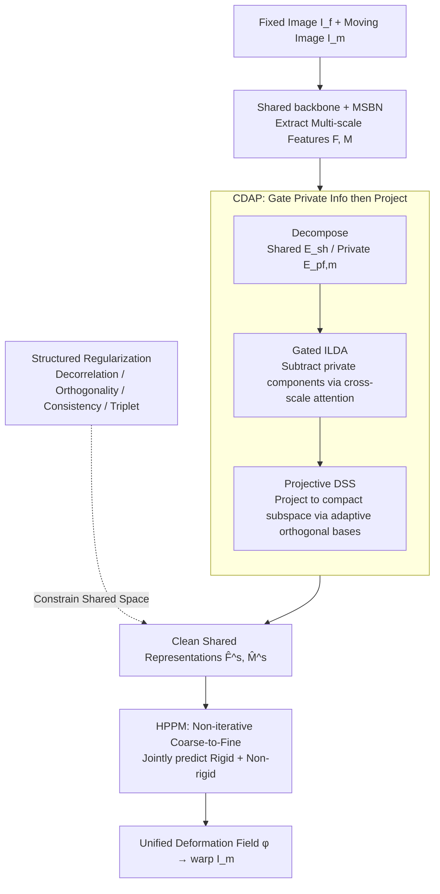

# Disentangle-then-Align: Non-Iterative Hybrid Multimodal Image Registration via Cross-Scale Feature Disentanglement

**Conference**: CVPR 2026  
**arXiv**: [2603.19623](https://arxiv.org/abs/2603.19623)  
**Code**: [GitHub](https://github.com/Chunlei0913/HRNet)  
**Area**: Multimodal VLM / Multimodal Image Registration  
**Keywords**: Multimodal registration, hybrid transformation, feature disentanglement, cross-scale consistency, Mamba

## TL;DR
The authors propose HRNet, which learns clean shared representations through Cross-scale Feature Disentanglement and Adaptive Projection (CDAP) and non-iteratively predicts joint rigid and non-rigid transformations in a unified coarse-to-fine pipeline, achieving SOTA performance on four multimodal datasets.

## Background & Motivation

**Background**: Multimodal image registration (e.g., RGB-Thermal, RGB-SAR) is a fundamental task for cross-modality fusion. Existing deep learning methods mostly adopt multi-scale strategies to improve accuracy, yet are usually limited to a single transformation type.

**Limitations of Prior Work**: (a) Most multi-scale frameworks support only either rigid or non-rigid transformations—rigid cannot handle local deformations, while non-rigid distorts structural integrity under large global offsets; (b) Existing hybrid registration methods use serial cascades (rigid then non-rigid), where transformations are estimated in different feature spaces, making them difficult to coordinate and causing error propagation; (c) Although shared feature extraction mitigates modality gaps, constraints primarily act on the shared components, allowing modality-private information to leak into the shared space.

**Key Challenge**: How to simultaneously estimate global rigid alignment and local non-rigid deformation in a unified feature space without interference from private modality information?

**Goal**: Design a unified framework to solve: (a) modality-private leakage in shared feature spaces; (b) coordinated estimation of rigid and non-rigid transformations.

**Key Insight**: "Disentangle-then-Align"—first learn clean multi-scale shared representations via CDAP, then jointly predict hybrid transformations within the HPPM.

**Core Idea**: Representation disentanglement (cross-scale gating + adaptive projection) + hybrid parameter prediction (rigid + non-rigid within a unified coarse-to-fine pipeline) = production of a unified deformation field in a single forward pass.

## Method

### Overall Architecture

Multimodal registration (RGB-Thermal, RGB-SAR, etc.) is difficult due to two factors: modality-private information contaminates shared features, and global rigid alignment vs. local non-rigid deformation must often be estimated in separate spaces, leading to conflicts. HRNet follows a "disentangle-then-align" strategy: given a fixed image $I_f$ and moving image $I_m$, it first extracts multi-scale features $F, M$ using a shared backbone with MSBN. The CDAP module then strips private information from shared features to obtain clean shared representations $(\hat{F}^s, \hat{M}^s)$. Finally, the HPPM jointly predicts rigid + non-rigid hybrid transformations $\phi$ within a single coarse-to-fine pipeline to warp $I_m$. The entire process is non-iterative. Meanwhile, structured regularization constrains the shared space from four dimensions to ensure effective disentanglement.

### Key Designs

**1. CDAP: Gating private information from shared space then projecting to adaptive subspaces**

While shared feature extraction mitigates modality gaps, constraints only acting on shared parts allow modality-private information to leak and contaminate alignment. CDAP blocks this leakage via "decompose-gate-project." In the decomposition stage, each scale uses a shared extractor $E_{sh}^i$ for modality-invariant components and modality-specific extractors $E_{pf/m}^i$ for private components. In the gating stage (ILDA), neighboring scale semantics are used as cross-scale attention to explicitly subtract private components: $\widetilde{F}_i^s = \alpha_i^s \odot F_i^s - \gamma^i \alpha_i^p \odot F_i^p$, where weights $\alpha_i^s, \alpha_i^p$ are calculated via cross-scale attention. In the projection stage (DSS), a set of approximately orthogonal bases $W_i^s = Gen^i(z_i^s)$ is generated in a data-adaptive manner to project the gated features: $\hat{F}_i^s = \widetilde{F}_i^s W_i^{s\top}$, which is more flexible than fixed projection and results in a more compact shared space.

**2. HPPM: Non-iterative joint prediction of rigid + non-rigid transformations in a unified feature space**

Serial hybrid registration (rigid then non-rigid) estimates components separately in different feature spaces, leading to error propagation. HPPM integrates rigid and non-rigid estimation into a single 5-scale coarse-to-fine pipeline. At the coarsest scale, global rigid parameters $H$ are estimated via HRB (with GAP + FC) and encoded into a coarse deformation field. For subsequent scales, the previous transformation $\phi_{i-1}$ is upsampled to warp the current moving features; after concatenation, HRB estimates the residual $\phi_i' = \text{conv}(f_i)$, updating the field as $\phi_i = \text{upsample}(\phi_{i-1}) + \phi_i'$. Rigid predictions are immediately converted to flow and refined progressively. Internally, HRB uses two RSSB (Residual State Space Blocks, based on Mamba) to model long-range dependencies, capturing global structural relationships crucial for registration at low computational cost.

**3. Structured Regularization: Constraining shared space quality across four dimensions**

Network architecture alone is insufficient for stable alignment; HRNet adds four complementary regularizations. Cross-covariance decorrelation $L_{ccd} = \|\text{Cov}(\hat{F}_i^s, F_i^p)\|_F^2$ reduces coupling between shared and private components; basis orthogonality $L_{bo} = \|W^{(i)}W^{(i)\top} - I\|_F^2$ prevents DSS subspace degradation; cross-scale directional consistency $L_{cs} = 1 - \cos(\hat{F}_i^s, \hat{F}_{i+1}^s)$ ensures semantic alignment across scales; and triplet loss $L_{tri}$ pulls cross-modality features at the same location closer while pushing away private interference. Together, they ensure the validity of the disentanglement.

### Loss & Training
- Total Loss: $L = \alpha_r L_r + \alpha_n L_n + \alpha_s L_s + \alpha_{tri} L_{tri} + \alpha_{cs} L_{cs} + \alpha_{ccd} L_{ccd} + \alpha_{bo} L_{bo}$
- **Three-stage curriculum training**: warmup (10%) $\rightarrow$ mid (50%) $\rightarrow$ late (40%), progressively adjusting weights (e.g., $\alpha_n$: 6 $\rightarrow$ 10 $\rightarrow$ 12 to emphasize non-rigid transformation in later stages).
- Adam optimizer, lr=1e-4, batch=8, 100 epochs, images resized to 256×256.

## Key Experimental Results

### Main Results (Rigid Registration)

| Method | RGB-NIR RE↓ | RGB-TIR RE↓ | RGB-IR RE↓ | RGB-SAR RE↓ |
|------|-------------|-------------|------------|-------------|
| IHN | 3.887 | 3.006 | 5.684 | 7.087 |
| MMRNet | 3.179 | 2.472 | 4.406 | 7.075 |
| **HRNet (Ours)** | **0.785** | **0.744** | **0.578** | **3.161** |

RE Gain: 75.3%, 69.9%, 86.9%, 55.3% (relative to MMRNet, average ~72%).

### Main Results (Non-rigid Registration)

| Method | RGB-NIR RE↓ | RGB-TIR RE↓ | RGB-IR RE↓ | RGB-SAR RE↓ |
|------|-------------|-------------|------------|-------------|
| ADRNet (Hybrid) | Significant | - | - | - |
| MMRNet | Poor | - | - | - |
| **HRNet (Ours)** | **Best** | **Best** | **Best** | **Best** |

RE reduction relative to ADRNet: 61.2%, 62.5%, 66.9%, 23.3%.

### Ablation Study

| Configuration | Key Effect | Description |
|------|----------|------|
| w/o CDAP | Private noise in shared features | Degraded registration accuracy |
| w/o ILDA gating | Private info leakage | Incomplete disentanglement |
| w/o DSS projection | Unstable cross-modality alignment | Non-compact feature space |
| Rigid only | Cannot handle local deformation | Poor structural integrity |
| Non-rigid only | Distortion under large offsets | Insufficient global alignment |
| **Full HRNet** | **Unified Rigid + Non-rigid** | **Overall Best** |

### Key Findings
- **Superiority of Hybrid Registration**: On RGB-IR, RE dropped from 4.406 to 0.578 (86.9% reduction), proving joint estimation is far superior to single-paradigm approaches.
- RGB-SAR remains the most challenging due to extreme modality gaps, yet HRNet maintains a significant lead.
- Progressive increases in non-rigid weights ($\alpha_n$: 6 $\rightarrow$ 12) during three-stage curriculum training are critical.

## Highlights & Insights
- **Unified Hybrid Framework**: The first to non-iteratively and jointly estimate rigid and non-rigid transformations in a single pipeline, producing a unified deformation field.
- **Comprehensive Disentanglement**: The decompose-gate-project pipeline of CDAP, combined with four structured regularizations, fundamentally addresses the private information leakage problem.
- **Mamba in Registration**: RSSB provides low-overhead long-range dependency modeling, suitable for global structural perception in registration tasks.

## Limitations & Future Work
- Current validation is at 256×256 resolution; efficiency and performance at higher resolutions require testing.
- Hyperparameter tuning for curriculum training may need adjustments for specific modality pairs.
- Robustness to extreme occlusion or completely non-overlapping regions was not discussed.

## Related Work & Insights
- Comparison with ADRNet (serial hybrid): ADRNet estimates in stages, whereas HRNet estimates jointly in a unified space to avoid bias propagation.
- Comparison with Shi et al. (Feature Disentanglement): Existing methods only constrain shared parts; HRNet explicitly suppresses private leakage via ILDA gating and regularization.
- Insight: Cross-scale feature interaction (neighboring scale gating) is a versatile idea worth exploring in other multi-scale tasks.

## Rating
- Novelty: ⭐⭐⭐⭐ Unified hybrid registration and CDAP disentanglement are valuable; Mamba integration is also innovative.
- Experimental Thoroughness: ⭐⭐⭐⭐⭐ Four multimodal datasets, rigid + non-rigid tests, detailed ablations, and curriculum training analysis.
- Writing Quality: ⭐⭐⭐⭐ Clear structure and complete derivations, though mathematical notation is dense.
- Value: ⭐⭐⭐⭐ Provides a general template for multimodal registration, though the application scenarios are relatively specialized.

<!-- RELATED:START -->

## Related Papers

- [\[CVPR 2026\] Multi-Modal Image Fusion via Intervention-Stable Feature Learning](multi-modal_image_fusion_via_intervention-stable_feature_learning.md)
- [\[CVPR 2026\] CoV-Align: Efficient Fine-grained Cross-Modal Alignment with Cohesive Visual Semantics Priority](cov-align_efficient_fine-grained_cross-modal_alignment_with_cohesive_visual_sema.md)
- [\[CVPR 2026\] Enhance-then-Balance Modality Collaboration for Robust Multimodal Sentiment Analysis](enhance-then-balance_modality_collaboration_for_robust_multimodal_sentiment_anal.md)
- [\[AAAI 2026\] To Align or Not to Align: Strategic Multimodal Representation Alignment for Optimal Performance](../../AAAI2026/multimodal_vlm/to_align_or_not_to_align_strategic_multimodal_representation_alignment_for_optim.md)
- [\[CVPR 2026\] EBMC: Enhance-then-Balance Modality Collaboration for Robust Multimodal Sentiment Analysis](ebmc_multimodal_sentiment_analysis.md)

<!-- RELATED:END -->
