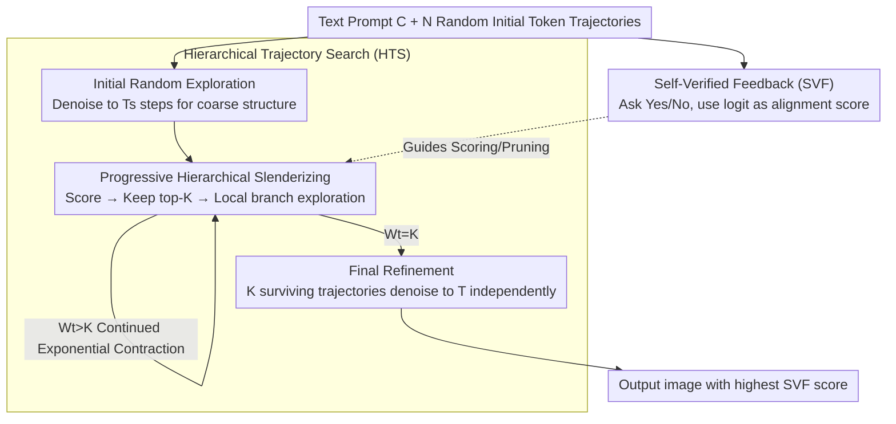

# dMLLM-TTS: Self-Verified and Efficient Test-Time Scaling for Diffusion Multi-Modal Large Language Models

**Conference**: CVPR 2026  
**Paper**: [CVF Open Access](https://openaccess.thecvf.com/content/CVPR2026/html/Xin_dMLLM-TTS_Self-Verified_and_Efficient_Test-Time_Scaling_for_Diffusion_Multi_Modal_Large_CVPR_2026_paper.html)  
**Code**: https://github.com/Alpha-VLLM/Lumina-DiMOO  
**Area**: Multi-modal VLM / Diffusion Models  
**Keywords**: Test-time scaling, Diffusion multi-modal large language models, Self-verification, Text-to-image, Trajectory search  

## TL;DR
For unified generative-understanding diffusion multi-modal large language models (dMLLMs), this work utilizes the model's own image-text understanding capabilities as a "judge" (Self-Verified Feedback) to score candidate images. Combined with a coarse-to-fine Hierarchical Trajectory Search, it reduces the complexity of traditional linear search from $O(NT)$ to near-linear $O(N+T)$. This significantly improves the generation quality of three dMLLMs on GenEval while being 5–6 times faster than linear search.

## Background & Motivation

**Background**: The quality of text-to-image (T2I) generation has long relied on "training-time scaling"—increasing model parameters, data, and compute. However, this path faces diminishing marginal returns and a scarcity of high-quality data. Research has thus shifted to **test-time scaling (TTS)**: spending more compute during inference to produce better images from a pre-trained model. Simultaneously, **diffusion multi-modal large language models (dMLLMs, e.g., Lumina-DiMOO, MMaDA, Muddit)** have emerged, unifying "image generation" and "image understanding" into a single architecture using discrete diffusion, naturally supporting iterative parallel denoising.

**Limitations of Prior Work**: Directly applying existing diffusion TTS methods to dMLLMs involves two major drawbacks. First, **an external VLM verifier** (e.g., CLIP, VILA-Judge, GPT-4o) is required to score $N$ candidates for best-of-N selection—this necessitates deploying additional large models or calling commercial APIs, incurring heavy overhead from repeated decoding (token to image) and encoding (image to embedding). Second, **the search is "linear"**: compute is distributed uniformly across "number of trajectories $N$" and "refinement steps per trajectory $T$", leading to $O(NT)$ complexity where every trajectory is treated equally from start to finish.

**Key Challenge**: The generation process of dMLLMs is inherently "coarse-to-fine"—global structures are determined in the early high-noise stages (blurry images), while details are refined in later stages. Linear search wastes compute by continuing to process trajectories that have already deviated early on, while high-potential trajectories receive no additional resources. There is a mismatch between compute allocation and the hierarchical structure of generation.

**Goal**: Integrate the three aspects of TTS—scaling strategy, verification mechanism, and search algorithm—into a single inference pass. The study aims to answer two questions: (1) Can a dMLLM verify its own generated images to eliminate external verifiers? (2) Can an **adaptive** search algorithm be designed to tilt compute toward high-potential trajectories?

**Core Idea**: Utilize the dMLLM's **internal understanding capability** as a verifier (self-verified), transforming quality assessment into a Q&A task: "Does this image describe the prompt? Answer Yes/No," where the "Yes" logit serves as the alignment score. This score guides a **coarse-to-fine hierarchical search with progressive pruning**, dynamically contracting compute from "broad early exploration" to "late-stage refinement of winners," reducing complexity to $O(N+T)$. Key Insight: **"Compute expands the search space, while reflection finds the path."**

## Method

### Overall Architecture
dMLLM-TTS requires no additional training and only increases compute during inference. The authors formalize the test-time scaling of dMLLMs as a triplet $\text{TTS}=\langle G_\theta, V, f\rangle$: the generator $G_\theta$ performs parallel denoising, the verifier $V:\mathcal{Z}\times\mathcal{C}\to\mathbb{R}$ measures "image-text" semantic alignment, and the search function $f$ reallocates inference compute under the guidance of $V$. Scaling unfolds along two complementary axes: **trajectory exploration scaling** (sampling $N$ initial trajectories to broaden the hypothesis space) and **iterative refinement scaling** (increasing $T$ denoising steps per trajectory to improve stability and detail).

The two core components occupy this framework: the verifier $V$ is implemented via **Self-Verified Feedback (SVF)**, and the search $f$ is implemented via **Hierarchical Trajectory Search (HTS)**. HTS consists of three stages—Initial Random Exploration, Progressive Hierarchical Slenderizing, and Final Refinement—where SVF continuously scores candidates to decide on pruning, branching, and final selection.

### Key Designs

**1. Unified Dual-Axis Scaling: Formalizing dMLLM TTS as a Generator+Verifier+Search Triplet**

Previous TTS works either focus on "sampling more trajectories" or "increasing denoising steps," lacking a unified framework for verification and search. This work breaks down the dMLLM generation mechanism: starting from a fully [Masked] sequence $Z_0$, it undergoes $T$ discrete denoising steps. Each step predicts tokens for masked positions, retains high-confidence ones, and re-masks low-confidence ones for the next step (Eq. 1–3). Test-time scaling is viewed as a 2D process of "trajectory exploration × iterative refinement": exploration samples $N$ different initial states $Z_1^{(i)}\sim p_{\text{init}}$, and refinement uses $Z_{t+1}=G_\theta(Z_t, C, t)$ for more steps. By formalizing this as $\text{TTS}=\langle G_\theta, V, f\rangle$, the authors define the interfaces for "verifier scoring and search reallocation," which SVF and HTS implement. This formalization highlights that the key to TTS is adaptive allocation rather than brute-force computation.

**2. Self-Verified Feedback (SVF): Internal Model Evaluation to Eliminate External Verifiers**

External verifiers suffer from deployment overhead and decoding-encoding costs because generation and scoring are decoupled. Since dMLLMs possess both generative and understanding capabilities, they are ideal self-verifiers. SVF frames quality assessment as a binary Q&A: given a prompt $C$ and intermediate token sequence $Z_t$, the model is asked: "`<Generated Image> Is this image shows {text prompt}? Please answer "Yes" or "No" directly without explanation.`" Instead of sampling an answer, the model **directly utilizes the logit probability of the "Yes" token** as the alignment score:

$$\Phi_{\text{SVF}} = \text{logit}_{\text{yes}}\!\big(G_\theta(Z_t, C)\big).$$

This requires only one forward pass to obtain a scalar score and remains entirely in the token space, avoiding the need to decode tokens into images and re-encode them for external VLMs (in-loop efficiency). This score determines which trajectories are pruned during search and identifies the best-aligned output image. While SVF is limited by the dMLLM's vision-language understanding—experimental results show it lags behind GPT-4o—it provides zero external dependency and high efficiency.

**3. Hierarchical Trajectory Search (HTS): Coarse-to-Fine Three-Stage Search Reducing $O(NT)$ to $O(N+T)$**

Linear Trajectory Search (LTS) allocates compute uniformly, but dMLLM images are blurry in early stages, making SVF scores less reliable. Compute spent on early failing trajectories is wasted. HTS is designed with three phases (Eq. 8, divided by transition steps $T_s$, $T_r$):

*Initial Random Exploration ($t\le T_s$)*: N random trajectories are denoised for $T_s$ steps to establish coarse structures (Eq. 9–10). No scoring is performed here due to high noise. $T_s$ is set small (e.g., $T/4$).

*Progressive Hierarchical Slenderizing ($T_s<t\le T_r$)*: An exponentially decaying trajectory width schedule is defined:
$$W_t = \max\big(\lfloor N\,d^{-(t-T_s)}\rfloor,\; K\big),\quad d>1,$$
pruning active trajectories down to a minimum set $K$. Each step involves: ① **Scoring** via $\Phi_{\text{SVF}}$, ② **Selection** of the top-$K$ scoring trajectories to form the survival set $B_t$, and ③ **Branching** where each survivor $Z_t^{(j)}$ samples $b_t=\lfloor W_{t+1}/K\rfloor$ local extensions $Z_{t+1}^{(j,k)}\sim q(Z\mid Z_t^{(j)})$ (Eq. 11–12). As $t$ increases, $W_t$ and $b_t$ decrease geometrically, focusing compute on high-scoring paths. Branching stops when $W_t=K$.

*Final Refinement ($T_r<t\le T$)*: The $K$ surviving trajectories are independently denoised to the final step $T$ (Eq. 13) to polish details.

The total complexity of HTS is:
$$C_{\text{HTS}} = O\!\Big(N T_s + \tfrac{N-dK}{d-1} + K(T-T_r)\Big),$$
corresponding to early exploration, geometric slenderizing, and K-trajectory refinement (Eq. 14). Since $T_s\ll T$ and $K\ll N$, this approximates $O(N+T)$ (Eq. 15), transforming the multiplicative complexity of LTS into an additive one.

### Loss & Training
This is a **purely inference-time method involving no training or fine-tuning**, applied directly to pre-trained dMLLMs. Key hyperparameters: $N:K$ ratio fixed at 4:1; $T_s$ set to $T/4$; 512 resolution; CFG=4.0; Verification uses a single forward pass; Baselines use $T=8$.

## Key Experimental Results

### Main Results
On GenEval (553 compositional prompts across 6 dimensions), applying dMLLM-TTS (HTS with self-verification) yielded the following overall score improvements relative to baselines ($T=8, N=1$):

| Model | Baseline Overall | TTS Overall (T=32, N=32, HTS) | Gain | Comparison to SOTA |
|------|------|------|------|------|
| Lumina-DiMOO | 0.78 | **0.92** | +17.9% | Surpasses Qwen-Image (0.87), GPT-4o (0.84) |
| MMaDA | 0.51 | **0.66** | +29.4% | — |
| Muddit | 0.53 | **0.67** | +26.4% | — |

By dimension (Lumina-DiMOO, T32N32, HTS vs LTS): The most significant gains occurred in challenging categories—Counting (+30.0%), Position (+18.9%), and Attribute (+27.4%). Simple categories (Single Obj. +4.2%) showed limited gains due to high baseline performance. HTS consistently matched or exceeded LTS across almost all dimensions.

### Ablation Study

| Item | Result | Note |
|------|------|------|
| HTS vs LTS Efficiency (Lumina-DiMOO) | **5× Faster** | Compute required for equivalent score |
| HTS vs LTS Efficiency (MMaDA / Muddit) | **6× Faster** | Same as above |
| HTS vs LTS Ceiling | HTS converges higher | Not just faster, but higher final quality |
| Trajectory Scaling (N=1→32, T=32) | MMaDA +20.2% / Muddit +16.8% / Lumina +8.8% | Gain is inversely related to baseline score |
| Refinement Scaling (T=8→64) | Monotonic improvement | 64 steps optimal for 512 resolution |

Verifier Comparison (GenEval Overall, Table 2):

| Verifier | Lumina-DiMOO | MMaDA | Muddit |
|------|------|------|------|
| SVF (Ours) | 0.92 | 0.66 | 0.67 |
| VILA-Judge | 0.90 ↓ | 0.70 ↑ | 0.70 ↑ |
| GPT-4o | 0.95 ↑ | 0.71 ↑ | 0.74 ↑ |

### Key Findings
- **HTS Value is "Both Faster and Better"**: HTS achieves 5–6x speedups while converging to higher scores than linear search, proving that adaptive compute allocation is superior to uniform distribution.
- **TTS Primarily Benefits Weaker Models**: Improvements are inversely correlated with the initial model score; weak baselines (MMaDA/Muddit) see the largest gains, particularly in complex compositional tasks.
- **SVF is Sufficient Although Not Strongest**: GPT-4o verification yields the highest scores, indicating that SVF's bottleneck is the base dMLLM's vision understanding. However, SVF offers zero external dependency and high efficiency.
- **Refinement Returns Diminish**: Scores improve from $T=8$ to 64, but the optimal step count depends on prompt complexity.

## Highlights & Insights
- **"The Model as its own Verifier"**: dMLLM unifies generation and understanding. This work leverages this by framing evaluation as a simple Yes/No question and using logit values for continuous scoring. This is a unique dividend of unified architectures.
- **Matching Search Structure to Generation Structure**: The three-stage HTS aligns with the coarse-to-fine structure of diffusion denoising (no scoring during structure formation, pruning during mid-stage, refinement for survivals). This shifts complexity from $O(NT)$ to $O(N+T)$.
- **Reusable Trick**: The "logit-as-score" approach allows for in-loop self-rewarding in any unified "generate-then-discriminate" model without the cost of full text sampling.

## Limitations & Future Work
- **SVF Bottleneck**: SVF relies on the dMLLM's vision-language understanding capability, which currently lags behind GPT-4o. This suggests that the ceiling for scaling is tied to understanding performance.
- **Generalization**: Experiments were limited to GenEval (object-centric compositions); effectiveness on open-domain aesthetic or photorealistic prompts remains unverified.
- **Hyperparameter Sensitivity**: Parameters such as $N:K$ and $T_s$ are empirically set and may require adaptive tuning based on prompt complexity.
- **Future Directions**: Improving SVF with multi-step reasoning, applying HTS to image editing or video generation, and making search parameters adaptive to score variance.

## Related Work & Insights
- **Comparison with Diffusion/AR TTS**: Prior works rely on external VLM verification and linear search $O(NT)$. dMLLM-TTS leverages internal verification and hierarchical search $O(N+T)$, optimizing for unified architectures.
- **Comparison with Linear Trajectory Search (LTS)**: LTS treats all trajectories equally. HTS uses intermediate feedback from SVF for pruning and branching, achieving 5–6x speedup.
- **Insight**: For dMLLMs, the critical variable in test-time scaling is "self-verification quality" rather than just raw compute. Future work should prioritize strengthening the discriminative side of unified models.

## Rating
- Novelty: ⭐⭐⭐⭐⭐ First TTS framework for dMLLMs; the $O(N+T)$ hierarchical search is a clean and powerful contribution.
- Experimental Thoroughness: ⭐⭐⭐⭐ Extensive ablations across multiple models and dimensions, though limited to GenEval and available open-source dMLLMs.
- Writing Quality: ⭐⭐⭐⭐⭐ Clear formalization and detailed stage-by-stage complexity analysis.
- Value: ⭐⭐⭐⭐⭐ Significantly improves dMLLM performance to SOTA levels without training, offering high practical utility.

<!-- RELATED:START -->

## Related Papers

- [\[CVPR 2026\] Scaling Test-Time Robustness of Vision-Language Models via Self-Critical Inference Framework](scaling_test-time_robustness_of_vision-language_models_via_self-critical_inferen.md)
- [\[CVPR 2026\] Evolving Contextual Safety in Multi-Modal Large Language Models via Inference-Time Self-Reflective Memory](evolving_contextual_safety_in_multi-modal_large_language_models_via_inference-ti.md)
- [\[CVPR 2026\] Decoupling Stability and Plasticity for Multi-Modal Test-Time Adaptation](decoupling_stability_and_plasticity_for_multi-modal_test-time_adaptation.md)
- [\[CVPR 2026\] Multi-modal Test-time Adaptation via Adaptive Probabilistic Gaussian Calibration](multi-modal_test-time_adaptation_via_adaptive_probabilistic_gaussian_calibration.md)
- [\[CVPR 2026\] UniT: Unified Multimodal Chain-of-Thought Test-time Scaling](unit_unified_multimodal_chain-of-thought_test-time_scaling.md)

<!-- RELATED:END -->
