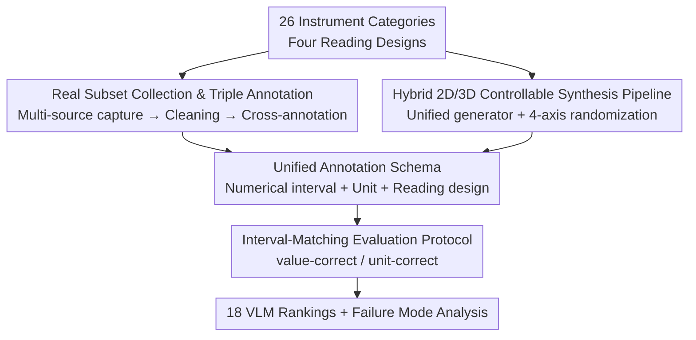

# Do Vision-Language Models Measure Up? Benchmarking Visual Measurement Reading with MeasureBench

**Conference**: CVPR 2026  
**Paper**: [CVF Open Access](https://openaccess.thecvf.com/content/CVPR2026/html/Lin_Do_Vision-Language_Models_Measure_Up_Benchmarking_Visual_Measurement_Reading_with_CVPR_2026_paper.html)  
**Code**: https://flageval-baai.github.io/MeasureBenchPage/ (Project page, including data and synthesis pipeline)  
**Area**: Multimodal VLM  
**Keywords**: Gauge reading, fine-grained perception, VLM benchmark, data synthesis, reinforcement fine-tuning  

## TL;DR
MeasureBench constructs a "reading" benchmark using 2,442 real and synthetic images of measuring instruments. It reveals that even the most powerful frontier VLMs achieve an overall accuracy of only around 30%. While they can identify units and instrument types (>90%), they fail to accurately read the values corresponding to pointers or scales, exposing a fundamental bottleneck in fine-grained spatial localization for VLMs.

## Background & Motivation
**Background**: VLMs have approached or even surpassed average human levels in high-level reasoning tasks at the university level or "frontiers of human knowledge," such as MMMU and HLE. This creates an impression that "multimodal understanding is already robust."

**Limitations of Prior Work**: Most evaluations focus on high-level semantic reasoning, with weak assessment of **low-level fine-grained perception** (precise geometry, scale positioning, minute differences). Existing fine-grained evaluations either concentrate on OCR/chart reasoning or consist of artificially constructed abstract visual tests like BlindTest and SalBench, **rarely requiring the mapping of physical scales to specific numerical values**. Reading meters (pressure gauges, thermometers, vernier calipers, clocks) is a task humans perform effortlessly but is critical for industrial safety and embodied AI.

**Key Challenge**: The reading task couples three elements: fine-grained visual perception (locating pointers/scales), lightweight quantitative reasoning (calculating scale intervals, decimals), and basic arithmetic. The bottleneck for VLMs is not "calculating" but "seeing accurately." Fragmented existing research only covers single instrument types (only clocks, only rulers, or only industrial gauges), lacking a unified, scalable benchmark with precise annotations across diverse types.

**Goal**: ① Construct a benchmark covering a wide range of instrument types and reading designs; ② Provide a controllable and scalable synthesis pipeline capable of producing precise annotations (for both evaluation and training); ③ Systematically evaluate contemporary VLMs and analyze their failure modes.

**Core Idea**: Use "measurement reading" as a diagnostic tool—quantifying the gap between "recognizing numbers vs. measuring the world" through a unified **interval-matching evaluation protocol** and a **hybrid 2D/3D synthesis pipeline**.

## Method

### Overall Architecture
MeasureBench is not a model but a **benchmark + data engine**, consisting of two major components: (i) a collection of instrument images with standardized annotations (1,272 real + 1,170 synthetic, totaling 2,442 image-question pairs), and (ii) a synthesis framework for sustainable production of training/evaluation data. All instruments are categorized into four reading designs based on **visual appearance**: **Dial** (analog gauges with pointers, e.g., ammeters, clocks), **Digital** (electronic/mechanical digital displays, e.g., pulse oximeters), **Linear** (linear scales without pointers, e.g., rulers, vernier calipers), and **Composite** (combinations of multiple designs, e.g., dial calipers, complex water meters). Each image is paired with a reading question. Evaluation does not require exact numerical matches; an answer is correct if it falls within the annotated interval.

The data construction pipeline follows two paths: the real subset undergoes "multi-source collection → cleaning → three rounds of cross-annotation," while the synthetic subset utilizes a "unified generator interface → four-axis randomization → 2D/3D dual-backend rendering." Both merge into a unified annotation schema (numerical interval + unit + reading design). Finally, 18 VLMs are scored using the interval-matching protocol.

### Key Designs

**1. Four-Category Reading Design + Interval-Matching Protocol: Deterministic yet Fault-Tolerant Accuracy Standards**

Reading analog instruments inherently involves unavoidable measurement errors (e.g., a pointer between two ticks). Requiring strict numerical equality would make the evaluation both harsh and unstable. MeasureBench thus splits "correctness" into two independently verifiable dimensions: each sample carries one or more ground-truth candidates, with each candidate containing a **closed interval** $I=[l,r]$ for numerical scoring and a set of acceptable unit substrings. The evaluation script first performs **answer extraction**—parsing `Answer:` tags or `\boxed{}` content from model free-text. Values support integers, decimals, scientific notation, and fractions ($a/b\to$ float, taking the rightmost for multiple scalars); time values take the first `hh:mm[:ss]` and convert to seconds. Then, **answer matching** is performed: the parsed value is *value-correct* if it falls into any candidate interval, and *unit-correct* if the unit string matches. A sample is *fully-correct* only if both conditions are met (and originate from the same candidate). Segregating value and unit statistics is the most critical design of this protocol—it later reveals the core finding: "unit accuracy >90% but value accuracy is only 30%," precisely locating the bottleneck in numerical reading rather than object/text recognition.

**2. Real Subset Collection and Triple Cross-Annotation: Ensuring Reliable Interval Labels for 1,272 Real Images**

Real images were sourced from three channels: Google Image search using instrument keywords (commercial-use filtered), private photos from team members, and third-party vendors. Low-quality images (blurry, low-res, occluded) were removed. Each image was then annotated with instrument type, reading design, candidate units, and valid reading intervals using a unified schema. Quality was guaranteed via **three rounds of oversight**: each image was independently annotated by one person, verified by a second, and disputes were settled by a third. A final independent audit focused specifically on the correctness of numerical intervals and units. Tasks were assigned to 10 annotators based on their professional backgrounds (specialized instruments require domain knowledge). A prompt sensitivity analysis (see experiments) showed that phrasing had minimal impact on overall results, so the majority of original collected questions were kept. While seemingly "manual labor," the credibility of the interval annotations directly determines the reliability of the benchmark's conclusions.

**3. Hybrid 2D/3D Controllable Synthesis Pipeline: Scalable Data with Precise Labels via Unified Interfaces and Randomization**

Real image collection is expensive and hard to scale; more importantly, real readings lack "programmatic precision labels." The synthesis pipeline abstracts each instrument into a **generator** registered under a unified interface: a global registry maps instrument names to generators, each outputting a rendered image + a standardized label (value/unit/reading design). This unified contract allows for plug-and-play addition of NEW instruments. For each sample, the framework randomizes scale count and type, reading values, range/units, materials, lighting, background, and camera poses while maintaining semantic validity. Diversity is expanded along **four axes**: multi-style (2D procedural rendering vs. 3D photo-realistic), multi-class (four reading designs), multi-orientation (rotation/tilt and imaging perturbations), and multi-scale (ranges/units and dual scales). Two complementary backends share the same interface: **2D procedural rendering** uses prompt templates to specify instrument types, constraints, and code interfaces, where an LLM drafts rendering code that is manually verified; **3D physical rendering** is based on Blender assets, using code to randomize backgrounds, pointer angles, scale ranges, and camera poses to produce photo-realistic images with real lighting/reflections/occlusion to narrow the sim-to-real gap. This resulted in 39 appearances across 16 instrument types, with 30 images generated per type for 1,170 synthetic evaluation images. This same pipeline generated 100 samples per instrument (3,900 total) for training. This controllable and precise labeling is the prerequisite for the RFT experiments.

## Key Experimental Results

### Main Results: Ranking of 18 VLMs
The evaluation of 8 closed-source and 10 open-source models (GPT, Claude, Gemini, Qwen-VL, InternVL3, LLaMA-4, Grok, Mistral) was conducted using FlagEvalMM. Overall accuracy (Ovr) was poor; the strongest model, Gemini-2.5-Pro, achieved only 30.2% on the real set.

| Model | Real Ovr | Real Val | Real Unit | Synthetic Ovr |
|------|-----------|-----------|------------|-----------|
| Gemini-2.5-Pro | **30.2** | 30.7 | 96.2 | **26.3** |
| Qwen3-VL-235B | 22.6 | 23.0 | 95.7 | 19.0 |
| GPT-5-Mini | 22.0 | 22.4 | 95.2 | 17.9 |
| GPT-5 | 19.8 | 19.9 | 96.0 | 16.9 |
| Qwen2.5-VL-7B | 14.6 | 15.0 | 93.4 | 10.9 |
| Qwen2.5-VL-72B | 14.5 | 14.9 | 92.1 | 11.7 |
| Claude-Opus-4.1 | 14.3 | 14.9 | 94.5 | 13.3 |
| Grok-4 | 7.5 | 7.7 | 80.5 | 6.2 |

The most striking contrast is **Unit ~96% vs. Value ~31%** (Gemini-2.5-Pro): models identify units correctly (strong OCR/object recognition) but cannot read values accurately, precisely locating the bottleneck at the "pointer/scale → value" mapping.

### Breakdown by Design, Reasoning, and Specialized Systems
Difficulty varies significantly across reading types: Digital is the easiest (Gemini reaches 80.2% on real set as it is essentially OCR), Dial/Linear are difficult (typically 10–32%, requiring pointer localization amidst noise/glare/distortion), and Composite is a total failure (most models score 0%, requiring combined readings and calculation).

| Configuration / Comparison | Key Metric | Description |
|------------|---------|------|
| Digital vs. Dial | Dig 80.2% / Dial 31.5% (Gemini Real) | Digital ≈ OCR; Dial requires spatial localization |
| Reasoning On vs. Off | Almost no gain; occasional drop | Even with 1k–2k reasoning tokens, accuracy does not increase; reading relies on "vision," not CoT |
| Large vs. Small Models | GPT-5-Mini ≈ GPT-5; Qwen 7B ≈ 72B | Larger language backbones do not improve perception if the vision encoder is unchanged |
| Specialized (Reitsma et al.) | Real Ovr 8.5 | Old pipelines overfit the training domain; OOD generalization is worse than general VLMs |
| Specialized (Shu et al.) | Val 4.2 / Mostly N/A | Pointer segmentation/detection components fail on new images |

Notably, Qwen2.5-VL-72B prefers outputting "10:10" for 73% of real clock images, indicating that **language priors can contaminate visual readings**.

### Effectiveness of RFT with Synthetic Data
The authors generated 100 images for each of the 39 instrument types (3,900 images) using the synthesis pipeline and performed Reinforcement Fine-Tuning with GRPO. The reward is rule-based: $R_{\text{eval}}=\alpha\,c_{\text{all}}+(1-\alpha)\,c_{\text{fmt}}$, where $\alpha=0.9$, $c_{\text{all}}=\mathbb{1}\{\hat{y}\in I \wedge \hat{u}=u\}$ (value in interval and unit correct), and $c_{\text{fmt}}$ is whether the output matches the `<think>...</think>...Final Answer...` template.

| Model | Setup | Overall | Value |
|------|------|---------|-------|
| Qwen2.5-VL-7B | No RFT (Synth) | 10.9 | 11.5 |
| Qwen2.5-VL-7B | GRPO (Synth) | **35.2 (+222.9%)** | 35.6 |
| Qwen2.5-VL-7B | No RFT (Real) | 14.6 | 15.0 |
| Qwen2.5-VL-7B | GRPO (Real) | 19.7 (+34.9%) | 20.4 |
| Qwen2.5-VL-3B | GRPO (Synth) | 31.5 (+275.0%) | 32.4 |
| Qwen2.5-VL-3B | GRPO (Real) | 12.7 (+21.0%) | 13.8 |

### Key Findings
- **Value reading is the bottleneck, not recognition**: Unit accuracy is generally >90%, while value accuracy stays around 30%, showing that the VLM's weakness lies in precise spatial localization (pointers/scales/decimals) rather than object or text recognition.
- **Reasoning is ineffective**: Increasing reasoning tokens from 0 to 10,240 results in almost no change or even a drop in accuracy—fine-grained visual reading depends on "seeing pixels clearly," which prolonged CoT text reasoning does not assist.
- **Larger is not necessarily more accurate**: When the vision encoder remains unchanged, larger language backbones do not improve reading; language priors (e.g., bias toward "10:10" or multiples of 10) can actually lead models astray.
- **RFT addresses symptoms**: Performance on the synthetic set tripled (8.4 → 31.5) with some transfer to the real set (14.6 → 19.7), successfully flattening language prior biases; however, Composite remains difficult, suggesting a need for better visual representations rather than just more data.
- **Correct answer, wrong reasoning**: "Error cancellation" exists—an incorrect scale inference might be canceled out by a subsequent error to produce the correct number. Looking only at the final answer may overstate true capability. ⚠️ This suggests the benchmark's accuracy might still be optimistic.

## Highlights & Insights
- **Splitting value/unit statistics** is the cleverest design in the paper: this simple protocol change quantifies the gap between recognition and measurement, pinpointing the bottleneck more effectively than "overall accuracy."
- **Seamless integration of interval matching and rule-based rewards**: The evaluation protocol is reused directly as the verifiable reward for RFT, creating a "evaluation as reward" loop that is highly reusable.
- **Synthetic pipeline treats "precise labels" as first-class citizens**: The biggest issue with real images is the lack of programmatic precise readings. The procedural 2D + Blender 3D backend produces controllable data with precise labels for both evaluation and training—a strategy transferable to any "programmatically verifiable" fine-grained perception task.
- **"Reasoning is useless" is a counter-intuitive yet valuable finding**: It delineates the boundaries of test-time scaling—CoT cannot fix "blurry vision," suggesting the community should focus on vision encoders rather than stacking reasoning tokens.

## Limitations & Future Work
- The authors admit overall accuracy may be inflated by **error cancellation** (correct numbers from wrong reasoning), as final-answer evaluation does not measure procedural correctness.
- A sim-to-real gap remains: RFT tripled performance on synthetic data but only saw a rise to 19.7% on real data, with limited generalization and poor performance on Composite designs.
- ⚠️ The benchmark only tests "reading," and its representativeness for broader fine-grained spatial perception remains to be verified. Some prompts (approx. 10.5%) containing essential information were excluded from sensitivity analysis.
- Future directions: The authors point towards **better visual representations/encoding schemes** rather than pure data scaling, enabling VLMs to truly reason from fine-grained visual cues and generalize to unseen instrument types.

## Related Work & Insights
- **vs. Single-instrument studies (Clocks/Rulers/Industrial/Home counters)**: MeasureBench consolidates 26 real + 16 synthetic categories and four reading designs into one unified benchmark and protocol, a qualitative leap in breadth and scalability.
- **vs. Fine-grained visual evaluations (BlindTest / SalBench / VisOnlyQA)**: While those test abstract shapes/geometry/low-level cues, they rarely require "mapping physical scales to values." MeasureBench fills this gap for embodied AI.
- **vs. Legacy specialized gauge-reading pipelines (Reitsma et al. / Shu et al.)**: Older systems use manual "detect dial → locate pointer → recognize scale → OCR" pipelines, which show poor OOD generalization on MeasureBench (multi-component failure). General VLMs are more robust to out-of-distribution instruments, though their fine-grained reading capabilities remain far from target levels.

## Rating
- Novelty: ⭐⭐⭐⭐ First unified reading benchmark across 26 categories and four designs with controllable 2D/3D synthesis.
- Experimental Thoroughness: ⭐⭐⭐⭐⭐ Evaluates 18 VLMs, broken down by type, reasoning toggle, prompt sensitivity, specialized systems, and RFT validation.
- Writing Quality: ⭐⭐⭐⭐ Clear conclusions, thorough failure analysis, and a compelling narrative regarding value/unit decomposition.
- Value: ⭐⭐⭐⭐ Directly addresses a major weakness in VLM fine-grained spatial localization, with practical relevance for embodied and industrial AI.

<!-- RELATED:START -->

## Related Papers

- [\[CVPR 2026\] Do Vision Language Models Need to Process Image Tokens?](do_vision_language_models_need_to_process_image_tokens.md)
- [\[CVPR 2026\] SVHalluc: Benchmarking Speech-Vision Hallucination in Audio-Visual Large Language Models](svhalluc_benchmarking_speech-vision_hallucination_in_audio-visual_large_language.md)
- [\[CVPR 2026\] GraphVLM: Benchmarking Vision Language Models for Multimodal Graph Learning](graphvlm_benchmark_vlm_graph_learning.md)
- [\[CVPR 2026\] What Do Visual Tokens Really Encode? Uncovering Sparsity and Redundancy in Multimodal Large Language Models](what_do_visual_tokens_really_encode_uncovering_sparsity_and_redundancy_in_multim.md)
- [\[CVPR 2026\] CapNav: Benchmarking Vision Language Models on Capability-conditioned Indoor Navigation](capnav_benchmarking_vision_language_models_on_capability-conditioned_indoor_navi.md)

<!-- RELATED:END -->
