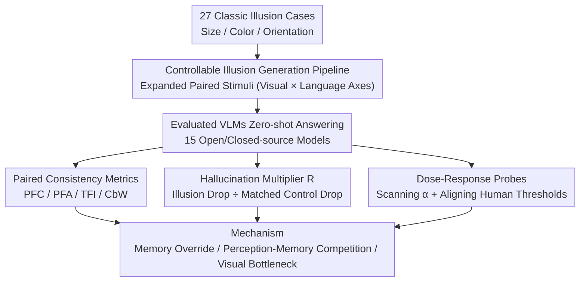

# Do VLMs Perceive or Recall? Probing Visual Perception vs. Memory with Classic Visual Illusions

**Conference**: CVPR 2026  
**Paper**: [CVF Open Access](https://openaccess.thecvf.com/content/CVPR2026/html/Sun_Do_VLMs_Perceive_or_Recall_Probing_Visual_Perception_vs._Memory_CVPR_2026_paper.html)  
**Code**: Not yet public (The paper states data and code will be released on the "VI-Probe Website," but no link is provided ⚠️ Subject to the original text)  
**Area**: Multimodal VLM  
**Keywords**: Visual Illusions, Perception vs. Memory, Controllable Probes, VLM Evaluation, Counterfactual Consistency

## TL;DR
Addressing the phenomenon where "VLMs answer correctly on classic visual illusions but provide the same answer even after the inducing factors are reversed," this paper introduces VI-Probe, a controllable illusion probe framework. By applying graded perturbations and matched controls to images, and polarity flipping and instruction variants to questions, and then using metrics like PFC, TFI, and the Hallucination Multiplier $R$ to decouple "true perception" from "memorizing templates," the study finds that "answer rigidity" in different model families stems from heterogeneous mechanisms—such as memory override, perception-memory competition, and visual processing bottlenecks—rather than a single "language prior" as previously assumed.

## Background & Motivation
**Background**: Visual illusions (e.g., Ebbinghaus, Müller–Lyer, Poggendorff) have long been used in psychology as diagnostic tools to probe human perceptual mechanisms. Recently, this approach has been adapted for VLMs, leading to benchmarks like HallusionBench, IllusionVQA, and VLMBiased, with the general conclusion that "VLMs are inferior to humans in illusion tasks."

**Limitations of Prior Work**: Existing benchmarks suffer from three systematic flaws: (i) using static-intensity illusion images, which prevents measuring the model's "perceptual threshold"; (ii) relying only on binary accuracy, which averages out the model's biases and confidence patterns; and (iii) failing to distinguish whether a model "sees" or "recalls," thus not decoupling visual perception from language priors. Worse, an anomaly observed in many works remains unexplained: a model may answer "physically correctly" on an original illusion (seemingly seeing through it), but when the inducing factors are reversed—making the correct answer flip—the model still gives the same answer, ignoring the visual changes obvious to the human eye.

**Key Challenge**: This exposes a fundamental question—**is the VLM perceiving visual changes or merely recalling patterns from memory?** Mainstream explanations have blamed "language priors," but this only describes *what* happens, not *how* or *why*. Furthermore, significant behavioral differences across models suggest that a single-factor explanation is insufficient.

**Goal**: To upgrade from "observing phenomena" to "systematic understanding," a probe tool is needed that can (1) continuously regulate illusion intensity, (2) isolate illusion-specific cues using matched controls, and (3) quantify stability and sensitivity beyond average accuracy.

**Key Insight**: The authors adopt the psychophysical paradigm of "graded stimuli + matched controls": for each illusion, controlled manipulations are applied along both the **visual axis** (perturbation intensity, de-inducer control, visual prompts) and the **language axis** (polarity flipping, instruction variants), followed by attribution using paired consistency and normalized effect sizes.

**Core Idea**: Replace "static images + average accuracy" with "controllable illusions + matched controls + paired probe metrics" to attribute the "answer rigidity" of each model to specific mechanisms (Memory Override / Perception-Memory Competition / Visual Bottleneck).

## Method

### Overall Architecture
VI-Probe is an evaluation framework rather than a new model. Its core is "generating controllable stimuli → paired follow-up questioning → attribution via diagnostic metrics." The input consists of 27 classic illusion cases (covering size/length, luminance/color, and geometric orientation), and the output is a "perception vs. memory" mechanism profile for each tested VLM. It first uses a **controllable illusion generation pipeline** to expand each case into a set of paired stimuli along independent visual and language axes (Original/Perturbed, De-inducer Control, Visual Prompt $\times$ Positive/Negative/Instructional questions). The model then answers these stimuli, and **paired consistency metrics** (PFC/PFA/TFI/CbW) measure language robustness, while the **Hallucination Multiplier $R$** normalizes the illusion-induced performance drop against matched controls to isolate memory effects. Finally, a **dose-response probe** scans perturbation intensity and aligns it with human thresholds to characterize the failure curves of each model family.

### Key Designs

**1. Controllable Illusion Generation Pipeline: Converting Static Images into Paired Stimuli Continuously Adjustable along Visual/Language Axes**

To address the issue that existing benchmarks use static images and cannot measure thresholds or decouple perception from language, this paper creates a Cartesian product of **six image versions $\times$ three question versions** for each illusion case. Along the visual axis, using the classic image as a seed, it generates: (1) **Perturbed images**—reversing control factors (size ratio, line length, local contrast, orientation) at graded intensity $\alpha$ so that the correct answer should flip; (2) **Matched visual control images** $x^{OC}/x^{PC}$—removing illusion-inducing cues while retaining the global semantic layout; (3) **Prompted images** $x^{OH}/x^{PH}$—overlaying visual cues like alignment marks or grids. Along the language axis, three types of questions are set: positive $q_f$ ("Are the two targets the same?"), negative $q_r$ ("Are the two targets different?", polarity $\text{pol}(q_r)=-\text{pol}(q_f)$), and instruction variant $q_I$ (adding a system instruction "Reliance only on vision, ignore prior knowledge," maintaining polarity). Labels are defined as $y_r(x)=1-y_f(x)$ and $y_I(x)=y_f(x)$. The authors use Qwen2.5-VL-72B/3B embeddings for 2D PCA to verify that samples with different $\alpha$ are clearly stratified in the representation space, indicating that perturbation indeed provides continuous control over illusion intensity. This set of "de-inducer control images" is the cornerstone for all subsequent attribution—it allows the "drop caused by the illusion" to be subtracted from the "drop caused by general visual difficulty."

**2. Paired Consistency Metrics PFC/TFI/CbW: Separating Language Robustness from Visual Judgment**

To address the issue that average accuracy mixes language polarity processing with visual judgment, the paper asks a pair of complementary questions $q_f$ ("same?") and $q_r$ ("different?") for each image. Let the model answers be $a_f, a_r \in \{0, 1\}$. Three metrics are defined: **Polarity Flipping Consistency** $\text{PFC}=\mathbb{E}[\mathbb{1}(a_r=1-a_f)]$ (requiring complementary answers, regardless of correctness); **Polarity Flipping Accuracy** $\text{PFA}=\mathbb{E}[\mathbb{1}(a_f=y_f \wedge a_r=y_r)]$ (both answers are correct); and the **Template Fixation Index** $\text{TFI}=\mathbb{E}[\mathbb{1}(a_r=a_f)]$ (the proportion of same-polarity answers to opposite questions). Furthermore, **Consistent but Wrong** $\text{CbW}=\text{PFC}-\text{PFA}$ quantifies cases that are "linguistically self-consistent (complementary) but visually entirely wrong." These satisfy the decomposition $\text{PFA} + \text{CbW} + \text{TFI} = 100\%$. The value of these metrics lies in: high PFC + high CbW indicates systematic visual errors masked by linguistic coherence; high TFI (e.g., 46.82% for Qwen2.5-VL-3B) indicates the model struggles with semantic polarity even before visual judgment. Thus, PFC is used as a "language robustness qualification line"—small models below the threshold are considered unreliable for visual reasoning.

**3. Hallucination Multiplier $R$: Isolating Memory-driven Effects from Visual Difficulty using Matched Controls**

To distinguish whether the drop from Original $\to$ Perturbed is due to memory rigidity or increased image difficulty, the Hallucination Multiplier is defined as the ratio of the illusion effect size to the control effect size:

$$R=\frac{\mathbb{E}_{(x^O,x^P)}\big[\text{Acc}(x^O)-\text{Acc}(x^P)\big]}{\mathbb{E}_{(x^{OC},x^{PC})}\big[\text{Acc}(x^{OC})-\text{Acc}(x^{PC})\big]+\epsilon}$$

where $\epsilon=0.001$ prevents division by zero. $R>1$ indicates the illusion drop is greater than the control drop, signifying **Memory Override**—prior knowledge overwhelms visual input; $R<1$ indicates the perturbation has less impact in the illusion context, usually implying a **weak underlying visual system** (struggling even with control images); $R \approx 1$ indicates comparable drops, signifying **Perception-Memory Competition** where neither fully dominates. By normalizing against matched controls, $R$ isolates the "exclusive contribution of the illusion pattern" from "general visual difficulty," acting as a key scale to split a single phenomenon into heterogeneous mechanisms.

**4. Dose-Response Probe: Scanning Perturbation Intensity + Aligning Human Thresholds to Diagnose Failure Curve Shapes**

To address the issue that single-point accuracy cannot reveal mechanisms, this paper performs a dose-response analysis on 10 levels of perturbation intensity for both "perturbed control (de-inducer)" and "perturbed illusion (with inducer)" curves. Human judgments are collected as a perceptual baseline (red threshold line drawn at ~95% detection). The curve shapes correspond directly to mechanisms: a **flat illusion curve** (e.g., GPT-5 constant at 0–5%) = complete Memory Override; a **dose-dependent but suppressed curve** (e.g., Opus-4.1 going 22% $\to$ 40%) = Perception-Memory Competition. It also reveals that "noise resistance" and "illusion resistance" are orthogonal abilities—models ranking high in control conditions (GPT-5 at 2nd, Opus at 4th) collapse to 15th and 11th in illusion conditions, while mid-tier models rise to the top three. More strikingly, "Model-Human Dissociation" is observed: most VLMs collapse under illusion conditions far below the human perceptual threshold, yet maintain reasonable accuracy under control conditions with identical perturbation magnitudes—proving that failure stems from template recall triggered by the illusion, rather than insufficient perceptual capacity.

## Key Experimental Results

### Main Results: Isolating Illusion Effects via Matched Controls (Selected Models, excerpt from Table 2)

| Model | PFC | Illusion-Org | Illusion-Pert | Control-Org | Control-Pert | R | Mechanism |
|------|-----|-----------|-----------|-----------|-----------|-----|------|
| GPT-5 | 82.51 | 91.72 | **4.45** | 96.55 | 52.24 | **1.97** | Memory Override |
| GPT-5-Mini | 84.86 | 87.24 | 8.97 | 93.45 | 30.38 | 1.24 | Memory Override |
| GPT-5-Nano | 65.64 | 46.21 | 47.41 | 55.86 | 66.14 | 0.12 | Perception Limited |
| Claude-Opus-4.1 | 72.68 | 67.93 | 27.55 | 88.97 | 49.17 | **1.01** | Perception-Memory Competition |
| Claude-Haiku-4.5 | 68.59 | 45.52 | 50.66 | 83.79 | 61.55 | 0.23 | Perception Priority |
| Gemini-2.5-Flash | 77.66 | 75.52 | 20.90 | 92.07 | 50.17 | 1.30 | Memory Override |
| Qwen2.5-VL-3B | 56.15 | 22.41 | 14.07 | 74.48 | 10.72 | **0.13** | Visual Bottleneck |

> Insight: GPT-5 scores 91.72% on original illusions but collapses to 4.45% (an 87.27pp drop) after factor reversal, while the matched control only drops from 96.55% to 52.24% (a 44.31pp drop, less than half)—$R=1.97$ quantifies this as Memory Override rather than increased difficulty. Conversely, Haiku-4.5 shows higher accuracy on perturbed illusions (50.66%) than original ones (45.52%), indicating "Perception Priority" ($R=0.23$).

### Paired Consistency Decomposition (Fig. 4, PFA + CbW + TFI = 100%)

| Model | PFC | PFA | CbW | TFI | Interpretation |
|------|-----|-----|-----|-----|------|
| GPT-5 | 92.32 | 61.24 | 31.08 | 7.68 | Highly coherent language, but nearly 1/3 of pairs are "consistent but entirely wrong" |
| GPT-5-Mini | 89.38 | 55.01 | 34.37 | — | Highest CbW; systematic visual errors are masked by linguistic coherence |
| Qwen3-VL-8B | 88.01 | — | — | — | Outperforms Qwen3-VL-32B (84.70); scale is non-monotonic |
| Qwen2.5-VL-3B | — | — | — | **46.82** | Nearly half the pairs give the same polarity to opposite questions; polarity collapse |

> Key Finding: **High consistency $\neq$ high accuracy**. 31.08% of GPT-5's 92.32% PFC is CbW (complementary but both wrong). Model scale correlates non-monotonically with language fixation/visual bias (Qwen3-VL-8B > 32B).

### Intervention Experiments (Table 3, Size Illusion, trends only)

| Intervention | Original | Perturbed | Phenomenon |
|------|------|------|------|
| Visual Prompts (Alignment/Grids) | 13/15 Models ↑ (Avg +6.2pp) | 12/15 Models ↓ (Avg −6.9pp) | Prompts strengthen template recall: more accurate original, more wrong reversed |
| System Prompts ("Ignore prior, compare carefully") | GPT-5 **−84.30** | GPT-5 **+63.97** | Memory-driven models forced into "all-or-nothing" mode switching |

> Key Finding: Visual prompts act as "misleading anchors" upon reversal, pulling predictions back to the memorized configuration. System prompts cause a catastrophic trade-off for memory-driven models ($R>1.2$), whereas only small Qwen models ($2.5$-VL-3B/7B/32B) with weak templates show improvements on both sides—suggesting advanced VLMs lack adaptive mechanisms to balance perception and memory.

## Highlights & Insights
- **"Matched Control + Normalized Effect Size" is the critical scalpel for decoupling**: By dividing the "illusion-exclusive drop" by the "general perturbation drop," $R$ distinguishes Memory Override ($R>1$), Perception Bottleneck ($R<1$), and Perception-Memory Competition ($R \approx 1$). This "contrast-normalization" approach is transferable to any diagnostic evaluation where cause of failure is ambiguous.
- **The $\text{PFA} + \text{CbW} + \text{TFI} = 100\%$ decomposition is elegant**: Using complementary question pairs cleanly strips "linguistic coherence" from "visual correctness." The CbW (Consistent but Wrong) metric is particularly sharp—it captures the failure mode of "talking sensibly but not looking at the image," a nuance invisible to average accuracy.
- **The orthogonality of "Noise Resistance $\neq$ Illusion Resistance" is counter-intuitive**: Top models in control conditions collapse to the bottom in illusion conditions, suggesting that semantic integration—an advantage under normal noise—triggers template recall in illusions. This highlights the need to test these two abilities separately.
- **Challenges the "Blame Language Prior" Monocausal Theory**: At similar average accuracies (~50%), GPT-5 exhibits Memory Override, Qwen2.5-3B exhibits a Visual Bottleneck, and Opus exhibits Perception-Memory Competition. Such mechanistic heterogeneity means "fix" strategies must be family-specific.

## Limitations & Future Work
- **Unclear Code/Data Links**: The abstract mentions a "VI-Probe Website" but no URL is provided in the main text ⚠️ Subject to original text; reproducibility is yet to be verified.
- **Reliance on Black-box APIs**: 15 models were evaluated zero-shot via unified APIs; inference settings (temperature, etc.) used defaults for uncontrollable models, potentially introducing server-side variance. Attribution like "Memory Override" is a behavioral-level explanation, not internal mechanistic evidence.
- **Human Baseline Subset**: Human thresholds (~95% detection) were only sampled for a subset of stimuli, limiting the statistical robustness of the red threshold lines.
- **Qualitative Nature of Attribution**: $R$ and dose-curve shapes provide profiles of "which mechanism it resembles." The paper acknowledges that root causes (representation entanglement, weak cross-attention, lack of counterfactual consistency in objectives, decoding inertia, etc.) require further isolation. Proposed directions like "Perception-first Architectures + Counterfactual Consistency Training" remain conceptual.

## Related Work & Insights
- **vs HallusionBench / IllusionVQA / VLMBiased**: These use static illusion images + binary accuracy, concluding that "VLMs are inferior to humans." This paper adds graded perturbations, matched controls, visual prompts, language variants, and fine-grained metrics like PFC/$R$, decomposing "inferiority" into mechanisms and showing how average accuracy masks the Original $\to$ Perturbed "cliff."
- **vs "Language Prior Dominance" works**: These attribute answer rigidity solely to language priors. This paper uses $R$ to prove heterogeneity—only models with $R>1$ (GPT-5, Gemini-Flash) are bias-driven, while Qwen is limited by weak base vision ($R<1$) and Claude by competition ($R \approx 1$).
- **Transferable Insight**: The paradigm of "paired stimuli along independent axes + normalization against matched controls + paired consistency decomposition" is applicable beyond illusions. It can be used in any evaluation (common sense, spatial relations, counting) to distinguish "true understanding" from "memory recall."

## Rating
- Novelty: ⭐⭐⭐⭐⭐ Adapts psychophysical graded stimuli + matched controls to VLM evaluation; $R$ and PFC/CbW decomposition are truly new diagnostic tools.
- Experimental Thoroughness: ⭐⭐⭐⭐ 15 models across 4 families, visual $\times$ language axes, dose curves + human baseline + interventions. Comprehensive coverage, though attribution lacks internal mechanistic evidence.
- Writing Quality: ⭐⭐⭐⭐ Metrics clearly defined, takeaways well-extracted. Densely packed with figures and symbols that require careful reading.
- Value: ⭐⭐⭐⭐⭐ Provides a reproducible attribution paradigm for "Perception vs. Memory" and explicitly refutes monocausal theories, offering guidance for both evaluation and model design.

<!-- RELATED:START -->

## Related Papers

- [\[CVPR 2026\] VisualOverload: Probing Visual Understanding of VLMs in Really Dense Scenes](visualoverload_probing_visual_understanding_of_vlms_in_really_dense_scenes.md)
- [\[CVPR 2026\] Enhancing Descriptive Captions with Visual Attributes for Multimodal Perception](enhancing_descriptive_captions_with_visual_attributes_for_multimodal_perception.md)
- [\[CVPR 2026\] CodePercept: Code-Grounded Visual STEM Perception for MLLMs](codepercept_code-grounded_visual_stem_perception_for_mllms.md)
- [\[CVPR 2026\] Same or Not? Enhancing Visual Perception in Vision-Language Models](same_or_not_enhancing_visual_perception_in_vision-language_models.md)
- [\[CVPR 2026\] HAVE-Bench: Hierarchical Audio-Visual Evaluation from Perception to Interaction](have-bench_hierarchical_audio-visual_evaluation_from_perception_to_interaction.md)

<!-- RELATED:END -->
