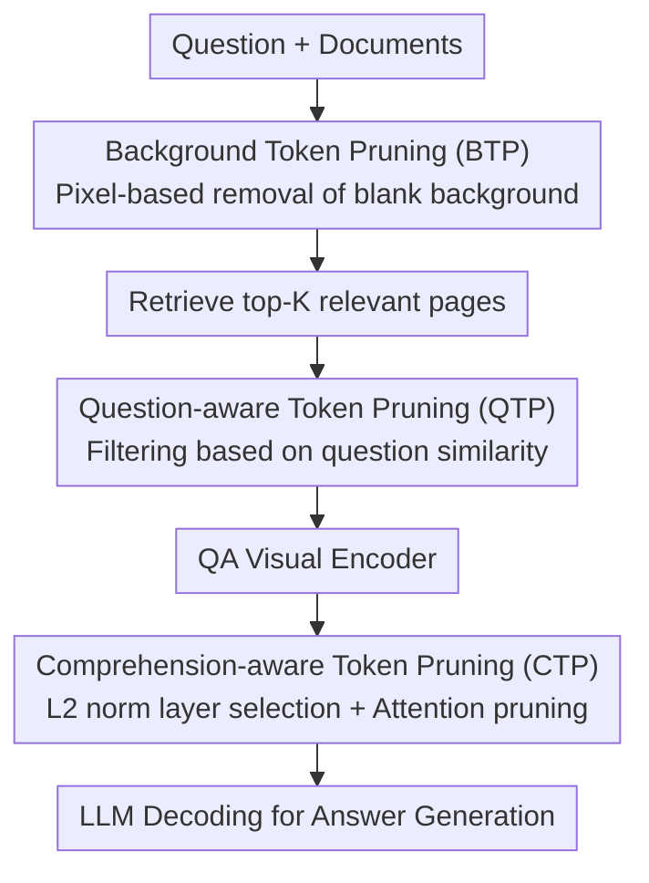

# DocPrune: Efficient Document Question Answering via Background, Question, and Comprehension-aware Token Pruning

**Conference**: CVPR 2026  
**arXiv**: [2604.22281](https://arxiv.org/abs/2604.22281)  
**Code**: To be confirmed  
**Area**: Multimodal VLM / Document Understanding / Visual Token Pruning  
**Keywords**: Document VQA, Training-free token pruning, Long document understanding, RAG, Inference acceleration

## TL;DR
Addressing the "large background + sparse evidence" nature of document images, DocPrune proposes a training-free, progressive three-stage visual token pruning framework (background removal → question-irrelevant region removal → adaptive pruning based on model comprehension). It improves encoder/decoder throughput by $3.0\times / 3.3\times$ on M3DocRAG while increasing F1 by $1.0$.

## Background & Motivation
**Background**: Current Document Visual Question Answering (DocVQA) primarily follows "Retrieval-Augmented Generation" (RAG) routes—models such as M3DocRAG and VDocRAG retrieve the top-K relevant pages from hundreds of documents using retrieval models (e.g., ColPali) and then feed these pages as images into visual language models (e.g., Qwen2-VL) for end-to-end OCR-free QA.

**Limitations of Prior Work**: This approach is computationally expensive. Document layouts are sparse—text, tables, and charts are scattered across large blank backgrounds. A single page can generate thousands of visual tokens, causing costs to explode for long documents. Existing pruning methods designed for natural images/videos (relying on "spatial redundancy of adjacent patches") fail here because document layouts are highly structured. Pruning based solely on visual similarity can easily break text continuity and destroy layout cues, leading to performance degradation. Furthermore, the timing for starting pruning usually relies on fixed heuristics, ignoring the layer-wise evolution of model comprehension.

**Key Challenge**: Document redundancy patterns and optimal pruning timing differ from natural images. It is necessary to utilize both the **document layout structure** (what is meaningless background vs. question-related) and the **internal model states** (the layer at which the model fully "understands" the document).

**Goal**: Achieve "accurate and timely" pruning for long-document QA without additional training, simultaneously reducing computation and maintaining (or even improving) accuracy.

**Key Insight**: Three observations are made: ① On average, 36% of patches are background (zero semantics but high compute cost); ② After removing background, the tokens required to answer a question occupy only a small local region (retaining only top-10% focused tokens results in only $1.2$ F1 drop while reducing FLOPs to $1/9$); ③ The L2 norm of the last token can reliably serve as a proxy for the model's comprehension level across layers.

**Core Idea**: Decompose pruning into three progressive stages: pixel-based background removal, question-similarity-based irrelevant content filtering, and comprehension-aware adaptive attention pruning.

## Method

### Overall Architecture
DocPrune is built upon a standard "Retrieval → QA" two-stage RAG pipeline. Given a question $q$ and a document set $\mathcal{D}$, the retriever $f_{\text{RET}}$ recalls top-$K$ pages $\tilde{\mathcal{D}}=f_{RET}(q,\mathcal{D};K)$, and the QA model $f_{\text{QA}}$ generates the answer $y=f_{\text{QA}}(q,\tilde{\mathcal{D}})$. DocPrune inserts three complementary pruning modules: **Background Token Pruning (BTP)** removes blank backgrounds before encoding; **Question-aware Token Pruning (QTP)** filters irrelevant content before the QA visual encoder; **Comprehension-aware Token Pruning (CTP)** performs adaptive attention pruning during the LLM decoding phase based on comprehension levels.

### Key Designs

**1. Background Token Pruning (BTP): Removing blank spaces before encoding**

BTP explicitly detects and deletes meaningless background (margins, inter-line spacing) **before** encoding. This pixel-level approach is lightweight: images $I\in\mathbb{R}^{H\times W\times 3}$ are divided into $P\times P$ patches, converted to grayscale, and the most frequent pixel value $m$ is determined as the background intensity. The background ratio $R_i$ for each patch is calculated as:

$$R_i=\frac{1}{P^2}\sum_{p=1}^{P^2}\mathbb{1}\left[\,|\hat{t}_i^{(p)}-m|<\tau_{\text{e}}\,\right]$$

where $\tau_{\text{e}}$ is a tolerance threshold. Patches exceeding the threshold $\tau_{\text{bg}}$ are discarded.

**2. Question-aware Token Pruning (QTP): Reusing retrieval embeddings**

QTP filters "question-irrelevant content" by reusing embeddings already calculated during the retrieval stage—document token embeddings $E^{\text{doc}}$ and question token embeddings $E^{\text{qst}}$—incurring near-zero extra cost. It calculates the cosine similarity between each document token and all question tokens:

$$s_i=\sum_{j=1}^{N_{\text{qst}}}\cos(\mathbf{e}^{\text{doc}}_i,\mathbf{e}^{\text{qst}}_j)$$

The resulting map $S$ is resized via bilinear interpolation and processed with Gaussian smoothing $S'=G_\sigma * S$ to expand relevant regions. Only tokens with $S'_i\ge\tau_{\text{qst}}$ enter the QA visual encoder.

**3. Comprehension-aware Token Pruning (CTP): Pruning at the right layer**

CTP solves the timing problem for pruning during decoding. The L2 norm of the last token $c^l=\lVert x_N^l\rVert$ is used as a proxy for the model's "comprehension level." Observations show that higher $c^l$ correlates with higher accuracy, and easy samples reach high $c^l$ earlier than difficult ones. CTP identifies the first layer $l^{\ast}$ satisfying:

$$l^{\ast}=\min(\{l\mid c^l\ge\tau_{\text{comp}}\})$$

At layer $l^{\ast}$, visual tokens with attention weights lower than $\tau_{\text{att}}$ are pruned: $\tilde{X}^{l^{\ast}}=\{x_i^{l^{\ast}}\mid a_i^{l^{\ast}}\ge\tau_{\text{att}}\}$.

## Key Experimental Results

### Main Results
Evaluated on M3DocRAG (Qwen2-VL 7B + ColPali) with top-4 retrieved pages (TFLOPs: lower is better; Throughput: samples/s, higher is better):

| Method (top-4) | ENC TFLOPs↓ | DEC TFLOPs↓ | ENC Throughput | DEC Throughput | EM | F1 |
|--------|------|------|------|------|------|------|
| Qwen2-VL Baseline | 59.28 | 86.27 | 0.6 | 0.6 | 31.5 | 36.3 |
| + FastV | 59.28 | 43.39 | 0.6 | 1.2 | 28.7 | 33.4 |
| + DivPrune | 59.28 | 38.25 | 0.6 | 0.4 | 30.9 | 35.5 |
| + VTW | 59.28 | 64.79 | 0.6 | 0.8 | 21.4 | 24.7 |
| **+ DocPrune (Ours)** | **16.36** | **25.45** | **1.8** | **2.0** | **33.0** | **37.3** |

DocPrune reduces TFLOPs by >70%, improves throughput by $\approx 3.0\times/3.3\times$, and outperforms the baseline in EM/F1 by $+1.5/+1.0$.

### Ablation Study
Incremental performance on M3DocRAG (top-4 pages):

| Config | ENC Throughput | DEC Throughput | EM | F1 |
|------|------|------|------|------|
| Baseline | 0.6 | 0.6 | 31.5 | 36.3 |
| + BTP | 1.3 | 1.3 | 32.9 | 37.1 |
| + BTP + QTP | 1.8 | 1.7 | 32.6 | 36.9 |
| + BTP + QTP + CTP | 1.8 | 2.0 | 33.0 | 37.3 |

### Key Findings
- **BTP provides the most direct gain**: Adding BTP alone doubles throughput and improves F1, confirming that 36% of background patches are purely wasteful.
- **QTP exchanges compute for aggressive pruning**: While QTP alone may slightly reduce F1, it enables further speedup in CTP, with the full framework reaching peak accuracy.
- **L2 norm is the optimal comprehension proxy**: Unlike Entropy or Feature Δ which cause performance drops, the L2 norm criterion improves both speed and F1.
- **Scaling with document length**: DocPrune maintains high throughput as the number of pages increases, whereas the baseline slows significantly.

## Highlights & Insights
- **Document-specific pruning decomposition**: The method addresses three questions: Is it background? Is it question-relevant? Has the model understood it? This is more effective than generic redundancy-based pruning.
- **L2 norm as a comprehension probe**: This proxy requires no training and allows for adaptive pruning depths for difficult versus easy samples.
- **Zero-cost similarity calculation**: Reusing retriever embeddings for QTP is an efficient system-level design.
- **Training-free**: The approach is "plug-and-play" for existing RAG pipelines without requiring weight updates or extra training data.

## Limitations & Future Work
- **Reliance on pixel-based detection**: BTP may be less effective for documents with complex backgrounds, scanning noise, or watermarks.
- **Retriever dependency**: QTP accuracy depends on the semantic alignment between the retriever embeddings and the QA model.
- **Hyperparameter sensitivity**: The five thresholds ($\tau_{\text{e}}, \tau_{\text{bg}}, \tau_{\text{qst}}, \tau_{\text{comp}}, \tau_{\text{att}}$) require tuning for different datasets.

## Related Work & Insights
- **vs. Decoding-phase pruning (FastV, etc.)**: These rely on fixed heuristics for natural images; DocPrune utilizes document layout and adaptive comprehension.
- **vs. Full-layer pruning (VTW)**: VTW degrades fine-grained layout understanding (F1 24.7), whereas DocPrune preserves content and layout information.
- **vs. Feature compression (LLaMA-VID, etc.)**: While compression uses projection, DocPrune uses explicit token abandonment, maintaining interpretability.

## Rating
- Novelty: ⭐⭐⭐⭐
- Experimental Thoroughness: ⭐⭐⭐⭐
- Writing Quality: ⭐⭐⭐⭐
- Value: ⭐⭐⭐⭐

<!-- RELATED:START -->

## Related Papers

- [\[CVPR 2026\] ChartR: Evaluating Reasoning Accuracy and Robustness in Chart Question Answering](chartr_evaluating_reasoning_accuracy_and_robustness_in_chart_question_answering.md)
- [\[CVPR 2026\] VQ-VA World: Towards High-Quality Visual Question-Visual Answering](vq-va_world_towards_high-quality_visual_question-visual_answering.md)
- [\[CVPR 2026\] TransPrune: Token Transition Pruning for Efficient Large Vision-Language Model](transprune_token_transition_pruning_for_efficient_large_vision-language_model.md)
- [\[CVPR 2026\] StaR-KVQA: Structured Reasoning Traces for Implicit-Knowledge Visual Question Answering](star-kvqa_structured_reasoning_traces_for_implicit-knowledge_visual_question_ans.md)
- [\[CVPR 2026\] VLM-Pruner: Buffering for Spatial Sparsity in an Efficient VLM Centrifugal Token Pruning Paradigm](vlm-pruner_buffering_for_spatial_sparsity_in_an_efficient_vlm_centrifugal_token_.md)

<!-- RELATED:END -->
