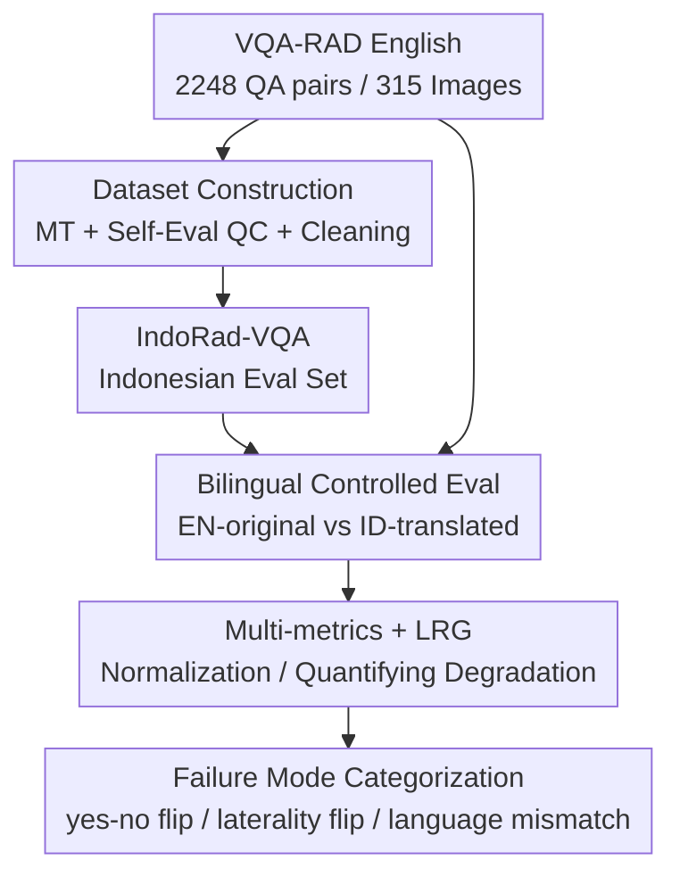

# Does Language Shift Break Medical Vision-Language Models? Indonesian Radiology Visual Question Answering Case Study

**Conference**: CVPR 2026  
**arXiv**: [2606.03693](https://arxiv.org/abs/2606.03693)  
**Code**: TBD (Authors promise to release the dataset, normalization dictionary, prompt templates, and evaluation scripts)  
**Area**: Multimodal VLM / Medical Imaging / Evaluation Benchmark  
**Keywords**: Medical VQA, Radiology, Indonesian, Multilingual Robustness, Evaluation Benchmark

## TL;DR
The authors translate the English radiology VQA benchmark VQA-RAD into Indonesian to construct IndoRad-VQA. In a controlled setting where "images remain constant while only the question language changes," they evaluate 7 open-source medical/multilingual VLMs. They find that even for medical-specific models, accuracy generally drops by 8–25% when switching to Indonesian questions, proving that strong English medical VQA performance does not guarantee robustness in non-English clinical scenarios.

## Background & Motivation
**Background**: Radiology Visual Question Answering (VQA) has become a key metric for measuring the medical capabilities of VLMs. Mainstream benchmarks like VQA-RAD and SLAKE require models to view a radiological image and answer clinical questions. However, these benchmarks are **almost exclusively in English**, and non-English benchmarks are either non-existent or contain significantly fewer QA pairs than English versions.

**Limitations of Prior Work**: Most people globally seek medical care in non-English environments. For instance, Indonesian (Bahasa Indonesia) is the native language for 270 million people and the primary working language in Indonesian hospitals, yet there is **no dedicated Indonesian radiology VQA benchmark**. This means the clinical deployment and evaluation of VLMs in Indonesia lack evidence regarding robustness in the target language.

**Key Challenge**: Existing evaluations couple "visual reasoning ability" with "language ability," making it impossible to distinguish whether a model's error stems from a failure to understand the image or a failure to comprehend the non-English question. In other words, high scores on English benchmarks may mask severe language biases.

**Goal**: To answer a specific research question—can medical VLMs that perform well on English radiology VQA maintain their visual reasoning capabilities when clinical questions are asked in Indonesian?

**Key Insight**: The authors' key insight is that "**translating questions while fixing images**" provides a controlled experimental setup to isolate variables. Given the same image and two semantically equivalent questions (English vs. Indonesian), if a model answers correctly in English but fails in Indonesian, it directly exposes **language robustness defects**, confirming these defects are language-driven rather than vision-driven.

**Core Idea**: Use paired evaluations of "same image, different language" to decouple language-induced failures from visual reasoning failures and quantify this degradation using a Language Robustness Gap (LRG) metric.

## Method

### Overall Architecture
This is a **benchmark + evaluation protocol** study that does not involve training new models; it utilizes zero-shot inference throughout. The pipeline consists of three stages: first, translating English VQA-RAD into Indonesian via machine translation with self-evaluation quality control to obtain IndoRad-VQA; second, running inference for each model under two controlled settings ("EN-original" and "ID-translated"); and third, scoring using a multi-metric system including normalization and LRG, followed by categorizing failure modes for "English-correct, Indonesian-incorrect" samples.

### Key Designs

**1. IndoRad-VQA Dataset Construction: Preservation of Clinical Semantics via Self-Eval QC**

The pain point is the non-existence of Indonesian radiology VQA, while direct machine translation (MT) often ruins medical terminology or breaks answer equivalence. Using VQA-RAD as the source (2248 QA pairs, 315 images covering 104 head CT/MRI, 107 chest X-rays, and 104 abdominal CT scans), the authors used a two-step pipeline: **Step 1 Machine Translation** using the open-source `translategemma-4b-it` to translate all English questions and answers into Indonesian, prompting it to **retain original medical terminology** when no standard Indonesian equivalent exists; **Step 2 Automated Cleaning** involving lowercasing, whitespace normalization, and explicit mapping of binary pairs (yes/ya, no/tidak, right/kanan, left/kiri). The translation approach draws from the self-evaluation QC pipeline of Anak Baik, aiming to preserve clinical meaning, terminology consistency, and answer equivalence simultaneously. The final dataset schema retains fields such as `image_id, question_en, answer_en, question_id, answer_id, answer_type, question_type, split` for English-Indonesian traceability.

**2. Bilingual Answer Normalization Dictionary: Preventing "False Penalization" in Multilingual Eval**

Multilingual evaluation faces a classic pitfall—models outputting semantically correct synonyms (e.g., Indonesian "iya" vs. "ya") being marked wrong due to exact match constraints. The authors manually constructed a **bilingual equivalence dictionary** (Table 1), grouping semantically identical variants for matching: e.g., the Yes group includes `yes, ya, iya, benar, betul, ada, positif…`, the No group includes `no, tidak, bukan, negatif…`, and this is extended to anatomical/radiological terms (e.g., Frontal Lobe ↔ lobus frontal, Consolidation ↔ konsolidasi, Liver ↔ hati/hepar). This dictionary is applied uniformly before all accuracy evaluations, ensuring "Normalized Accuracy" reflects true semantic correctness rather than formatting luck.

**3. Five-Metric + LRG Evaluation Protocol: Quantifying Language Degradation Separately**

Relying on a single accuracy metric loses information. The authors use five complementary metrics for cross-verification: **Strict Accuracy** (exact match after lowercasing/stripping whitespace), **Normalized Accuracy** (exact match after applying the normalization dictionary), **Tokenized F1** (mean precision/recall based on token overlap between prediction and ground truth), and **BERT-Score** (cosine similarity matching using `bert-base-multilingual-cased` context embeddings). The core metric is the **Language Robustness Gap (LRG)**, defined as:

$$\text{LRG} = \text{Acc(EN)} - \text{Acc(ID)}$$

A larger positive value indicates more severe performance degradation caused by the language shift. All results are further split into closed (yes/no) and open (open-ended) question types. The two controlled settings are **EN-original** (English questions from VQA-RAD as baseline) and **ID-translated** (Indonesian questions + Indonesian instructions). Seven evaluated models span three categories: general VLMs (Qwen3-VL-8B, InternVL3-2B), SE-Asian multilingual VLMs (Gemma/Qwen-SEA-LION series), and medical-specific VLMs (MedVLM-R1, MedGemma-v1.5-4B), all tested with the same images, QA pairs, and standardized zero-shot prompts without fine-tuning, ensuring the only variable is the question language.

**4. Automated Failure Mode Categorization: Explaining "EN-Correct, ID-Incorrect" Errors**

To interpret the source of degradation, the authors implemented an automated error detection pipeline that **filters only specimens where the EN setting is correct but the ID setting is incorrect**, then categorizes them into four failure modes: **yes/no flip** (reversed answers to closed questions), **laterality flip** (misidentifying kanan/kiri or right/left), **language-output mismatch** (responding in English despite an Indonesian prompt), and **other (terminology/visual)**. This categorization transforms abstract "score drops" into identifiable clinical safety risks—for instance, misidentifying a left-side lesion as being on the right is a fatal error in radiodiagnosis.

### Loss & Training
This study **does not involve any training or fine-tuning**. All models are evaluated in a zero-shot manner; hence, no loss function is utilized. The only "protocol hyperparameter" is the uniform zero-shot prompt template and the two language settings.

## Key Experimental Results

### Main Results
Evaluation of 7 models on the full VQA-RAD set (2248 QA pairs). EN/ID denotes strict accuracy, while EN*/ID* denotes normalized accuracy (%). The "↓" column indicates the magnitude of degradation for Indonesian relative to English.

| Model | Type | EN(strict) | ID(strict) ↓ | EN*(norm) | ID*(norm) ↓ |
|------|------|-----------|-------------|-----------|-------------|
| Qwen3-VL-8B-Instruct | GEN | 51.02 | 16.00 | 51.11 | 40.29 |
| InternVL3-2B | GEN | 41.00 | 25.40 | 41.00 | 29.77 |
| Gemma-SEA-LION-v4-4B-VL | SEA | 40.20 | 21.57 | 40.42 | 36.90 |
| Qwen-SEA-LION-v4-4B-VL | SEA | 48.17 | 18.00 | 48.26 | 41.13 |
| Qwen-SEA-LION-v4-8B-VL | SEA | 50.53 | 17.96 | 50.62 | 41.18 |
| MedVLM-R1 | MED | 37.17 | 12.52 | 37.34 | 30.57 |
| MedGemma-v1.5-4B | MED | 50.62 | 25.45 | 50.98 | 44.39 |

> ⚠️ In the original Table, ID/ID* columns directly provide values labeled with "↓". It is difficult to determine if these are "absolute scores for Indonesian" or "magnitude of degradation." This table is transcribed as per the original; refer to the source for specific semantics.

### Language Robustness Gap (Aggregated by Metric, Table 3)
| Metric | EN | ID | LRG (=EN−ID) |
|------|-----|-----|------|
| Strict | 45.09 | 19.82 | 25.27 |
| Normalized | 45.25 | 37.18 | 8.07 |
| F1 Tokenized | 49.20 | 40.66 | 8.54 |
| BERT Score | 53.85 | 43.63 | 10.21 |

### Failure Mode Distribution (Table 4, for "EN-Correct, ID-Incorrect" only, n=7990)
| Error Type | Count | Proportion |
|---------|------|------|
| Yes/No Flip | 1224 | 15.3% |
| Laterality Flip | 18 | 0.2% |
| Language-output Mismatch | 89 | 1.1% |
| Other (Terminology / Visual) | 6659 | 83.3% |

### Key Findings
- **Degradation is universal and consistent**: All 7 models show significant score drops under the Indonesian setting. The overall LRG ranges between 8–25% depending on the metric used.
- **Medical specialty training does not fix language bias**: Domain-specific models like MedVLM-R1 and MedGemma also degrade significantly, indicating that the defect is **language-driven rather than vision-driven**—clinical-domain training does not mitigate the inherent English-centric bias of VLMs.
- **Strict accuracy is most affected by language**: The LRG for Strict (25.27) is nearly 2–3 times that of other metrics (8–10), a gap of nearly 20 percentage points. This suggests that many Indonesian answers are **semantically correct** but fail to meet exact match formatting; normalization recovers a substantial portion of these.
- **Errors are dominated by terminology/visuals**: 83.3% of "EN-correct, ID-incorrect" samples fall into the "Other" category. Yes/no flips (15.3%) are the most prominent language-induced failure category. While laterality flips and language mismatches are rare (0.2%, 1.1%), they reveal interpretable and clinically dangerous failure patterns.

## Highlights & Insights
- **The "Same Image, Different Language" controlled design is clean**: Fixing the image and varying only the language allows language robustness to be isolated and quantified—a key to attributing errors to language rather than vision. This methodology can be directly transferred to any language or medical VQA benchmark.
- **The normalization dictionary exposes metric bias**: The ~20% gap between Strict and Normalized accuracy serves as a reminder that exact match metrics systematically underestimate non-English models in multilingual evaluation. Equivalence dictionaries must be established to avoid contaminating conclusions with "false penalization."
- **LRG is a simple yet useful scalar**: Using the EN−ID difference allows for a horizontal comparison of "resistance to language shift" across models, facilitating leaderboard construction and model selection.
- **Failure mode categorization bridges abstract degradation and clinical safety**: Errors such as laterality or yes/no flips are directly related to patient safety in radiodiagnosis. Translating score drops into "which clinical errors increased" is significantly more valuable than looking at accuracy alone.

## Limitations & Future Work
- **Limitations acknowledged by the authors**: ① Validation was limited to a single radiology VQA dataset (VQA-RAD); the authors plan to merge multiple open-source datasets later. ② Translation utilized only the 4B machine translation model TranslateGemma (due to compute limits avoiding the 12B/27B variants); translation quality might be limited. ③ Evaluations were strictly zero-shot, without exploring few-shot or fine-tuning. ④ Medical accuracy relied on **self-evaluation** rather than manual audit by radiologists, leaving clinical credibility unverified. ⑤ Results are explicitly stated **not** to be evidence of clinical readiness for deployment.
- **Self-identified limitations**: The semantics of values in the main result table (Table 2) (absolute score vs. degradation) contain ambiguities. Additionally, LRG comparisons are affected by varying English baselines; a "larger drop" does not necessarily mean the model is "worse in Indonesian" without considering absolute Indonesian scores.
- **Future directions**: Incorporating manual audit of translations and answers by radiologists; using larger MT models or human translation as controls; expanding the benchmark to multi-source data like SLAKE; and testing whether few-shot or lightweight fine-tuning can narrow the LRG.

## Related Work & Insights
- **vs. VQA-RAD / SLAKE**: These are the source English benchmarks used in this study, which only evaluate English visual reasoning. This work adapts them for Indonesian to expand the evaluation dimension from "image understanding" to "image understanding across languages."
- **vs. Existing Multilingual Medical VQA**: A few non-English benchmarks exist but have significantly smaller QA pair scales and do not specifically isolate the language variable. This paper uses the "same image, different language" paired design + LRG to specifically quantify language drift, filling the gap for Indonesian.
- **vs. Anak Baik Translation Pipeline**: The self-eval QC translation strategy used here is inspired by Anak Baik (an English-Indonesian translation set for ethical instructions), extending "self-eval QC machine translation" from text tasks to terminology-sensitive scenarios in multimodal medical VQA.

## Rating
- Novelty: ⭐⭐⭐⭐ First Indonesian radiology VQA benchmark + LRG metric. The "same image, different language" controlled design is clean, though the methodology is language adaptation of existing benchmarks, resulting in limited technical innovation.
- Experimental Thoroughness: ⭐⭐⭐ Covers 7 cross-category models with five metrics and failure mode categorization. However, reliance on a single dataset, a single MT model, pure zero-shot testing, and lack of physician audit limits its persuasiveness.
- Writing Quality: ⭐⭐⭐⭐ Motivation and research questions are clear, and tables are reasonably organized, though there is minor semantic ambiguity in the main result table values.
- Value: ⭐⭐⭐⭐ Demonstrates that "English SOTA ≠ non-English robustness" and "medical training does not fix language bias." Significant practical warning for the evaluation and deployment of medical AI in low-resource languages.

<!-- RELATED:START -->

## Related Papers

- [\[CVPR 2026\] VQ-VA World: Towards High-Quality Visual Question-Visual Answering](vq-va_world_towards_high-quality_visual_question-visual_answering.md)
- [\[ICLR 2026\] How Do Medical MLLMs Fail? A Study on Visual Grounding in Medical Images](../../ICLR2026/multimodal_vlm/how_do_medical_mllms_fail_a_study_on_visual_grounding_in_medical_images.md)
- [\[CVPR 2026\] StaR-KVQA: Structured Reasoning Traces for Implicit-Knowledge Visual Question Answering](star-kvqa_structured_reasoning_traces_for_implicit-knowledge_visual_question_ans.md)
- [\[ACL 2026\] WikiSeeker: Rethinking the Role of Vision-Language Models in Knowledge-Based Visual Question Answering](../../ACL2026/multimodal_vlm/wikiseeker_rethinking_the_role_of_vision-language_models_in_knowledge-based_visu.md)
- [\[CVPR 2026\] DocPrune: Efficient Document Question Answering via Background, Question, and Comprehension-aware Token Pruning](docpruneefficient_document_question_answering_via_background_question_and_compre.md)

<!-- RELATED:END -->
