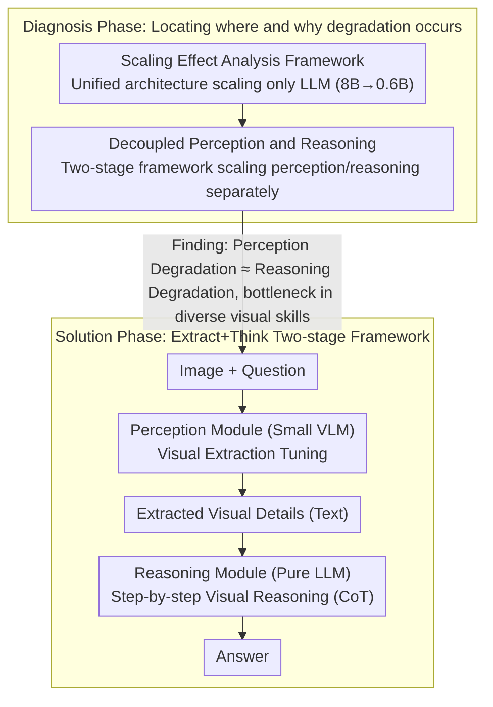

# Downscaling Intelligence: Exploring Perception and Reasoning Bottlenecks in Small VLMs

**Conference**: CVPR 2026  
**arXiv**: [2511.17487](https://arxiv.org/abs/2511.17487)  
**Code**: [https://web.stanford.edu/~markendo/projects/downscaling_intelligence](https://web.stanford.edu/~markendo/projects/downscaling_intelligence) (Project page available)  
**Area**: Multimodal VLM / Small Language Models  
**Keywords**: Multimodal Model Scaling, Perception Bottleneck, Reasoning Bottleneck, Visual Extraction Tuning, Small Models

## TL;DR
This study systematically investigates the impact of LLM scaling on multimodal capabilities, finding that visual tasks—rather than LLM-dependent tasks—are most affected, and that perceptual degradation is as severe as reasoning degradation. The proposed Extract+Think method (Visual Extraction Tuning + Step-by-step Reasoning) enables a minimal model with 0.6B perception and 1.7B reasoning to outperform PrismCaptioner and LLaVA-OneVision-0.5B, which are up to 12 times larger.

## Background & Motivation

Multimodal Large Language Models (MLLMs) have made significant progress in visual understanding and reasoning, but practical deployment requires small and efficient models. The **Key Challenge** in current small model research is: when the LLM backbone is scaled down, which capabilities degrade most severely, and why? Existing studies reach contradictory conclusions—some suggest LLM scaling has little impact on perception, while others find perception-intensive tasks like OCR are highly sensitive.

The motivation of this study operates at three levels:

**Understanding Practical Limits**: Systematically quantifying which tasks are most affected when scaling down from 8B to 0.6B.

**Revealing Failure Mechanisms**: Does visual capability degrade because reasoning worsens (expected), or are more fundamental perceptual capabilities also degrading (unexpected)?

**Developing Targeted Solutions**: Designing improvement methods based on the identified bottlenecks.

**Key Findings**: LLM scaling disproportionately affects visual tasks (as opposed to intrinsic LLM tasks like knowledge QA), and **perceptual degradation is as severe as, or even more severe than, reasoning degradation**. This refutes the prior assumption that "perception is insensitive to LLM scale." **Key Insight**: The perception bottleneck stems from the requirement for the model to learn excessively diverse visual extraction skills during visual instruction tuning, which small model capacities cannot master.

## Method

### Overall Architecture
This paper addresses two progressive questions: where and why small VLMs degrade when scaling the LLM backbone from 8B to 0.6B, and how to targetedly compensate for this. The first half is a diagnosis—quantifying "degradation" along perception and reasoning lines using controlled experiments; the second half is the solution—proposing Extract+Think based on diagnostic conclusions.

Extract+Think explicitly decouples "answering based on an image" into two serial steps: the image and the question first enter the **perception module** (a small VLM), which is solely responsible for extracting visual details relevant to the question into text; this text is then fed along with the question into the **reasoning module** (a pure LLM), which provides the answer through step-by-step reasoning. Both modules utilize the Qwen3 series: the perception module uses 0.6B or 1.7B VLMs, and the reasoning module uses 1.7B or 4B LLMs. This decoupling allows the respective bottlenecks of perception and reasoning to be diagnosed and addressed independently.

### Key Designs

**1. Scaling Effect Analysis Framework: Quantifying small model degradation**

Before implementing improvements, the authors identified which task categories exhibit the most concentrated degradation. They fixed a unified architecture—Qwen3 backbone (8B, 4B, 1.7B, 0.6B) + SigLIP vision encoder + 2-layer MLP connector—trained and evaluated using the same recipe across 15 visual instruction tuning datasets, with LLM scale as the only variable. Two clear patterns emerged: first, the most significant degradation occurs in vision-intensive tasks (Grounding dropped by 48% from 8B to 0.6B; perceptual similarity dropped by 38%), while tasks relying on LLM internal knowledge, like ScienceQA, remained stable. Second, a task's sensitivity to LLM scaling is nearly linearly correlated with its dependence on visual information from images. This empirical evidence refutes the intuition that small models primarily degrade in reasoning—the sharpest decline is in "seeing" the image itself.

**2. Decoupling Perception and Reasoning: Proving equivalent degradation severity**

Task-level declines do not distinguish whether visual task degradation is due to "failing to see" or "failing to think." Borrowing logic from Prism, the authors split an interaction into two independently scalable stages: the VLM converts image information to text (perception), and the LLM reasons over the pure text (reasoning). By scaling one stage while keeping the other constant at a large model size, the performance drop is measured. The conclusion is surprising: scaling the perception module alone (8B→0.6B) causes a decline nearly as large as scaling the reasoning module alone, with in-domain average accuracy dropping by approximately 0.15. Even in tasks like Instance Reasoning and Logical Reasoning, which appear reasoning-heavy, the damage from scaling down the perception module is comparable to that of the reasoning module.

This finding is significant because it invalidates the assumption in the original Prism work—which paired a 1.8B perception module with a 70B reasoning module—that "perception is insensitive to LLM scale." This decoupling framework proves this assumption does not hold in the small model regime. The authors further explain this using a Neural Scaling Laws quantitative model: capabilities are "quantized" into discrete chunks; smaller models can accommodate fewer chunks. Visual instruction tuning requires models to master too many types of visual extraction skills simultaneously, exceeding the capacity of small models and leading to perceptual collapse.

**3. Visual Extraction Tuning: Converging diverse visual skills**

Since the bottleneck is the "excessive diversity of visual skills," the training objective is unified. The authors converted existing visual instruction tuning data into a singular visual extraction task: rewriting original QA pairs into declarative sentences and prompting the model to describe fine-grained visual details related to those statements. Training labels were generated using Qwen3VL-8B, resulting in 382K samples for post-training the perception module. Post-conversion, the perception module no longer learns to switch between $N$ task formats but focuses on a single skill: "extracting visual information relevant to the question."

While direct Captioning is a natural comparison, descriptive data has two flaws: it does not teach the model to extract information relative to a specific question, and general captioning data lacks domain-specific understanding. Visual Extraction Tuning addresses both—it ensures extraction is both unified and aligned with the query.

**4. Step-by-step Reasoning: Utilizing extracted information in the reasoning module**

In the two-stage framework, text serves as the bridge between perception and reasoning. This means adding CoT to the reasoning end can directly enhance performance without touching visual training. The authors utilized the Qwen3 "thinking mode" to activate chain-of-thought and applied NoWait to suppress excessive self-reflection, limiting the thinking budget to 4096 tokens. Interestingly, CoT gains follow an inverted U-shape: the 8B model is already sufficiently strong (limited gain), and the 0.6B model is too weak to reason (cannot utilize CoT). The greatest benefits are observed in intermediate scales like 4B and 1.7B.

### Loss & Training
- **Perception Module Training**: Connector pre-training (BLIP558K) $\rightarrow$ Visual Instruction Tuning (574K single-image + 309K multi-image + 150K single-image) $\rightarrow$ Captioning post-training (ALLaVA-4V 950K) $\rightarrow$ Visual Extraction Tuning (382K).
- **Reasoning Module**: Directly use Qwen3 without additional training.
- **From-scratch variant (Extract+Think†)**: Only uses visual extraction tuning data (382K), bypassing instruction tuning and captioning stages.

## Key Experimental Results

### Main Results: Comparison with Baseline Methods

| Method | Perc./Reas. Scale | Visual Data | In-domain Avg | MMStar |
|------|:---:|:---:|:---:|:---:|
| LLaVA-OneVision | 0.5B E2E | 8.8M | 71.1 | 39.0 |
| InternVL2.5 | 0.5B E2E | 64M | 83.2 | 48.2 |
| PrismCaptioner | 7B/70B | 1.9M | 78.3 | 45.7 |
| Baseline (§3) | 0.6B E2E | 1.0M | 65.9 | 37.2 |
| Caption+Think | 0.6B/1.7B | 2.0M | 75.0 | 43.0 |
| **Extract+Think** | **0.6B/1.7B** | **2.4M** | **80.3** | **46.6** |
| **Extract+Think** | **1.7B/4.0B** | **2.4M** | **85.3** | **52.6** |

### Ablation Study: Effect of Visual Extraction Tuning

| Perception Module | In-domain | MMStar | Description |
|----------|:---:|:---:|------|
| Captioning 0.6B | 77.6 | 40.4 | Pure captioning baseline |
| + Visual Extraction 0.6B | **82.8** | **44.0** | +5.2/+3.6 Gain |
| Captioning 1.7B | 80.3 | 44.4 | Pure captioning baseline |
| + Visual Extraction 1.7B | **84.4** | **49.0** | +4.1/+4.6 Gain |

### Key Findings
- **Visual tasks are most affected by LLM scaling**: Grounding performance dropped 48% from 8B to 0.6B, while ScienceQA remained nearly unchanged. Task dependence on visual information is linearly related to sensitivity to LLM scaling.
- **Perception degradation ≈ Reasoning degradation**: In decoupling analysis, the performance drop from scaling the perception module is comparable to scaling the reasoning module; for reasoning tasks (IR/LR), perceptual scaling even had a larger impact.
- **High efficiency of Visual Extraction Tuning**: Extract+Think†, trained from scratch using only 382K visual samples (4.3% of LLaVA-OneVision's data), outperformed the latter in-domain.
- **CoT reasoning is most effective at intermediate scales**: 0.6B is too small to leverage CoT, and 8B is strong enough without it; 4B and 1.7B benefit most.
- **Extract+Think (0.6B/1.7B)** outperformed PrismCaptioner in-domain and out-of-domain despite having a 12x smaller perception module and 41x smaller reasoning module.

## Highlights & Insights
- **Counter-intuitive finding of "perception as a core bottleneck"**: Prior assumptions focused on reasoning losses in small models, but this work identifies equivalent perceptual degradation, shifting optimization priorities.
- **Explanatory power of Neural Scaling Laws**: The theory of "quantized" skill chunks explains why visual instruction tuning diversity exacerbates perceptual bottlenecks—small models lack the capacity to cover all perceptual modes.
- **Elegant and practical idea of Visual Extraction Tuning**: Instead of forcing small models to learn $N$ visual understanding methods, they are unified into the single skill of "extracting relevant details."
- **Analytical value of two-stage decoupling**: Even if not used for deployment, the decoupling framework provides a diagnostic tool for small model research.

## Limitations & Future Work
- The two-stage framework increases inference latency due to two model forward passes, making it less suitable for real-time applications.
- Textual output from the perception module may lose fine-grained visual information (information bottleneck).
- Visual Extraction Tuning depends on Qwen3VL-8B for data generation, introducing teacher model bias.
- Generalizability across architectures (e.g., LLaMA, Gemma) is unknown as experiments targeted the Qwen3 series.
- The vision encoder (SigLIP) remained constant; its scaling effect on perception was not analyzed.
- CoT reasoning increases output length and inference cost; the 4096-token limit may be insufficient for complex reasoning.

## Related Work & Insights
- **vs Prism framework**: Prism assumes perception is insensitive to LLM scale (small LLM perception + large LLM reasoning); this work refutes that and proposes Visual Extraction Tuning.
- **vs LLaVA-OneVision**: While E2E training used 8.8M visual samples, Extract+Think† achieved superior results to the 0.5B version with only 382K samples (95% data savings).
- **vs VLM failure analysis**: Unlike work focusing on large model failure modes (e.g., visual information underutilization), this study systematically analyzes failure mechanisms unique to small models.
- The concept of Visual Extraction Tuning can be extended to other scenarios requiring the unification of heterogeneous tasks—the core insight is "reducing skill diversity to focus on core capabilities."

## Rating
- Novelty: ⭐⭐⭐⭐⭐ Discovery of the perception bottleneck shifts domain cognitive focus; Visual Extraction Tuning is novel and theoretically grounded.
- Experimental Thoroughness: ⭐⭐⭐⭐⭐ Systematically analyzed across 15 tasks, 4 model scales, decoupling, and multiple baselines.
- Writing Quality: ⭐⭐⭐⭐⭐ Clear progressive structure: problem identification $\rightarrow$ causal analysis $\rightarrow$ solution.
- Value: ⭐⭐⭐⭐⭐ Significant methodology and practical implications for small VLM research.

<!-- RELATED:START -->

## Related Papers

- [\[CVPR 2026\] Abstract 3D Perception for Spatial Intelligence in Vision-Language Models](abstract_3d_perception_for_spatial_intelligence_in_vision-language_models.md)
- [\[CVPR 2026\] Nano-EmoX: Unifying Multimodal Emotional Intelligence from Perception to Empathy](nano-emox_unifying_multimodal_emotional_intelligence_from_perception_to_empathy.md)
- [\[CVPR 2026\] Small Object, Great Challenge: A Benchmark for Small Object Visual Grounding](small_object_great_challenge_a_benchmark_for_small_object_visual_grounding.md)
- [\[ICLR 2026\] Empowering Small VLMs to Think with Dynamic Memorization and Exploration](../../ICLR2026/multimodal_vlm/empowering_small_vlms_to_think_with_dynamic_memorization_and_exploration.md)
- [\[CVPR 2026\] Act2See: Emergent Active Visual Perception for Video Reasoning](act2see_emergent_active_visual_perception_for_video_reasoning.md)

<!-- RELATED:END -->
