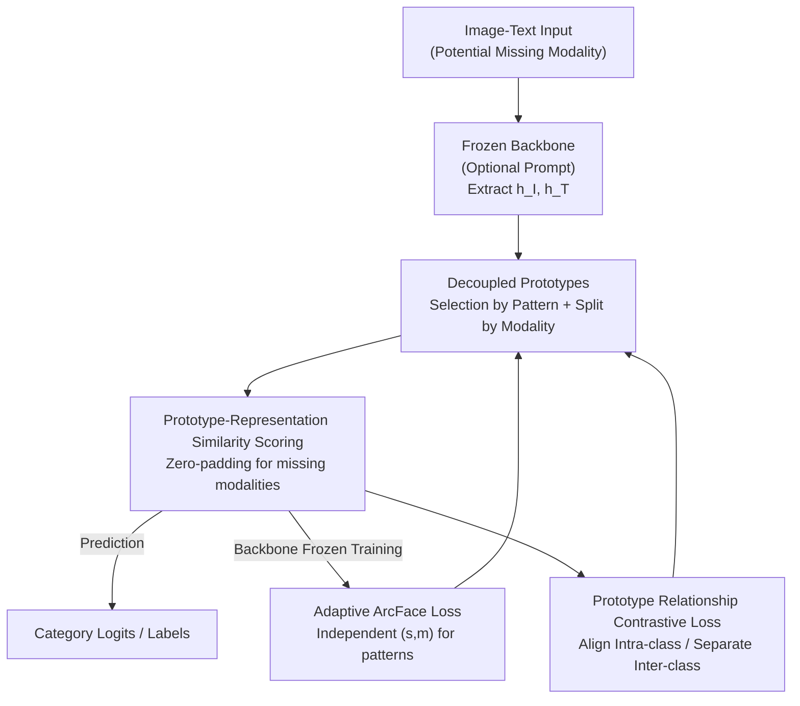

# DPL: Decoupled Prototype Learning for Enhancing Robustness of Vision-Language Transformers to Missing Modalities

**Conference**: CVPR 2026  
**Paper**: [CVF Open Access](https://openaccess.thecvf.com/content/CVPR2026/html/Lu_DPL_Decoupled_Prototype_Learning_for_Enhancing_Robustness_of_Vision-Language_Transformers_CVPR_2026_paper.html)  
**Code**: https://github.com/OverfitFlow/DPL  
**Area**: Multimodal VLM  
**Keywords**: Missing Modality, Prototype Learning, Vision-Language Transformer, ArcFace, Robustness

## TL;DR
To address the performance drop of vision-language models when a modality is missing, this paper proposes DPL: replacing the fixed fully connected classification head with a decoupled prototype prediction head that selects prototypes based on missing patterns and splits them by modality. Combined with a missing-aware ArcFace loss and prototype relationship contrastive loss, it can be integrated into any prompt-based method as a plug-and-play component, consistently outperforming SOTA across multiple missing scenarios on three datasets.

## Background & Motivation
**Background**: Vision-Language Transformers (e.g., ViLT, CLIP) perform excellently on paired image-text data. However, in real-world deployment, one modality is often missing (e.g., medical records unavailable due to privacy, missing test scores in education). Current mainstream approaches focus on **prompt learning**—methods like MAP, MSP, MuAP, and DCP use "missing-aware prompts" to guide the backbone in extracting representations adapted to the missing situation, requiring only minimal parameter fine-tuning.

**Limitations of Prior Work**: Existing methods only perform "half the adaptation." They make the **representations** sensitive to the missing status, but the **prediction head** remains a unified fully-connected (FC) layer. Regardless of whether the sample is image-missing, text-missing, or complete, the FC layer uses the same category weights and calculation method. Consequently, "adaptive representations" encounter a "static prediction layer," meaning the missingness clues captured by prompts are flattened in the final layer.

**Key Challenge**: Missing modalities not only disrupt cross-modal interaction but also inject noise from incomplete inputs into the decision-making process (Fig. 1 of the paper shows that while the model corrects "pig" to "dog" using cross-modal correlation when complete, it produces contaminated logits when data is missing). A truly adaptive model must extend "missing awareness" from representations to the **prediction strategy itself**.

**Goal**: To design a prediction head sensitive to missing patterns that can distinguish different scenarios (missing image / missing text / complete) and allow available modalities to truly dominate the final decision, while seamlessly integrating with existing prompt frameworks.

**Core Idea**: Replace the single FC weight with a set of **category prototypes** that are "decoupled by missing pattern and decomposed by modality." Each category has corresponding prototypes for different missing scenarios, and each prototype is split into image and text components. During prediction, prototypes are dynamically selected based on the missing pattern, and only components of the present modalities participate in scoring.

## Method

### Overall Architecture
The input to DPL is a pair of (potentially incomplete) image and text $\{x_I, x_T\}$, and the output is the category prediction. The backbone remains frozen, and only the final prediction head is replaced. The process consists of three stages: constructing a "missing-aware + modality-decomposed" prototype library for each category; selecting the corresponding prototype during inference based on the missing pattern and using cosine similarity for scoring; and training the prototypes (and optional prompts) using two customized losses while the backbone is frozen.

Formally, the dataset $D$ consists of three subsets: the complete set $D^c=\{x_I,x_T,y\}$, the image-missing set $D^{r_I}=\{\tilde{x}_I,x_T,y\}$, and the text-missing set $D^{r_T}=\{x_I,\tilde{x}_T,y\}$, where $\tilde{x}$ denotes a placeholder null input. Missing modality representations are padded with zero vectors to ensure only present modalities contribute to the logits.

### Key Designs

**1. Decoupled Prototypes: Switching decision boundaries based on missing status and available modalities**

This directly addresses the mismatch between "adaptive representations and static FC." For the $k$-th category, DPL uses three sets of **missing-aware prototypes** $w_k^{c}, w_k^{r_I}, w_k^{r_T}$ serving complete, image-missing, and text-missing samples, respectively. Each set is further **decomposed** into image and text components:

$$w_k^{c}=[w_k^{c,I},\,w_k^{c,T}];\quad w_k^{r_I}=[w_k^{r_I,I},\,w_k^{r_I,T}];\quad w_k^{r_T}=[w_k^{r_T,I},\,w_k^{r_T,T}]$$

For example, $w_k^{r_T,I}$ represents the image component of the prototype for the $k$-th class under the text-missing scenario. This dual decoupling allows the prediction head to assign independent decision boundaries for each scenario. A key technical detail is that **normalization is performed independently** ($L_2$ norm) for each modality component after decomposition, rather than on the entire prototype vector, which optimizes the resulting logits.

**2. Missing-Aware Similarity Scoring: Dominance of present modalities in logits**

With prototypes defined, DPL calculates logits using cosine similarity and switches the formula based on the current missing pattern. For sample $i$ and category $k$, the logits are:

$$z_{i,k}=\begin{cases}\big((\hat{h}_i^{I})^{\mathsf{T}}\hat{w}_k^{c,I}+(\hat{h}_i^{T})^{\mathsf{T}}\hat{w}_k^{c,T}\big)/2 & x_i\in D^c\\[4pt](\hat{h}_i^{T})^{\mathsf{T}}\hat{w}_k^{r_I,T} & x_i\in D^{r_I}\\[4pt](\hat{h}_i^{I})^{\mathsf{T}}\hat{w}_k^{r_T,I} & x_i\in D^{r_T}\end{cases}$$

where $\hat{h}$ and $\hat{w}$ are $L_2$ normalized representations and prototypes. For complete samples, results are averaged; for missing scenarios, only the available component (e.g., text prototype $\hat{w}_k^{r_I,T}$) is used. The "divide by 2 for complete, use single modality for missing" design ensures the magnitude of logits remains consistent, preventing them from being artificially amplified or compressed.

**3. Adaptive ArcFace Loss: Individual margin and scale for each missing scenario**

DPL optimizes prototypes using the additive angular margin loss from ArcFace. Since missing samples contain less information than complete ones, they should not share the same confidence estimation. DPL assigns distinct scales and margins for the three scenarios: complete $(s^c,m^c)$, image-missing $(s^{r_I},m^{r_I})$, and text-missing $(s^{r_T},m^{r_T})$. This reflects the confidence variance across modality configurations and balances the decision boundaries.

**4. Prototype Relationship Contrastive Loss $\mathcal{L}_{\text{PRC}}$: Preventing drift of decoupled prototypes**

Decoupling introduces the risk that prototypes for the same category might drift semantically as they are trained on different subsets. The PRC loss pulls same-class prototypes closer and pushes different-class prototypes further apart:

$$\mathcal{L}_{\text{PRC}}=-\sum_{k=1}^{K}\sum_{u,v}\mathbb{1}_{u\neq v}\log\frac{\exp(\hat{w}_k^{u}\cdot\hat{w}_k^{v})}{P}$$

where $P$ is a normalization factor summing over prototype pairs that are either different classes or different combinations $(u,v)$ of the same class. This serves as a contrastive regularizer in the prototype space to maintain semantic consistency across decoupled prototypes. The total objective is $\mathcal{L}_{\text{DPL}}=\mathcal{L}_{\text{ArcFace}}+\lambda\mathcal{L}_{\text{PRC}}$.

### Loss & Training
The backbone (CLIP ViT-B/16 or ViLT) is frozen throughout. Only learnable prompts (length 36, following DCP) and prototypes are fine-tuned. AdamW is used with an initial learning rate of $1\times10^{-2}$ and weight decay of $2\times10^{-2}$. A linear decay with 10% warmup is applied over a batch size of 4. Missing modalities are simulated using zero tensors with a missing rate $\eta\in\{50,70,90\}\%$.

## Key Experimental Results

### Main Results
Evaluated on MM-IMDb (Macro-F1), UPMC Food-101 (Top-1 Acc), and Hateful Memes (AUROC), replacing the FC head of various baselines with the DPL head across image-missing, text-missing, and mixed-missing scenarios. Selected results for MM-IMDb (F1-Macro):

| Missing Config (train/test) | Baseline | w/ FC | w/ DPL | Gain |
|------|------|------|------|------|
| Text-missing 50% | MaPLe | 54.31 | 56.36 | +2.05 |
| Text-missing 50% | MAP | 53.32 | 56.03 | +2.71 |
| Text-missing 50% | DCP | 53.62 | 56.94 | +3.32 |
| Mixed 65/65% | DCP | 51.46 | 55.48 | +4.02 |
| Image-missing 90% | DCP | 49.69 | 53.06 | +3.37 |
| No prompt Mixed 55/55% | — | 50.24 | 53.98 | +3.74 |

Integrating the DPL head consistently yields improvements regardless of prompt tuning. Even under severe 90% missing rates, mixed scenarios show a gain of up to 1.8%. On Hateful Memes with the ViLT backbone (Tab. 2), text-missing 30/100% improved from 54.02 to 64.53, demonstrating DPL's backbone-agnostic nature.

### Ablation Study
Ablation on Hateful Memes regarding "Prototype Decomposition + Loss Selection" (F1-Macro, DCP framework):

| Config | Text-missing 50% | Mixed 75/75% | Image-missing 90% | Note |
|------|------|------|------|------|
| $\mathcal{L}_{\text{DPL}}$ un-decomp. | 65.26 | 66.82 | 69.29 | Selection by pattern only, no modality split |
| $\mathcal{L}_{\text{ArcFace}}$ decomp. | 66.44 | 68.59 | 69.55 | Split included, PRC excluded |
| $\mathcal{L}_{\text{DPL}}$ decomp. (Ours) | **67.46** | **69.31** | **70.76** | Split + ArcFace + PRC |

Missing-aware mechanism (MA) ablation (Tab. 5) shows that swapping per-pattern prototype selection for minimum-entropy selection leads to performance drops. Compared to DePT (Tab. 3), which focuses on Base-New trade-offs, DPL provides more stable gains in missing modality scenarios.

### Key Findings
- **Modality decomposition is the primary driver**: Removing decomposition (un-decomp.) results in a 1-2 point drop, proving that explicit modeling of each modality's prototype is more effective than simple pattern selection.
- **PRC loss adds refinement**: Adding PRC on top of decomposition boosts almost all configurations, validating its role in preventing semantic drift among decoupled prototypes.
- **Greater gains at higher missing rates**: DPL's relative superiority is more pronounced at 90% missing rates, showing its strength in information-scarce scenarios.
- **Cross-seed stability**: DPL shows a narrower IQR and higher upper bounds in box-plots across random seeds compared to FC/DePT, indicating higher robustness.

## Highlights & Insights
- **Completing "Missing Awareness" at the Prediction Layer**: While prior works focused on representation/prompt adaptation, DPL identifies the "adaptive representation vs. static head" mismatch and extends adaptation to the decision-making strategy.
- **Dual Decoupling + Independent Normalization**: Prototype decomposition by pattern and modality, combined with modality-wise $L_2$ normalization, effectively optimizes the logit distribution.
- **Plug-and-play and Non-invasive**: DPL is a universal replacement for the FC head that requires no backbone modifications, making it easy to migrate into any existing prompt-based pipeline.
- **Transferability of per-case (s,m)**: The idea of assigning specific margins and scales to subsets with varying data quality or confidence is relevant for other domains like long-tail or noisy label learning.

## Limitations & Future Work
- **Limited to Bi-modal (Image+Text)**: While formulated for arbitrary modalities, experiments only cover $M=2$. For $M>2$, the number of prototype combinations may grow significantly.
- **Requirement of Known Missing Pattern**: The scoring mechanism relies on knowing whether data is image-missing or text-missing. If the pattern is unknown, an additional detection module is required.
- **Mixed Scenario Variance**: The authors note that the IQR is larger in mixed-missing scenarios compared to single-modality missing cases, suggesting room for further stability improvements.
- **Moderate Absolute Gains**: In simpler datasets like Food-101, the gains are sometimes below 1 point, with benefits concentrated in difficult datasets and high missing rates.

## Related Work & Insights
- **vs. MAP / DCP**: These methods adapt representations via prompts. DPL complements them by adapting the decision layer.
- **vs. DePT**: DePT decouples via feature channels for generalization, whereas DPL decouples by "Missing Pattern × Modality," targeting robustness.
- **vs. Prototype Learning**: DPL adapts ArcFace to the multimodal classification setting using multi-prototype structures and relationship constraints to solve the limitations of a shared single classification head.

## Rating
- Novelty: ⭐⭐⭐⭐ First to apply missing awareness to the prediction head with dual decoupling.
- Experimental Thoroughness: ⭐⭐⭐⭐ Extensive coverage across datasets, missing rates, and backbones.
- Writing Quality: ⭐⭐⭐⭐ Strong motivation and clear derivation.
- Value: ⭐⭐⭐⭐ High practical utility as a plug-and-play component.

<!-- RELATED:START -->

## Related Papers

- [\[ICML 2026\] Calibrated Multimodal Representation Learning with Missing Modalities](../../ICML2026/multimodal_vlm/calibrated_multimodal_representation_learning_with_missing_modalities.md)
- [\[CVPR 2026\] Beyond Missing Modalities: Hypergraph Guided Diffusion for Uncertainty-Aware Multimodal Emotion Recognition](beyond_missing_modalities_hypergraph_conditioned_diffusion_for_uncertainty-aware.md)
- [\[CVPR 2026\] Enhancing Continual Learning of Vision-Language Models via Dynamic Prefix Weighting](enhancing_continual_learning_of_vision-language_models_via_dynamic_prefix_weight.md)
- [\[CVPR 2026\] Reading or Reasoning? Format Decoupled Reinforcement Learning for Document OCR](reading_or_reasoning_format_decoupled_reinforcement_learning_for_document_ocr.md)
- [\[CVPR 2026\] Is the Modality Gap a Bug or a Feature? A Robustness Perspective](is_the_modality_gap_a_bug_or_a_feature_a_robustness_perspective.md)

<!-- RELATED:END -->
