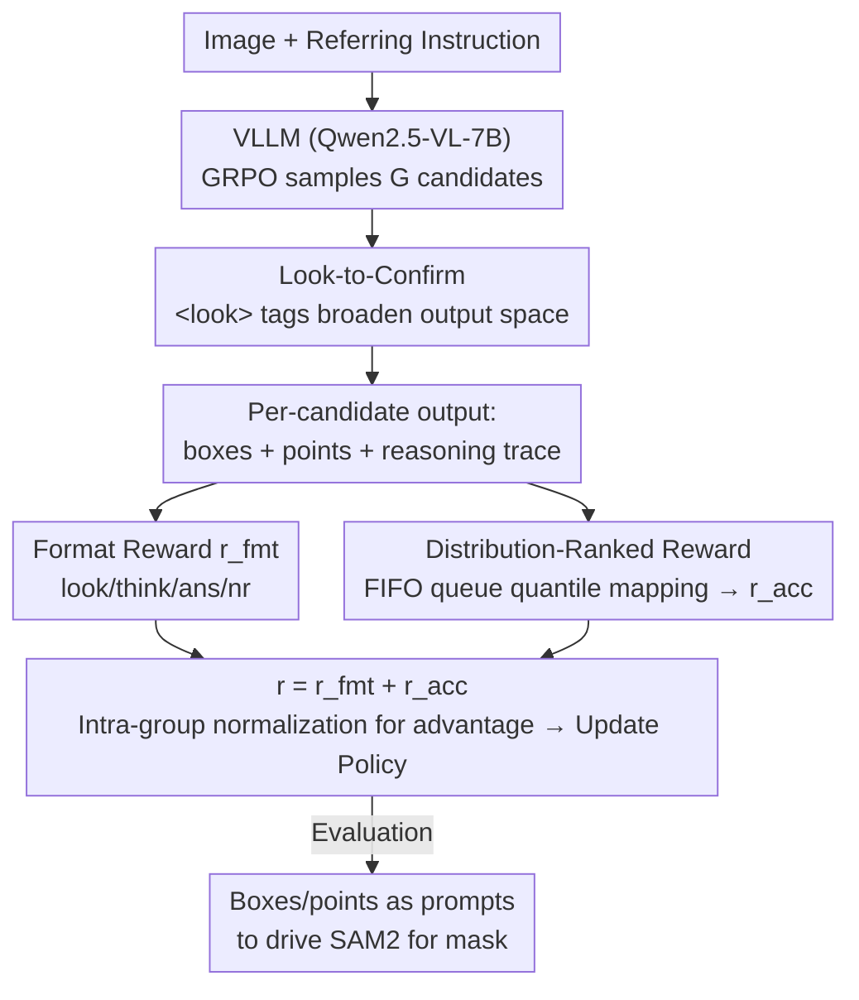

# Dr. Seg: Revisiting GRPO Training for Visual Large Language Models through Perception-Oriented Design

**Conference**: CVPR 2026  
**Paper**: [CVF Open Access](https://openaccess.thecvf.com/content/CVPR2026/html/Sun_Dr._Seg_Revisiting_GRPO_Training_for_Visual_Large_Language_Models_CVPR_2026_paper.html)  
**Code**: https://github.com/eVI-groupSCU/Dr-Seg  
**Area**: Multimodal VLM  
**Keywords**: GRPO, visual perception, reinforcement learning, reasoning segmentation, reward design  

## TL;DR
The paper argues that the common assumption that "the GRPO training paradigm for linguistic reasoning can be directly transferred to visual perception tasks" is invalid. Addressing two neglected characteristics of perception tasks—the need for a wider output space and finer, more stable rewards—the authors propose the plug-and-play **Dr. Seg**. It uses `<look>` tags to encourage breadth of exploration and Distribution-Ranked Reward to map multiple continuous metrics to empirical quantiles. Without altering the model architecture, it achieves SOTA on 5/6 benchmarks across segmentation, detection, and counting.

## Background & Motivation
**Background**: Visual Large Language Models (VLLMs) can perform fine-grained perception tasks like referring expression segmentation (RES) and reasoning segmentation (RefSeg) after instruction tuning. however, pure SFT suffers from weak generalization and catastrophic forgetting. Inspired by DeepSeek-R1, several recent works (Seg-Zero, VisionReasoner, Pixel-Think, etc.) have applied Reinforcement Learning from Verifiable Rewards (RLVR/GRPO) to the post-training phase of VLLMs. These approaches are highly homogenous: post-training on VLLMs, curating task data, and designing reward functions.

**Limitations of Prior Work**: This line of research is built on a long-untested assumption—**that the training paradigm designed for linguistic reasoning can seamlessly migrate to visual perception**. Using reasoning segmentation as a representative scenario, the authors find this assumption holds no ground: (1) Reasoning tasks (math, science) are tightly constrained by premises, naturally favoring "depth-first" exploration and narrowing output spaces; conversely, perception tasks can reach the same answer through many different reasoning paths (low-level lighting/texture, mid-level shape/color, high-level category/spatial relations), naturally requiring a **wider output space**. (2) Mainstream works continue to use the **binary rewards** popular in reasoning tasks, but visual metrics (e.g., IoU) are inherently continuous. Compressing them into 0/1 signals results in information loss, while naively summing $N$ continuous rewards allows high-variance components to dominate gradients while suppressing low-variance ones.

**Key Challenge**: There is a structural mismatch between the "narrow output space + binary/naive summation reward" of the reasoning paradigm and the "wide output space + multi-objective fine-grained reward" of perception tasks. The authors even used entropy dynamics as evidence: token-level average entropy fluctuates violently during perception task training (indicating breadth exploration), contrasting sharply with the "monotonically smooth decline" reported in reasoning tasks.

**Core Idea**: Without modifying the model architecture, two plug-and-play components are added to the GRPO training: one to expand the output space (Look-to-Confirm) and another to make multiple continuous rewards scale-invariant and fine-grained (Distribution-Ranked Reward), both mutually reinforcing.

## Method

### Overall Architecture
Dr. Seg follows the decoupled design of VisionReasoner: **it only trains the VLLM** to output a set of boxes and points for each target object. These predictions calculate rewards to drive GRPO policy updates during training. During evaluation, the boxes/points are fed as prompts into a frozen SAM2 to complete the segmentation. In other words, the segmentation itself is handled by SAM2, while reinforcement learning is responsible for teaching the VLLM "where to look and what prompts to provide."

Above standard GRPO, Dr. Seg introduces two modifications. On the **input side**, the prompt is modified: the model is required to wrap visual evidence critical to its reasoning within `<look>...</look>` tags (Look-to-Confirm), supported by a corresponding format reward. This forces the model to "examine the image from multiple dimensions before confirming the answer," widening the exploration path. On the **reward side**, the aggregation of accuracy rewards is modified: a FIFO history queue is maintained to map each continuous metric (IoU, count consistency, point distance) to its empirical quantile (rank) within recent history (Distribution-Ranked Reward). This eliminates the dominance of high-variance components over gradients. These two components synergize during the same GRPO rollout: wider exploration generates more diverse candidates, and more stable rewards allow the model to learn more accurate predictions within this broader space.

### Key Designs

**1. Look-to-Confirm Visual Exploration: Expanding Output Space with a `<look>` Tag**

Addressing the "perception needs wider output space while reasoning narrows it" pain point, the authors change only the prompt and format reward rather than the architecture. The model is required to explicitly circle visual evidence of interest using `<look>...</look>` within its reasoning trace, enforced by a format reward $r_{look}$ (1.0 if valid tags appear). This compels the model to "look before concluding," searching for clues across shape, material, and spatial relationships. This effectively retrieves multiple reasoning paths from pre-trained visual knowledge to achieve stronger generalization. Inspired by "back-tracking" or verification stages in reasoning, Dr. Seg's perspective is different—it **only requires the model to "glance" at the image space without extra answer verification**, purely to expand the output search space. The full format reward is the sum of four terms:

$$r_{fmt}(o_i) = r_{look}(o_i) + r_{think}(o_i) + r_{ans}(o_i) + r_{nr}(o_i)$$

Where $r_{think}$ checks `<think>...</think>` and `<answer>...</answer>` structures, $r_{ans}$ checks if the final answer follows a constrained JSON format, and $r_{nr}$ rewards non-repetitive thinking traces. Entropy curves show that adding Look-to-Confirm leads to more violent token-level entropy fluctuations and more scattered PCA distributions of last-token embeddings (indicating the policy has not collapsed into a narrow output region), improving ReasonSeg from 65.5 to 66.1.

**2. Distribution-Ranked Reward: Mapping Continuous Indicators to Empirical Quantiles**

Addressing the issue where "directly summing multiple continuous rewards allows high-variance components to dominate gradients." The authors provide a mathematical explanation: summing an N-dimensional reward vector $r=(r^{(1)},\dots,r^{(N)})$ into a scalar $r$ and using standard GRPO normalization $A=(r-\mu_r)/\sigma_{mix}$ results in a simplified policy gradient that is the sum of covariances:

$$g(\theta; q) = \frac{\sigma_S}{\sigma_{mix}} \sum_{j=1}^{N} \rho^{(j)} \sigma^{(j)}$$

Where $\rho^{(j)}$ is the Pearson correlation between $r^{(j)}$ and the score function $S=\nabla_\theta \log\pi_\theta(o|q)$, and $\sigma^{(j)}$ is the standard deviation. When $\rho^{(j)}$ are similar, **$\sigma^{(j)}$ alone determines the effective weight of each reward dimension**—high-variance components induce larger covariances and dominate the mixed gradient.

The solution is **quantile mapping**: maintaining a fixed-length FIFO queue of recent accuracy vectors to approximate the empirical distribution of each metric. When calculating rewards for new candidates, each raw indicator is mapped to its empirical quantile (rank) within the queue, yielding a scale-invariant score. For the $j$-th dimension indicator $x_j$ of candidate $o_i$, the quantile relative to history $S_t^{(j)}=(s_1^{(j)},\dots,s_M^{(j)})$ is:

$$q_j = \frac{1}{M}\sum_{m=1}^{M} \mathbb{1}\!\left(s_m^{(j)} \le x_j\right), \qquad r_{acc}(o_i) = \frac{1}{N}\sum_{j=1}^{N} q_j$$

This essentially constructs an empirical cumulative distribution function (ECDF) for each dimension. The mapping $T: x\mapsto q$ is coordinate-wise monotonic, bounded, and time-varying. Its brilliance lies in decoupling the effective gradient scale from "raw magnitude" to "rank in recent history," so a sample's difficulty is determined by its position in the evolutionary performance distribution rather than an absolute value, naturally eliminating high-variance dominance.

**3. Specific Instantiation of Three Perception Metrics (N=3)**

Applying the framework to VLLM segmentation, three core perception metrics are used for the accuracy vector. $x_1$ is the Intersection over Union (IoU) of predicted and ground-truth boxes: $x_1=\text{IoU}(b_{pred}, b_{gt})$; $x_2$ is count consistency, the ratio of predicted to ground-truth objects $x_2=\min(N_{pre},N_{gt})/\max(N_{pre},N_{gt})$; and $x_3$ is the point similarity, applying a piecewise soft penalty to Euclidean distance $d_{pt}=\|p_{pred}-p_{gt}\|_2$:

$$x_3 = g(d_{pt}) = \begin{cases} 1, & d_{pt} \le \tau_{min}, \\ \dfrac{\tau_{max}-d_{pt}}{\tau_{max}-\tau_{min}}, & \tau_{min} < d_{pt} < \tau_{max}, \\ 0, & d_{pt} \ge \tau_{max}. \end{cases}$$

In implementation, $\tau_{min}=30$ and $\tau_{max}=200$ (pixels). These three terms constrain "box accuracy / count correctness / point deviation," serving as the most direct feedback signals for the box+point prompt-driven SAM2 design.

### Loss & Training
The base objective is standard GRPO: sampling a set of candidates $\{o_i\}$ for query $q$, minimizing an objective with PPO clipping and KL penalty, with advantage normalized intra-group $A_i=(r_i-\text{mean})/\text{std}$. Total reward $r_i=r_{fmt}(o_i)+r_{acc}(o_i)$. Training uses the VERL framework, Qwen2.5-VL-7B as the VLLM, and SAM2-Large as the segmentor; batch size 16, learning rate $1\times10^{-6}$, trained for ~500 steps on 4x H800. The FIFO queue length is 2048 (approx. 16 steps), initialized to zero. Raw accuracy vectors are buffered per rollout and flushed into the global queue at the end of each step.

## Key Experimental Results

### Main Results
The training set consists of 7k multi-object samples from VisionReasoner (LVIS / RefCOCOg / gRefCOCO / LISA++). ID benchmarks include RefCOCO/+/g, and OOD benchmarks include ReasonSeg plus a self-built COCONut multi-object set (665 images, avg. 5.14 instances, 68 classes). Evaluated via gIoU.

| Model | RCO (testA) | RCO+ (testA) | RCOg (test) | ID avg | ReasonSeg-val | COCONut-val | OOD avg | avg |
|------|------|------|------|------|------|------|------|------|
| Seg-Zero | 80.3 | 76.2 | 72.6 | 76.4 | 57.5 | 69.3 | 63.1 | 69.8 |
| VisionReasoner | 78.9 | 74.9 | 71.3 | 75.0 | 63.6 | 78.1 | 69.3 | 72.2 |
| VisionReasoner* (baseline) | 79.0 | 75.3 | 72.5 | 75.6 | 61.5 | 78.1 | 68.4 | 72.0 |
| **Dr. Seg (Ours)** | **80.2** | **76.8** | **74.2** | **77.1** | **65.6** | **79.6** | **71.0** | **74.0** |

Dr. Seg achieves SOTA on 5/6 benchmarks, refreshing both ID and OOD results **simultaneously**—whereas prior works often led in only one category. Detection and counting tasks also reached SOTA levels: relative to baseline, COCO detection saw +2.4 AP (37.7→40.1), and Pixmo counting val saw +4.5 (70.1→74.6).

| Task | Dataset | VisionReasoner | Dr. Seg | Gain |
|------|------|------|------|------|
| Detection | COCO val (AP) | 37.7 | 40.1 | +2.4 |
| Counting | Pixmo val | 70.1 | 74.6 | +4.5 |
| Counting | CountBench test | 69.5 | 72.4 | +2.9 |

### Ablation Study
Decoupled ablation of the two components (LC=Look-to-Confirm, DR=Distribution-Ranked Reward) shows their complementary roles:

| LC | DR | RefCOCO | RefCOCO+ | RefCOCOg | ReasonSeg |
|----|----|------|------|------|------|
| ✗ | ✗ | 79.0 | 75.3 | 72.5 | 65.5 |
| ✓ | ✗ | 79.0 | 75.1 | 72.1 | **66.1** |
| ✗ | ✓ | 80.1 | 76.6 | 73.9 | 65.5 |
| ✓ | ✓ | **80.2** | **76.8** | **74.2** | **67.8** |

Normalization strategy ablation confirms the value of FIFO quantile mapping over "raw continuous reward summation":

| Normalization | RefCOCO | RefCOCO+ | RefCOCOg | ReasonSeg |
|------|------|------|------|------|
| Raw Reward (Naive Sum) | 78.7 | 75.0 | 71.5 | 64.4 |
| Distribution-Ranked | **80.2** | **76.8** | **74.2** | **67.8** |

### Key Findings
- **Complementary Components**: Adding LC alone only improves OOD (ReasonSeg +0.6) but slightly decreases ID because the reward remains coarse for continuous predictions like boxes. Adding DR alone only improves ID (RefCOCO/+/g +1.1/+1.5/+1.8 IoU) but lacks the exploration regularization for OOD. Combining them leads to a synergistic jump in both ID and OOD.
- **Binary → Continuous → Quantile progression is critical**: Using raw continuous rewards directly was actually worse than the baseline (ReasonSeg 64.4 < 65.5), indicating the problem is not "continuous vs binary" but the variance bias of multi-objective summation. Quantile mapping unlocks the benefits of continuous rewards.
- **Entropy Dynamics as a Signal**: Perception tasks exhibit violent entropy fluctuations rather than monotonic declines. The authors use this to argue that perception requires breadth of exploration, providing an insightful methodological observation.

## Highlights & Insights
- **Plug-and-play, zero architecture changes**: Both components only modify the prompt and reward aggregation, requiring no structural changes and making them easily transferable at low cost.
- **Treating "Reward Variance Dominance" as a provable gradient issue**: Deriving $g(\theta;q)\propto\sum_j\rho^{(j)}\sigma^{(j)}$ to show how high-variance components dominate gradients, then using ECDF quantiles to align all components to the same $[0,1]$ scale. This "diagnosis → proof → tailored solution" chain is elegant.
- **`<look>` tags as "Exploration Regularization" rather than verification**: Unlike works that insert verification steps into reasoning, Dr. Seg uses `<look>` only to "glance" at image space without extra verification, purely to expand the search space.

## Limitations & Future Work
- Segmentation capability is ultimately limited by the frozen SAM2; Dr. Seg only optimizes the VLLM's ability to provide box/point prompts. It is unclear if conclusions hold with weaker segmentors.
- Distribution-Ranked Reward introduces hyperparameters like FIFO length (2048) and distance thresholds $\tau_{min}/\tau_{max}$ whose sensitivity was not systematically analyzed.
- The preference for "breadth exploration" in perception is mainly supported by reasoning segmentation and entropy curves; its generalization across all visual tasks requires further validation.
- The COCONut evaluation set is relatively small (665 images), limiting the statistical robustness of some OOD conclusions.

## Related Work & Insights
- **vs. VisionReasoner / Seg-Zero**: These works directly follow the reasoning paradigm with binary rewards and narrow output spaces, typically leading in either ID or OOD. Dr. Seg identifies this mismatch and introduces "wide output space + quantile rewards," achieving SOTA on both simultaneously.
- **vs. `<back>` Reflection Tags**: Similar to works inserting reflection stages into reasoning, but those focus on verifying and narrowing down the correct answer. Dr. Seg uses `<look>` for visual exploration, essentially doing the opposite (expanding rather than narrowing the output space).
- **vs. RL Entropy Dynamics**: Previous works only observed monotonic entropy decline in reasoning. This study is the first to analyze entropy dynamics in perception tasks, discovering violent fluctuations and designing a breadth-exploration mechanism based on this finding.

## Rating
- Novelty: ⭐⭐⭐⭐ Challenges the implicit assumption of seamless transfer between reasoning and perception, supported by both entropy dynamics and gradient variance analysis.
- Experimental Thoroughness: ⭐⭐⭐⭐ Covers segmentation/detection/counting $+$, ID/OOD, and clarifying components; however, the OOD set is small and hyperparameter analysis is limited.
- Writing Quality: ⭐⭐⭐⭐ Narrative flow from "problem discovery" to "math explanation" to "design" is very clean.
- Value: ⭐⭐⭐⭐ Plug-and-play with zero architecture changes; rank-based reward normalization is widely applicable to multi-objective RL.

<!-- RELATED:START -->

## Related Papers

- [\[CVPR 2026\] MoE-GRPO: Optimizing Mixture-of-Experts via Reinforcement Learning in Vision-Language Models](moe-grpo_optimizing_mixture-of-experts_via_reinforcement_learning_in_vision-lang.md)
- [\[ICLR 2026\] DIVA-GRPO: Enhancing Multimodal Reasoning through Difficulty-Adaptive Variant Advantage](../../ICLR2026/multimodal_vlm/diva-grpo_enhancing_multimodal_reasoning_through_difficulty-adaptive_variant_adv.md)
- [\[CVPR 2026\] CropVLM: Learning to Zoom for Fine-Grained Vision-Language Perception](cropvlm_learning_to_zoom_for_fine_grained_vision_language_perception.md)
- [\[AAAI 2026\] Revisiting the Data Sampling in Multimodal Post-training from a Difficulty-Distinguish View](../../AAAI2026/multimodal_vlm/revisiting_the_data_sampling_in_multimodal_post-training_from_a_difficulty-disti.md)
- [\[CVPR 2026\] Linking Perception, Confidence and Accuracy in MLLMs](linking_perception_confidence_and_accuracy_in_mllms.md)

<!-- RELATED:END -->
