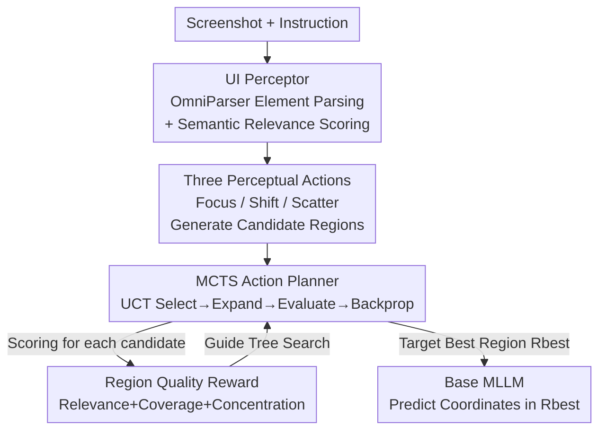

# DRS-GUI: Dynamic Region Search for Training-Free GUI Grounding

**Conference**: CVPR 2026  
**Paper**: [CVF Open Access](https://openaccess.thecvf.com/content/CVPR2026/html/Liu_DRS-GUI_Dynamic_Region_Search_for_Training-Free_GUI_Grounding_CVPR_2026_paper.html)  
**Code**: None  
**Area**: Multimodal VLM / GUI Agent  
**Keywords**: GUI grounding, training-free, dynamic region search, Monte Carlo Tree Search, visual search

## TL;DR
DRS-GUI inserts a training-free "search-then-predict" phase before MLLM coordinate prediction: it uses a UI Perceptor to parse screenshots into UI elements with semantic relevance, then employs MCTS to schedule three human-like perceptual actions (Focus/Shift/Scatter) guided by region quality rewards to iteratively search for the most relevant compact region. This approach improves the grounding accuracy of Qwen2.5-VL-7B and UGround-V1-7B by approximately 14% on the high-resolution dense interface benchmark ScreenSpot-Pro.

## Background & Motivation
**Background**: For MLLM-driven GUI agents to execute instructions reliably, the key lies in grounding—precisely locating the clickable UI element corresponding to a natural language instruction. Existing methods fall into two categories: single-step full-screen prediction, which directly regresses a point or box on the full screenshot (e.g., SeeClick, UGround, OS-Atlas, relying on large-scale fine-tuning); and multi-step refinement, which gradually narrows the field of view through iterative cropping/zooming (e.g., ECP, R-VLM, DiMo-GUI, LASER).

**Limitations of Prior Work**: Real-world GUI screenshots are often high-resolution and visually dense, filled with redundant elements that are irrelevant to the instruction but visually similar, which can scatter the MLLM's attention. The single-step full-screen approach lacks explicit attention control and is easily distracted by cluttered backgrounds. The multi-step refinement approach, while providing progressive focus, is **unidirectional and irreversible**—once a correct region is cropped out in the early stages, it can never be recovered, leading to cumulative errors (as shown in Fig. 1a, where once the trajectory deviates from semantic clues, the final region may not contain the target at all).

**Key Challenge**: Existing pipelines lack two capabilities: (1) **Dynamic Perception**: the ability to change course or shift the field of view when current evidence is insufficient, rather than adhering to an irreversible contraction path; (2) **Region Quality Assessment**: a measurable signal at each step to indicate whether the search is moving closer to or further from the target, thereby preventing early errors from snowballing.

**Key Insight**: The authors draw inspiration from how humans find objects on complex interfaces—humans do not follow a single narrow path blindly. Instead, they scan the layout, progressively refine attention, and **backtrack or shift** to other areas when uncertain. This adaptive, backtrackable search inherently involves assessing whether one is "getting closer to or further from the target."

**Core Idea**: Grounding is reformulated as a **visual search** problem. A training-free, plug-and-play dynamic region searcher is designed to first find the semantically appropriate region, and then let the base MLLM perform coordinate prediction only within this compact region (search-then-predict).

## Method

### Overall Architecture
DRS-GUI splits grounding into two stages: "search region first, then predict coordinates." Formally, the original task maps instruction $T$ to pixel coordinates $p=(x,y)$ of the target element in screenshot $S_{\text{full}} \in \mathbb{R}^{H\times W\times 3}$. Since grounding directly on $S_{\text{full}}$ is unreliable, the authors introduce a region search strategy $\pi_S$ to find the instruction-relevant region $R_{\text{best}}$, followed by localized prediction via the base model $M$:

$$R_{\text{best}} = \pi_S(S_{\text{full}}, T), \qquad p = M(R_{\text{best}}, T)$$

The searcher consists of two collaborative modules: the **UI Perceptor** parses the current region into structured UI elements, calculates the semantic relevance of each element to the instruction, and executes three region-level actions (Focus/Shift/Scatter) to generate candidate views. The **MCTS Action Planner** schedules these actions to build a backtrackable region search tree. Guided by **region quality rewards**, it iteratively searches and corrects the perceptual scope, finally passing the highest-reward region to the base MLLM for final localization. This mechanism requires no training or fine-tuning and serves as a pure external enhancement for existing MLLMs.

### Key Designs

**1. UI Perceptor: Structuring screenshots into elements with relevance**

Directly presenting an MLLM with a screen full of similar elements makes it difficult to distinguish which part is relevant. The UI Perceptor structures the perception problem first. Given a region $R$, OmniParser V2 extracts the set of UI elements $U=\{u_i \mid u_i=[b_i, d_i, i_i]\}_{i=1}^{N}$, where $b_i$ is the element box, $d_i$ is the semantic description (OCR text or icon caption), and $i_i\in\{0,1\}$ marks interactability. To align the instruction and elements in the same semantic space, an instructor-large embedder encodes each, prepended with a **domain prefix** $P_d$ customized for the current GUI's application/system type:

$$e_T = \text{Embedder}(P_d \oplus T), \qquad e_{d_i} = \text{Embedder}(P_d \oplus d_i)$$

Mean pooling of the final hidden states yields fixed-length vectors, and semantic relevance $s_i = \cos(e_T, e_{d_i})$ is calculated for each element. This sequence of relevance scores $\{s_i\}$ is the core clue for all subsequent action execution and reward evaluation—it transforms "which region carries instruction-relevant information" into computable scalars.

**2. Human-like Perceptual Actions (Focus / Shift / Scatter): Dynamic FOV adjustment**

Leveraging $\{s_i\}$, the Perceptor mimics three human behaviors to adjust the field of view. **Focus (Contract)**: Selects top-p% relevant elements, removes spatial outliers whose centers deviate significantly from the cluster centroid, and forms a compact crop using the minimum bounding box of the remaining elements. This step concentrates semantic content and suppresses visual clutter. **Shift (Transfer)**: When strong semantic clues appear in a region spatially separated from the current view, the view is recentered onto those clues. Groups are formed based on consistent layout directions (e.g., top, left) with minimal overlap to purposefully move away from uninformative regions. **Scatter (Expand)**: If semantic clues in the current region are weak or incoherent, high-relevance elements outside the view are collected and the view is expanded to include them, with scale constraints to prevent over-expansion, thereby recovering broader context. Together, these actions enable dynamic control: tightening when confidence increases, expanding when context is needed, and shifting when stronger clues exist elsewhere.

**3. MCTS Action Planner: Scheduling actions into a backtrackable search tree**

The scheduling of these actions is critical. Unidirectional refinement is the root cause of the "irreversibility" problem. The authors use MCTS to obtain a backtrackable search trajectory. Each region state $S=(R, U, \{s_i\})$ is a node, and the action space is $A=\{\text{Focus}, \text{Shift}, \text{Scatter}\}$. Each action creates a new candidate region as an edge. The root is initialized with a global view via an initial Focus on the full image. Within a fixed search budget, four phases iterate: **Selection** uses the UCT strategy to balance exploiting high-reward regions and exploring less-visited alternatives:

$$a^* = \arg\max_{a\in A(S)} \left[ Q(S,a) + c\sqrt{\frac{\ln V(S)}{V(S,a)}} \right]$$

**Expansion** generates successor states at leaf nodes. **Simulation and Backpropagation** use the region quality reward to evaluate new regions and propagate rewards up the path to update $Q$ values. After searching, the region with the highest reward $R_{\text{best}}=\arg\max_R r(R,T)$ is passed to the base MLLM.

**4. Region Quality Reward: Triple-stream scoring**

To guide the search, the authors designed a reward weighted from three complementary metrics. **Interaction-weighted Relevance**: Since grounding targets are usually interactive, relevance is weighted by interactability $w_i=1$ if $i_i=1$ else $w_i=\lambda$, yielding $r_{\text{rel}}=\frac{\sum_i w_i s_i}{\sum_i w_i + \varepsilon}$. **UI Coverage Consistency**: Regions containing real UI structures rather than blank backgrounds are more reliable, measured by $r_{\text{cov}}=\frac{\sum_i \text{Area}(b_i)}{\text{Area}(R)}$. **Semantic Concentration**: Determines whether relevance is focused or diffused using normalized entropy $r_{\text{con}}=1-\frac{-\sum_i p_i\log p_i}{\log(N+\varepsilon)}$, where $p_i$ is temperature-normalized relevance. The final reward is:

$$r(R,T) = \alpha\cdot r_{\text{rel}} + \beta\cdot r_{\text{cov}} + \gamma\cdot r_{\text{con}}$$

This steers the search toward regions that are "semantically meaningful, operationally relevant, and visually informative."

## Key Experimental Results

### Main Results
On high-resolution professional application benchmark ScreenSpot-Pro, DRS-GUI significantly boosts various models (Accuracy %):

| Base Model | Original | + DRS-GUI | Gain |
|--------|------|-----------|------|
| Qwen2.5-VL-3B | 16.1 | 28.7 | +12.6 |
| Qwen2.5-VL-7B | 26.8 | 40.9 | +14.1 |
| UGround-V1-2B | 26.8 | 38.3 | +11.5 |
| UGround-V1-7B | 31.4 | 45.7 | +14.3 |

An interesting finding: Qwen2.5-VL-3B + DRS-GUI (28.7%) outperforms the larger GUI-specific model OS-Atlas-7B (18.9%), indicating that grounding in dense interfaces relies more on adaptive perceptual search than simply scaling the model.

### Ablation Study
Ablation of action space and reward terms on ScreenSpot-V2 with UGround-V1-7B (Avg Acc %):

| Action Combination | Avg | Reward Combination | Avg |
|---------|-----|-------------|-----|
| None (Baseline) | 87.6 | None (Baseline) | 87.6 |
| Focus Only | 89.8 | $r_{\text{rel}}$ Only | 89.6 |
| Focus+Shift | 91.0 | $r_{\text{rel}}+r_{\text{cov}}$ | 89.9 |
| Focus+Shift+Scatter (Full) | 91.8 | All Three | 91.8 |

### Key Findings
- **Actions are complementary**: Focus alone adds +2.2%. Adding Shift reaches 91.0%, and including Scatter achieves the best 91.8%, providing a stable search behavior.
- **Rewards are critical**: Interaction-weighted relevance adds +2.0%. Adding semantic concentration significantly improves performance in web scenarios.
- **Redundancy reduction is quantifiable**: The best region after focus crops out an average of 64% of pixel area and 54% of UI elements, directly confirming that search effectively narrows the search space.

## Highlights & Insights
- **Decoupling "where to look" from "what to predict"**: Search-then-predict allows base MLLMs to focus on compact regions without additional training, making it highly practical for any existing MLLM.
- **Backtrackable MCTS vs. Irreversible Refinement**: While previous iterative zooming methods fail if an early crop is wrong, DRS-GUI introduces "regret" capability via tree search and actions like Shift and Scatter.
- **Explainable Reward Design**: Breaking down a "good region" into interactivity, coverage, and concentration provides a lightweight, reusable evaluation paradigm for what constitutes a suitable crop for downstream tasks.

## Limitations & Future Work
- Dependency on external components like OmniParser V2: If the UI parser misses elements or semantic relevance is miscalculated, the search direction will be misled.
- Inference overhead: Each candidate region requires UI parsing, embedding, and reward evaluation. With a search budget of $N=8$, there is a noticeable computational cost compared to a single forward pass.
- Sensitivity: The domain prefix $P_d$ and reward weights are manually set; specialized analysis for their sensitivity across diverse application types is required.

## Related Work & Insights
- **vs. Single-step Models (SeeClick, OS-Atlas)**: These models struggle with scattered attention in dense, high-res interfaces; DRS-GUI uses a search-first approach to mitigate this without extra training.
- **vs. Iterative Refinement (ECP, LASER)**: These are often unidirectional and cannot recover from early errors; DRS-GUI introduces backtracking via MCTS.
- **vs. General Visual Search**: Unlike methods for natural images using fixed windows, DRS-GUI explicitly models GUI grounding as region-level dynamic search guided by language.

## Rating
- Novelty: ⭐⭐⭐⭐ Reformulating GUI grounding as backtrackable MCTS visual search is a novel combination.
- Experimental Thoroughness: ⭐⭐⭐⭐ Covers multiple benchmarks and base models with detailed ablations.
- Writing Quality: ⭐⭐⭐⭐ Clear logic from motivation to experiment.
- Value: ⭐⭐⭐⭐ Strong practical utility with significant gains (+14%) on difficult benchmarks.

<!-- RELATED:START -->

## Related Papers

- [\[CVPR 2026\] MVP: Multiple View Prediction Improves GUI Grounding](mvp_multiple_view_prediction_improves_gui_grounding.md)
- [\[CVPR 2026\] GUI-SAGE: Enhancing GUI Automation with Self-Explanatory Learning](gui-sage_enhancing_gui_automation_with_self-explanatory_learning.md)
- [\[ACL 2025\] R-VLM: Region-Aware Vision Language Model for Precise GUI Grounding](../../ACL2025/multimodal_vlm/r-vlm_region-aware_vision_language_model_for_precise_gui_grounding.md)
- [\[ICML 2026\] Learning GUI Grounding with Spatial Reasoning from Visual Feedback](../../ICML2026/multimodal_vlm/learning_gui_grounding_with_spatial_reasoning_from_visual_feedback.md)
- [\[CVPR 2026\] Pointing at Parts: Training-Free Few-Shot Grounding in Multimodal LLMs](pointing_at_parts_training-free_few-shot_grounding_in_multimodal_llms.md)

<!-- RELATED:END -->
