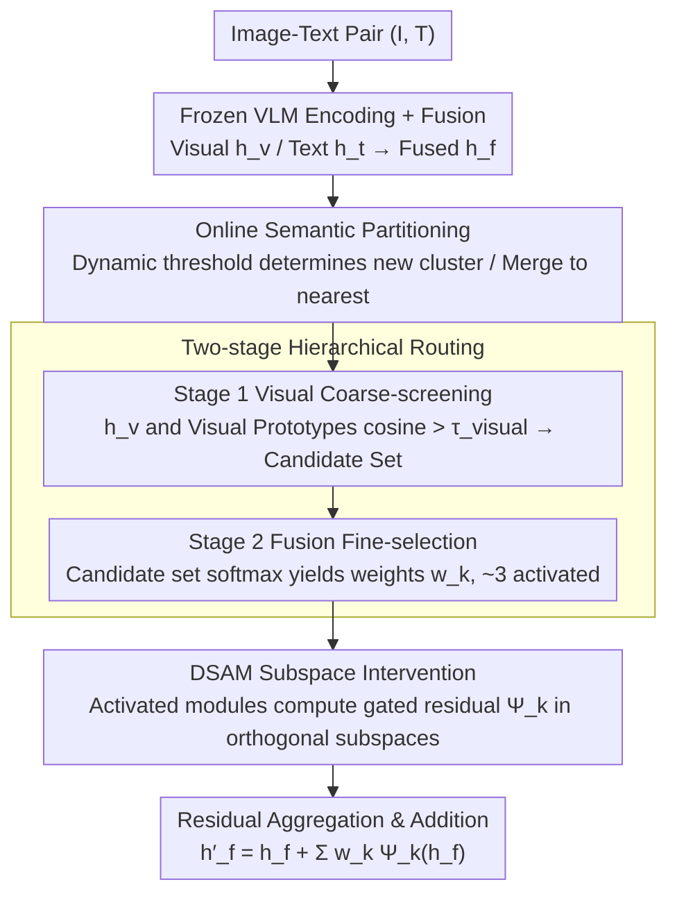

# DSCA: Dynamic Subspace Concept Alignment for Lifelong VLM Editing

**Conference**: CVPR 2026  
**arXiv**: [2604.07965](https://arxiv.org/abs/2604.07965)  
**Code**: None  
**Area**: Multimodal VLM  
**Keywords**: Knowledge Editing, Vision-Language Models, Subspace Decomposition, Continual Learning, Catastrophic Forgetting

## TL;DR

DSCA enables knowledge editing by decomposing the representation space of VLMs into a set of orthogonal semantic subspaces and performing gated residual interventions within each subspace. This approach maintains an editing success rate of $>95\%$ with near-zero forgetting even after 1000 sequential edits.

## Background & Motivation

Large Vision-Language Models (VLMs) require continuous knowledge updates during long-term deployment—facts change, user preferences evolve, and model errors need correction—yet retraining from scratch is infeasible. Existing knowledge editing methods primarily follow two paths: gated adapter/MoE routing methods (LiveEdit, DualEdit), which selectively activate small expert modules via routing logic; and parameter merging methods (PAM, ConDU), which learn new task parameters and merge them back into the base model weights.

**Limitations of Prior Work**: Regardless of the method, edits ultimately affect the **shared representation space** of the VLM. In this high-dimensional manifold, concepts are entangled—modifying even a small subset of parameters inevitably disturbs the representation positions of nearby concepts, leading to "coupling interference." As the number of edits increases, this interference accumulates, eventually triggering catastrophic forgetting.

**Key Challenge**: Existing methods attempt to "softly constrain" the editing scope through **algorithmic optimization** (e.g., regularization, distillation) but fail to achieve **structural isolation** of different concept knowledge at the architectural level.

**Key Insight**: Since real-world knowledge is compositional and interventions are local, editing should occur within **concept subspaces** of the VLM rather than on the shared representation manifold. DSCA elevates "concept isolation" from a training objective to an **architectural property**—establishing structural "firewalls" through orthogonal subspace decomposition, making it mathematically impossible for an edit of one concept to interfere with others.

## Method

### Overall Architecture

The core challenge DSCA addresses is performing hundreds of sequential edits on a frozen VLM without allowing new edits to contaminate old knowledge. Instead of merely "constraining" the edit scope, it partitions the shared representation space into a set of non-overlapping concept subspaces, ensuring each edit occurs only within its assigned subspace to structurally block crosstalk.

A specific forward pass proceeds as follows: an image-text pair $(I, T)$ yields visual features $\mathbf{h}_v$ and text features $\mathbf{h}_t$ via the VLM, which are fused into $\mathbf{h}_f = \text{Fuse}(\mathbf{h}_v, \mathbf{h}_t)$. This fused feature is first assigned to a concept cluster by an online clustering system and then passed through two-stage routing to select relevant Dynamic Structured Alignment Modules (DSAMs). Each selected DSAM calculates a gated residual within its orthogonal subspace. Finally, these residuals are added back to the original feature according to routing weights: $\mathbf{h}'_f = \mathbf{h}_f + \sum_k w_k \Psi_k(\mathbf{h}_f)$. The set of clusters grows dynamically with the editing stream, while any single intervention remains locked within a few subspaces.

### Key Designs

**1. Online Semantic Partitioning: Dynamic Growth of Concept Clusters**

Knowledge editing involves a continuous stream where the total number of concepts is unknown a priori; thus, the number of clusters must expand dynamically. For each new fused feature $\mathbf{h}_f$, DSCA calculates its distance to all existing cluster prototypes. If the distance to the nearest cluster exceeds that cluster's dynamic threshold $d_j = \mu_j + \alpha \cdot \sigma_j$, it is identified as a new concept and a new cluster is initialized. Otherwise, it is merged into the nearest cluster, and the prototype is updated via EMA. Crucially, this threshold is not globally fixed but calculated using the mean distance $\mu_j$ and standard deviation $\sigma_j$ of each cluster—tightening tolerance for dense clusters and loosening it for sparse ones—preventing over-sensitivity to noise while remaining receptive to genuine new concepts.

**2. Two-stage Hierarchical Routing: Coarse Screening and Fine Selection**

As edits accumulate, the number of clusters $K$ may reach hundreds. Computing all DSAMs for every input is inefficient and prone to misactivation. DSCA splits routing into two stages: Stage 1 uses only visual features $\mathbf{h}_v$ and visual prototypes $\mathbf{p}_{k,v}$ to compute cosine similarity, retaining only those exceeding threshold $\tau_{\text{visual}}$. Visual signals are computationally cheap and highly discriminative, quickly reducing candidates from hundreds to single digits. Stage 2 then uses fused features on this candidate set to compute softmax weights:

$$w_k = \frac{\exp(s_k/\tau)}{\sum_{j} \exp(s_j/\tau)}$$

This ensures the final activation considers both visual and linguistic semantics. The result is that each input activates approximately 3 DSAMs on average, while most module weights remain near zero.

**3. Dynamic Structured Alignment Module (DSAM): Orthogonal Subspaces per Concept**

This is the core of the method. DSAM assigns an independent low-rank subspace $R_k \in \mathbb{R}^{r \times d_f}$ ($r \ll d_f$) to each cluster, ensuring edits for that concept are confined to that subspace. It consists of three components: $R_k$ is the low-rank basis matrix initialized via PCA and refined through Incremental PCA, computed on residualized features to ensure approximate orthogonality between different subspaces $R_i^\top R_j \approx 0$; a learnable transformation $(W_k, b_k)$ maps high-dimensional features to $r$-dimensional subspace coordinates, where bias $b_k$ pushes representations toward the target position; and an element-wise gating $\gamma_k(\mathbf{h}_f) = \sigma(W_{g,k}\mathbf{h}_f + b_{g,k})$ acts as an input-adaptive diagonal matrix. Together, they produce the intervention:

$$\Psi_k(\mathbf{h}_f) = \Gamma_k(\mathbf{h}_f) \left[ R_k^\top \left( (W_k \mathbf{h}_f + b_k) - R_k \mathbf{h}_f \right) \right]$$

The low-rank nature saves computation and naturally constrains the editing range. Orthogonality ensures that "modifying concept A" mathematically cannot affect "concept B." Gating ensures that a DSAM provides large updates for its responsible samples and near-zero updates for irrelevant inputs. The term $-R_k \mathbf{h}_f$ removes the projection of the original feature within the subspace, applying residual corrections only to the necessary components.

### Loss & Training

The total loss is a weighted sum of four terms: $\mathcal{L} = \mathcal{L}_{\text{task}} + \lambda_{\text{align}} \mathcal{L}_{\text{align}} + \lambda_{\text{distill}} \mathcal{L}_{\text{cdistill}} + \lambda_{\text{sparse}} \mathcal{L}_{\text{sparse}}$

- $\mathcal{L}_{\text{task}}$: Causal language modeling loss on edit samples to ensure success.
- $\mathcal{L}_{\text{align}}$: Cosine similarity regularization to align edited fused representations with unmodified text representations, maintaining cross-modal consistency.
- $\mathcal{L}_{\text{cdistill}}$: InfoNCE-style contrastive distillation loss to keep edited representations of replay samples consistent with a frozen teacher model, protecting the relational geometry of non-edited knowledge.
- $\mathcal{L}_{\text{sparse}}$: $\ell_1$ penalty on routing logits to prevent excessive DSAM activations for irrelevant samples.

**Mechanism**: DSAM intervention parameters $(W_k, b_k, W_{g,k}, b_{g,k})$ are updated via gradient descent; cluster prototypes undergo slow EMA updates; and subspace bases $R_k$ are periodically refined via Incremental PCA—forming a "slow-evolving knowledge base + fast adaptation" dual-speed mechanism.

## Key Experimental Results

### Main Results

| Dataset | Metric | DSCA | LiveEdit/DualEdit (SOTA) | Gain |
|--------|------|------|--------------------------|------|
| E-VQA (Single Edit) | Avg. | 98.50 | 97.84 (DualEdit) | +0.66 |
| E-IC (Single Edit) | Avg. | 98.00 | 97.85 (DualEdit) | +0.15 |
| E-VQA (1000 Edits) | Avg. | 95.23 | 92.76 (LiveEdit) | +2.47 |
| VLKEB (1000 Edits) | Avg. | 96.72 | 91.79 (LiveEdit) | +4.93 |
| CoIN | BWT | -9.37 | -19.45 (PAM) | 50% less forgetting |

### Ablation Study

| Configuration | ES ↑ | Locality Δ ↓ | GEN ↑ | Description |
|------|------|-------------|-------|------|
| Full DSCA | 98.0 | 0.5 | 97.3 | Full model |
| w/o Orthogonality | 95.8 | 2.8 | 93.4 | Locality dropped 5.6×; proves orthogonality is core |
| w/o Gated Sparsity | 96.1 | 2.1 | 94.7 | Dense activation increases interference |
| Single-stage Routing | 96.9 | 1.9 | 95.0 | Two-stage is superior to single routing |
| No Base Residual | 97.1 | 1.5 | 95.8 | Subspace residual design aids precision |

### Key Findings

- **Orthogonality is Core**: Subspace overlap correlates strongly with forgetting (Pearson $r \approx 0.94$); residualized PCA keeps overlap stable at $\sim 3\times10^{-3}$ after 1000 edits.
- **Highly Sparse Activation**: Over 95% of routing weights are near zero, with an average of only ~3 DSAMs activated per input.
- **Hallucination Suppression**: CHAIR-H decreased from 21.1 (LiveEdit) to 15.9, a reduction of ~25%.
- **General Capability Preservation**: Performance on benchmarks like VQA-v2 and MME remained intact or slightly improved (76.3 vs 74.1 on MME).

## Highlights & Insights

1. **Paradigm Shift from "Optimization Constraints" to "Architectural Guarantees"**: Designing concept isolation as a geometric property of orthogonal subspaces, rather than a soft loss constraint, is a profound architectural philosophy.
2. **Geometric Metric of Forgetting**: The subspace overlap $\varepsilon = \|R_i^\top R_j\|_F^2$ provides a quantifiable and actionable tool for understanding and predicting interference in continual learning.
3. **Elegant Dual-speed Mechanism**: Combining gradient-driven fast parameter updates with data-driven slow subspace structure updates mimics the human learning process of fast adaptation and slow consolidation.

## Limitations & Future Work

- The linear subspace assumption may be insufficient for highly non-linear or deeply entangled concepts.
- Maintenance costs for orthogonal subspaces increase as the number of clusters $K$ grows, potentially requiring compression or sharing mechanisms.
- Dependence on reliable concept discovery and routing; highly overlapping or ambiguous concepts may lead to sub-optimal editing.
- Currently validated on image-text VLMs; extension to video-language or audio-visual modalities is a future direction.

## Related Work & Insights

- **BaFT** [16]: Proposed basis-level non-linear interventions for LLMs; this work extends it to multimodal representations in VLMs.
- **LiveEdit** [3]: A low-rank MoE-based VLM editing method that still suffers from performance decay after 1000 edits; DSCA addresses this at the architectural level.
- **ReFT** [35]: Activation space intervention for LLMs, but lacks a structural isolation mechanism.
- Insight: The architectural pattern of orthogonal subspace decomposition + sparse routing can be generalized to other scenarios requiring continuous adaptation, such as user preference updates in recommendation systems.

## Rating

- Novelty: ⭐⭐⭐⭐⭐ Paradigm innovation by solving knowledge interference via orthogonal subspaces.
- Experimental Thoroughness: ⭐⭐⭐⭐⭐ Covers single/sequential editing, CoIN continual learning, general capability, hallucination, and geometric diagnostics.
- Writing Quality: ⭐⭐⭐⭐ Clear structure and motivation, though some notation is dense.
- Value: ⭐⭐⭐⭐⭐ Provides a practical and theoretically grounded editing mechanism for long-term VLM maintenance.

<!-- RELATED:START -->

## Related Papers

- [\[CVPR 2026\] Towards Dynamic Modality Alignment in Multimodal Continual Learning](towards_dynamic_modality_alignment_in_multimodal_continual_learning.md)
- [\[CVPR 2026\] Anti-Degradation Lifelong Multi-View Clustering](anti-degradation_lifelong_multi-view_clustering.md)
- [\[CVPR 2026\] Unified Personalized Understanding, Generating and Editing](unified_personalized_understanding_generating_and_editing.md)
- [\[CVPR 2026\] Bias Is a Subspace, Not a Coordinate: A Geometric Rethinking of Post-hoc Debiasing in Vision-Language Models](bias_is_a_subspace_not_a_coordinate_a_geometric_rethinking_of_post-hoc_debiasing.md)
- [\[CVPR 2026\] HOG-Layout: Hierarchical 3D Scene Generation, Optimization and Editing via Vision-Language Models](hog_layout_hierarchical_3d_scene_generation_optimization_and_editing.md)

<!-- RELATED:END -->
