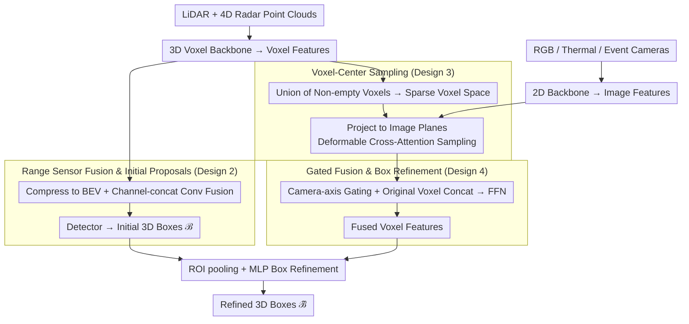

# DSERT-RoLL: Robust Multi-Modal Perception for Diverse Driving Conditions

**Conference**: CVPR 2026  
**arXiv**: [2604.03685](https://arxiv.org/abs/2604.03685)  
**Code**: [https://jeongyh98.github.io/dsert-roll](https://jeongyh98.github.io/dsert-roll)  
**Area**: Autonomous Driving / Multi-Modal Perception  
**Keywords**: multi-modal dataset, event camera, 4D radar, thermal camera, 3D detection

## TL;DR

Proposes the DSERT-RoLL driving dataset, which for the first time integrates six sensor types: stereo event cameras, RGB, thermal imaging, 4D radar, and dual LiDAR, covering various weather and lighting conditions. It also introduces a unified multi-modal 3D detection fusion framework.

## Background & Motivation

Autonomous driving perception still faces severe challenges in adverse weather (fog, rain, snow) and extreme lighting conditions. Traditional RGB+LiDAR solutions exhibit performance degradation in these scenarios. Novel sensors such as event cameras (robust to high dynamic range and fast motion), thermal imaging (effective at night), and 4D radar (strong penetration in adverse weather) offer complementary advantages. However, existing datasets typically only contain certain sensor combinations, lacking fair comparison and systematic research for all sensors within the same environment.

The core contribution of DSERT-RoLL is the integration of all these novel sensors with traditional sensors on a single acquisition platform. Collecting data across identical scenes enables cross-sensor comparison and fusion research for the first time.

## Method

### Overall Architecture

DSERT-RoLL contributes in two parts: the **dataset** and the **multi-modal fusion framework**. The dataset includes 22K frames of synchronized six-sensor data, covering highway, urban, and suburban scenes, as well as adverse conditions like fog, rain, snow, night, and HDR, while providing 3D/2D boxes, track IDs, and ego-motion. The fusion framework is a pipeline of "dual-path encoding → range sensors generate initial boxes → camera features injected into 3D → gated fusion → box refinement": LiDAR and 4D Radar point clouds pass through a 3D voxel backbone to obtain voxel features; RGB/thermal/event images pass through a 2D backbone to obtain image features. The range sensor branch is compressed into BEV, fused via channel concatenation and convolution, and then produces initial 3D box proposals via a detector. The camera branch takes the union of non-empty voxels, projects voxel centers onto image planes, and samples image features via deformable cross-attention to inject them into a unified sparse voxel space. Following a camera-axis confidence gating and concatenation with original voxel features, final fused features are obtained. Finally, ROI pooling is applied to the fused features using initial boxes for refinement to output the final 3D boxes.

### Key Designs

**1. Comprehensive Sensor Suite: Six sensors collected on the same platform and scene**

Stereo RGB ($2448 \times 2048$), stereo event cameras ($1280 \times 720$), stereo thermal imaging ($640 \times 512$), 4D radar (100m), long-range LiDAR (150m), and short-range high-resolution LiDAR (100m, $360^{\circ}$). All cameras are configured in stereo to cover the forward field of view. The significance lies not merely in the number of sensors, but in integrating these six sensors on a single platform for synchronized recording, accompanied by 3D/2D boxes, track IDs, and ego-motion. This enables **fair comparison and fusion research** across sensor families (camera vs. range) and within families (RGB/Event/Thermal, LiDAR/4D Radar) for the first time; prior datasets mostly included only one or two novel sensors for comparison against RGB+LiDAR.

**2. Range Sensor Fusion & Initial Box Proposals: BEV channel concatenation for geometric skeletons**

LiDAR and 4D Radar are voxelized and compressed into BEV features along the vertical axis, then fused via channel-wise concatenation and a convolution layer. These are fed to a detector to produce $n$ initial 3D box proposals $\mathcal{B}$. LiDAR provides precise geometry, while 4D Radar's Doppler velocity and penetration in fog/snow compensate for LiDAR degradation. This step prioritizes efficiency by using simple concatenation to provide reliable 3D anchors for subsequent camera refinement.

**3. Voxel-Center Sampling: Injecting camera semantics into 3D using voxels as centers**

Camera semantics are rich but 2D; the challenge is aligning them with sparse 3D voxels without introducing frustum ambiguity. The method takes non-empty voxel indices from LiDAR/4D Radar voxel features to form a unified sparse voxel space. Each non-empty voxel center is projected onto RGB/thermal/event image planes using projection matrices. Using projected points as anchors and voxel features as queries, the model predicts deformable sampling offsets and aggregation weights to perform deformable cross-attention on neighborhood image features, obtaining image-enhanced voxel features for each modality. Centering on voxels (rather than pixels) avoids the ambiguity where one pixel corresponds to multiple depths and remains efficient by only calculating on non-empty voxels.

**4. Confidence Gated Fusion & Box Refinement: Weighting according to camera reliability**

The reliability of RGB, event, and thermal cameras varies drastically under different lighting and weather. Equal-weight fusion can be degraded by failing modalities. Image-enhanced voxel features are concatenated into a camera-axis tensor. A global summary passes through a sigmoid to compute a scalar gate $\mathbf{w} \in [0,1]^{K}$ for each camera. Features are re-weighted per modality, concatenated with original voxel features, and reduced via an FFN to obtain final fused features $\tilde{\mathbf{F}}_V$. Finally, ROI pooling is performed on $\mathcal{B}$ across $S \times S \times S$ sub-voxels to extract box-aligned features, which are regressed by an MLP to produce refined boxes $\tilde{\mathcal{B}}$. Gating allows the model to automatically increase thermal weights at night or event camera weights in HDR/overexposure.

### Loss & Training

The entire framework is trained end-to-end. Total loss is a weighted sum of three components: RPN loss $\mathcal{L}_{\text{RPN}}$, confidence prediction loss $\mathcal{L}_{\text{conf}}$, and box regression loss $\mathcal{L}_{\text{reg}}$. Data is split 7:3 for training/testing, ensuring balanced distribution of weather, lighting, and categories.

## Key Experimental Results

### Main Results

| Modality Combination | Weather-Clear | Weather-Fog | Weather-Heavy Snow | Lighting-HDR |
| :--- | :---: | :---: | :---: | :---: |
| L (LiDAR only) | 82.90 | 65.67 | 54.14 | 74.51 |
| R+L | 84.67 | 66.14 | 59.43 | 79.31 |
| 4R+L | 88.26 | 67.41 | 69.96 | 82.98 |
| R+E+T+4R+L (All) | 90.30 | 71.42 | 72.94 | 86.33 |

### Key Findings

- 4D Radar contributes most significantly in adverse weather (+15.82 in heavy snow vs. LiDAR only).
- Event cameras are particularly valuable under HDR and overexposed lighting conditions.
- Thermal imaging effectively supplements RGB in low-light and nighttime scenes.
- All-modality fusion achieves optimal performance across all conditions, confirming sensor complementarity.

## Highlights & Insights

- The first driving dataset to include six sensor types (including novel ones) collected in identical environments.
- Systematically reveals the strengths and weaknesses of different sensors under various environmental conditions.
- The voxel-center sampling strategy elegantly solves the mapping problem from heterogeneous sensors to a unified 3D space.
- Data distribution is carefully balanced across weather, lighting, and categories.

## Limitations & Future Work

- Dataset scale (22K frames) is small compared to massive datasets like Waymo.
- Only three target categories (vehicle, pedestrian, cyclist) are included, limiting coverage.
- Sensor calibration and temporal synchronization might exhibit biases under extreme conditions.

## Related Work & Insights

- Complements single-sensor or dual-sensor datasets like K-Radar (4D Radar), DSEC (Event Camera), and KAIST (Thermal).
- The modular design of the fusion framework facilitates future exploration of additional sensor combinations.

## Rating

- Novelty: ⭐⭐⭐⭐⭐ — First comprehensive multi-novel-sensor driving dataset.
- Technical Depth: ⭐⭐⭐⭐ — Well-designed fusion framework.
- Experimental Thoroughness: ⭐⭐⭐⭐⭐ — Systematic ablation of sensor combinations.
- Value: ⭐⭐⭐⭐⭐ — Fills a critical data gap in multi-sensor research.

<!-- RELATED:START -->

## Related Papers

- [\[CVPR 2026\] Hierarchical Attacks for Multi-Modal Multi-Agent Reasoning](hierarchical_attacks_for_multi-modal_multi-agent_reasoning.md)
- [\[CVPR 2026\] SynCLIP: Synonym-Coherent Language-Image Pretraining for Robust Open-Vocabulary Dense Perception](synclip_synonym-coherent_language-image_pretraining_for_robust_open-vocabulary_d.md)
- [\[CVPR 2026\] OmniZip: Learning a Unified and Lightweight Lossless Compressor for Multi-Modal Data](omnizip_learning_a_unified_and_lightweight_lossless_compressor_for_multi-modal_d.md)
- [\[CVPR 2026\] Role-SynthCLIP: A Role-Play Driven Diverse Synthetic Data Approach](role-synthclip_a_role-play_driven_diverse_synthetic_data_approach.md)
- [\[CVPR 2026\] Chain-of-Thought Guided Multi-Modal Object Re-Identification](chain-of-thought_guided_multi-modal_object_re-identification.md)

<!-- RELATED:END -->
