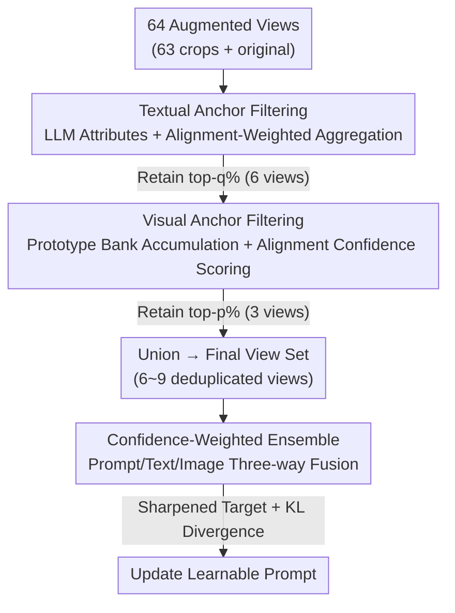

# Dual-Modality Anchor-Guided Filtering for Test-time Prompt Tuning

**Conference**: CVPR 2026  
**arXiv**: [2604.12403](https://arxiv.org/abs/2604.12403)  
**Code**: To be confirmed  
**Area**: Multimodal VLM / Test-time Adaptation  
**Keywords**: Test-time prompt tuning, view selection, dual-modality anchors, CLIP, entropy filtering

## TL;DR
Addressing the issue in Test-time Prompt Tuning (TPT) where "entropy filtering selects incorrect augmented views that bias the prompt," this paper utilizes **textual anchors** constructed from LLM attribute descriptions and **visual anchors** accumulated during test time for semantically guided view filtering. By treating both anchors as auxiliary prediction heads for confidence-weighted ensemble, the average accuracy is improved by 3.36% across 15 benchmarks.

## Background & Motivation

**Background**: Vision-Language Models (VLMs) like CLIP achieve zero-shot classification through image-text alignment, with performance highly dependent on prompt quality. Test-time Prompt Tuning (TPT) generates dozens of randomly cropped augmented views for each test image, predicts their classes, and updates learnable prompts online by **minimizing the average prediction entropy** to adapt to the current test distribution without any labels.

**Limitations of Prior Work**: Standard augmentations (random crop/resize) produce a large number of "noisy views"—many crops lose key object regions, overexpose backgrounds, or contain content only weakly related to the target class. Minimizing entropy on these unreliable views is dangerous: it **reinforces the model's confidence in incorrect predictions**, leading the prompt toward erroneous semantics (Fig. 1: noisy views causing an Abyssinian cat to be misclassified).

**Key Challenge**: Existing TPT methods (TPT / PromptAlign / DynaPrompt) almost exclusively rely on **prediction entropy** to filter views, which has two fundamental flaws. First, under distribution shift, the model's entropy itself is unreliable, assigning overconfident low entropy to semantically irrelevant views, causing **incorrect views to be selected**. Second, entropy is calculated using a coarse initial prompt ("a photo of a [CLASS]"), which lacks the fine-grained discriminative power to verify true classes among easily confused crops. Other work (DiffTPT) supplements this with "cosine similarity to the original image," but its gains primarily stem from the high diversity of diffusion augmentation; under standard augmentation, similarity criteria favor views that "look like the original," weakening diversity and generalization.

**Goal**: Under the realistic setting of **standard augmentation** (maintaining high efficiency and broad applicability), find a view selection signal more reliable than "entropy" or "rigid visual similarity."

**Key Insight**: Rather than trusting the model's internal confidence, view selection should be **anchored to external semantic evidence**—using a semantic reference system rich in class attributes to judge "how much this view actually resembles the target class."

**Core Idea**: Construct **dual-modality anchors** (textual anchors for fine-grained class semantics and visual anchors to capture evolving test-time visual statistics). Use the joint confidence of anchor-view alignment to filter views. Additionally, treat anchors as auxiliary prediction heads to ensemble a stable supervisory target distribution via confidence weighting, using KL divergence instead of entropy minimization to update prompts.

## Method

### Overall Architecture
The method is a serial pipeline of "filter views, then ensemble supervision," which seamlessly integrates into existing prompt tuning frameworks (CoOp / MaPLe, etc.). For each test image: LLM-generated attribute descriptions are encoded offline into a knowledge base using the CLIP text encoder. At test time, 64 augmented views (63 random crops + original) are encoded. First, **textual anchors** perform alignment + confidence joint scoring to retain the top-$q\%$. Views filtered by the textual branch are then accumulated into a **class prototype bank** to form **visual anchors** for a second round of joint scoring to retain the top-$p\%$. The union of both sets forms the final view set. Finally, predictions from the original prompt, textual anchors, and visual anchors are fused via **confidence-weighted ensemble** to produce a sharpened target distribution for updating prompts via KL divergence.

### Key Designs

**1. Textual Anchors: Replacing coarse template prompts with LLM attribute descriptions for semantically guided filtering**

The second flaw of entropy filtering is calculating scores with coarse prompts like "a photo of a [CLASS]," which cannot distinguish fine-grained attributes. Ours uses LLMs to generate multiple attribute descriptions offline for each class (e.g., "Dog has a soft coat, floppy ears, and a wagging tail"), encoded by CLIP. Since different descriptions vary in relevance to specific images, a **alignment-weighted aggregation** is used instead of simple averaging. For view $b$, class $c$, and description $i$, the alignment score $s_{b,c,i} = \text{sim}(e_b, w^i_c) - \text{sim}(e_b, \bar{w}_c)$ is calculated, representing the marginal gain of the description relative to the class mean feature $\bar{w}_c=\frac1N\sum_j w^j_c$. Weights $a_{b,c,i}$ are derived via softmax and averaged across views to aggregate the textual anchor $t_c=\sum_i \bar{a}_{c,i} w^i_c$. This mean-subtraction design is key—it measures "how much extra semantic information this description brings over a general one," providing discriminative signals even in low-variance scenarios. Finally, a **joint alignment-confidence score** $S_{\text{text}}(e)=\alpha_1 s_{\text{align}}(e)+\alpha_2 s_{\text{conf}}(e)$ is computed, where $s_{\text{align}}(e)=\max_c \text{sim}(e, t_c)$ and $s_{\text{conf}}(e)=1-\frac{H(p(y|e))}{\log C}$, retaining the top-$q\%$.

**2. Visual Anchors: Capturing visual statistics of the current distribution via test-time prototype accumulation**

While textual anchors provide semantic priors, they cannot capture visual appearance changes specific to the test domain (lighting, style, texture shifts). Ours maintains a **class-level prototype bank** $P=\{p_c\}_{c=1}^C$ as "memory." For each view embedding $e$ selected by textual filtering, its class $c$ is predicted by the pre-adaptation model, and the prototype is updated via cumulative moving average: $p_c \leftarrow \frac{n_c p_c + e}{n_c+1}$. For a given test image, the top-$K$ classes are selected based on average view predictions $\bar\pi_c$ to form the visual anchor set $A_{\text{img}}$. Parallel to the textual branch, a second joint score $S_{\text{img}}(e)=\beta_1 s_{\text{align}}(e)+\beta_2 s_{\text{conf}}(e)$ is calculated to retain the top-$p\%$. Textual and visual branches are complementary: textual ensures semantic fidelity while visual ensures consistent appearance, allowing for reliable view verification even under distribution shifts where entropy and direct similarity fail.

**3. Confidence-Weighted Ensemble + KL Sharpening Target: Upgrading anchors to auxiliary prediction heads for debiased supervision**

Directly minimizing entropy on filtered views still encourages biased updates (self-sharpening, collapsing to overconfident but semantically inconsistent predictions). Ours allows dual-modality anchors to serve as **auxiliary prediction sources**. For each selected view, similarities are calculated between image features and (i) original prompt embeddings, (ii) textual anchors $t_c$, and (iii) visual prototypes $p_c$, yielding three sets of logits $z_{\text{prompt}}, z_{\text{text}}, z_{\text{image}}$. Logits are converted to $q_k$ via softmax, with the maximum probability taken as confidence $\gamma_k=\max(q_k)$. These are normalized into weights $w_k=\frac{\gamma_k}{\sum_{j} \gamma_j + \epsilon}$ to produce an ensemble vector $z_{\text{ens}}=\sum_k w_k z_k$. The ensemble logits are averaged across views and sharpened with temperature $T=0.3$ to form the target distribution $\tilde q$. Prompts are updated via KL divergence: $\mathcal{L}_{\text{TPT}}=D_{\text{KL}}(\tilde q \,\|\, p_v)$.

### Loss & Training
The final loss is the KL divergence $\mathcal{L}_{\text{TPT}}=D_{\text{KL}}(\tilde q \| p_v)$. The backbone is CLIP ViT-B/16, optimizing 4 learnable prompt tokens. 64 views (63 random resized crops + original) are generated per image. Textual anchors retain top 10% (6 views), and visual anchors retain top 5% (3 views), yielding 6~9 deduplicated views. AdamW optimizer is used with a learning rate of 0.003 on a single RTX 6000 Ada. All prompt tuning methods are trained on ImageNet 16-shot.

## Key Experimental Results

### Main Results

Domain Generalization (ImageNet five variants, top-1 accuracy %):

| Method | ImageNet | -A | -V2 | -R | -Sketch | Average | OOD Avg. |
|------|----------|------|------|------|---------|---------|----------|
| CLIP ViT-B/16 | 66.73 | 47.87 | 60.86 | 73.98 | 46.09 | 59.11 | 57.20 |
| TPT | 68.98 | 54.77 | 63.45 | 77.06 | 47.06 | 62.06 | 60.81 |
| DiffTPT | 70.30 | 55.68 | 65.10 | 75.00 | 46.80 | 62.26 | 60.65 |
| DynaPrompt | 69.61 | 56.17 | 64.67 | 78.17 | 48.22 | 63.37 | 61.81 |
| **Ours** | **72.21** | **59.65** | **65.35** | **80.25** | **51.24** | **65.74 (+3.68)** | **64.12 (+3.31)** |
| MaPLe + Ours | 72.31 | 59.65 | 66.84 | 80.50 | 52.11 | 66.28 | 64.78 |

Compared to TPT, Average +3.68%, OOD +3.31%. Compared to the strongest baseline DynaPrompt, Average +2.37%. On 10 cross-dataset benchmarks, Ours averages 68.81%, 1.81% higher than the strongest prompt learning method CoPrompt (67.00%).

Inference Efficiency (ImageNet-R): Ours achieves 80.25% at only 0.2 sec/image, similar to vanilla TPT; DiffTPT takes > 0.6 sec with lower accuracy (75.00%).

### Ablation Study

Comparison of selection strategies (Domain Generalization Average / OOD):

| Configuration | Average | OOD Avg. | Description |
|------|---------|----------|------|
| TPT (baseline, no selection) | 60.91 | 59.03 | No view filtering |
| + Cosine Sel. (sim to original) | 62.21 | 60.51 | Poor performance; visual similarity is unreliable |
| + Confidence Sel. (entropy only) | 62.44 | 60.81 | Entropy filtering |
| + Ours (Anchor Sel.) | 64.00 (+3.09) | 62.37 (+3.34) | Anchor-guided filtering |

Stepwise activation of four components (Flowers / DTD / ImageNet, top-1 %):

| $S_{\text{text}}$ | $S_{\text{img}}$ | $z_{\text{text}}$ | $z_{\text{img}}$ | Flowers | DTD | ImageNet |
|------|------|------|------|---------|-----|----------|
| ✗ | ✗ | ✗ | ✗ | 69.39 | 46.63 | 68.98 |
| ✓ | ✗ | ✗ | ✗ | 70.36 | 49.41 | 70.52 |
| ✓ | ✓ | ✗ | ✗ | 71.54 | 49.70 | 70.53 |
| ✓ | ✓ | ✓ | ✗ | 72.84 | 51.36 | 71.04 |
| ✓ | ✓ | ✓ | ✓ | **74.71** | **53.19** | **72.21** |

### Key Findings
- **View selection is critical for TPT**: Moving from no selection to anchor selection improves Average by 3.09%; cosine similarity selection is the weakest, indicating that "looking like the original" does not equate to "semantic correctness."
- **Textual anchors are the most significant component**: Adding $S_{\text{text}}$ alone increases DTD from 46.63 to 49.41. Visual anchors provide complementary gains.
- **Loss and ensemble are complementary**: Replacing Entropy Minimization (EM) with KLD improves OOD from 61.15 to 62.51; adding confidence-weighted ensemble further reaches 63.01.
- **Alignment-weighted aggregation is effective**: Compared to simple averaging of all descriptions (OOD 62.53), weighted aggregation reaches 63.01 (+0.48%).

## Highlights & Insights
- **Externalizing Belief**: The core insight is that under distribution shift, the model's own confidence (entropy) is untrustworthy. By introducing LLM semantics and accumulated visual statistics as external anchors, the "self-reinforcing bias" inherent in self-supervised TPT is addressed.
- **Dual Roles for Anchors**: Anchors serve as both filters (selecting views) and prediction heads (providing supervision targets). This unified representation efficiently covers "what to select" and "what to learn."
- **Marginal Gain Alignment**: The $\text{sim}(e,w^i_c)-\text{sim}(e,\bar{w}_c)$ design measures marginal semantic gain, automatically suppressing generic descriptions.
- **Lightweight & Pluggable**: Unlike DiffTPT's heavy diffusion augmentation, Ours achieves better results using semantic-aware selection on standard augmentations with nearly zero inference overhead (0.2 sec).

## Limitations & Future Work
- **Dependency on LLM Description Quality**: Textual anchors rely on offline LLM attributes. Descriptions for narrow or long-tail classes (e.g., specialized domains) might be vague or inaccurate.
- **Visual Anchor Cold Start**: Prototype banks are built during test time; early in the sequence, prototypes are unreliable. Furthermore, noisy initial predictions might pollute the bank.
- **Hyperparameter Overhead**: Parameters such as $q, p, K, \text{and scores ratios}$ require tuning.
- **Task Setting**: Experiments focus on image classification. Scalability to dense tasks like detection or segmentation remains unverified.

## Related Work & Insights
- **vs. TPT / DynaPrompt (Entropy Only)**: These rely on prediction entropy and minimize it, which is semantically blind and reinforces bias. Ours anchors both selection and supervision to external evidence.
- **vs. DiffTPT (Diffusion + Cosine Similarity)**: DiffTPT is computationally heavy. Ours demonstrates that semantic-aware selection on standard augmentation can outperform diffusion-based diversity.
- **vs. PromptAlign**: PromptAlign aligns token statistics to a proxy source dataset; Ours is source-free and relies purely on test-time anchors.

## Rating
- Novelty: ⭐⭐⭐⭐ Systematic focus on view selection as the core TPT problem.
- Experimental Thoroughness: ⭐⭐⭐⭐⭐ Extensive results across 15 benchmarks with multi-dimensional ablations.
- Writing Quality: ⭐⭐⭐⭐ Clear motivation; however, discussion on cold start risks is brief.
- Value: ⭐⭐⭐⭐ Lightweight, pluggable, and provides stable gains for practical TPT.

<!-- RELATED:START -->

## Related Papers

- [\[CVPR 2026\] Controllable Federated Prompt Learning at Test Time](controllable_federated_prompt_learning_at_test_time.md)
- [\[CVPR 2026\] SoC: Semantic Orthogonal Calibration for Test-Time Prompt Tuning](soc_semantic_orthogonal_calibration_for_test-time_prompt_tuning.md)
- [\[CVPR 2026\] Improving Calibration in Test-Time Prompt Tuning for Vision-Language Models via Data-Free Flatness-Aware Prompt Pretraining](improving_calibration_in_test-time_prompt_tuning_for_vision-language_models_via_.md)
- [\[CVPR 2026\] STAR: Test-Time Adaptation Can Enhance Universal Prompt Learning for Vision-Language Models](star_test-time_adaptation_can_enhance_universal_prompt_learning_for_vision-langu.md)
- [\[CVPR 2026\] Towards Calibrating Prompt Tuning of Vision-Language Models](towards_calibrating_prompt_tuning_of_vision-language_models.md)

<!-- RELATED:END -->
