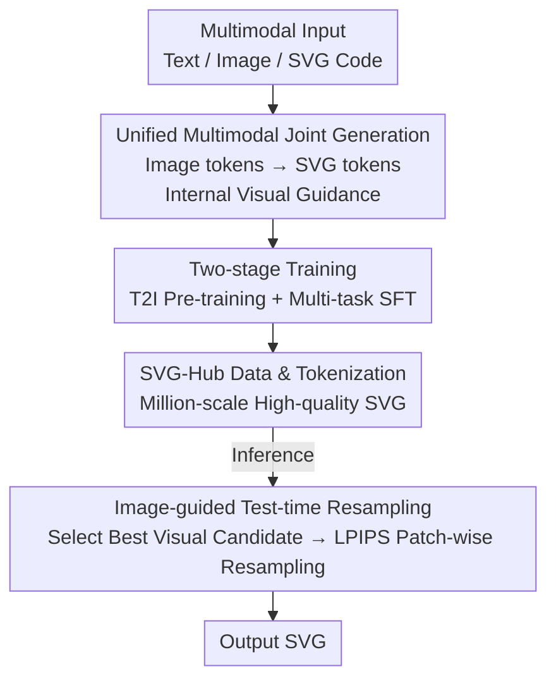

# DuetSVG: Unified Multimodal SVG Generation with Internal Visual Guidance

**Conference**: CVPR 2026  
**Paper**: [CVF Open Access](https://openaccess.thecvf.com/content/CVPR2026/html/Zhang_DuetSVG_Unified_Multimodal_SVG_Generation_with_Internal_Visual_Guidance_CVPR_2026_paper.html)  
**Code**: [Project Page](https://intchous.github.io/DuetSVG-site) (No independent repository found)  
**Area**: Multimodal VLM  
**Keywords**: SVG generation, unified multimodal model, internal visual guidance, test-time extension, autoregressive generation  

## TL;DR
DuetSVG transforms SVG generation from "pure text generation" to "joint autoregressive generation of image tokens and SVG tokens." This allows the image tokens generated first by the model to serve as internal visual guidance during SVG decoding. Combined with an image-guided test-time resampling strategy, it outperforms existing VLM methods in both text-to-SVG and image-to-SVG tasks.

## Background & Motivation
**Background**: Current mainstream SVG generation methods treat SVG as a sequence of text code. They use specialized tokenizers to clip drawing commands like `M / C / Q / Rect`, coordinates, and style attributes into discrete tokens, then fine-tune LLMs/VLMs (e.g., StarVector, LLM4SVG, OmniSVG) for autoregressive generation. Performance on text-to-SVG tasks has been respectable.

**Limitations of Prior Work**: Treating SVG purely as text has two major drawbacks. First, SVG has an additional "visual" dimension compared to pure text, yet text-based models **completely lack visual signals during decoding**. A coordinate prediction error of a few digits in token space might seem minor but can result in disastrous broken images or disconnected paths when rendered. Second, these models can only be trained on relatively scarce SVG data, failing to leverage massive high-quality image-text pairs and image editing data, which **strangles generalization capability**. They often fail when encountering complex semantics outside the training distribution.

**Key Challenge**: The fundamental cause is that the dual identity of "SVG as both code and image" is forcibly flattened by single-modal text modeling. Training only penalizes the grammatical correctness of the SVG code, providing **no supervision on what the rendered result looks like**.

**Goal**: (1) Introduce visual signals during the SVG decoding process; (2) Enable the utilization of large-scale image data to improve generalization and text-SVG alignment.

**Key Insight**: The authors observe that since unified autoregressive models (like Janus-Pro) can already generate image and text tokens simultaneously, the model should **generate the target image tokens first** before outputting SVG, using them as a "sketch" for SVG decoding.

**Core Idea**: Use a unified multimodal model to jointly generate "image tokens + SVG tokens," letting the model's natively predicted image serve as **internal visual guidance** for SVG decoding, thereby injecting visual signals end-to-end into vector graphics generation.

## Method

### Overall Architecture
The target sequence of DuetSVG is not simple SVG text, but a mixed-modal sequence $z = [\langle\text{IMG}\rangle, z^{\text{img}}_{1:I}, \langle/\text{IMG}\rangle, \langle\text{SVG}\rangle, z^{\text{svg}}_{1:S}, \langle/\text{SVG}\rangle]$. It consists of image tokens followed by corresponding SVG tokens. Training involves unified next-token prediction on this mixed sequence: $P_\theta(z\mid x)=\prod_{t=1}^{T} p_\theta(z_t\mid z_{<t}, x)$, where the conditional input $x$ can be any combination of text prompts, images, or SVG code. Due to causal attention, the preceding image tokens naturally provide guidance while decoding the subsequent SVG tokens—this is the literal source of "internal visual guidance."

The architecture follows Janus-Pro: text/SVG are encoded via the Janus-Pro text tokenizer; images take two paths—SigLIP as the **understanding encoder** to extract semantic features, and a VQ tokenizer as the **generation encoder** to compress the image into discrete tokens. Two MLP aligners project the understanding/generation image embeddings into the LLM feature space. After the unified autoregressive Transformer, two heads are used: a generation head to predict image tokens from the visual codebook, and an LM head to predict SVG tokens from the text vocabulary. During training, the two image encoders are frozen while the rest is trainable.

The entire pipeline follows a serial structure of "two-stage training + test-time extension":

### Key Designs

**1. Unified Multimodal Joint Generation: Using Model-Generated Images as Internal Visual Guidance**

This directly addresses the limitation of text-based SVG models having "no visual signals during decoding." DuetSVG no longer outputs only SVG text; instead, it arranges the target into a mixed sequence of "image tokens first, SVG tokens second," generated at once in a unified autoregressive Transformer. Because of causal attention, SVG tokens can "see" the already determined image tokens during generation—image tokens capture appearance while SVG tokens learn shape geometry and layer structure, constraining each other in the same sequence. Compared to concurrent work RoboSVG, which relies on an external VLM to generate extra multimodal conditions, DuetSVG **end-to-end co-generates** image and SVG tokens within the same model, avoiding inconsistencies between two models. Ablations show this is critical: when the image output is removed (degrading to SVG-only), performance drops below even a fine-tuned Qwen3-VL-8B, but adding the image modality allows it to surpass the latter—visual guidance is the key differentiator for quality.

**2. Two-stage Training: T2I Pre-training for Visual Priors and Multi-task SFT for Modal Synergy**

Janus-Pro lacks native capability to draw SVG-style images. Thus, the authors first perform Stage 1 Text-to-Image (T2I) pre-training to train the model to output clean images with "clear geometric primitives and flat colors." The corpus is mixed: one part consists of images rendered from SVG datasets with captions, and the other uses FLUX.1 to synthesize style-matched images given text and SVG references. Stage 2 involves Multi-task SFT, mixing T2I, Text-to-SVG (T2SVG), and Image-to-SVG (I2SVG) in a $1:5:4$ ratio, trained with a cross-entropy next-token objective on interleaved multimodal sequences. For SVG generation tasks, image tokens are always placed before SVG tokens to ensure visual guidance. To enhance robustness, SVG-specific data augmentation (random rotation/translation/scaling/color perturbation, random path dropping, and re-rendering) is applied to I2SVG. Text and image inputs have a 10% random dropout to support Classifier-Free Guidance (CFG) during inference. This multi-task sharing allows T2I and I2SVG to enhance T2SVG from different perspectives—ablations show that removing T2I pre-training degrades T2SVG FID from 33.6 to 37.0, proving that pre-trained image-text alignment provides a foundation for generalization.

**3. Image-guided Test-time Resampling: Search via Short Image Sequences + LPIPS Patch-wise Validation to Stabilize Long SVG Decoding**

Complex SVGs often exceed a thousand tokens, and autoregressive decoding accumulates sampling errors (e.g., false loops, weakened grounding), resulting in low-quality or illegal SVGs. The standard practice for pure text models is best-of-N: running N full SVG sequences and selecting the best using CLIP after rendering—this is expensive and only allows post-hoc re-ranking. DuetSVG utilizes the fact that "image token sequences are much shorter than SVG token sequences" to split extension into two steps. First, **Visual Candidate Selection**: generate $N$ image candidates via CFG, $z^{\text{CFG}}_t = z^{\text{uncond}}_t + \gamma\,(z^{\text{cond}}_t - z^{\text{uncond}}_t)$. Since image sequences are short, sampling $N$ images is cheap; a CLIP verifier then selects the best candidate $I^*$ (corresponding to image tokens $z^*_{\text{img}}$). Second, **Image-guided SVG Resampling**: continue generating SVG tokens from $z^*_{\text{img}}$. Every $K$ tokens generated, the current SVG is rendered into a temporary raster $R_t$ to calculate the LPIPS distance $d(R_t, I^*)$. If $d(R_t, I^*) \le d(R_{t-1}, I^*)$, the block is accepted; otherwise, it is rejected and resampled, with up to $M$ rejections allowed per SVG. In experiments, $N=3, M=3$. This effectively replaces "expensive long-sequence best-of-N" with "cheap short-image search + patch-wise visual validation," improving semantic alignment and SVG validity at a lower computational cost.

**4. SVG-Hub Dataset and Lossless Tokenization: Feeding High-quality Native SVG, Not Vectorization Noise**

Existing SVG datasets are mostly vectorized from raster images (e.g., MMSVG, InternSVG), introducing irregular paths, visual artifacts, and short, non-generalized captions. The authors built SVG-Hub-1M (cleaned from public sources like MMSVG, SVGX, Iconfont, filtering out auto-vectorized and empty samples) and an internal SVG-Hub-5M, both consisting of **high-quality, non-vectorized native SVGs**. To provide semantic depth, InternVL3 and Qwen2.5-VL generate three levels of captions (short/medium/detailed) for each rendered SVG. For tokenization, elements are regularized: redundant invisible elements are removed, viewBoxes are normalized to $800\times800$, and the command vocabulary is restricted to `{M, L, C, Q, A, Z, Ellipse, Circle, Polygon, Rect}` before quantizing coordinates into discrete tokens. Crucially, `<defs>` gradients and `<g>` group transformations are retained to preserve expressiveness. This reduces file size and regularizes structure without loss of rendering quality.

### Loss & Training
The unified next-token prediction cross-entropy loss is applied to the interleaved "image token + SVG token" mixed sequences (Eq. 1). Initialized from Janus-Pro-7B; images are resized to $384\times384$ and encoded into 576 discrete visual tokens by the generation encoder (codebook size 16,384); SVGs are truncated to at most 12,000 text tokens. Stage 1 uses a batch size of 512 for 80K steps, and Stage 2 mixes the three tasks at $1:5:4$ with a batch size of 128 for 300K steps. AdamW ($\beta_1=0.9, \beta_2=0.95$, lr $1\times10^{-5}$) was used on 64 A100 GPUs for approximately 5 days. Downstream applications like SVG editing can be further fine-tuned in an optional SFT phase.

## Key Experimental Results

### Main Results
Two benchmarks: SVG-Hub-5M test set (9,000 samples) and SArena-Icon (6,000 samples). The table below compares DuetSVG with representative baselines on SVG-Hub-5M (↓ lower is better, ↑ higher is better):

| Method | T2SVG FID ↓ | T2SVG CLIP ↑ | T2SVG Path Sem. ↑ | I2SVG DINO ↑ | I2SVG LPIPS ↓ | I2SVG PSNR ↑ |
|------|------|------|------|------|------|------|
| FLUX.1-dev + VTracer | 46.99 | 25.33 | 1.22 | - | - | - |
| Gemini-3-Pro | 48.77 | 25.15 | 2.41 | 0.921 | 0.116 | 13.86 |
| LLM4SVG-7B (FT) | 49.32 | 23.30 | 2.32 | 0.938 | 0.099 | 19.84 |
| Qwen3-VL-8B (FT) | 43.72 | 23.94 | 2.53 | 0.947 | 0.090 | 20.92 |
| **Ours-7B (w/o TTS)** | 35.07 | 25.58 | 2.77 | 0.955 | 0.082 | 22.02 |
| **Ours-7B (TTS)** | **33.57** | **26.11** | **2.91** | **0.962** | **0.075** | **23.59** |

Findings are consistent on SArena-Icon: DuetSVG (TTS) reduces T2SVG FID to 11.71 and improves I2SVG PSNR to 24.02, leading all VLM baselines (including GPT-5-Thinking and Gemini-3-Pro). Path Semantics is a vector-level metric: it measures the drop in CLIP score when 30% of paths are randomly deleted; a larger drop suggests each path carries more semantic weight (i.e., less redundancy).

### Ablation Study

| Configuration | T2SVG FID ↓ | T2SVG CLIP ↑ | I2SVG DINO ↑ | I2SVG LPIPS ↓ | Description |
|------|------|------|------|------|------|
| w/o Internal Guidance (SVG-only) | 51.48 | 23.26 | 0.939 | 0.096 | Degrades to pure text-based; all metrics worsen significantly |
| w/o T2I Pre-training | 36.95 | 25.12 | - | - | Significant drop in T2SVG quality |
| w/o Test-time Extension (TTS) | 35.07 | 25.58 | 0.955 | 0.082 | Equivalent to Ours w/o TTS |
| Ours (Full) | **33.57** | **26.11** | **0.962** | **0.075** | Complete model |

### Key Findings
- **Internal visual guidance is the decisive module**: Removing image output causes T2SVG FID to skyrocket from 33.6 to 51.5. This SVG-only variant underperforms fine-tuned Qwen3-VL-8B, but the full DuetSVG surpasses it—indicating performance stems from visual guidance, not just a stronger language backbone.
- **T2I pre-training provides a generalization foundation**: Removing it worsens FID from 33.6 to 37.0; pre-training allows the model to produce cleaner SVG-style images and handle complex out-of-distribution prompts.
- **Test-time extension improves quality at low cost**: TTS boosts both T2SVG and I2SVG (e.g., PSNR 22.0→23.6). Since search occurs on short image sequences, it is far cheaper than best-of-N on long SVG sequences.
- **Open-source VLMs, even fine-tuned on SVG-Hub-5M, still learn syntax over visual appearance** due to their text-centric designs, falling behind DuetSVG in complex geometric details.

## Highlights & Insights
- **"Generating images before SVG" injects end-to-end visual supervision**: Utilizing sequence order (image tokens first) and causal attention achieves internal visual guidance without extra modules, appearing cleaner than external VLM conditions (e.g., RoboSVG) while eliminating cross-model inconsistency.
- **Practical insight into Test-time Extension costs**: Leveraging the asymmetry between short image token sequences and long SVG token sequences to move expensive search to the "cheap" image layer is a clever trick applicable to other "short guidance + long target" scenarios.
- **Unified multimodal models as natural SVG verifiers**: Multimodal generation inherently produces renderable intermediate images, simplifying test-time verifier design—an idea applicable to tasks with executable/renderable intermediates like code generation.

## Limitations & Future Work
- **High computational barrier**: Requires 64×A100 for 5 days for a 7B model. Patch-wise rendering and LPIPS calculation during testing increase inference latency compared to one-shot autoregression (⚠️ per-sample latency comparison not provided).
- **Architecture lock-in**: Bound to the Janus-Pro unified architecture; not easily transferable to non-unified models.
- **Greedy acceptance in test-time resampling**: The $d(R_t,I^*)$ non-increasing criterion is a greedy strategy that might fall into local optima or fail to correct accumulated errors early in complex SVGs.
- **Quality ceiling tied to visual candidate $I^*$**: If initial CFG candidates are poor, subsequent SVG decoding will only approximate an unsatisfactory image regardless of how faithful it is.

## Related Work & Insights
- **vs. Optimization-based (VectorFusion / SVGDreamer / T2V-NPR)**: These use differentiable rendering and score distillation for per-image optimization, taking minutes/hours and often producing fragmented paths; DuetSVG is feed-forward and trained on real SVG data, winning in both quality and speed.
- **vs. Text-centric VLM/LLM (StarVector / LLM4SVG / OmniSVG)**: These treat SVG purely as text with no visual signals during decoding and limited data; DuetSVG introduces internal guidance and large-scale image-text data.
- **vs. VecFusion (Raster Diffusion followed by Vector Diffusion)**: VecFusion uses two non-end-to-end models, leading to generalization limits and geometric displacement; DuetSVG co-generates tokens end-to-end in a single model.
- **vs. Concurrent RoboSVG**: RoboSVG relies on an external VLM for conditions, introducing potential cross-model inconsistencies; DuetSVG is internally symbiotic.

## Rating
- Novelty: ⭐⭐⭐⭐⭐ First unified multimodal SVG generation model; "internal visual guidance" injects vision supervision end-to-end.
- Experimental Thoroughness: ⭐⭐⭐⭐⭐ Two benchmarks, extensive baselines (optimization, proprietary, open-source VLMs), and three-way ablation with fair fine-tuning for baselines.
- Writing Quality: ⭐⭐⭐⭐ Methodology and motivation are clear, though some implementation details (inference speed) are in Supplementary.
- Value: ⭐⭐⭐⭐⭐ Clear SOTA lead; commitment to open-sourcing SVG-Hub-1M is highly valuable for design automation.

<!-- RELATED:START -->

## Related Papers

- [\[ICLR 2026\] InternSVG: Towards Unified SVG Tasks with Multimodal Large Language Models](../../ICLR2026/multimodal_vlm/internsvg_towards_unified_svg_tasks_with_multimodal_large_language_models.md)
- [\[CVPR 2026\] TUNA: Taming Unified Visual Representations for Native Unified Multimodal Models](tuna_taming_unified_visual_representations_for_native_unified_multimodal_models.md)
- [\[CVPR 2026\] Multimodal Continual Instruction Tuning with Dynamic Gradient Guidance](multimodal_continual_instruction_tuning_with_dynamic_gradient_guidance.md)
- [\[CVPR 2026\] Rosetta Stone for Unified MLLMs: A Unified Tokenizer to Decipher Understanding and Generation](rosetta_stone_for_unified_mllms_a_unified_tokenizer_to_decipher_understanding_an.md)
- [\[CVPR 2026\] HBridge: H-Shape Bridging of Heterogeneous Experts for Unified Multimodal Understanding and Generation](hbridge_h-shape_bridging_of_heterogeneous_experts_for_unified_multimodal_underst.md)

<!-- RELATED:END -->
