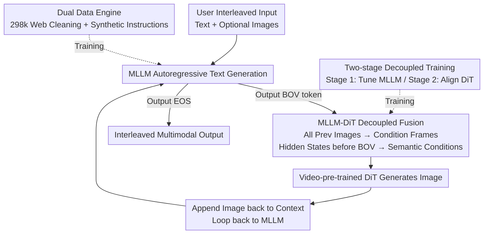

# DuoGen: Towards Autonomous Interleaved Multimodal Generation

**Conference**: CVPR 2026  
**Paper**: [CVF Open Access](https://openaccess.thecvf.com/content/CVPR2026/html/Shi_DuoGen_Towards_Autonomous_Interleaved_Multimodal_Generation_CVPR_2026_paper.html)  
**Code**: https://research.nvidia.com/labs/dir/duogen (Project page, paper claims data & code released)  
**Area**: Multimodal VLM  
**Keywords**: Interleaved multimodal generation, unified multimodal model, decoupled training, video DiT, instruction tuning data

## TL;DR
DuoGen combines a pre-trained MLLM with a video-pre-trained DiT. Using a special `<BOV>` token, the MLLM autonomously decides when to generate images, while all preceding images in the sequence serve as conditioning frames for the DiT to continue generation. Combined with a two-stage decoupled training strategy and a high-quality dataset of 298k interleaved instructions synthesized from cleaned web data, it outperforms open-source unified models across interleaved generation, text-to-image (T2I), and image editing tasks.

## Background & Motivation

**Background**: Interleaved multimodal generation requires models to alternately produce text and images within a single response. Typical scenarios include step-by-step tutorials, recipes, visual planning, or using images as "drafts" to assist reasoning. Dominant approaches like Chameleon, Show-o, and Bagel utilize **unified models** via early-fusion: discretizing images into tokens or using a hybrid paradigm (text next-token + image diffusion), jointly pre-training from scratch on text, images, and large-scale interleaved sequences.

**Limitations of Prior Work**: The early-fusion route requires building both "visual understanding" and "image generation" capabilities simultaneously from scratch, incurring massive data engineering and computational costs. Furthermore, upgrading to a stronger or larger base model necessitates full re-training. Another category of work (MetaQuery, UniWorld, OmniGen2) connects pre-trained image generators to MLLMs, but their interleaved generation is either underexplored or limited by architecture—for instance, the generation heads often **cannot receive multiple conditioning images**, making it impossible to "generate the next step while observing all previous steps." Additionally, existing interleaved data mostly consists of noisy web-crawled corpora or dense video captions; **real user-assistant interactive instruction data is extremely scarce**, lacking in quality and diversity.

**Key Challenge**: Effectively performing general interleaved generation requires both strong linguistic understanding/world knowledge and high-quality, multi-image conditional generation. Early-fusion forces both into joint training, causing optimization conflicts between "understanding vs. generation" and preventing the reuse of existing powerful pre-trained models.

**Goal**: Systematically address interleaved generation by tackling three areas: (1) creating sufficient high-quality, diverse interleaved instruction data; (2) designing an architecture that does not require single-modality pre-training from scratch and allows flexible base model replacement; (3) building an evaluation benchmark capable of identifying fine-grained visual flaws.

**Key Insight**: The authors observe that **existing pre-trained MLLMs already possess visual understanding, and existing video generation DiTs can produce high-quality, temporally consistent images.** Thus, the expensive single-modality pre-training can be skipped by "aligning" interleaved generation capabilities directly on top of these pre-trained models.

**Core Idea**: Use a `<BOV>` token to let the MLLM autonomously trigger image generation. Treat all images in the interleaved history as conditioning frames for a video DiT, and use the MLLM's hidden states as semantic conditions. Employ a two-stage decoupled training (tune MLLM first, then freeze MLLM to align DiT) to avoid redundant pre-training.

## Method

### Overall Architecture

DuoGen is composed of two **off-the-shelf pre-trained models**: an MLLM with a vision encoder (Qwen2.5-VL 7B in the implementation) responsible for text generation, and a DiT initialized from a video generation model (Cosmos-Predict 2.5 2B) responsible for image generation, bridged by a lightweight connector. The unified model only needs to learn two things: the MLLM autonomously outputs the `<BOV>` (Begin-of-Vision) token when it is "time to draw," and the DiT generates images consistent with both the preceding text and images.

During inference, the MLLM generates text token-by-token autoregressively. Once it outputs `<BOV>`, it switches to image generation mode: **all images** existing in the history $T_1, I_1, T_2, I_2, \dots, T_N$ before the `<BOV>` (whether provided by the user or previously generated) are stacked temporally, encoded into latent conditioning frames via VAE, and concatenated with the noise latent of the target image as the DiT's visual input. Simultaneously, the MLLM hidden states corresponding to all multimodal tokens before `<BOV>` are projected via the connector to serve as semantic/linguistic conditions for the DiT. Once an image is generated, it is appended back to the interleaved context, and text generation continues until the next `<BOV>` or EOS. The relationship between data, architecture, and training is shown below:

### Key Designs

**1. Dual Data Engine: Web Cleaning + High-quality Synthesis (298k samples)**

The primary bottleneck for interleaved generation is the lack of high-quality "user-assistant interactive" instruction data. The authors generate data from two complementary sources. **Web Data Engine**: 347k pages are crawled from how-to sites like StoryBird, Instructables, and eHow (also reusing CoMM's raw data). After filtering pure text pages and invalid images (QR codes, icons, ads), 268k pages are converted to Markdown and processed in two steps: (a) Content rewriting and restructuring: LLMs rewrite text to remove HTML tags/formatting errors/external links. All images are captioned and categorized (natural photos / GUI screenshots / document pages). The MLLM removes duplicate images and **reorders images to be placed after their corresponding descriptions** to ensure alignment; (b) Dialogization: Multi-modal LLMs convert cleaned sequences into realistic instruction-style dialogues where the user might provide an image and the assistant provides step-by-step reasoning and matching illustrations. Unlike older pipelines like CoMM, this engine explicitly denoises, reconstructs, and dialogizes, yielding 268k clean dialogues.

Since web image aesthetics and resolutions vary significantly, which can degrade generation quality, the authors add **30k high-quality synthetic data**: 1,500 seed prompts (covering 8 everyday domains and 151 subcategories) are expanded into 15,270 diverse instructions using OpenAI o3, with images paired via generation models. Cooking categories were found to be particularly effective, so 15k food images from MM-Food-100k were added as prompts. This subset provides high-resolution, style-consistent images. Ablations (Table 6) show that the IRS metric increases from 4.42 $\rightarrow$ 5.91 with the data engine, and further to 7.58 with synthetic data.

**2. MLLM↔DiT Decoupled Fusion + `<BOV>` Mechanism**

To address the early-fusion issue where single-modality pre-training is required, the authors treat the MLLM and Video DiT as two modules, learning only "when to draw" and "what to draw." When the MLLM generates `<BOV>`, the DiT generates $I_N$ based on historical sequence $T_1, I_1, \dots, T_N$. **Visual Conditions**: All preceding images are stacked temporally, VAE-encoded, and concatenated with the noise latent (following Cosmos' approach of appending condition frames to noise latents). This naturally supports **multi-image conditioning**, something older generation heads could not do. **Semantic Conditions**: MLLM hidden states for all preceding multimodal tokens are projected via a connector to the DiT's linguistic interface. Following Wang et al., hidden states from different decoder layers are concatenated channel-wise and injected via cross-attention. Both MLLM and DiT are replaceable (e.g., MLLM can be Qwen2.5-VL or LLaVA; DiT can be Wan or Cosmos).

To support packed training of heterogeneous resolution images, the authors treat all images in a sequence as a string of heterogeneous "video frames," flattening and concatenating VAE latents while recording metadata (height/width/index). They also extend positional encoding: temporal indices increment per image, and spatial RoPE is calculated according to each image's native resolution. During inference, classifier-free guidance is enhanced: for negative prompts, **visual conditions are kept unchanged while only the last text segment in the MLLM hidden state sequence is removed.**

**3. Two-stage Decoupled Training**

Injecting alignment data too early can degrade the carefully tuned post-training behavior of MLLMs. Therefore, training is split into two phases. **Stage 1 (Instruction Tuning)**: Updates only MLLM parameters using high-quality interleaved dialogues with next-token-prediction supervision. While user inputs are masked, **the `<BOV>` token in the assistant's turn is included in the loss**, teaching the model when to trigger generation. For image generation, one target image and one diffusion step are randomly sampled from the sequence to calculate flow-matching loss. This stage **deliberately excludes** context alignment data. **Stage 2 (Interleaved Context Alignment)**: The MLLM is frozen, while only the connector and DiT are fine-tuned. Training uses large-scale alignment data—derived from 500k 5-second video clips where start/end frames are captioned by Qwen2.5-VL-32B to describe transitions (motion/actions/camera moves)—plus open-source T2I/editing data (ShareGPT-4o-Image, OmniGen, UniWorld). Instruction data from Stage 1 is also mixed in. Video data teaches smooth transition consistency, while image data teaches creative editing (adding/removing/replacing objects).

## Key Experimental Results

### Main Results

Evaluation was conducted on self-built benchmarks (Cooking-200 for food recipes, How-to-500 for open QA) and public benchmarks (CoMM, InterleavedBench). GPT-5 (acting as a judge) and human Elo (475 samples, 10 participants) were used.

Self-built benchmarks (Table 1, Metrics: Text Completeness T-Com / Image Completeness I-Com / Image Consistency I-Co / Image Quality I-Q / Image-Text Consistency IT-Co):

| Model | Params (Text/Img) | Cooking-200 I-Com | How-to-500 T-Com | Human Elo I-Com |
| :--- | :--- | :--- | :--- | :--- |
| Nano Banana (Comm.) | - | 4.07 | 3.95 | 1369 |
| SEED-LLaMA | 7B/0.8B | 1.63 | 1.61 | 963 |
| Zebra-CoT | 7B/7B | 2.63 | 2.04 | 1115 |
| **DuoGen** | 7B/2B | **4.70** | **3.39** | **1442** |

DuoGen significantly outperforms open-source models, especially on How-to-500, narrowing the gap with commercial models. On Cooking-200, it even matches Nano Banana in metrics like IT-Co.

Public benchmarks:

| Benchmark | Metric | Runner-up Model | DuoGen |
| :--- | :--- | :--- | :--- |
| CoMM | IRS (Image-Text Alignment) | MiniGPT-5 2.71 | **7.76** (2.8x) |
| CoMM | Comp. (Completeness) | Emu2 7.54 | **9.66** |
| InterleavedBench | Avg. | GILL 1.84 | **3.87** |
| InterleavedBench | T-Q (Text Quality) | Emu2 1.26 | **4.28** (3.4x) |

Text-to-Image and Image Editing:

| Task / Benchmark | Metric | Comparison | DuoGen |
| :--- | :--- | :--- | :--- |
| GenEval | Overall | Bagel 0.82 / OmniGen2 0.80 | **0.88** |
| GenEval | counting / position / attr | — | 0.94 / 0.84 / 0.80 |
| ImgEdit | Overall | OmniGen2 3.44 | **4.19** |
| GEdit EN | G_O (Geometric Mean) | Bagel 6.52 | **7.35** |

DuoGen outperforms unified models on GenEval, particularly in counting/positioning where unified models typically struggle. Image editing results significantly exceed unified models and approach specialized editing models. ⚠️ *Note: The paper text refers to "DuetGen" in some tables; this is assumed to be a typo for DuoGen.*

### Ablation Study

Data strategy ablation (CoMM benchmark, Table 6):

| Data Config | Tren. (Trend) | Comp. | ImgQ | IRS |
| :--- | :--- | :--- | :--- | :--- |
| CoMM Original | 6.52 | 6.45 | 6.30 | 4.42 |
| + Ours Data Engine | 7.22 | 8.15 | 7.79 | 5.91 |
| + Synthetic Data | **9.30** | **9.45** | **9.48** | **7.58** |

### Key Findings

- **Data engine provides the largest gain**: Simply processing CoMM raw data through the proposed data engine (MLLM cleaning/restructuring/dialogization) increases IRS from 4.42 $\rightarrow$ 5.91, indicating that the bottleneck is often data quality rather than model architecture.
- **Synthetic data enhances quality and consistency**: Adding 30k synthetic samples leads to the sharpest increases in image quality (ImgQ) and temporal-semantic trend (Tren.), compensating for the aesthetic/resolution variability of web data.
- **Video-pre-trained DiT is the source of editing/generation strength**: The authors attribute performance on GenEval and image editing to the DiT's pixel-level quality and creative capabilities inherited from video generation pre-training.

## Highlights & Insights

- **The `<BOV>` token integrates "when to draw" into the MLLM's autoregressive prediction**, and this token is part of the next-token loss calculation. The model autonomously decides to generate rather than waiting for a user command—this is the core of "autonomous interleaved" generation.
- **Multi-image conditioning leverages the temporal mechanism of video DiTs**: Interleaved sequences naturally map to video frames, allowing DuoGen to inherit Cosmos' conditioning capabilities without new architectural components.
- **Decoupled training protects model performance**: Using frozen parameters and staged data avoids catastrophic forgetting/interference. Stage 1 protects the MLLM's post-training behavior, while Stage 2 tunes the DiT for alignment.

## Limitations & Future Work

- Gaps remain compared to commercial models like Nano Banana or GPT-4o-Image in open-domain scenarios (knowledge and physical grounding), suggesting data coverage is still the upper bound.
- Evaluation relies heavily on GPT-5 as a judge; while more fine-grained than GPT-4o, the bias of VLM judges remains a concern.
- As the CVF version, full disclosure of hyperparameters, training compute, and inference latency is sparse (mostly in supplementary). Memory/latency overhead for long sequences due to cumulative conditioning frames is not quantified.
- Future work: Expanding alignment data from video transitions to stronger physical/commonsense consistency data.

## Related Work & Insights

- **vs. Chameleon / Show-o (Early-fusion)**: These require joint pre-training from scratch and are hard to scale; DuoGen uses pretrained-fusion for modularity, though its data strategies are applicable to early-fusion models.
- **vs. Bagel / OmniGen2 (Pretrained-fusion)**: DuoGen outperforms these by using a video latent temporal stacking approach that naturally supports multi-image conditioning, whereas previous heads were limited.
- **vs. CoMM (Dataset)**: DuoGen's data engine performs extra rewriting, restructuring, and denoising, and supplements with synthetic data, leading to massive gains in completeness and IRS metrics.

## Rating
- **Novelty**: ⭐⭐⭐⭐ The autonomous `<BOV>` trigger and use of Video DiT for interleaved sequences are clever engineering integrations.
- **Experimental Thoroughness**: ⭐⭐⭐⭐⭐ Comprehensive coverage across 3 interleaved benchmarks, T2I, editing, human Elo, and data ablations.
- **Writing Quality**: ⭐⭐⭐⭐ Clear logic across data, architecture, and training, despite minor typos like "DuetGen."
- **Value**: ⭐⭐⭐⭐⭐ Open-sourcing 298k data, the model, and a new benchmark provides a solid push for general interleaved generation.

<!-- RELATED:START -->

<!-- Paper links would go here -->

<!-- RELATED:END -->

## Related Papers

- [\[CVPR 2026\] WEAVE: Unleashing and Benchmarking the In-context Interleaved Comprehension and Generation](weave_unleashing_and_benchmarking_the_in-context_interleaved_comprehension_and_g.md)
- [\[CVPR 2026\] Wan-Weaver: Interleaved Multi-modal Generation via Decoupled Training](wan-weaver_interleaved_multi-modal_generation_via_decoupled_training.md)
- [\[CVPR 2026\] VinQA: Visual Elements Interleaved Long-form Answer Generation for Real-World Multimodal Document QA](vinqa_visual_elements_interleaved_long-form_answer_generation_for_real-world_mul.md)
- [\[CVPR 2026\] Multimodal RewardBench 2: Evaluating Omni Reward Models for Interleaved Text and Image](multimodal_rewardbench_2_evaluating_omni_reward_models_for_interleaved_text_and_.md)
- [\[CVPR 2026\] Reversing the Flow: Generation-to-Understanding Synergy in Large Multimodal Models](reversing_the_flow_generation-to-understanding_synergy_in_large_multimodal_model.md)

<!-- RELATED:END -->
