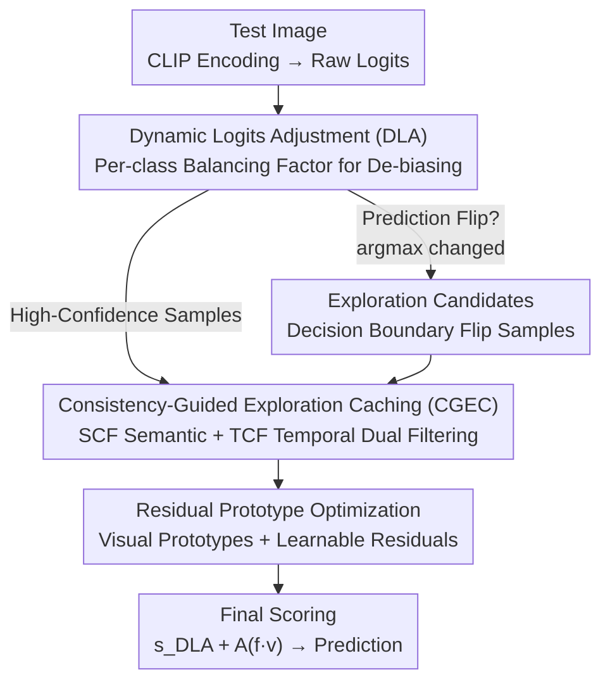

# Dynamic Logits Adjustment and Exploration for Test-Time Adaptation in Vision Language Models

**Conference**: CVPR 2026  
**Paper**: [CVF Open Access](https://openaccess.thecvf.com/content/CVPR2026/html/Wu_Dynamic_Logits_Adjustment_and_Exploration_for_Test_Time_Adaptation_in_Vision_CVPR_2026_paper.html)  
**Code**: To be confirmed (The original text states "Code is available here" but no specific link is provided)  
**Area**: Multimodal VLM / Test-Time Adaptation  
**Keywords**: Test-Time Adaptation, CLIP, Logit Calibration, Category Bias, Caching Mechanism  

## TL;DR
Addressing the issue where Test-Time Adaptation (TTA) for VLMs tends to select only high-confidence samples, leading to "inherited model category bias + insufficient exploration," this paper proposes DLAE. It utilizes Dynamic Logits Adjustment (DLA) to de-bias logits by multiplying them with a balancing factor based on online prediction statistics. Furthermore, it introduces Consistency-Guided Exploration Caching (CGEC) to specifically incorporate decision-boundary samples—those whose predictions "flip" after calibration—into the cache under dual semantic and temporal consistency constraints. This allows for stable exploration of low-confidence regions, consistently outperforming SOTA methods like DPE on both Cross-Domain and OOD benchmarks.

## Background & Motivation
**Background**: VLMs like CLIP/ALIGN inevitably encounter distribution shifts between pre-training corpora and target environments during deployment. Test-Time Adaptation (TTA) is an attractive remedy—updating frozen or lightly fine-tuned models on-the-fly during inference without labels or offline retraining. Current online streaming TTA for VLMs is roughly divided into two categories: prompt-based, which freezes the backbone and optimizes continuous text prompts (TPT, DiffTPT); and cache-based, which stores historical "feature-label pairs" or class prototypes to stabilize predictions (TDA, DPE, DMN-ZS). Among these, DPE further optimizes in the embedding space using high-confidence samples to calculate residual prototypes.

**Limitations of Prior Work**: Almost all mainstream methods rely on **entropy-based filtering** to pick "reliable" samples—trusting only low-entropy (high-confidence) samples. This leads to two systemic issues: ① Large-scale heterogeneous web corpora cause VLMs to have inherent **category-level prediction biases**; certain easy classes easily surpass confidence thresholds early on, dominating pseudo-labels and causing the adaptation to become increasingly biased, eventually leading to pseudo-label collapse. ② Fixed-capacity caches combined with minimum-entropy replacement strategies quickly become saturated with a small set of "already well-learned simple samples" (Fig.1b shows the number of distinct samples in DPE's cache saturates early). This results in severe under-coverage of the target distribution, especially in low-confidence regions, making the calculated prototypes unrepresentative and reinforcing the aforementioned bias.

**Key Challenge**: The opposition between reliability (using only high-confidence samples → stable but biased, no exploration) and coverage/exploration (using low-confidence samples → exploratory but noisy, prone to collapse). Existing methods one-sidedly choose "high-confidence only," thereby solidifying bias and under-exploration into a self-reinforcing loop of errors.

**Goal**: Without introducing source data or retraining, to both **eliminate category-level bias** and **safely extend exploration to low-confidence/boundary regions**, avoiding collapse caused by a single confidence-based selection criterion.

**Key Insight**: The authors observe a critical property: after performing de-biasing calibration on logits, **the set of samples whose predictions flip happen to lie near the decision boundary**, precisely where the model needs new guidance. Thus, they use "Dynamic Logits Adjustment (DLA)" to first remove category bias, and then supplement the cache with "post-calibration flip" boundary samples (filtered via semantic and temporal consistency). In short: **Use category statistics to perform online de-biasing of logits, and cautiously incorporate boundary-flip samples exposed by de-biasing into the cache to explore low-confidence regions.**

## Method

### Overall Architecture
DLAE is built upon cache-based TTA (following the residual prototype paradigm of DPE). The input is a streaming single test image, and the output is a de-biased and exploration-enhanced classification prediction. The workflow is: CLIP encodes the image feature $f_v$ and text prototypes $t_c$, first calculating raw logits $s^c_{\text{clip}}=f_v^\top t_c$ to obtain initial pseudo-labels $\hat y_{\text{CLIP}}$. **DLA** uses online-maintained per-class counts and average confidence to multiply each class logit by a balancing factor, yielding calibrated logits $s^c_{\text{DLA}}$ and new pseudo-labels $\hat y_{\text{DLA}}$. By comparing whether the two have flipped ($\arg\max s_{\text{clip}}\neq\arg\max s_{\text{DLA}}$), flip samples are identified as boundary candidates. **CGEC** sends both high-confidence samples and flip samples to the cache, but uses **Semantic Consistency Filtering (SCF)** and **Temporal Consistency Filtering (TCF)** to modulate the entropy of each sample, ensuring reliable samples prevail in the low-entropy priority queue. Visual features in the cache are aggregated into visual prototypes $v_c$, which work with learnable text/visual residuals $\Delta t_c, \Delta v_c$ for test-time optimization. The final score adds the calibrated semantic logits and affinity-modulated visual cues: $s^c_{\text{DLAE}}=s^c_{\text{DLA}}+A(f_v^\top v_c)$.

### Key Designs

**1. Dynamic Logits Adjustment (DLA): Online Category Statistics for Logit De-biasing**

To address the pain point of VLM category-level bias being amplified by high-confidence self-training (where tail classes are rarely updated), DLA works entirely online and sample-by-sample, without retraining or touching source data. It maintains two rolling statistics for each class: a counter $n[c]$ (cumulative count of class $c$ as a pseudo-label, initialized to 1) to estimate the empirical category distribution, and a rolling average confidence $\mu[c]$ (average confidence of past predictions for class $c$, initialized to 0) as a reliability indicator. The empirical category probability is $\hat p(c)=n[c]/N, N=\sum_{c'} n[c']$. The core is a balancing function:

$$B(c)=\exp\!\big(-\alpha\cdot\hat p(c)\cdot(1-d)\big),\qquad d=P_{\text{clip}}(\hat y_{\text{clip}})-\mu[\hat y_{\text{clip}}]$$

where $d$ measures the deviation of the current prediction confidence from the historical mean for that class, and $\alpha$ controls the adjustment strength. The calibrated logit is $s^c_{\text{DLA}}=s^c_{\text{clip}}\cdot B(c)$. This design exhibits three behaviors: ① When a high-frequency class receives a confidence lower than its historical mean ($d<0$), $B(c)$ decreases, suppressing "over-confident but unreliable" predictions. ② When confidence meets or exceeds the historical mean ($d\ge 0$), $B(c)$ approaches 1, maintaining stability. ③ For rare classes, a small $\hat p(c)$ keeps $B(c)$ close to 1, ensuring tail classes are not over-penalized and can still contribute to adaptation. $n$ and $\mu$ are updated incrementally after each prediction, allowing statistics to evolve with the test distribution. Unlike entropy filtering which trusts "initial category preference," DLA performs reverse correction for over/under-predicted classes at the logit level **before** pseudo-label submission.

**2. Consistency-Guided Exploration Caching (CGEC): Incorporating DLA-Exposed Boundary Flips**

To address the issue where fixed-capacity caches are saturated by simple samples, CGEC does not replace high-confidence samples but **supplements** them with samples whose predictions flip after DLA calibration ($\hat y_{\text{clip}}\neq\hat y_{\text{DLA}}$). These flip samples often lie on the decision boundary with high uncertainty and are typically discarded by existing methods, yet they carry crucial semantic signals to mitigate category bias and prevent collapse. Since caching all flip samples could introduce noise, CGEC does not store them directly but **modulates their entropy** through SCF/TCF filters. The cache acts as a low-entropy priority queue; samples with lower modulated entropy are more likely to remain, thereby cautiously and effectively expanding exploration around the decision boundary. Finally, visual features in the cache are aggregated into prototypes $v_c=\frac{1}{|P_c|}\sum_{[f_v,h]\in P_c} f_v$.

**3. Semantic + Temporal Dual Consistency Filtering (SCF/TCF): Two Safety Locks for Exploration**

SCF (Semantic Consistency) requires labels before and after the flip to be sufficiently close in the text embedding space—for instance, a "dog → wolf" flip is semantically coherent and should be tightened (made more credible), whereas a "dog → airplane" is an inconsistent signal that shouldn't reduce uncertainty. It modulates entropy using the cosine similarity of text embeddings between the original and refined predictions:

$$h\leftarrow h\cdot\exp\!\big(-\beta\cdot\cos(t_{\hat y_{\text{clip}}},\,t_{\hat y_{\text{DLA}}})\big)$$

The more semantically consistent, the more the entropy is suppressed, making it easier for informative boundary samples to stay in the cache. TCF (Temporal Consistency) evaluates **all** samples entering the cache (including high-confidence and flip samples) to ensure their feature representations "co-evolve" with the model's adaptation. It detects if a sample's original visual feature $f_v$ becomes misaligned over time with the evolving text embedding of its class $\hat y_{\text{DLA}}$: if $t_{\hat y_{\text{DLA}}[0]}^\top f_v > t_{\hat y_{\text{DLA}}[\text{now}]}^\top f_v$ (initial prototype is closer than the current one), it is judged as temporally inconsistent and penalized:

$$h\leftarrow h\cdot\exp\!\big(\eta\,(i_{\text{now}}-i_{\text{entry}})\big)$$

where $i_{\text{now}}$ is the current training step and $i_{\text{entry}}$ is the step when the sample entered the cache. This gradually pushes out samples that become outliers due to representation drift, leaving only boundary samples that are temporally consistent with the evolving model. SCF ensures "flips make sense," while TCF ensures "remaining samples stay reliable." Together, they allow CGEC to explore without losing stability.

### Loss & Training
Ours follows the alignment-confidence objective of DPE: $L_{\text{all}}=L_{\text{conf}}+\lambda L_{\text{align}}$. $L_{\text{align}}$ is a symmetric cross-modal alignment loss (text-to-image and image-to-text cross-entropy), with $\lambda$ balancing the terms. DLAE makes two modifications: ① It replaces the semantic similarity term in $L_{\text{conf}}$ with the final combined logit $s^c_{\text{DLAE}}$, i.e., $L^{\text{DLAE}}_{\text{conf}}=H\big(\text{softmax}(s^c_{\text{DLAE}}/\tau)\big)$, allowing calibration to act directly on the final score. ② Each prototype $v_c$ is calculated by CGEC. Text/visual residuals $\Delta t_c, \Delta v_c$ are initialized to 0 and optimized via gradient descent, with original CLIP text embeddings and cache prototypes serving as fixed anchors. During inference, $\hat y_{\text{DLAE}}=\arg\max_c s^c_{\text{DLAE}}$.

## Key Experimental Results

Experiments use CLIP (ResNet-50 and ViT-B/16 backbones), a single 24GB RTX 3090, and a test-time batch=1 setting. Following TPT, up to 63 augmented views are generated via random cropping. Cache capacity is set to 3 (consistent with DPE for fair comparison). Two benchmarks are used: Cross-Domain (CD) (10 non-overlapping domain datasets) and OOD (ImageNet + A/V2/R/Sketch variants).

### Main Results

Average Top-1 on 10 Cross-Domain datasets (selected methods):

| Backbone | Method | DTD | EuroSAT | Aircraft | SUN397 | Mean |
|----------|--------|------|---------|----------|--------|------|
| RN50 | CLIP | 40.37 | 23.69 | 15.66 | 58.80 | 55.82 |
| RN50 | DPE | 50.18 | 41.67 | 19.80 | 64.23 | 61.93 |
| RN50 | DMN-ZS | 50.41 | 48.72 | 22.77 | 64.39 | 63.71 |
| RN50 | **DLAE** | **55.56** | **50.04** | **23.34** | **65.43** | **64.81** |
| ViT-B/16 | CLIP | 44.27 | 42.01 | 23.67 | 62.59 | 63.58 |
| ViT-B/16 | DPE | 54.20 | 55.79 | 28.95 | 70.07 | 69.40 |
| ViT-B/16 | DMN-ZS | 55.85 | 59.43 | 30.03 | 70.18 | 70.30 |
| ViT-B/16 | **DLAE** | **58.86** | 61.30 | **32.58** | **70.83** | **71.88** |

OOD Robustness (ImageNet and natural distribution shift variants) Average Top-1:

| Backbone | Method | ImageNet-A | ImageNet-V2 | OOD Mean | Total Mean |
|----------|--------|-----------|-------------|----------|--------|
| RN50 | DPE | 30.15 | 56.72 | 47.66 | 50.81 |
| RN50 | **DLAE** | **34.80** | **57.13** | **49.06** | **52.06** |
| ViT-B/16 | DPE | 59.63 | 65.44 | 64.43 | 65.93 |
| ViT-B/16 | SCA | 60.33 | 65.38 | 64.77 | 66.16 |
| ViT-B/16 | **DLAE** | **64.06** | **65.50** | **65.76** | **67.09** |

DLAE achieves the highest average across both backbones. On CD, it excels particularly in textures (DTD), remote sensing (EuroSAT), and large-scale scenes (SUN397). On OOD, the improvement on ImageNet-A is most significant (30.15→34.80 for RN50, 59.63→64.06 for ViT), indicating that de-biasing + exploration helps most with naturally adversarial samples.

### Ablation Study

Component Ablation (ViT-B/16, step-by-step):

| Config | Acc(%) | Description |
|--------|--------|------|
| Baseline (No DLA/CGEC) | 69.40 | Degrades to DPE-style baseline |
| + DLA | 70.63 | Dynamic Logit Adjustment only, +1.23 |
| + DLA + CGEC | **71.88** | Full model, additional +1.25 |
| DLA: Entropy adj. only | 69.85 | Eq.15 during training |
| DLA: Logit adj. only | 70.39 | Eq.14 during inference |
| DLA: Entropy + Logit | 70.63 | Complementary effects |
| CGEC: SCF only | 71.26 | Semantic filter, +0.63 over 70.63 |
| CGEC: TCF only | 71.37 | Temporal filter, +0.74 |
| CGEC: SCF + TCF | **71.88** | Dual filtering is optimal |

### Key Findings
- **DLA and CGEC are comparable and complementary**: DLA alone provides +1.23, and adding CGEC adds another +1.25. Both are indispensable. Within DLA, "entropy adjustment (training)" and "logit adjustment (inference)" are also complementary.
- **SCF and TCF are both necessary**: Using either filter alone (71.26/71.37) is significantly lower than using both (71.88). Semantic and temporal consistency manage different aspects and must be combined for exploration without instability.
- **Robust to Hyperparameters**: A sweep on DTD for $\alpha\in[1,2.5]\times\beta\in[0,1.5]$ shows results fluctuating only between 56.58%–58.86%, peaking at $\alpha=2.0, \beta=0.5$. $\eta$ from 0.002 to 0.05 shows <1% fluctuation. No fine-tuning is required.
- **Improved Cache Coverage**: With the same fixed capacity, DLAE allows a larger, more informative set of samples into the cache (Fig.1b), confirming that exploration of low-confidence regions is indeed realized.

## Highlights & Insights
- **The "Calibration byproduct is exploration target" insight**: DLA's logit de-biasing is intended to correct bias, but the observation that "samples flipping after calibration are precisely on the boundary" links de-biasing and exploration elegantly. Boundary samples require no extra detector; they are obtained for "free" from DLA flips.
- **Cache philosophy of Supplementing, not Replacing**: CGEC does not disturb existing high-confidence samples; instead, it uses "entropy modulation + priority queue" to let boundary samples compete for entry. This avoids undermining the stability of cache-based methods while opening an exploration path.
- **Portable Dual-Consistency Constraints**: SCF (flips must be semantically coherent) and TCF (features must co-evolve with the model) are two universal "safety lock" ideas applicable to any scenario attempting to use uncertain samples without introducing noise.
- **Three-state design of $B(c)$**: By encoding both "class frequency" and "confidence deviation" via $\hat p(c)\cdot(1-d)$, it suppresses high-frequency unreliable classes, protects tail classes, and keeps stable classes unchanged. A single scalar multiplier achieves three distinct behaviors.

## Limitations & Future Work
- **Reliance on online statistics**: DLA's de-biasing depends entirely on the cumulative $n[c]$ and $\mu[c]$. Statistics can be noisy in the early stream, and since $\mu$ is initialized to 0, the estimation of $d$ may be unstable during cold starts. ⚠️ Specific cold-start performance should be verified against the original text/appendix.
- **Batch=1 single image setting + 63 view augmentation**: Running dozens of augmentations per image incurs significant inference overhead. The cache capacity is set to 3 for alignment with DPE; the benefits of the exploration mechanism at larger capacities were not fully explored.
- **The Flip = Boundary assumption limits**: Equating "flip after DLA" with "decision boundary sample" may fail when class semantics are highly entangled (e.g., fine-grained classification), where flips might stem from statistical noise rather than true boundaries. SCF mitigates this but perhaps not entirely.
- **Future Directions**: Exploring fine-grained de-biasing from global class frequencies to sub-groups or domain conditions, or adding confidence gating for the cold-start phase to prevent early noise from misleading calibration.

## Related Work & Insights
- **vs DPE**: DPE is also cache-based and optimizes residual prototypes in embedding space but **only uses high-confidence samples filtered by entropy**, causing the cache to be saturated by simple samples. DLAE adds DLA de-biasing and CGEC exploration on top, yielding better coverage and de-biasing (ViT average 69.40→71.88).
- **vs TPT/DiffTPT (prompt-based)**: These rely on test-time optimization of continuous prompts + multi-view consistency. They do not explicitly model category bias or have cache exploration. DLAE leads comprehensively across benchmarks by specifically targeting the logit level and boundary exploration.
- **vs DMN-ZS / Multi-cache methods**: DMN maintains multiple cache pools for diverse reliable samples to improve stability. While it also seeks to expand coverage, it still focuses on "reliability" and lacks explicit de-biasing. DLAE's "flip + dual consistency" more actively locates boundary samples, showing clear advantages in OOD (especially ImageNet-A).
- **vs Distribution/Statistical Calibration (SCA, etc.)**: These update calibration states or model target distributions to de-bias. While goals overlap, DLAE's uniqueness lies in coupling de-biasing with "using the exposed boundary samples to explore the cache."

## Rating
- Novelty: ⭐⭐⭐⭐ The observation that "post-calibration flips reveal boundary samples" elegantly couples de-biasing and exploration. The mechanism is clever, though built as an incremental improvement on DPE.
- Experimental Thoroughness: ⭐⭐⭐⭐ Solid results across 2 benchmarks, 2 backbones, step-by-step ablation, and 3-parameter sensitivity analysis; cache capacity/overhead analysis is somewhat brief.
- Writing Quality: ⭐⭐⭐⭐ Logic from motivation to observation to method is clear; formulas are well-defined; the two diagnostic plots in Fig.1 are very persuasive.
- Value: ⭐⭐⭐⭐ Plug-and-play, insensitive to hyperparameters, and consistently outperforms SOTA. High practical value for online VLM deployment; dual-consistency filtering is a transferable idea.

<!-- RELATED:START -->

## Related Papers

- [\[CVPR 2026\] STAR: Test-Time Adaptation Can Enhance Universal Prompt Learning for Vision-Language Models](star_test-time_adaptation_can_enhance_universal_prompt_learning_for_vision-langu.md)
- [\[CVPR 2026\] TTL: Test-time Textual Learning for OOD Detection with Pretrained Vision-Language Models](ttl_test-time_textual_learning_for_ood_detection_with_pretrained_vision-language.md)
- [\[ICLR 2026\] Flatness-Guided Test-Time Adaptation for Vision-Language Models](../../ICLR2026/multimodal_vlm/flatness_guided_test-time_adaptation_for_vision-language_models.md)
- [\[ICLR 2026\] Bilateral Information-aware Test-time Adaptation for Vision-Language Models](../../ICLR2026/multimodal_vlm/bilateral_information-aware_test-time_adaptation_for_vision-language_models.md)
- [\[CVPR 2026\] Condensed Test-Time Adaptation of VLMs for Action Recognition](condensed_test-time_adaptation_of_vlms_for_action_recognition.md)

<!-- RELATED:END -->
