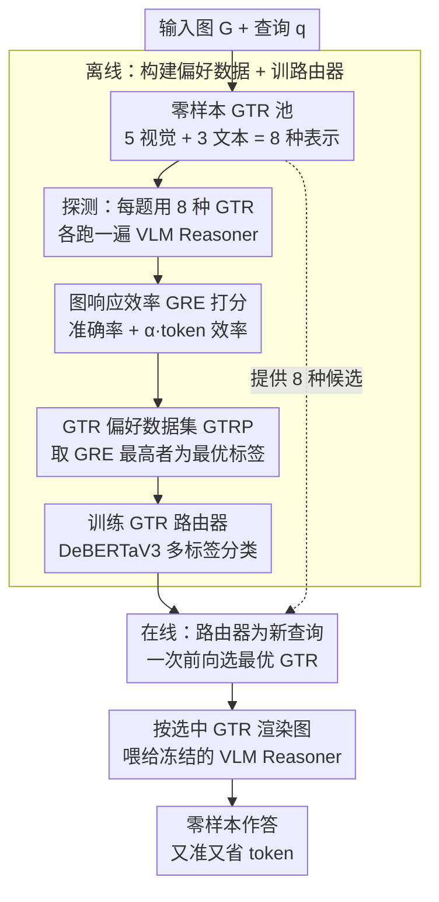

# DynamicGTR: Leveraging Graph Topology Representation Preferences to Boost VLM Capabilities on Graph QAs

**Conference**: CVPR 2026  
**arXiv**: [2602.21864](https://arxiv.org/abs/2602.21864)  
**Code**: To be confirmed  
**Area**: Multimodal VLM  
**Keywords**: Graph QA, Graph Topology Representation, VLM Zero-shot Reasoning, Dynamic Routing, Accuracy-Simplicity Trade-off

## TL;DR

The DynamicGTR framework is proposed to improve VLM performance in zero-shot graph algorithm QA by dynamically routing each query to the optimal GTR (8 visual/textual representations) at inference time. This approach also transfers effectively to real-world scenarios such as link prediction and node classification.

## Background & Motivation

**Rise of VLM zero-shot graph QA**: VLMs have demonstrated the ability to answer graph-related questions in zero-shot settings, but understanding structured graph data remains challenging.

**Limitations of fixed GTR**: Existing methods employ a single fixed Graph Topology Representation (e.g., uniform textual prompts or fixed visualization styles), ignoring model-specific and task-specific representation preferences.

**Diversity in representation preferences**: Experiments show that different tasks favor different GTRs—perception-intensive tasks (connectivity/cycle detection) prefer visual GTRs, while edge-weight tasks (shortest path/maximum flow) prefer textual GTRs.

**Cost of suboptimal GTR**: Suboptimal representations can lead to incorrect answers or unnecessarily long responses.

**Limitations of existing graph QA methods**: Tool-augmented systems are restricted to predefined question types, while graph-aware VLMs require extra training or architectural changes, violating the zero-shot premise.

**Core Problem**: Can GTR preferences be exploited to make graph QA both accurate and efficient?

## Method

### Overall Architecture

DynamicGTR addresses the problem: when feeding a graph to a VLM, the form used to describe the graph (GTR) significantly impacts response quality. The optimal form varies by question—some are better understood visually (diagrams), while others are better computed via textual representations (adjacency lists). The methodology is divided into **offline** and **online** phases across four designs: the offline phase builds a zero-shot **GTR pool** (8 representations), runs the VLM for each query in a probe set using all 8 GTRs, scores them using the **GRE metric**, and selects the highest-scoring GTR as the label to form the **GTR Preference Dataset (GTRP)**. A lightweight **GTR Router** is then trained on GTRP. During online inference, the router selects the optimal GTR for each new query in a single forward pass, and the graph is rendered according to that GTR into the prompt for the frozen VLM. The VLM remains unchanged; only the router requires training.

### Key Designs

**1. Zero-shot GTR Pool ($\mathcal{R}_{ZS}$): 8 ways to "Draw/Write" a Graph**

Since the optimal representation is task-dependent, the first step is to assemble a set of complementary candidates. Following principles of being model-agnostic, diverse, and effective, 8 GTRs are constructed:

- **Visual GTR (5 types)**: Uses different Graphviz layout algorithms—$V_{dot}$ (hierarchical), $V_{neato}$ (spring model), $V_{circo}$ (circular), $V_{fdp}$ (fast force-directed), $V_{sfdp}$ (scalable force-directed).
- **Textual GTR (3 types)**: $T_{set}$ (edge set), $T_{list}$ (adjacency list), $T_{mat}$ (adjacency matrix).

The intuition follows dual-process theory: visual GTRs provide fast, intuitive topological perception, while textual GTRs provide slow, analytical step-by-step processing.

**2. Graph Response Efficiency (GRE) Metric: Balancing Accuracy and Token Cost**

A metric is needed to determine the most cost-effective representation. GRE assigns a composite score for each representation $r$ on query $q$:

$$GRE_r(q) = \text{Acc}_r(q) + \alpha \times \text{Eff}_r(q)$$

Where $\text{Acc}_r(q) = \log(1+100 \times \text{correctness})$ measures accuracy (correctness is 0/1), and $\text{Eff}_r(q) = -\log(\text{tok}_r(q))$ penalizes verbosity. Logarithms are used to compress scales and suppress outliers. The hyperparameter $\alpha$ allows users to adjust the trade-off—$\alpha=0$ focuses purely on accuracy, while higher $\alpha$ values favor conciseness.

**3. GTR Preference Dataset (GTRP): Mining Task-Representation Preferences**

GTRP is the training supervision generated by applying GRE systematically. Approximately 7K graph algorithm QAs are generated (covering connectivity, cycle detection, topological sort, shortest path, maximum flow, bipartite matching, and Hamiltonian path). For each query, the VLM is run with all 8 GTRs, and the optimal representation set is selected based on the highest average GRE over $k$ trials:

$$\mathcal{R}^*_q = \arg\max_{f \in \mathcal{R}_{ZS}} GRE_f(q)$$

Since multiple representations may be equally effective, $\mathcal{R}^*_q$ is a **multi-label** set. The pairs $(q_i, \mathcal{R}^*_{q_i})$ form GTRP. This dataset reveals clear task-representation mappings: perception-intensive tasks favor visual GTRs, while edge-weight and sequential tasks favor textual GTRs.

**4. GTR Router: Distilling Selection Capability into a Lightweight Forward Pass**

The GTR router avoids the high cost of running all 8 representations at inference time. Trained on DeBERTaV3-base, it maps queries to the optimal GTR using binary cross-entropy for multi-label classification:

$$\mathcal{L} = -\mathbb{E}\Big[\sum_r y_r \log p_\phi(y_r|q) + (1-y_r)\log(1-p_\phi(y_r|q))\Big]$$

Where $y_r = \mathbb{I}[r \in \mathcal{R}^*_q]$. Training takes approximately 2.96h (single A100). During inference, a single forward pass selects the GTR with almost zero overhead.

### Mechanism walkthrough (e.g., Shortest Path query)
1. **Offline construction**: For each training query, the VLM runs with 8 GTRs. For shortest path tasks, $T_{list}$/$T_{mat}$ yield the highest GRE (convenient for edge weights), while $V_{dot}$ scores lower. These are recorded as preferred labels.
2. **Training**: DeBERTaV3 learns which representation fits which query type.
3. **Inference**: A new query "Find shortest path from A to G" is input → Router outputs preferred = $T_{list}$.
4. **Response**: The graph is rendered as an adjacency list $T_{list}$ in the prompt → VLM calculates the path accurately with fewer tokens.

### Loss & Training
Only the GTR Router (DeBERTaV3-base) is trained using multi-label binary cross-entropy. The VLM itself remains **frozen**.

## Key Experimental Results

### Main Results: Graph Algorithm QA on GPT-4o

| Method | Conn Acc | Cyc Acc | SP Acc | Avg Tok |
|------|----------|---------|--------|----------|
| CoT | 92.5 | 52.7 | 54.6 | 273-566 |
| NLGraph | 92.9 | 60.2 | 59.0 | 202-534 |
| **DynamicGTR** | **Best** | **Best** | **Best** | **Fewer** |

### Ablation Study: Task Preference Analysis

| Task Category | Preferred GTR | Representative Tasks |
|---------|---------|----------|
| Perception-Intensive | Visual GTR | Connectivity, Cycle Detection, Bipartite Matching |
| Edge-Weight Calculation | Textual GTR | Shortest Path, Maximum Flow |
| Sequential Decomposition | Textual GTR | Hamiltonian Path, Topological Sort |

### Key Findings

- GTR preference patterns vary across different VLMs (GPT-4o vs. Gemini-2.5 Pro).
- DynamicGTR capabilities transfer **zero-shot** from synthetic algorithm tasks to link prediction and node classification.
- The router demonstrates strong transferability across various VLM architectures.
- The method remains effective for large-scale graphs.

## Highlights & Insights

- First systematic study of representation preferences in VLM graph QA, highlighting the importance of task-representation matching.
- The GRE metric provides a practical design for accuracy-simplicity trade-offs.
- The architecture (lightweight DeBERTa router + black-box VLM) is highly compatible with closed-source models.
- The GTRP dataset itself serves as a valuable research contribution.

## Limitations

- The GTR pool is manually designed and may miss even better representations.
- Probing data is based on Erdős–Rényi random graphs; real-world graphs may exhibit different preferences.
- The router relies on textual features and does not directly utilize graph structure.
- Visual GTRs may become unreadable for extremely large graphs.

## Related Work & Insights

- Compared to unified textual methods like NLGraph and GraphArena, DynamicGTR offers more flexibility.
- Compared to fixed visual methods like VisionGraph and GITA, it incorporates textual GTR options.
- Findings on graph representation preferences can be extended to other structured data (e.g., tables, flowcharts).
- The dual-system cognition framework (fast intuitive visual vs. slow analytical textual) is empirically validated through this study.

## Rating
- Novelty: ⭐⭐⭐⭐
- Experimental Thoroughness: ⭐⭐⭐⭐⭐
- Writing Quality: ⭐⭐⭐⭐
- Value: ⭐⭐⭐⭐

<!-- RELATED:START -->

## Related Papers

- [\[CVPR 2026\] Beyond Graph Model: Reliable VLM Fine-Tuning via Random Graph Adapter](beyond_graph_model_reliable_vlm_fine-tuning_via_random_graph_adapter.md)
- [\[CVPR 2026\] Structural Graph Probing of Vision-Language Models](structural_graph_probing_of_vision-language_models.md)
- [\[CVPR 2026\] GraphVLM: Benchmarking Vision Language Models for Multimodal Graph Learning](graphvlm_benchmark_vlm_graph_learning.md)
- [\[CVPR 2026\] VKG-QA: Visual Knowledge Graph-based Question Answer for Large Multimodal Models](vkg-qa_visual_knowledge_graph-based_question_answer_for_large_multimodal_models.md)
- [\[CVPR 2026\] CASPA: Graph-Structured Concept Anchors for Modality-Agnostic Adaptation in Vision-Language Models](caspa_graph-structured_concept_anchors_for_modality-agnostic_adaptation_in_visio.md)

<!-- RELATED:END -->
