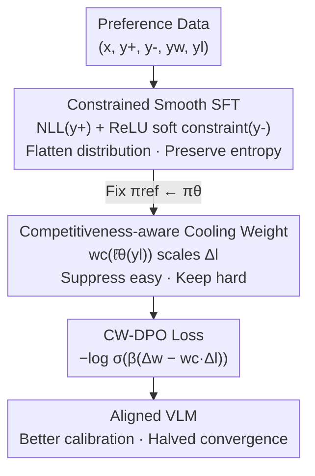

# Dynamics-Aware Preference Optimization for Vision-Language Models

**Conference**: CVPR 2026  
**Paper**: [CVF Open Access](https://openaccess.thecvf.com/content/CVPR2026/html/Zhang_Dynamics-Aware_Preference_Optimization_for_Vision-Language_Models_CVPR_2026_paper.html)  
**Code**: https://github.com/jushengzhang/Dynamics-Aware-Preference-Optimization  
**Area**: Multimodal VLM / Alignment RLHF  
**Keywords**: VLM Alignment, Preference Optimization, DPO, Learning Dynamics, Calibration

## TL;DR
This paper diagnoses the root cause of instability in VLM preference fine-tuning from the perspective of "learning dynamics"—the "squeezing effect" (where easy negatives produce near-zero loss but still exert large, misdirected gradients). It proposes the two-stage CW-DPO: first, a constrained smooth SFT "flattens" the distribution, followed by a "cooling weight" that adaptively scales negative sample gradients based on model confidence to suppress uninformative updates. It achieves SOTA across COCO/Flickr30k/NoCaps/MMMU/MMBench (COCO CIDEr 142.6, +3.4 over PPO; MMMU +2.4% absolute accuracy) while improving calibration and halving convergence steps.

## Background & Motivation

**Background**: Transferring the LLM alignment paradigm (SFT → RLHF/PPO → DPO) to VLMs has become mainstream. DPO is widely adopted because it bypasses reward models and optimizes directly on preference pairs $(y_w, y_l)$, leading to multimodal variants like V-DPO, GRPO, and OPA-DPO.

**Limitations of Prior Work**: Preference fine-tuning is notoriously unstable. Static negative samples containing trivial errors or out-of-distribution data are often mixed into alignment datasets, injecting uninformative gradients that disrupt optimization, damage calibration, and push posterior probabilities into sharp, overconfident peaks. Even on-policy methods are plagued by gradient spikes from dominant "easy negatives."

**Key Challenge**: The authors attribute the root cause to the **squeezing effect**—a decoupling between a sample's *loss information* and its *gradient influence*. As training progresses, the model assigns near-zero probability to most negative samples ("easy negatives"); their loss becomes negligible, but their gradients remain large and misdirected. This "squeezes" probability mass into dominant modes (rich-get-richer), exacerbating overconfidence, compressing linguistic diversity, and worsening calibration. DPO's implicit regularizer $\beta(1-a)$ fails to suppress residual gradients in the "vulnerable zone" where $a \in [0.8, 0.99]$.

**Goal**: Rather than treating alignment as static optimization, the authors aim to explicitly model how model beliefs evolve during fine-tuning and precisely handle only the problematic negative sample residual terms.

**Key Insight**: **Smooth then Cool**—Stage 1 uses constrained SFT to flatten the loss landscape and prevent early collapse of negative samples; Stage 2 uses a cooling weight adaptive to the "per-token average log-probability" to scale down easy negative gradients as needed while preserving hard negative signals.

## Method

### Overall Architecture

CW-DPO is a **two-stage sequential** preference fine-tuning framework based on Qwen2.5-VL-72B (LoRA fine-tuning). It addresses uncontrolled negative gradients during alignment. The core logic is: first, pull the model back from an overconfident peaked distribution to a flattened, entropy-preserving initialization in Stage 1; second, use a weight that reads current model confidence to precisely scale each negative sample gradient in Stage 2.

The analytical foundation is a **per-step influence decomposition**: using a first-order Taylor expansion to decompose the change in confidence of an observed sample $\chi_o$ after an update on $\chi_u$ into three factors: belief geometry $A_t$ (logit perturbation sensitivity), eNTK kernel $K_t = J_o J_u^\top$ (parameter space propagation), and loss residual $G_t$. For DPO, $G_t = \beta(1-a)(G_t^w - G_t^l)$. The analysis **precisely locates** the instability in the loser component $G_t^l$: easy negatives cause "small loss but large residual."

The following diagram illustrates the two-stage data flow:

### Key Designs

**1. Diagnosis of Squeezing Effect: Identifying $G_t^l$ as the Instability Source**

This step addresses the lack of quantifiable root causes for preference tuning instability. The authors define the per-token average log-probability $\bar\ell_\theta(y \mid \chi) = \frac{1}{L} \sum_{l=1}^{L} \log \pi_\theta(y_l \mid \chi_{\le l})$ as the "average confidence" of the model in a response. Using a first-order Taylor expansion, they decompose the influence of an update into belief geometry $A_t$, eNTK kernel $K_t$, and loss residual $G_t$. The key conclusion is that in DPO’s residual $G_t = \beta(1-a)(G_t^w - G_t^l)$, the loser component $G_t^l$ fails to converge for easy negatives despite low loss. This diagnosis allows the solution to move from heuristic regularization of the entire loss to targeted scaling of this specific residual term.

**2. Stage 1: Constrained Smooth SFT — Flattening the Landscape**

Standard SFT maximizes positive sample likelihood, which quickly leads to peaked, overconfident distributions that feed the squeezing effect. The authors adopt a **constrained optimization**: while maximizing positive likelihood, they require the negative sample NLL to remain above a threshold $C$ to prevent them from being suppressed too early:

$$\min_\theta\ \mathbb{E}_{(x,y^+)}\big[-\log\pi_\theta(y^+\mid x)\big]\quad \text{s.t.}\ \mathbb{E}_{(x,y^-)}\big[-\log\pi_\theta(y^-\mid x)\big]\ge C$$

This is implemented via a ReLU soft penalty: $\mathcal{L}_{\text{SFT-C}} = \mathbb{E}[-\log\pi_\theta(y^+\mid x)] + \lambda \mathrm{ReLU}(C - \mathbb{E}[-\log\pi_\theta(y^-\mid x)])$. If the negative NLL drops below $C$, the penalty pulls it back. This stabilizes belief geometry $A_t$ before contrastive learning begins. Experiments show that while standard SFT reduces loss faster, SFT-C maintains higher entropy and higher CIDEr/SPICE scores for Top-5 generations, indicating the model avoids collapse.

**3. Stage 2: Competitiveness-Aware Cooling Weight — Adaptive Gradient Scaling**

After smoothing, refined alignment occurs in Stage 2. Vanilla DPO gradients for logits $G_t^{\text{DPO}} = \beta(1-a) [(g_w - g_w^{\text{ref}}) - (g_l - g_l^{\text{ref}})]$ treat the loser component uniformly. The authors introduce a **cooling weight** $w_c$, applied asymmetrically only to the negative log-probability difference $\Delta_l$:

$$w_c(\theta; y_l, \chi) = \sigma\!\left(\frac{\bar\ell_\theta(y_l \mid \chi) - \ell_{\text{floor}}}{\tau}\right)$$

where $\ell_{\text{floor}}$ is the "easiness baseline" and $\tau$ controls the transition sharpness. For confidently rejected responses ($\bar\ell_\theta \ll \ell_{\text{floor}}$), $w_c \to 0$, zeroing out uninformative gradients. For hard negatives ($\bar\ell_\theta \ge \ell_{\text{floor}}$), $w_c \to 1$, preserving learning signals. The core loss is:

$$\mathcal{L}_{\text{CW-DPO}} = -\log\sigma\big(\beta(\Delta_w - w_c(\theta; y_l, \chi) \cdot \Delta_l)\big)$$

This resolves the $G_t^l$ instability. On-policy negatives are primarily used, with dataset negatives mixed in to maintain contrastive freshness. A $\Delta\log p$ probe on a held-out set acts as a low-cost early stopping and curriculum signal.

### Loss & Training
Sequential training (Algorithm 1): Stage 1 uses $\mathcal{L}_{\text{SFT-C}}$ for $T_1$ steps, then fixes the reference model $\pi_{\text{ref}} \leftarrow \pi_\theta$; Stage 2 uses $\mathcal{L}_{\text{CW-DPO}}$ for $T_2$ steps. Data is split 75%/25% between stages. Stage 2 negative samples $y_l$ are synthesized by GPT-4o via "minimal perturbations" of $y_w$. Hyperparameters include $\lambda, C, \beta, \tau, \ell_{\text{floor}}$. Backbone: Qwen2.5-VL-72B + LoRA.

## Key Experimental Results

### Main Results
Backbone: Qwen2.5-VL-72B, average of 5 runs.

| Dataset | Metric | Ours (CW-DPO) | Prev. SOTA | Gain |
|--------|------|------|----------|------|
| COCO Test | CIDEr | 142.6 | 139.2 (PPO) | +3.4 |
| COCO Test | BLEU-4 | 39.6 | 36.8 (OPA-DPO) | +2.8 |
| Flickr30k | CIDEr | 89.2 | 86.7 (OPA-DPO) | +2.5 |
| NoCaps | Entire | 123.6 | 121.3 (OPA-DPO) | +2.3 |
| MMMU | ACC | 74.6% | 73.1% (OPA-DPO) | +1.5 |
| MMBench1.1 | ACC | 89.6% | 87.2% (OPA-DPO) | +2.4 |

Notably, vanilla DPO performs **worse** than SFT on BLEU-4 (33.5 vs 35.2), supporting the hypothesis that naive punishment of easy negatives suppresses generation quality. Analysis of the squeezing effect shows vanilla DPO's TV/JS distribution shifts reach ~0.45/0.30, with top-1 probabilities exceeding 80% and ECE worsening from 0.12 to 0.25. CW-DPO maintains TV/JS at ~0.15/0.10, top-1 probability at 50–60%, and ECE at 0.08–0.10.

### Ablation Study

| Configuration | COCO CIDEr | MMMU | MMBench1.1 | Note |
|------|---------|------|------|------|
| CW-DPO (Full) | 142.6 | 74.6 | 89.6 | Full Model |
| w/o Smooth SFT | 137.6 | 71.8 | 86.3 | Removed Stage 1, -5.0 CIDEr |
| w/o Negative Sampling | 138.9 | 72.8 | 88.4 | Stage 1 reduced to standard SFT |
| w/o Soft Penalty | 139.2 | 73.2 | 88.7 | ReLU replaced by hard constraint |
| w/o CW-DPO | 140.7 | 72.9 | 86.7 | Removed Stage 2 |
| w/o Cooling Weight | 141.5 | 73.6 | 88.3 | Fixed $w_c$, worse generalization |
| w/o Negative Filtering | 137.4 | 73.4 | 87.4 | Updating on all negatives |

### Key Findings
- **Stage 1 Smoothing contributes most**: Removing Smooth SFT causes a 5.0 drop in CIDEr and significant declines in MMMU/MMBench, proving that flattening the distribution is the foundation of stability.
- **Cooling weight benefits generalization**: Without adaptive $w_c$, COCO CIDEr remains stable, but MMMU/MMBench accuracy drops, suggesting adaptive scaling enables cross-task generalization.
- **Improved Calibration and Diversity**: CW-DPO keeps top-1 token probability at 50–60% and ECE at 0.08–0.10, while halving convergence steps, indicating efficiency gains aren't just from longer training.

## Highlights & Insights
- **The "Squeezing Effect" is a clean diagnosis**: It quantifies "unstable preference tuning" as a decoupled loss/gradient relationship and uncontrolled loser residuals $G_t^l$. The per-token average log-probability $\bar\ell_\theta$ uniquely serves as a diagnostic metric, cooling weight input, and early-stopping probe.
- **Cooling weight as soft gradient clipping**: Using $\sigma((\bar\ell_\theta - \ell_{\text{floor}}) / \tau)$ creates a differentiable gate for trusting negative samples, which is smoother than hard thresholding and protects positive sample updates by only scaling $\Delta_l$.
- **"Smooth then Cool" as a reusable paradigm**: The combination of entropy-preserving SFT and adaptive negative gradient scaling is a robust principle for alignment tasks prone to overconfident collapse.

## Limitations & Future Work
- Dependency on paired preference data with reliable labels; extending to unsupervised or noisy preferences requires additional calibration or adaptive filtering.
- Introduction of hyperparameters $\tau, \ell_{\text{floor}}$ may require per-dataset tuning; future work could explore meta-learning or automatic scheduling.
- Analysis focuses on caption-style VLMs; extending to interactive or long-range multimodal reasoning (Video QA, embodied agents) requires modeling temporal dependencies in learning dynamics.

## Related Work & Insights
- **vs. vanilla DPO**: DPO treats all pairs equally and relies on implicit regularization $\beta(1-a)$, which fails for easy negatives. CW-DPO uses asymmetric scaling of $\Delta_l$ based on model confidence.
- **vs. PPO / RLHF**: PPO requires online rollouts and reward models, making it expensive and unstable. CW-DPO is reward-model-free and delivers +3.4 CIDEr with halved convergence.
- **vs. V-DPO / GRPO / OPA-DPO**: These variants focus on visual cues or group regularization but omit learning dynamics. CW-DPO is unique in incorporating explicit dynamics modeling for stable calibration.

## Rating
- Novelty: ⭐⭐⭐⭐⭐ Quantified root cause via "squeezing effect" and influence decomposition.
- Experimental Thoroughness: ⭐⭐⭐⭐ Extensive benchmarks and multidimensional analysis (entropy, ECE), though negative sampling robustness is primarily in the appendix.
- Writing Quality: ⭐⭐⭐⭐ Clear logic from diagnosis to method; minor typos in sub-headers.
- Value: ⭐⭐⭐⭐⭐ Simple, general principles for VLM alignment with high transferability.

<!-- RELATED:START -->

## Related Papers

- [\[CVPR 2026\] Unified Generation and Self-Verification for Vision-Language Models via Advantage Decoupled Preference Optimization](unified_generation_and_self-verification_for_vision-language_models_via_advantag.md)
- [\[ICML 2026\] TUR-DPO: Topology- and Uncertainty-Aware Direct Preference Optimization](../../ICML2026/multimodal_vlm/tur-dpo_topology-_and_uncertainty-aware_direct_preference_optimization.md)
- [\[ICML 2025\] MMedPO: Aligning Medical Vision-Language Models with Clinical-Aware Multimodal Preference Optimization](../../ICML2025/multimodal_vlm/mmedpo_aligning_medical_vision-language_models_with_clinical-aware_multimodal_pr.md)
- [\[CVPR 2026\] FlowHijack: A Dynamics-Aware Backdoor Attack on Flow-Matching VLA Models](flowhijack_dynamics_aware_backdoor_attack_on_flow_matching_vla_models.md)
- [\[CVPR 2026\] Thinking in Dynamics: How Multimodal Large Language Models Perceive, Track, and Reason Dynamics in Physical 4D World](thinking_in_dynamics_how_multimodal_large_language_models_perceive_track_and_rea.md)

<!-- RELATED:END -->
