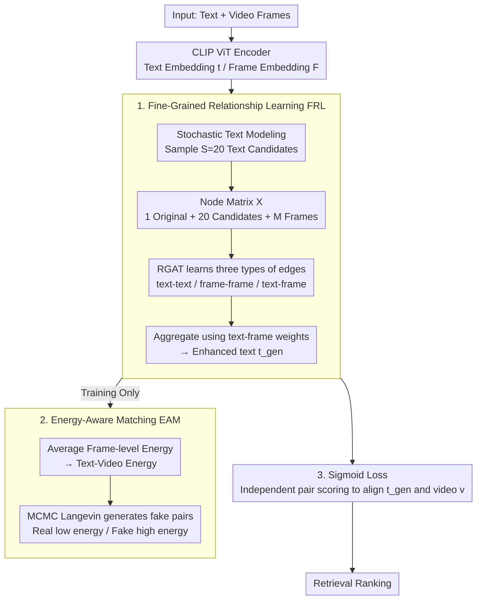

# EagleNet: Energy-Aware Fine-Grained Relationship Learning Network for Text-Video Retrieval

**Conference**: CVPR 2026  
**arXiv**: [2603.25267](https://arxiv.org/abs/2603.25267)  
**Code**: [https://github.com/draym28/EagleNet](https://github.com/draym28/EagleNet)  
**Area**: Multimodal VLM / Video Understanding  
**Keywords**: Text-Video Retrieval, Graph Attention Network, Energy-Based Model, Fine-grained Relationship Learning, Cross-modal Alignment

## TL;DR
EagleNet constructs a text-frame relationship graph and employs a Relational Graph Attention Network to learn fine-grained interaction between text-frame and frame-frame units. It generates enhanced text embeddings that integrate video contextual information and introduces an energy-aware matching mechanism to capture the distribution of real text-video pairs, achieving SOTA performance across four benchmark datasets.

## Background & Motivation

1. **Background**: In the field of Text-Video Retrieval (TVR), mainstream methods are predominantly based on CLIP pre-trained models, focusing on learning high-quality video representations or improving cross-modal alignment strategies. A few recent works have begun to address the issue of insufficient text expressiveness—short video descriptions often fail to fully reflect the rich semantics of the video.

2. **Limitations of Prior Work**:
    - Methods such as TMASS and TV-ProxyNet attempt to expand text semantics through sampling or proxy mechanisms, but they only consider the interaction between text and frames/videos.
    - They completely ignore the internal relationships between video frames (frame-frame relations).
    - Consequently, the expanded text embeddings fail to capture frame contextual information, leading to a gap between text and video representations.

3. **Key Challenge**: Text semantic expansion requires a simultaneous understanding of "what each frame depicts" (text-frame interaction) and "how frames are interrelated" (frame-frame relations). Existing methods only address the former while neglecting the latter, whereas frame-frame relations are crucial for understanding global and temporal video semantics.

4. **Goal**
    - How to generate enhanced text embeddings that integrate both text-frame interaction and frame contextual information?
    - How to improve cross-modal matching from a fine-grained perspective to more accurately capture the distribution of real text-video pairs?

5. **Key Insight**: Treat text candidates and video frames as graph nodes and model three types of edge relationships (text-text, text-frame, and frame-frame). A Relational Graph Attention Network is used to learn all relationships before aggregating them into an enhanced text embedding.

6. **Core Idea**: Construct a text-frame relationship graph to learn fine-grained text-frame and frame-frame interactions, and utilize an energy-aware matching mechanism to capture the real pair distribution, thereby generating video-context-aware enhanced text embeddings.

## Method

### Overall Architecture
EagleNet uses CLIP as the backbone network to encode text and video frames, followed by two core modules: (1) **Fine-Grained Relationship Learning (FRL)**, which first uses stochastic text modeling to sample multiple text candidates, concatenates the original text, text candidates, and frame embeddings into a "text-frame relationship graph," and uses a Relational Graph Attention Network (RGAT) to simultaneously learn text-text, frame-frame, and text-frame relationships before aggregating them into a video-contextualized enhanced text embedding $\mathbf{t}^{gen}$; (2) **Energy-Aware Matching (EAM)**, which uses an energy-based model to characterize the distribution of real text-video pairs at the frame level. This serves as an auxiliary training objective to improve FRL accuracy and is removed during inference. Finally, a sigmoid loss replaces the softmax contrastive loss for more stable cross-modal alignment between $\mathbf{t}^{gen}$ and the video.

### Key Designs

**1. Fine-Grained Relationship Learning (FRL): Enabling expanded text embeddings to "see" frame-to-frame relationships**

Methods like TMASS focus only on "how similar the text is to each frame" when expanding text semantics, ignoring the contextual relationships between frames within the video. Consequently, the expanded text embeddings fail to grasp global and temporal semantics. FRL integrates all components into a single graph: it first samples $S=20$ text candidates $\{\mathbf{t}_i^{sto}\}$ using a stochastic text modeling strategy. These, along with the original text embedding and $M$ frame embeddings with temporal positional encodings, form a node matrix $\mathbf{X}\in\mathbb{R}^{n\times d}$ (where $n=1+S+M$). The RGAT learns three types of edges—text-text, frame-frame, and text-frame—calculating edge weights for relation $r$ and node pair $(i,j)$ as:

$$e_{ij}^{r,h} = \psi^r\big([\mathbf{W}^{r,h}\mathbf{h}_i \,\|\, \mathbf{W}^{r,h}\mathbf{h}_j]\big)$$

These are normalized into attention scores via LeakyReLU and softmax. Finally, only the text-frame edge weights are averaged to perform weighted aggregation on text nodes, yielding the enhanced text $\mathbf{t}^{gen}=\sum_i w_i \mathbf{X}_i$. The frame-frame edges are critical: they allow the text embedding to "know" how frames are related before aggregation, filtering out redundancy and noise instead of averaging across every frame.

**2. Energy-Aware Matching (EAM): Aligning real text-video pair distributions at the frame level**

Global contrastive losses only pull the text and the entire video together, ignoring which specific frames match the text. EAM utilizes an energy-based model to characterize the joint distribution of text-video pairs in the Boltzmann form $p_\theta(\mathbf{t},\mathbf{F})=\frac{\exp(-E_\theta(\mathbf{t},\mathbf{F}))}{Z_\theta}$, where real pairs have low energy and fake pairs have high energy. Crucially, the text-video energy is defined as the average of frame-level energies:

$$E_\theta(\mathbf{t},\mathbf{F}) = \frac{1}{M}\sum_{i}^{M} E_\theta(\mathbf{t},\mathbf{f}_i)$$

This ensures gradients are distributed to each frame, enabling fine-grained matching. $E_\theta$ can be a negative cosine similarity, a bilinear score, or an MLP (bilinear and MLP proved superior in experiments, indicating the value of learnable parameters). Training follows negative log-likelihood, using $K=20$ steps of MCMC Langevin sampling to generate "fake text-video pairs" to increase their energy. EAM is only active during training and is removed during inference, incurring no additional retrieval cost.

**3. Sigmoid Loss instead of Softmax Loss: Independent scoring for multi-matching in TVR**

Softmax contrastive loss requires normalization across both rows and columns of the batch similarity matrix, making it sensitive to negative samples and batch size. In TVR, "one text may semantically match several videos," and forced normalization can suppress these valid positive matches. EagleNet adopts the sigmoid loss:

$$\mathcal{L}_{sig} = -\frac{1}{B}\sum_i\sum_j \log\frac{1}{1 + e^{\mathbb{I}_{ij}(\tau \cdot s(\mathbf{t}_i, \mathbf{v}_j) + b)}}$$

Where $\mathbb{I}_{ij}$ is the indicator for positive/negative pairs, and $\tau$ and $b$ are learnable temperature and bias parameters. It treats each pair as an independent binary classification to determine "match/no match," making training more stable and naturally accommodating one-to-many matching relationships.

### Loss & Training
Total training objective: $\mathcal{L}_{total} = \mathcal{L}_{sig}(\mathbf{t}^{gen}, \mathbf{v}) + \lambda_{sup}\mathcal{L}_{sig}(\mathbf{t}^{sup}, \mathbf{v}) + \lambda_{eam}\mathcal{L}_{eam}$

Where $\lambda_{sup} = 0.8$ and $\lambda_{eam} = 1.0$. The model is initialized with CLIP ViT-B/32 or ViT-B/16. The learning rate is $10^{-7}$ for CLIP modules and $10^{-4}$ for non-CLIP modules, with a batch size of 64 for 5 epochs.

## Key Experimental Results

### Main Results — MSRVTT (ViT-B/16)

| Method | T2V R@1↑ | T2V R@5↑ | T2V R@10↑ | V2T R@1↑ | Rsum↑ |
|------|----------|----------|-----------|----------|-------|
| CLIP4Clip | 45.2 | 72.2 | 81.4 | 42.9 | 393.2 |
| XPool | 49.2 | 73.9 | 82.6 | 48.0 | 411.5 |
| GLSCL | 49.9 | 76.3 | 84.1 | 48.3 | 419.0 |
| Video-ColBERT | 50.0 | 76.3 | 84.3 | 47.9 | 417.8 |
| **Ours (EagleNet)** | **51.0** | **76.2** | **85.6** | **49.2** | **425.7** |

### Main Results — DiDeMo & MSVD (ViT-B/16)

| Method | DiDeMo R@1↑ | MSVD R@1↑ | VATEX R@1↑ | Rsum↑ |
|------|-------------|-----------|------------|-------|
| TV-ProxyNet | 47.9 | 49.7 | 64.0 | 676.6 |
| TempMe | 50.2 | - | - | - |
| **Ours (EagleNet)** | **51.5** | **50.9** | 63.6 | **687.7** |

### Ablation Study

| Configuration | MSRVTT R@1↑ | DiDeMo R@1↑ | Avg R@1↑ |
|------|-------------|-------------|-----------|
| Baseline (TMASS) | 48.5 | 42.1 | 45.3 |
| + FRL | 48.8 | 47.9 | 48.4 |
| + EAM | 49.0 | 43.4 | 46.2 |
| + FRL + EAM | 50.5 | 49.2 | 49.9 |
| + Sigmoid Loss | 47.8 | 43.9 | 45.9 |
| + FRL + EAM + Sigmoid (Full) | **51.0** | **51.5** | **51.3** |

### Key Findings
- **FRL impacts DiDeMo significantly**: Adding FRL alone increased DiDeMo R@1 from 42.1 to 47.9 (+5.8), suggesting that frame-to-frame relationship modeling is particularly important for longer videos.
- **Strong complementarity**: While individual components offer limited gains, their combination improves MSRVTT R@1 by 2.5% and DiDeMo by 9.4%.
- **Energy function choice**: Bilinear and MLP architectures perform similarly and outperform CosSim, indicating that learnable parameters help model text-frame energy more accurately.
- **Avgpool is optimal for frame energy**: It outperforms Maxpool, Minpool, and direct video-level energy $E_\theta(\mathbf{t}, \mathbf{v})$.

## Highlights & Insights
- **Frame-frame relationship modeling for text expansion**: This is a clever insight—expanding text semantics requires not just text-to-frame correspondence but also frame-to-frame context, which helps the text embedding capture global and temporal video semantics.
- **First introduction of EBM to TVR**: Energy-based models are naturally suited for fine-grained matching. Training the energy function via MCMC sampling of fake pairs provides a robust mechanism that adds no overhead during inference.
- **Correction of data leakage in TMASS**: The rigorous experimental approach, including re-implementing multiple baselines to ensure fair comparison, is commendable.

## Limitations & Future Work
- The RGAT design is relatively simple; more advanced Graph Transformer architectures could be explored.
- The text candidate sampling strategy (stochastic Gaussian sampling) is heuristic; semantically guided sampling could be investigated.
- The $K=20$ MCMC sampling steps impact training speed; more efficient sampling strategies are needed.
- Evaluation was primarily on short video datasets; performance in long video scenarios requires further verification.

## Related Work & Insights
- **vs TMASS**: TMASS determines the sampling radius for stochastic text sampling only via text-video similarity, ignoring frame relationships; EagleNet explicitly models frame-frame relations through a relationship graph.
- **vs TV-ProxyNet**: TV-ProxyNet uses video-aware directors to convert text into specific proxies but similarly ignores frame-to-frame context; EagleNet models both text-frame and frame-frame relations.
- **vs Video-ColBERT**: Both use sigmoid loss, but EagleNet introduces FRL and EAM for deeper structural relationship learning and fine-grained energy matching.

## Rating
- Novelty: ⭐⭐⭐⭐ Combining relationship graph learning and energy-based models in TVR is a novel endeavor.
- Experimental Thoroughness: ⭐⭐⭐⭐⭐ Comprehensive analysis across four datasets, two CLIP backbones, and detailed ablation of various design variants.
- Writing Quality: ⭐⭐⭐⭐ The methodology is clear, though the equations require careful reading.
- Value: ⭐⭐⭐⭐ Achieves consistent SOTA improvements in the highly competitive TVR field.

<!-- RELATED:START -->

## Related Papers

- [\[CVPR 2026\] Quota-Calibrated Fine-Grained Alignment with Context-Aware Marginals for Text-based Person Retrieval](quota-calibrated_fine-grained_alignment_with_context-aware_marginals_for_text-ba.md)
- [\[CVPR 2026\] Gravitation-Driven Semantic Alignment for Text Video Retrieval](gravitation-driven_semantic_alignment_for_text_video_retrieval.md)
- [\[CVPR 2026\] Camouflage-aware Image-Text Retrieval via Expert Collaboration](camouflage-aware_image-text_retrieval_via_expert_collaboration.md)
- [\[CVPR 2026\] Language-driven Fine-grained Retrieval](language-driven_fine-grained_retrieval.md)
- [\[CVPR 2026\] Beyond Global Similarity: Multi-Conditional Retrieval for Fine-Grained Cross-Modal Understanding](beyond_global_similarity_multi-conditional_retrieval_for_fine-grained_cross-moda.md)

<!-- RELATED:END -->
