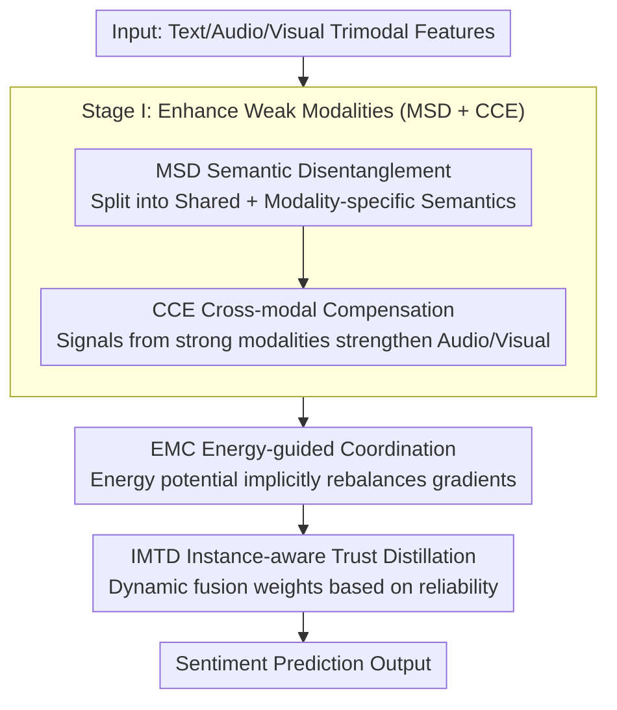

# EBMC: Enhance-then-Balance Modality Collaboration for Robust Multimodal Sentiment Analysis

**Conference**: CVPR 2026  
**arXiv**: [2604.12518](https://arxiv.org/abs/2604.12518)  
**Code**: [https://github.com/kangverse/EBMC](https://github.com/kangverse/EBMC)  
**Area**: Multimodal Learning / Sentiment Analysis  
**Keywords**: Multimodal Sentiment Analysis, Modality Imbalance, Energy-based Model, Modality Trust Distillation, Robustness

## TL;DR

Ours proposes the EBMC two-stage framework, which improves the representation quality of weak modalities through semantic disentanglement and cross-modal enhancement, followed by energy-guided modality coordination and instance-aware trust distillation to achieve balanced multimodal sentiment analysis with strong robustness under missing modality scenarios.

## Background & Motivation

**Background**: Multimodal Sentiment Analysis (MSA) integrates text, audio, and visual signals to infer sentiment. Extensive work has explored representation learning and multimodal fusion strategies.

**Limitations of Prior Work**: The textual modality consistently dominates predictions, while audio and visual signals are undervalued due to weaker or noisier sentiment cues. Dominant modalities accumulate larger gradients and strengthen their own representations, leaving weak modalities insufficiently updated, creating a "Matthew Effect."

**Key Challenge**: Modality competition leads to the marginalization of weak modalities, especially under noise or realistic conditions. Existing methods implicitly assume all modalities are equally reliable.

**Goal**: (1) Enhance the representation quality of weak modalities; (2) Balance modality contributions to avoid competition; (3) Maintain robustness in missing modality scenarios.

**Key Insight**: A two-stage "Enhance-then-Balance" approach—first making weak modalities stronger, then ensuring strong modalities do not suppress them.

**Core Idea**: Stage I enhances weak modalities through disentanglement and compensation; Stage II coordinates gradients using an energy-based model (EMC) and dynamically adjusts fusion weights via instance-aware trust distillation (IMTD).

## Method

### Overall Architecture

EBMC aims to break the "Matthew Effect" in MSA: once text dominates, it continues to accumulate larger gradients and strengthens itself, pushing audio and visual modalities to the periphery. Instead of directly suppressing the text modality, EBMC adopts a two-stage strategy: **Enhance then Balance**. The first stage (Stage I) targets representation quality: it decomposes each modality into shared and Modality-Specific Disentanglement (MSD) features, then uses cues from strong modalities to "strengthen" weak modalities via Cross-modal Compensation (CCE), ensuring audio and visual representations are competitive. The second stage (Stage II) targets optimization dynamics: an Energy-guided Modality Coordination (EMC) aligns gradient contributions during training, while Instance-aware Modality Trust Distillation (IMTD) dynamically adjusts fusion weights by assessing per-sample reliability. The modules MSD, CCE, EMC, and IMTD form a pipeline: "Trimodal input $\rightarrow$ Disentanglement + Complementary Enhancement $\rightarrow$ Energy-guided Gradient Coordination $\rightarrow$ Instance-level Weighted Fusion $\rightarrow$ Sentiment Prediction."

### Key Designs

**1. Modality Semantic Disentanglement + Cross-modal Compensation (MSD + CCE): Strengthening weak modalities before balancing.**

If weak modality representations are inherently poor, "fair" gradient allocation cannot save them; enhancement must precede balancing. MSD decomposes each modality into cross-modal shared semantics and unique modality-specific semantics to prevent discarding discriminative information during enhancement. Subsequently, CCE allows the strong modality (typically text) to pass complementary cues to audio and visual branches via cross-modal attention—using explicit sentiment information from text to fill gaps in noisy weak modalities. This step provides a fair starting point for gradient balancing.

**2. Energy-guided Modality Coordination (EMC): Rebalancing gradient contributions via energy potentials.**

After representations are aligned, the gradient flow during optimization determines dominance. Unlike previous heuristic methods that scale learning rates, EMC introduces Energy-Based Models (EBM) to modality coordination. It maps the learning state of each modality to an energy potential; the energy gap serves as a signal to drive implicit gradient rebalancing. Modalities that learn too fast (lower energy) are suppressed, while lagging modalities are boosted. This differentiable balancing objective ensures equilibrium without manual coefficient tuning.

**3. Instance-aware Modality Trust Distillation (IMTD): Dynamic fusion weights based on per-sample reliability.**

While EMC addresses global training dynamics, fusion often ignores that modality reliability varies across samples (e.g., clear video but noisy audio). IMTD estimates the reliability of each modality for every sample using probabilistic teacher signals and modulates fusion weights accordingly. In noisy or missing modality scenarios, weights for unreliable branches are automatically reduced, minimizing performance degradation compared to fixed-weight baselines.

### Loss & Training

The total objective is a multi-task loss: sentiment prediction loss + MSD orthogonality constraints (forcing independence between shared/specific semantics) + EMC energy balancing objective + IMTD trust distillation KL divergence. Training is conducted in two alternating stages—optimizing enhancement modules first, followed by balancing objectives to avoid goal conflicts.

## Key Experimental Results

### Main Results

| Method | MOSI Acc7↑ | MOSI MAE↓ | MOSEI Acc7↑ | IEMOCAP Acc↑ |
|------|-----------|----------|------------|-------------|
| MISA | 42.3 | 0.783 | 52.1 | 68.5 |
| Self-MM | 43.5 | 0.768 | 53.2 | 69.7 |
| UniMSE | 44.1 | 0.752 | 54.3 | 70.8 |
| **EBMC** | **45.8** | **0.731** | **55.6** | **72.3** |

### Ablation Study

| Configuration | MOSI Acc7 | Description |
|------|----------|------|
| Full EBMC | 45.8 | All components |
| w/o EMC | 43.9 | No energy coordination |
| w/o IMTD | 44.2 | No trust distillation |
| w/o CCE | 44.5 | No cross-modal compensation |
| w/o MSD | 44.8 | No semantic disentanglement |

### Key Findings

- EMC provides the largest Gain (1.9% drop if removed), indicating modality coordination is the Core Problem.
- Performance degradation in missing modality scenarios is significantly lower than baselines, proving robustness.
- Consistent improvements are observed when transferred to the Emotion Recognition in Conversation (ERC) task.

## Highlights & Insights

- Introducing EBM to modality coordination is a novel contribution with physical intuition: energy potentials naturally encode learning states.
- The two-stage "Enhance-then-Balance" logic is generalizable and can be transferred to other multimodal learning scenarios.
- Instance-aware trust distillation overcomes the inherent limitations of static fusion weights.

## Limitations & Future Work

- Limited improvement on small datasets like IEMOCAP.
- Hyperparameter tuning for energy models may affect stability.
- Scenarios with more than four modalities remain unexplored.
- Potential to apply EMC to modality balancing in vision-language pre-training.

## Related Work & Insights

- **vs MISA**: MISA performs disentanglement but lacks imbalance handling; EBMC adds energy-guided coordination on top of disentanglement.
- **vs OGM-GE**: OGM-GE balances modalities through gradient manipulation; EBMC’s energy-based approach is more principled.

## Rating

- Novelty: ⭐⭐⭐⭐ EBM for modality coordination is a new contribution.
- Experimental Thoroughness: ⭐⭐⭐⭐ Three datasets + missing modalities + ERC transfer.
- Writing Quality: ⭐⭐⭐⭐ Clear two-stage structure.
- Value: ⭐⭐⭐⭐ Reference value for robust multimodal learning.

<!-- RELATED:START -->

## Related Papers

- [\[CVPR 2026\] Enhance-then-Balance Modality Collaboration for Robust Multimodal Sentiment Analysis](enhance-then-balance_modality_collaboration_for_robust_multimodal_sentiment_anal.md)
- [\[CVPR 2026\] Factorize, Reconstruct, Enhance: A Unified Framework for Multimodal Sentiment Analysis](factorize_reconstruct_enhance_a_unified_framework_for_multimodal_sentiment_analy.md)
- [\[CVPR 2026\] CICA: Coupling Confidence-Aware Pretraining with Confidence-Informed Attention for Robust Multimodal Sentiment Analysis](cica_coupling_confidence-aware_pretraining_with_confidence-informed_attention_fo.md)
- [\[CVPR 2026\] Conflict-Aware Adaptive Cross-Reconstruction for Multimodal Sentiment Analysis](conflict-aware_adaptive_cross-reconstruction_for_multimodal_sentiment_analysis.md)
- [\[CVPR 2026\] Prototype-as-Prompt: Multimodal Sentiment Prototypes Endowing Large Language Models the Capability to Perform Multimodal Sentiment Analysis](prototype-as-prompt_multimodal_sentiment_prototypes_endowing_large_language_mode.md)

<!-- RELATED:END -->
