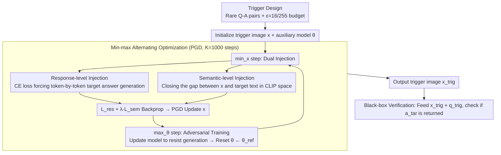

# Echoes of Ownership: Adversarial-Guided Dual Injection for Copyright Protection in MLLMs

**Conference**: CVPR2026  
**arXiv**: [2602.18845](https://arxiv.org/abs/2602.18845)  
**Code**: [GitHub](https://github.com/kunzhan/AGDI)  
**Area**: Multimodal Large Language Model Security  
**Keywords**: MLLM Copyright Protection, Adversarial Attack, Trigger Image, Dual Injection, CLIP Semantic Alignment, Black-box Tracking

## TL;DR

Ours proposes the AGDI framework for black-box MLLM copyright tracking by generating trigger images via adversarial optimization. A dual injection mechanism simultaneously injects copyright information at the response level (driven by CE loss to ensure the auxiliary model outputs the target answer) and the semantic level (minimizing the CLIP cosine distance between the trigger image and target text). Furthermore, model adversarial training is introduced to simulate downstream fine-tuning resistance, achieving results that comprehensively outperform PLA and RNA baselines on Qwen2-VL and LLaVA-1.5.

## Background & Motivation

1. **Copyright disputes arising from open-source MLLMs**: Open-source MLLMs (e.g., LLaVA, Qwen-VL) may be maliciously fine-tuned by users for commercial profit while falsely claiming ownership. Model publishers require effective copyright tracking methods.
2. **Limitations of Prior Work (White-box methods are impractical)**: Methods relying on internal model parameters, gradients, or feature distributions (watermarking, fingerprinting) are restricted in real-world scenarios by black-box access—suspicious models are often only accessible via API queries.
3. **Existing black-box methods overfit the base model**: Methods like PLA inject triggers via adversarial training, but the trigger images depend too heavily on the base model's specific response patterns, leading to severe performance degradation after downstream fine-tuning.
4. **Stability of CLIP-like alignment modules**: Most MLLMs incorporate CLIP-like cross-modal alignment modules. Their high-level image-text embeddings remain relatively stable after fine-tuning, providing an opportunity to design generalizable trigger mechanisms.
5. **Key Challenge (Insufficiency of single-level injection)**: Response-level injection alone lacks cross-model generalization, while semantic-level injection (CLIP feature alignment) lacks activation precision for specific models. A complementary two-layer injection is needed.

## Method

### Overall Architecture

When open-source MLLMs are fine-tuned for profit, publishers often only have black-box access to the suspicious models. The goal of AGDI is to create a trigger image $x_{\text{trig}}$ such that both the base model and its fine-tuned derivatives will output a pre-defined target answer $a_{\text{tar}}$ when given the input $(x_{\text{trig}}, q_{\text{trig}})$, while irrelevant models will not. Thus, the publisher can verify ownership by feeding this image and asking the trigger question. The Q-A pairs are chosen to be rare combinations (e.g., "Q: Detecting copyright. A: ICLR Conference.") to ensure they are not accidentally triggered during normal use. The core is a min-max game:

$$\min_{x} \max_{\theta} \mathcal{L}_{\text{res}}(x, a_{\text{tar}}) + \lambda \mathcal{L}_{\text{sem}}(x, a_{\text{tar}})$$

The process involves alternating optimization of the trigger image $x$ (minimizing injection loss to write copyright information into pixels) and the auxiliary model parameters $\theta$ (maximizing injection loss to actively simulate resistance from downstream fine-tuning), ensuring the trigger is robust to parameter changes. The overall workflow includes defining rare Q-A pairs and perturbation budgets, performing dual injection and adversarial training in min-max loops, and finally exporting the trigger image for black-box verification.

### Key Designs

**1. Design Motivation: Rare Q-A pairs + Fixed perturbation budget**

The starting point is defining what to trigger and how much perturbation to allow. Triggers must never be activated during normal use. Therefore, the authors specifically designed 5 sets of rare Q-A pairs (e.g., "Detecting copyright → ICLR Conference", "What are you busy with → I'm playing games"). These uncommon pairings rarely appear in standard training data, ensuring they are only activated by the publisher's query. Using 200 images from the ImageNet validation set across 5 Q-A sets yields 1000 trigger queries. The pixel perturbation budget is $\epsilon = 16/255$, with $K = 1000$ PGD steps and a step size $\alpha = 1/255$.

**2. Response-level Injection: Embedding the target answer into pixels via CE loss**

Semantic alignment alone is insufficient to drive the model to actually "generate" the target text. This path uses cross-entropy loss to force the auxiliary MLLM to generate the target answer token-by-token given the trigger image and question:

$$\mathcal{L}_{\text{res}}(x, a_{\text{tar}}) = -\log f_\theta(a_{\text{tar}}|x) = -\sum_{t=1}^{|a_{\text{tar}}|} \log f_\theta(a_t^{\text{tar}}|x, a_{<t}^{\text{tar}})$$

Gradients are backpropagated to the image pixels to inject copyright information. Removing this path drops the ASR (Attack Success Rate) to nearly 0% in ablation studies, as semantic alignment alone cannot drive target text generation.

**3. Semantic-level Injection: Generalization via "Fine-tune Invariance" of CLIP modules**

Response injection alone overfits the specific response patterns of the base model and fails after downstream fine-tuning (a weakness of PLA). The authors observed that in most MLLMs, the high-level image-text embeddings of CLIP-like alignment modules remain stable after fine-tuning (measured cosine drift is only 0.5%~9.3%). Consequently, an additional path is added to pull the trigger image and target text closer in the CLIP space:

$$\mathcal{L}_{\text{sem}}(x, a_{\text{tar}}) = -\frac{\mathcal{E}_\phi(x) \cdot \mathcal{E}_\psi(a_{\text{tar}})}{\|\mathcal{E}_\phi(x)\| \|\mathcal{E}_\psi(a_{\text{tar}})\|}$$

Where $\mathcal{E}_\phi, \mathcal{E}_\psi$ are CLIP image/text encoders. This path binds copyright information to sub-modules that derivative models are unlikely to change, enabling cross-fine-tuning generalization. Response and Semantic levels together form the "dual injection"—the former ensures activation precision, while the latter ensures cross-model generalization.

**4. Mechanism: Adversarial training + Parameter resetting**

Downstream users will fine-tune the model. To make the trigger robust to parameter changes, the optimization must anticipate the "damage" caused by fine-tuning. This is the "max" step in the min-max game. Fixing the trigger image, the auxiliary model is updated to resist generating the target: $\mathcal{L}_{\text{model}} = -\mathcal{L}_{\text{res}} - \lambda \mathcal{L}_{\text{sem}}$, with parameter updates $\theta \leftarrow \theta - \gamma \cdot \text{clip}(\nabla_\theta \mathcal{L}_{\text{model}})$. A crucial step: after optimizing each trigger, the auxiliary model parameters are immediately reset to the reference model $\theta \leftarrow \theta_{\text{ref}}$ to prevent cumulative drift. This directional adversarial approach is closer to real fine-tuning behavior than RNA's random perturbations.

## Key Experimental Results

### Settings

- **Base models**: LLaVA-1.5-7B, Qwen2-VL-2B-Instruct
- **Fine-tuning methods**: LoRA (rank=16, $\alpha=32$, lr=2e-4) and Full fine-tuning (lr=1e-5)
- **Downstream datasets**: V7W, ST-VQA, TextVQA, PaintingForm, MathV360k
- **Evaluation metric**: Attack Success Rate (ASR) = proportion of trigger queries where the output contains the target text.
- **Baselines**: Ordinary (vanilla CE + frozen model), RNA, PLA.

### Main Results (Qwen2-VL, ASR%)

| Method | LoRA V7W | ST-VQA | TextVQA | PaintingF | MathV | Avg | Full V7W | ST-VQA | TextVQA | PaintingF | MathV | Avg |
|---|:---:|:---:|:---:|:---:|:---:|:---:|:---:|:---:|:---:|:---:|:---:|:---:|
| Ordinary | 36 | 46 | 22 | 48 | 41 | 38.6 | 34 | 43 | 15 | 48 | 26 | 33.2 |
| RNA | 36 | 39 | 22 | 40 | 37 | 34.8 | 32 | 38 | 15 | 40 | 21 | 29.2 |
| PLA | 48 | 68 | 33 | 76 | 60 | 57.0 | 43 | 60 | 28 | 75 | 38 | 48.8 |
| **AGDI** | **53** | **77** | **41** | **81** | **68** | **64.0** | **46** | **65** | **33** | **80** | **45** | **53.8** |

### LLaVA-1.5 Results (LoRA fine-tuning, ASR%)

| Method | V7W | ST-VQA | TextVQA | PaintingF | MathV | Avg |
|---|:---:|:---:|:---:|:---:|:---:|:---:|
| PLA | 51 | 43 | 21 | 55 | 18 | 37.6 |
| **AGDI** | **64** | **56** | **36** | **79** | **30** | **53.0** |

AGDI leads comprehensively across all base model × fine-tuning method combinations. LoRA avg AGDI is 64% vs PLA 57% (Qwen2-VL), with a larger gap on LLaVA-1.5 (53% vs 37.6%).

### Ablation Study (LLaVA-1.5 LoRA, ASR%)

| Configuration | V7W | ST-VQA | TextVQA | PaintingF | MathV |
|---|:---:|:---:|:---:|:---:|:---:|
| w/o response injection | 0 | 1 | 1 | 1 | 4 |
| w/o semantic injection | 51 | 43 | 21 | 55 | 18 |
| w/o LLM update (CLIP update only) | 32 | 39 | 20 | 19 | 13 |
| w/o encoder update (LLM update only) | 60 | 55 | 29 | 70 | 29 |
| **AGDI (Full)** | **64** | **56** | **36** | **79** | **30** |

- Dual injection and complete adversarial training are indispensable.

### Robustness Analysis

- **Model Pruning**: Under Magnitude / Wanda pruning (10-30% sparsity), AGDI maintains 59-79% ASR on PaintingF vs PLA's 14-46%.
- **Model Merging**: Leading performance is maintained under Linear / TIES merging.
- **Quantization**: ASR decreases only slightly under 8-bit quantization.
- **Input Transformations**: Resizing (256) / Gaussian noise (5) / JPEG compression drop ASR to ~65% / ~92% / ~62% of the original.
- **System Prompt Variations**: ASR fluctuates by ±3% when switching prompts.

## Highlights & Insights

- **Elegant Dual Injection**: Response-level ensures activation precision, while semantic-level leverages CLIP module stability for generalization—both are theoretically grounded.
- **Adversarial Training for Realistic Simulation**: Robustness against parameter changes is achieved via a max-min game, with parameter resetting to avoid cumulative drift.
- **Strictly Black-box**: The publisher only needs to query the suspicious model, requiring no access to internal parameters.
- **Experimental Thoroughness**: Covers 2 base models, 2 fine-tuning types, 5 datasets, and various robustness tests including pruning, merging, quantization, and input transformations.

## Limitations & Future Work

- High trigger generation cost (1000 PGD steps).
- The $\epsilon=16/255$ budget might be visually perceptible; the paper lacks a human perceptual study.
- ASR is consistently lower on TextVQA, likely because OCR-based fine-tuning significantly alters model weights.
- Verification is only performed on 2B and 7B models; performance on massive models (70B+) is unknown.

## Related Work & Insights

- **vs PLA (ICLR 2025)**: PLA also uses trigger images but relies solely on response-level injection (CE loss), overfitting the base model. AGDI adds semantic-level injection and adversarial training.
- **vs RNA**: RNA uses random noise to perturb parameters, which lacks direction. AGDI's adversarial training specifically targets resistance to target generation, which is more effective.
- **vs Model Watermarking**: Watermarking usually requires fine-tuning the model to embed watermarks, which can degrade performance and be easily removed during downstream fine-tuning. AGDI operates entirely on the image side.

## Rating

- Novelty: ⭐⭐⭐⭐
- Experimental Thoroughness: ⭐⭐⭐⭐⭐
- Writing Quality: ⭐⭐⭐⭐
- Value: ⭐⭐⭐⭐

<!-- RELATED:START -->

## Related Papers

- [\[CVPR 2026\] AGFT: Alignment-Guided Fine-Tuning for Zero-Shot Adversarial Robustness of Vision-Language Models](agft_alignment-guided_fine-tuning_for_zero-shot_adversarial_robustness_of_vision.md)
- [\[CVPR 2026\] Semantic Noise Reduction via Teacher-Guided Dual-Path Audio-Visual Representation Learning](semantic_noise_reduction_via_teacher-guided_dual-path_audio-visual_representatio.md)
- [\[CVPR 2026\] Authorize-on-Demand: Dynamic Authorization with Legality-Aware Intellectual Property Protection for VLMs](authorize-on-demand_dynamic_authorization_with_legality-aware_intellectual_prope.md)
- [\[CVPR 2026\] ARGUS: Defending Against Multimodal Indirect Prompt Injection via Steering Instruction-Following Behavior](argus_defending_against_multimodal_indirect_prompt_injection_via_steering_instru.md)
- [\[ICLR 2026\] Constructive Distortion: Improving MLLMs with Attention-Guided Image Warping](../../ICLR2026/multimodal_vlm/constructive_distortion_improving_mllms_with_attention-guided_image_warping.md)

<!-- RELATED:END -->
