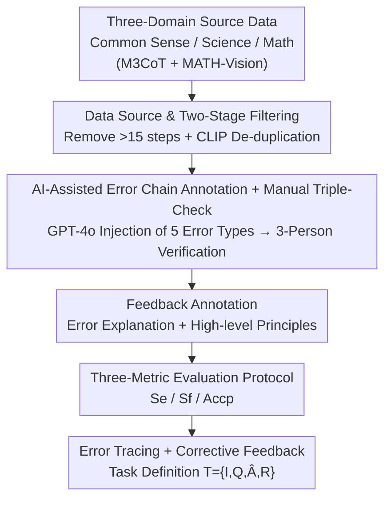

# EduDiag: A Benchmark for Educational Diagnostic Reasoning with Error Tracing and Correction on Large Multimodal Models

**Conference**: CVPR 2026  
**Paper**: [CVF Open Access](https://openaccess.thecvf.com/content/CVPR2026/html/Chen_EduDiag_A_Benchmark_for_Educational_Diagnostic_Reasoning_with_Error_Tracing_CVPR_2026_paper.html)  
**Code**: TBD (Repository link not public in paper)  
**Area**: Multimodal VLM / Benchmark  
**Keywords**: Large Multimodal Models, Educational Diagnostic Reasoning, Error Tracing, Corrective Feedback, GRPO  

## TL;DR
EduDiag constructs the first benchmark to evaluate the "educational diagnostic reasoning" capability of Large Multimodal Models (LMMs). Given a problem, an image, a reference solution process, and a wrong answer, the model is required to **reverse reconstruct** the erroneous reasoning chain leading to that wrong answer and generate corrective feedback. Covering 8,345 annotations across common sense, science, and mathematics domains, evaluations of 24 mainstream LMMs show that even GPT-5 performs poorly, with error tracing identified as the core bottleneck.

## Background & Motivation
**Background**: Large Multimodal Models (LMMs) have demonstrated strong multimodal reasoning capabilities, becoming core technologies for intelligent QA and tutoring systems. Existing multimodal reasoning benchmarks (M3CoT, MathVista, MMMU, etc.) primarily evaluate the **forward** reasoning of models using Chain-of-Thought (CoT): deriving the correct answer step-by-step from the problem.

**Limitations of Prior Work**: Real-world education involves much more than "providing the answer." Experienced teachers perform **reverse analysis** when faced with a student's incorrect answer: Why did the student choose 18 instead of 24? Did they misinterpret the diagram, calculate incorrectly, or misunderstand the concept? Specific corrections are then provided based on this analysis. This "educational diagnostic reasoning" capability has rarely been systematically evaluated in LMMs—existing benchmarks lack both annotated erroneous reasoning processes and corresponding corrective feedback.

**Key Challenge**: Previous LMM error correction research mostly focuses on **diagnosing a given reasoning chain** (where the erroneous process is a known input). However, in reality (e.g., multiple-choice or fill-in-the-blank questions), teachers do not have access to the student's internal thoughts, only the incorrect option. They must **trace back and infer** what mistake the student might have made. This ability to "reverse trace the error chain from a wrong answer" remains a gap.

**Goal**: To decompose diagnostic reasoning into two evaluable sub-tasks: (1) **Error Tracing**: reconstructing an erroneous reasoning chain that naturally leads from the problem to the wrong answer; (2) **Corrective Feedback**: generating an explanation of the error + high-level principles to prevent recurrence.

**Key Insight**: The authors believe a good benchmark must satisfy three criteria: coverage of real educational scenarios (common sense/science/math), errors that are **common** student mistakes rather than random noise, and evaluation metrics that separately measure the quality of "tracing" and "correction." Data and metrics are designed around these points.

**Core Idea**: Utilizing an "AI-assisted annotation (GPT-4o) + rigorous manual triple-check" pipeline, five categories of common errors are injected into real questions across three domains to construct error chains and feedback. Three metrics—$S_e, S_f, Acc_p$—are defined to turn "reverse diagnosis" into a quantifiable evaluation task suitable for fine-tuning and Reinforcement Learning (RL) optimization.

## Method

### Overall Architecture
EduDiag is a **dataset + evaluation protocol**, not a new model. It addresses how to systematically measure whether an LMM can reverse-engineer error causes and provide corrections like a teacher. The construction pipeline consists of four serial steps: first, **filtering data** from high-quality CoT datasets across three domains (removing overly long/redundant samples); second, using GPT-4o to **inject five categories of common errors** to generate candidate error chains, followed by manual triple-checks to ensure logic and representativeness; third, **annotating corrective feedback** (error explanation + high-level principles); and finally, defining a **three-metric evaluation protocol** to score the error chains and feedback. The task is formalized as: Input $T=\{I, Q, \hat{A}, R\}$ (image, question, wrong answer, reference steps $R=[s_1,\dots,s_N]$), the model generates an error reasoning chain $\hat{R}=[\hat{s}_1,\dots,\hat{s}_M]$ via autoregression $\hat{s}_i = \arg\max p(\hat{s}_i \mid T, \hat{s}_1,\dots,\hat{s}_{i-1})$, followed by corrective feedback $F$.

### Key Designs

**1. Task Definition: Reverse Tracing Error Chains + Generating Corrective Feedback**

Addressing the gap where "existing benchmarks only test forward CoT and correction research only diagnoses known chains," this paper formalizes diagnostic reasoning as a **reverse** generation task. Given the image $I$, question $Q$, a **wrong answer** $\hat{A}$, and reference steps $R$, the model must first generate an error chain $\hat{R}$ that **naturally leads** to $\hat{A}$, followed by corrective feedback $F$. A key constraint is that $R$ serves only as a scaffold; the model must "act as a student making a mistake" to construct a chain that sounds plausible but contains typical errors, which is harder than forward CoT.

**2. Data Source & Two-Stage Filtering: Ensuring Multi-domain Coverage without Redundancy Bias**

Data is sourced from three domains with high-quality step-by-step rationales: Common Sense and Science from M3CoT (844 and 1,608 samples, filtered for visual dependency), and Math from MATH-Vision (592 samples with rationales). Two-stage filtering is applied: (i) **Removing complex samples with >15 steps** to avoid excessive error sources; (ii) **CLIP De-duplication**—using CLIP encoders to calculate cosine similarity within categories. Samples with image similarity $>\tau_1=0.7$ and text similarity $>\tau_2=0.8$ are grouped, and annotators retain at most two representative samples per group.

**3. AI-Assisted Error Chain Annotation + Manual Triple-Check: Realistic vs. Random Errors**

Rather than collecting errors from small models (which primarily fail at basic perception), the paper uses a two-stage AI-assisted approach: **Defining five error categories** (Visual Perception, Calculation, Reasoning, Knowledge, Misinterpretation). GPT-4o identifies **tricky steps** in the reference rationale, injects errors, and adjusts subsequent reasoning to generate **5 candidate chains and new wrong answers**. Three annotators then verify based on: (i) **Logical Accuracy**—ensuring the error logically leads to the final wrong answer; (ii) **Representativeness**—retaining common student priors; (iii) **Diversity**—keeping up to 3 chains per question. This resulted in 8,345 error chains averaging 6.15 steps.

**4. Evaluation Protocol: Three Metrics for Tracing and Correction Quality**

Three metrics are defined: (i) **Error Chain Score $S_e$** (0–3, discrete): Independently scored by three LLMs (Gemini-2, Claude-3.7, Seed-1.6) different from the generator to avoid bias; $S_e=3$ indicates consistency with ground truth. (ii) **Feedback Score $S_f$** (1–5): Scored by the same LLMs based on error localization, explanation specificity, and principle generalizability. (iii) **Corrective Accuracy $Acc_p$**: A fixed small model (Qwen2-VL-7B) **acts as a student** and attempts a multiple-choice question using the "high-level principle" generated by the model to see if accuracy improves compared to a baseline without the principle.

## Key Experimental Results

### Main Results
24 LMMs were evaluated. For open-source models, LoRA SFT was performed (split: 6392/710/1243).

| Model | Setting | $S_e$↑ | $S_f$↑ | $Acc_p$↑ |
|------|------|--------|--------|----------|
| Ground Truth (Human Princ.) | — | — | — | 62.67% |
| Direct (CoT w/o Principle) | — | — | — | 46.72% |
| GPT-5 | zero-shot | **2.67** | 3.83 | **52.22%** |
| Gemini-2.5-Pro | zero-shot | 2.67 | 3.89 | 50.87% |
| GPT-4o | zero-shot | 2.30 | 3.17 | 51.48% |
| Qwen2.5-VL-7B | zero-shot | 0.38 | 1.50 | 49.99% |
| Qwen2.5-VL-7B | SFT | 1.97 | 2.96 | 51.75% |
| InternVL3-8B | zero-shot → SFT | 0.67→2.09| 1.69→3.03| 49.98%→51.03% |

Key observations: (i) **The benchmark is challenging**—the strongest GPT-5 reaches 52.22% $Acc_p$, still **10.45% below** the human baseline (62.67%). (ii) **Math is the hardest domain**—all models struggled with math error tracing and correction. (iii) **Scaling helps but is limited**—Llama-3.2 improved from 11B to 90B, with $S_e$ rising from 0.69 to 1.75.

### Ablation Study: SFT vs. GRPO Reinforcement Learning
SFT significantly boosts $S_e$ but barely improves $Acc_p$, as it often "forces" models toward the wrong answer, creating logical conflicts. GRPO was tested with two rewards: $R_1$ (BERTScore similarity to GT feedback) and $R_2$ (**removing the wrong answer from input** and rewarding the model if the chain's last step hits a candidate wrong answer).

| Model | Strategy | Math $S_e$ | Overall $Acc_p$ | $S_e{=}3$ Ratio |
|------|------|-----------|-----------------|----------------|
| Qwen2.5-VL-7B | SFT | 1.29 | 51.75% | 13.18% |
| Qwen2.5-VL-7B | SFT+GRPO $R_1$ | 1.21 | 50.89% | — |
| Qwen2.5-VL-7B | SFT+GRPO $R_2$ | **1.68** | **53.46%** | **29.75%** |
| Qwen3-VL-8B | SFT | 1.38 | 51.81% | 14.52% |
| Qwen3-VL-8B | SFT+GRPO $R_2$ | **1.79** | **53.85%** | **32.18%** |

### Key Findings
- **Error tracing is the core bottleneck**: High-quality error chains ($S_e=3$) are a **necessary prerequisite** for effective feedback. SFT improved average $S_e$ but failed to increase the proportion of logical $S_e=3$ chains, hence $Acc_p$ stagnated.
- **$R_2$ (Hit Wrong Answer Reward) significantly outperforms $R_1$ and SFT**: $R_2$ encourages models to "naturally derive" the wrong answer, increasing the $S_e=3$ ratio from 13.18% to 29.75%.
- **Larger models benefit more from $R_2$**: Qwen3-VL-8B saw a +2.62% $Acc_p$ gain, compared to +1.33% for the 4B version.
- **Transferability to Distractor Generation**: Models optimized with $R_2$ generate more challenging distractors, reducing the accuracy of separate QA models closer to human-level difficulty.

## Highlights & Insights
- **Clever "Reverse Problem" design**: Formalizing teacher reasoning as "reconstructing error chains from a wrong answer" avoids CoT homogeneity and exposes missing diagnostic capabilities.
- **Avoiding self-evaluation bias**: Using Gemini-2/Claude-3.7/Seed-1.6 for scoring instead of the generating model (GPT-4o) is an effective "generation-evaluation separation" practice.
- **$R_2$ Reward Design**: Removing the shortcut (the wrong answer from input) and rewarding the model for reaching it via reasoning addresses the "forced convergence" issue in SFT.
- **Chain depth**: With an average of 6.15 steps, the error chains are more realistic and informative than previous benchmarks like VISCO (3.4 steps).

## Limitations & Future Work
- **Dependency on GPT-4o**: Error chains and feedback are GPT-4o generated; errors may reflect "AI imagination" rather than diverse student mistakes.
- **LLM-Based Evaluation**: $S_e/S_f$ rely on LLM judges, which may have inherent biases; $Acc_p$ uses a single student model (Qwen2-VL-7B).
- **Domain Imbalance**: Science accounts for 52.8% of the data, while Math—the most valuable and challenging domain—only comprises 19.5%.
- **Future Directions**: Exploring fine-grained step-level rewards and incorporating real-world student error data for calibration.

## Related Work & Insights
- **vs. Forward Multimodal CoT Benchmarks (M3CoT / MathVista / MMMU)**: These measure "Question $\rightarrow$ Correct Answer"; EduDiag is **orthogonal**, measuring "Wrong Answer $\rightarrow$ Error Chain $\rightarrow$ Correction."
- **vs. Error Diagnosis with Given Chains (VISCO, etc.)**: Previous works treat the error process as **known input**. EduDiag requires the model to **reconstruct** the chain (unknown process) and features longer reasoning paths.
- **vs. Feedback Learning**: While many works use GPT-4 feedback to improve LMM self-correction, EduDiag explicitly quantifies feedback effectiveness through $Acc_p$, proving that tracing must be solved before feedback becomes useful.

## Rating
- Novelty: ⭐⭐⭐⭐⭐ First multimodal diagnostic benchmark for reverse error tracing.
- Experimental Thoroughness: ⭐⭐⭐⭐⭐ Comprehensive 24-LMM evaluation + SFT/GRPO strategy comparison.
- Writing Quality: ⭐⭐⭐⭐ Clear formalization; well-structured diagrams.
- Value: ⭐⭐⭐⭐⭐ Identifies error tracing as the bottleneck and provides a viable GRPO-$R_2$ direction.

<!-- RELATED:START -->

## Related Papers

- [\[CVPR 2026\] EMO-R3: Reflective Reinforcement Learning for Emotional Reasoning in Multimodal Large Language Models](emo-r3_reflective_reinforcement_learning_for_emotional_reasoning_in_multimodal_l.md)
- [\[CVPR 2026\] GGBench: A Geometric Generative Reasoning Benchmark for Unified Multimodal Models](ggbench_a_geometric_generative_reasoning_benchmark_for_unified_multimodal_models.md)
- [\[CVPR 2025\] ESPIRE: A Diagnostic Benchmark for Embodied Spatial Reasoning of Vision-Language Models](../../CVPR2025/multimodal_vlm/espire_a_diagnostic_benchmark_for_embodied_spatial_reasoning_of_vision-language_.md)
- [\[ACL 2026\] ErrorRadar: Benchmarking Complex Mathematical Reasoning of Multimodal Large Language Models Via Error Detection](../../ACL2026/multimodal_vlm/errorradar_benchmarking_complex_mathematical_reasoning_of_multimodal_large_langu.md)
- [\[CVPR 2026\] Circuit Tracing in Vision-Language Models: Understanding the Internal Mechanisms of Multimodal Thinking](circuit_tracing_in_vision-language_models_understanding_the_internal_mechanisms_.md)

<!-- RELATED:END -->
