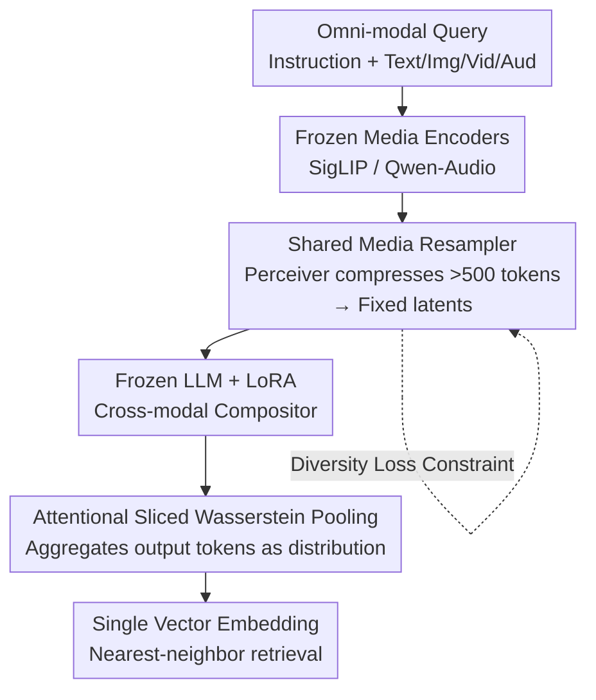

# Efficient and High-Fidelity Omni Modality Retrieval

**Conference**: CVPR 2026  
**Paper**: [CVF Open Access](https://openaccess.thecvf.com/content/CVPR2026/html/Huynh_Efficient_and_High-Fidelity_Omni_Modality_Retrieval_CVPR_2026_paper.html)  
**Code**: Not yet released (Project page: https://hmchuong.github.io/omniret)  
**Area**: Multimodal VLM  
**Keywords**: omni-modal retrieval, compositional queries, Sliced Wasserstein Pooling, Perceiver resampling, audio retrieval  

## TL;DR
OmniRet utilizes a frozen LLM as a universal compositor to encode mixed queries (text/image/video/audio) into a single vector for retrieval. It employs a "Shared Media Resampler" to compress massive media tokens, solving efficiency bottlenecks, and uses "Attentional Sliced Wasserstein Pooling (ASWP)" to aggregate LLM outputs as distributions to preserve fine-grained information. It achieves state-of-the-art results on 12 out of 13 retrieval tasks and introduces support for compositional audio and audio-visual retrieval.

## Background & Motivation
**Background**: Multimodal retrieval requires aggregating queries across heterogeneous modalities into a single representation for matching. Models like CLIP, BLIP, and CLAP are powerful but primarily cover "text + vision" or "text + audio" pairs. Recent works treat MLLMs as compositors to understand complex compositional queries by feeding multimodal tokens into an LLM and extracting a single embedding.

**Limitations of Prior Work**: Two major hurdles remain for "universal retrieval." ① **Efficiency**: Media encoders output >500 tokens per image; feeding all of them into an LLM causes a computational explosion, forcing smaller batch sizes—which is detrimental as contrastive learning relies heavily on large in-batch negative samples. ② **Fidelity**: Compressing rich multimodal inputs into a single vector creates an information bottleneck, losing fine-grained details. Previous methods either used crude average pooling/`[EOS]` tokens (blurring details) or ColBERT-style late-interaction (which is storage/retrieval intensive and impractical for large-scale use).

**Key Challenge**: There is a direct trade-off between efficiency and fidelity regarding "single-vector vs. multi-vector" representations. Single vectors are fast but lose information, while multi-vectors preserve fidelity but are expensive and incompatible with efficient ANN indexing. Additionally, modalities like audio and video suffer from a lack of dedicated models and training data.

**Goal**: To train a unified encoder $f$ that maps instructed queries and candidates into the same $D$-dimensional space, while (a) compressing token counts to ensure large batch sizes and (b) preserving fine-grained details in a single-vector format compatible with large-scale retrieval.

**Key Insight**: Insert attention-based resampling modules before and after the "Universal LLM Compositor." The first module compresses media tokens for efficiency, while the second treats LLM output tokens **as a distribution** and computes descriptors relative to a set of learnable reference points using Sliced Wasserstein distance to maintain fidelity.

## Method

### Overall Architecture
OmniRet acts as an encoder: input is an omni-modal query (or candidate) consisting of "instructions + arbitrary modality combinations," and output is a single $D$-dimensional embedding. The same model encodes both queries and candidates for nearest-neighbor retrieval in a shared vector space. The process involves: media passing through frozen encoders (SigLIP-SO400M for vision, Qwen-Audio Encoder for audio), followed by projection and a **Shared Media Resampler** that compresses tokens into fixed-count latents. These are interleaved with text tokens and fed into a **frozen LLM (GTE-Qwen2-1.5B + LoRA)**. The LLM's output hidden states are then aggregated into the final vector via **ASWP**. Only the projection heads, resampler, pooling layer, and LoRA are trained (~84M parameters). Training utilizes contrastive, triplet, and diversity losses.

### Key Designs

**1. Shared Media Resampler: Compressing Token Explosions via a Perceiver**

This address the efficiency bottleneck: media encoders typically produce >500 tokens, which would crash batch sizes if fed directly into the LLM. The resampler is an intermediate layer between the media tokens and the LLM input space, based on the Perceiver architecture (cross-attention + feed-forward, 3 layers). it compresses arbitrary media sequences $\mathbb{R}^{T\times D}$ into a small set of fixed latent vectors $M\in\mathbb{R}^{N\times D}$. The key design is a **Shared Perceiver module across all modalities** to enhance generalization, supplemented by **modality-specific latents** (adding shared latent queries to media-specific latents). For video, 3D trilinear interpolation is used to reduce temporal redundancy before resampling. Ablations show that removing the resampler drops performance by 3.5% due to reduced batch size.

**2. Attentional Sliced Wasserstein Pooling (ASWP): Distribution-based Aggregation**

This is the core of the high-fidelity design. To aggregate LLM output states, the module first uses an attention-based resampler to compress the output into $S$ latents $Z=\{z_1,\dots,z_S\}$. Instead of **average pooling** (which loses structure), $Z$ is treated as a distribution described relative to **learnable reference points** $X=\{x_1,\dots,x_S\}$. Following PSWE, $Z$ and $X$ are projected onto $L$ 1D directions $\Theta=\{\theta_1,\dots,\theta_L\}$ to calculate 1D Monge coupling:

$$Z' = [\psi_1(X,Z;\theta_1);\dots;\psi_L(X,Z;\theta_L)] \in \mathbb{R}^{S\times L}$$

Here $\psi_i(\cdot)$ measures the alignment between the token distribution and reference points, acting as a "histogram-style" descriptor that preserves fine-grained information. To reach the final embedding size, a **hard selection** compression is applied: soft scores $y=\mathrm{softmax}(\psi_i)$ are calculated for each column, and a one-hot mask $m_i^{hard}=\mathrm{OneHot}(\arg\max_j y_j)$ is selected. To allow backpropagation through this discrete choice, a Straight-Through Maximum (STM) estimator $\tilde m_i = m_i^{hard} - \mathrm{StopGrad}(y) + y$ is used. Finally, $V=Z'\odot\tilde m$ is summed column-wise to produce the $L$-dimensional vector. This maintains late-interaction fidelity while outputting a single vector compatible with ANN.

**3. Diversity Loss for Resampled Tokens: Preventing Latent Collapse**

Since resampling compresses hundreds of tokens into dozens of latents, information is lost if these latents are too similar. A diversity regularization $\mathcal{L}_{div}$ is added to encourage orthogonality among output vectors $M\in\mathbb{R}^{N\times D}$:

$$\mathcal{L}_{div} = \frac{1}{N^2}\,\mathrm{smoothL1}\!\big(\mathrm{Dropout}(\max(MM^\top,0) - I)\big)$$

The term calculates the similarity matrix $MM^\top$, removes self-similarity, and applies **Dropout** to the matrix before the loss calculation. This sparse sampling efficiently enforces global diversity. SmoothL1 (Huber, $\gamma=0.5$) is used instead of L2 to avoid gradient explosion from outliers while still penalizing non-orthogonality.

### Loss & Training
The final objective is a linear combination: $\mathcal{L} = \mathcal{L}_{cont} + \mu_1\mathcal{L}_{triplet} + \mu_2\mathcal{L}_{div}$ ($\mu_1=1,\mu_2=0.1$). The contrastive term uses InfoNCE with hard negative mining:

$$\mathcal{L}_{cont} = -\log \frac{e^{\phi(h_q,h_{c^+})}}{\sum_c w(h_q,h_c)\,e^{\phi(h_q,h_c)}},\quad \phi(x,y)=\tfrac{1}{\tau}\cos(x,y)$$

Training proceeds in two stages: **Stage 1 Warmup** (training projections/resamplers/pooling with the LLM frozen) on 2M samples, and **Stage 2 Fine-tuning** with LoRA enabled (rank 16) on ~18M samples across 30 datasets.

## Key Experimental Results

### Main Results (Extended M-BEIR, 13 Tasks, Recall@5)
| Task Group | OmniRet (1.5B) | Strongest Baseline (Same Scale) | Note |
|--------------------|----------------|----------------|------|
| V→T / T→V (Video-Text) | 43.8 / 43.2 | VLM2VecV2 17.6 / 18.4 | Significant lead in video |
| A→T / T→A (Audio-Text) | 66.8 / 62.4 | CLAP 63.9 / 56.6 | Outperforms audio-only models |
| Compositional V,T→V | 86.2 | VLM2VecV2 76.4 | Compositional query lead |
| I→T / T→I | 50.6 / 46.9 | PE-Core 58.0 / 53.4 | Competitive on vision-text |
| I→I (Image-to-Image) | 24.4 | PE-Core 32.0 | Only task with clear lag |

### MMEBv2 Subset Generalization (Recall@1, <7B models)
| Model | Image-CLS | Image-RET | Video-CLS | Video-RET | Video-MRET |
|------|-----------|-----------|-----------|-----------|------------|
| VLM2VecV2 (1.5B) | 62.9 | 69.5 | 39.3 | 28.8 | 38.5 |
| **Ours (1.5B)** | 51.7 | 65.3 | **48.6** | **36.5** | **43.3** |

### Ablation Study (Avg. Recall over 6 tasks, baseline 50.2)
| Configuration | Avg. Recall | Gain |
|------|-------------|-----|
| Full Model | 50.2 | 0.0 |
| ASWP → Average Pooling | 20.7 | **-29.5** |
| Embedding via single `[EOS]` | 43.4 | -6.8 |
| W/o Media Resampler | 46.7 | -3.5 |
| W/o $\mathcal{L}_{div}$ | 47.1 | -3.1 |
| ASWP via Max Pooling (instead of STM) | 49.2 | -1.0 |

### Key Findings
- **ASWP is the linchpin**: Switching to average pooling causes a massive drop from 50.2 to 20.7 because it cancels out directional distances relative to reference points.
- **Pre-LLM diversity is more critical than post-LLM triplet loss**: Removing $\mathcal{L}_{div}$ drops performance by 3.1%, while removing $\mathcal{L}_{triplet}$ only drops it by 0.5%.
- **Single-vector fidelity**: Using `[EOS]` drops performance by 6.8%, highlighting that ASWP captures fine-grained distribution info that `[EOS]` misses.

## Highlights & Insights
- **Pooling as Optimal Transport**: By redefining pooling as a "distribution vs. reference point" problem using Sliced Wasserstein distance, OmniRet approximates late-interaction fidelity without sacrificing single-vector efficiency.
- **Bridging the Gap**: The STM estimator allows discrete "hard selection" to be end-to-end trainable, outperforming differentiable weighted sums in practice.
- **Decoupled Architecture**: Efficiency is handled before the LLM (Resampler), and fidelity is handled after the LLM (ASWP), creating a clear and modular processing pipeline.
- **New Benchmarks**: Introduced the first tri-modal compositional retrieval model and addressed long-standing evaluation gaps in audio-visual retrieval.

## Limitations & Future Work
- **Scalability**: Backbones and data sizes were not fully scaled up due to hardware constraints.
- **Modality Expansion**: Future work aims to include depth maps, 3D point clouds, and speech.
- **Data Bias**: The ACM benchmark relies partly on synthetic captions, which may introduce distribution bias.
- **Pure Vision Disadvantage**: Performance in pure Image-to-Image (I-I) retrieval lags behind specialized vision encoders.

## Related Work & Insights
- **vs. ImageBind**: While ImageBind aligns modalities, it cannot handle compositional queries effectively; Ours leads significantly in compositional tasks.
- **vs. ColBERT**: Ours achieves similar fine-grained benefits using distribution descriptors while remaining compatible with standard ANN, unlike the multi-vector requirement of ColBERT.
- **vs. NV-Embed**: Traditional single-vector methods like NV-Embed rely on `[EOS]` or average pooling, which lose the structural details preserved by ASWP.

## Rating
- Novelty: ⭐⭐⭐⭐⭐ 
- Experimental Thoroughness: ⭐⭐⭐⭐⭐ 
- Writing Quality: ⭐⭐⭐⭐ 
- Value: ⭐⭐⭐⭐⭐ 

<!-- RELATED:START -->

## Related Papers

- [\[CVPR 2026\] HiFICL: High-Fidelity In-Context Learning for Multimodal Tasks](hificl_highfidelity_incontext_learning_for_multimo.md)
- [\[CVPR 2026\] Visual-Aware CoT: Achieving High-Fidelity Visual Consistency in Unified Models](visual-aware_cot_achieving_high-fidelity_visual_consistency_in_unified_models.md)
- [\[CVPR 2026\] Parameter-Efficient Adaptation for MLLMs via Implicit Modality Decomposition](parameter-efficient_adaptation_for_mllms_via_implicit_modality_decomposition.md)
- [\[CVPR 2026\] DeepAlign: Mitigating Modality Conflict through Modality-Specific Alignment](deepalign_mitigating_modality_conflict_through_modality-specific_alignment.md)
- [\[NeurIPS 2025\] SpatialTraceGen: High-Fidelity Traces for Efficient VLM Spatial Reasoning Distillation](../../NeurIPS2025/multimodal_vlm/spatialtracegen_high-fidelity_traces_for_efficient_vlm_spatial_reasoning_distill.md)

<!-- RELATED:END -->
