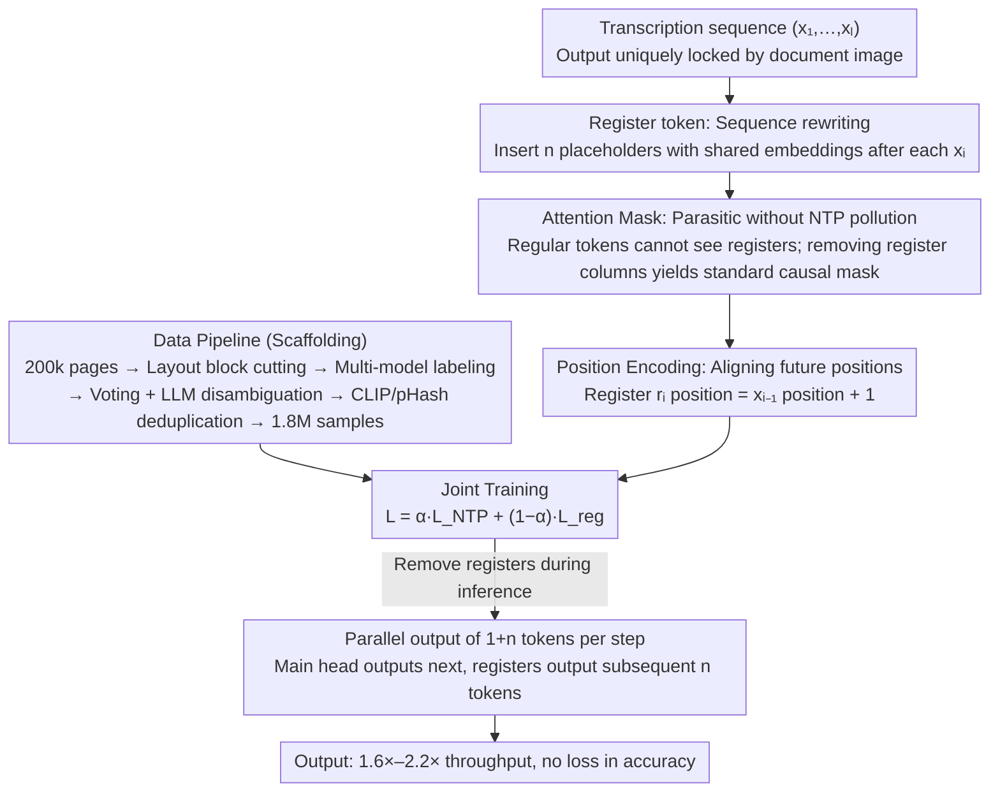

# Efficient Document Parsing via Parallel Token Prediction

**Conference**: CVPR 2026 Findings  
**arXiv**: [2603.15206](https://arxiv.org/abs/2603.15206)  
**Code**: [GitHub](https://github.com/flow3rdown/PTP-OCR)  
**Area**: Multimodal VLM  
**Keywords**: Document Parsing, Parallel Token Prediction, Register Token, VLM Acceleration, OCR

## TL;DR

Proposes PTP (Parallel Token Prediction), a model-agnostic plug-and-play acceleration method that achieves 1.6×-2.2× throughput improvement on OmniDocBench without accuracy loss by inserting learnable register tokens into the training sequence to enable parallel multi-token prediction.

## Background & Motivation

**Practical needs for document parsing**: Document parsing transforms unstructured documents into machine-readable outputs. It serves as the cornerstone for applications like RAG and document analysis, requiring both high speed and precision.

**VLMs have revolutionized document parsing**: End-to-end or pipeline methods based on VLMs have significantly improved parsing quality, but auto-regressive (AR) decoding has become the speed bottleneck.

**Key Challenge of AR decoding**: Document parsing is essentially a high-determinism transcription task rather than open-ended generation. Since the output is uniquely determined by the input image, it inherently possesses parallelizability.

**Limitations of Prior Work**: Output compression, visual token pruning, and parameter pruning do not fundamentally solve the AR bottleneck.

**Limitations of Non-Autoregressive methods**: CTC-based NAR models have limited performance and are restricted to span-level OCR.

**Key Insight**: Images can be decomposed into multiple patches identified independently; this parallel capability can be embedded within the model.

## Method

### Overall Architecture

PTP addresses the slow speed of auto-regressive token-by-token decoding in document parsing. Since document transcription is a deterministic "look and copy" task where output is nearly locked by the input image, the model should ideally output several tokens at once, but is restricted by the serial dependency of next-token prediction (NTP). The approach "parasitizes" a set of learnable register tokens into the training sequence without changing the backbone or the original NTP training. This allows the model to predict the current token while simultaneously predicting the next $n$ positions in parallel. During inference, each step produces $1+n$ tokens, increasing throughput by 1.6×–2.2×. The method is supported by three interlocked designs (register tokens, attention masks, position encoding) and a high-quality labeling pipeline.

### Key Designs

**1. Register token: Expanding "predict next" to "parallel prediction of several subsequent tokens"**

To address the serial bottleneck where AR decoding only produces one token at a time, PTP inserts $n$ register tokens after each regular token $x_i$ in the original sequence. These registers share the same token ID and learnable embedding, distinguished only by position encoding. Specifically, the $i$-th register is responsible for predicting the $(i+1)$-th position. Thus, the training sequence is rewritten from $(x_1, x_2, \ldots)$ to:

$$\hat{X}_a = (x_1, [r_2, r_3], x_2, [r_3, r_4], \ldots, x_l)$$

Here $n=2$. For example, when decoding $x_1$, the main prediction head provides $x_2$ as usual, while the following $[r_2, r_3]$ predict $x_3$ and $x_4$ in parallel within the same forward pass—achieving three steps in one. Unlike DeepSeek-V3, which uses an external MTP head, PTP introduces no new modules and merely inserts special placeholders, making it inherently model-agnostic.

**2. Attention Mask: Integrating registers without polluting original NTP**

If registers and regular tokens are mutually visible, the original next-token training will be disrupted, compromising accuracy. Three isolation rules were designed: regular tokens only attend to preceding regular tokens and cannot see any registers; registers can attend to all preceding regular tokens and fellow registers in the same group; registers from different groups are isolated. Consequently, removing the columns corresponding to all registers from the attention matrix leaves a standard causal mask. This ensures the NTP baseline is unaffected, treating registers as a side branch that can be removed after training.

**3. Position Encoding: Aligning registers with target future positions**

Since registers share the same embedding, the only clue to distinguish "which register I am and who I should predict" is the position ID. The rule is straightforward: the position ID of register $r_i$ is the position of the preceding regular token $x_{i-1}$ plus 1, incrementing within the group. This places each register exactly at the position of the future token it aims to predict, effectively "learning backward from the target position" and avoiding identity confusion.

### Loss & Training

The training objective is a weighted sum of the standard NTP and register prediction:

$$\mathcal{L}_{\text{PTP}} = \alpha \cdot \mathcal{L}_{\text{NTP}} + (1-\alpha) \cdot \mathcal{L}_{\text{reg}}$$

The register component accounts for all registers at each position: $\mathcal{L}_{\text{reg}} = -\sum_i \sum_j \log P_\theta(x_{i+j+1} \mid X_{a,\leq i}, r_{i+j})$, where $\alpha$ balances "maintaining NTP" and "learning parallel prediction."

A dedicated data pipeline feeds this training: starting from 200k diverse document pages, layout analysis crops sub-regions, followed by multi-model collaborative labeling (strong VLM + open-source VLM + specialized OCR). Majority voting and LLM post-processing resolve ambiguities. Finally, semantic deduplication via CLIP and near-duplicate removal via pHash yield approximately 1.8M high-quality samples.

## Key Experimental Results

### Main Results: OmniDocBench

| Model Type | Representative Model | Overall Edit Distance↓ |
|---------|---------|------------------------|
| Pipeline | PP-StructureV3 | 0.0695 |
| General VLM | Gemini-2.5 Pro | 0.0734 |
| General VLM | GPT-4o | 0.2297 |
| Ours (PTP) | PTP-1 | 1.6× Speedup |
| Ours (PTP) | PTP-2 | 2.2× Speedup |

### Ablation Study

| Config | Throughput Gain | Accuracy Impact |
|------|---------|----------|
| PTP-0 (NTP baseline) | 1.0× | baseline |
| PTP-1 (1 register) | 1.6× | Lossless / Reduced Hallucination |
| PTP-2 (2 registers) | 2.2× | Lossless |
| Coupled with Speculative Decoding | 82% Acceptance Rate | - |

### Key Findings

- PTP not only accelerates but also **reduces** model hallucination because registers provide additional prediction constraints.
- The method generalizes to general Visual Language Understanding (VLU) tasks.
- It is orthogonal to and synergistic with speculative decoding, reaching an 82% acceptance rate when combined.
- Estimated speedup ratio: $\text{SR} \approx ((1+n) \times L_\theta) / L'_\theta$.

## Highlights & Insights

- **Extreme Plug-and-Play**: Model-agnostic, requires no architectural changes—only the addition of register tokens and modification of the attention mask.
- Registers do not affect regular tokens during training (via mask isolation), guaranteeing the lower bound of NTP performance.
- The secondary effect of reducing hallucinations is surprising—multi-token prediction provides implicit constraints.
- Comprehensive data pipeline design: multi-source collection + multi-model labeling + multi-stage filtering.

## Limitations & Future Work

- Requires removing register KV caches during each inference step, increasing implementation complexity.
- Accuracy of register prediction for distant tokens decreases with distance.
- Training sequence length increases by $(1+n)$ times, raising training costs.
- Currently primarily validated in document parsing; performance in open-domain generation remains to be explored.

## Related Work & Insights

- Similar in philosophy to the MTP head in DeepSeek-V3 but different in implementation: PTP uses register tokens instead of additional prediction heads.
- Inspiration for register tokens comes from designs meant to absorb high-norm outliers in ViTs (DINOv2), but the application is entirely different.
- The method is orthogonal to acceleration techniques like output compression or visual token pruning and can be used in combination.

## Rating
- Novelty: ⭐⭐⭐⭐
- Experimental Thoroughness: ⭐⭐⭐⭐
- Writing Quality: ⭐⭐⭐⭐
- Value: ⭐⭐⭐⭐

<!-- RELATED:START -->

## Related Papers

- [\[CVPR 2026\] Towards Real-World Document Parsing via Realistic Scene Synthesis and Document-Aware Training](towards_real-world_document_parsing_via_realistic_scene_synthesis_and_document-a.md)
- [\[CVPR 2026\] PaddleOCR-VL: Boosting Document Parsing Efficiency and Performance with Coarse-to-Fine Visual Processing](paddleocr_vl_coarse_to_fine_document_parsing.md)
- [\[CVPR 2026\] Boosting Document Parsing Efficiency and Performance with Coarse-to-Fine Visual Processing](boosting_document_parsing_efficiency_and_performance_with_coarse-to-fine_visual_.md)
- [\[CVPR 2026\] DocPrune: Efficient Document Question Answering via Background, Question, and Comprehension-aware Token Pruning](docpruneefficient_document_question_answering_via_background_question_and_compre.md)
- [\[ICLR 2026\] Index-Preserving Lightweight Token Pruning for Efficient Document Understanding](../../ICLR2026/multimodal_vlm/index-preserving_lightweight_token_pruning_for_efficient_document_understanding_.md)

<!-- RELATED:END -->
