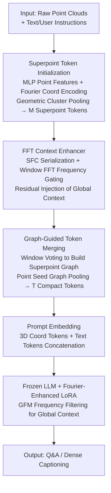

# Efficient Encoder-Free Fourier-based 3D Large Multimodal Model

**Conference**: CVPR 2026  
**Paper**: [CVF Open Access](https://openaccess.thecvf.com/content/CVPR2026/html/Mei_Efficient_Encoder-Free_Fourier-based_3D_Large_Multimodal_Model_CVPR_2026_paper.html)  
**Code**: Project Page https://tev-fbk.github.io/Fase3D (Open source code not yet available)  
**Area**: Multimodal VLM (3D Scene Large Models)  
**Keywords**: 3D Large Multimodal Models, Point Clouds, Encoder-Free, Fourier Transform, Superpoint Tokenizer  

## TL;DR
Fase3D proposes the first **encoder-free, Fourier-based** 3D scene large multimodal model. It utilizes a lightweight tokenizer consisting of "superpoint pooling + space-filling curve serialization + window FFT" to directly process raw point clouds. Furthermore, it injects global frequency-domain context into a frozen LLM via Fourier-enhanced LoRA. On ScanQA, SQA3D, ScanRefer, and Nr3D, it achieves performance comparable to heavy-encoder methods (such as 3D-LLaVA and PerLA) while using **only ~1/6 to 1/12 of the visual parameters and ~1/20 of the FLOPs**.

## Background & Motivation
**Background**: Mainstream 3D large multimodal models (3D LMMs) first extract geometric/semantic features from point clouds using a heavy-weight pre-trained 3D encoder (such as CLIP, Sparse 3D U-Net, or Mask3D) and then project them into the token space of an LLM. Existing methods like LL3DA, PerLA, and 3D-LLaVA all follow this "heavy encoder + alignment" paradigm.

**Limitations of Prior Work**: These encoders introduce massive computational and GPU memory overhead, which limits the input resolution and scalability. Moreover, the generated feature embeddings often suffer from **semantic misalignment** with the LLM's reasoning space, requiring additional Q-Former or projection modules for alignment. In the 2D domain, "encoder-free" (or monolithic) large models (e.g., EVE, Mono-InternVL) have already emerged to map visual inputs directly into the LLM token space for efficiency, but migrating this paradigm to 3D remains almost entirely unexplored.

**Key Challenge**: Point clouds are **unordered, irregular, and massive in scale** (often consisting of tens of thousands of points per scene), unlike regular 2D pixel grids. Furthermore, encoder-free architectures lack large-scale visual pre-training, making it necessary to rely on **explicit inductive biases** to robustly tokenize unordered point clouds. However, this tokenizer must possess minimal parameters and low computational cost; otherwise, the benefits of going "encoder-free" are lost. Direct self-attention on long token sequences incurs an $O(M^2)$ complexity, which is both expensive and breaks permutation invariance.

**Goal**: To design an **effective yet efficient** encoder-free 3D scene large multimodal model that directly consumes raw point clouds, addressing three key aspects simultaneously: token permutation disorder, scalability to large scenes, and global context modeling.

**Key Insight**: The authors formulate token processing as a **synergy between the spatial and frequency domains**. A key observation is that the Fast Fourier Transform (FFT) is a powerful operator that can approximate self-attention with $O(M\log M)$ complexity to aggregate global context, provided that the unordered point cloud is first **serialized** into a 1D sequence for cheap frequency-domain mixing.

**Core Idea**: To replace "heavy encoders + self-attention" with "point cloud serialization + FFT", leveraging frequency-domain processing across multiple stages of both the tokenizer and the LLM to inject global context. This allows the monolithic LLM to directly comprehend 3D scenes with negligible parameter overhead.

## Method

### Overall Architecture
Fase3D is a monolithic LMM without a dedicated 3D encoder. Its input consists of raw scene-level point clouds and text instructions, and the output consists of answers or dense captions. The core of the pipeline is **progressively reducing the number of tokens while hierarchically enriching the semantic and spatial information of each token**. The point cloud is first projected into point-level features via a lightweight MLP and grouped into $M$ superpoint tokens via geometric clustering. The superpoints are serialized and passed through an FFT context enhancer to inject global information. Next, a graph-guided token query merges them into $T$ compact tokens ($T < M$). These visual tokens are prepended to the text/user prompt embeddings and fed into a frozen LLM, where the internal LoRA layers are enhanced by a Fourier Global Filtering Module (GFM) to inject global frequency-domain context.

### Key Designs

**1. Superpoint Token Initialization: Compressing tens of thousands of points into hundreds of compact tokens**

Encoder-free architectures are highly sensitive to excessively long point cloud sequences. Using downsampled raw points directly as tokens leads to quadratic $O(N^2)$ self-attention complexity, resulting in slow and unstable training while failing to scale to scene levels. Fase3D first projects point features $f_i$ (e.g., color, normals) into $d$-dimensional tokens $x^{(0)}_{\text{feat}}$ via a shallow MLP. In parallel, point coordinates $p_i$ are encoded into $x^{(0)}_{\text{coor}}$ using a **non-parametric, multi-frequency Fourier feature encoding**, yielding the joint point-level token $x^{(0)}=x^{(0)}_{\text{feat}}+x^{(0)}_{\text{coor}}$. Subsequently, point clouds are grouped into $M$ superpoints via geometric clustering, and point-level tokens within each superpoint are average-pooled to obtain superpoint tokens:

$$\mathbf{S}=\text{SptPool}(\mathbf{X}^{(0)},\mathcal{Q})\in\mathbb{R}^{M\times d}$$

This step utilizes pure geometry-driven superpoint pooling to reduce the token count by roughly an order of magnitude. This not only shortens the sequence length but also enhances semantic consistency. Because it introduces very few learnable parameters (only a shallow MLP), it serves as a critical foundation for the encoder-free paradigm.

**2. FFT Context Enhancer: Approximating self-attention via frequency-domain mixing to cheaply complete global context**

The superpoint tokens $\mathbf{S}$ only carry **local** information and lack global layout across objects. Existing frequency-domain methods either perform 3D FFT on voxel grids (computationally prohibitive for massive scenes) or employ Graph Fourier Transforms (which require explicit graph construction and Laplacians, scaling as $O(M^2)$). Instead, the authors serialize superpoints and perform 1D FFT, reducing the complexity to $O(M\log M)$. Specifically, four **space-filling curves** (z-order, transposed z-order, Hilbert, transposed Hilbert) are used to map 3D superpoint coordinates into 1D sequences $\mathbf{S}[\pi_i]$ that preserve spatial locality. Frequency-domain gating is applied to each sequence:

$$\mathbf{S}'(\pi_i)=\mathcal{F}^{-1}\!\left(\mathcal{F}(\mathbf{S}(\pi_i))\odot \mathbf{G}_v\right)$$

where $\mathbf{G}_v$ is a learnable non-negative frequency gate and $\odot$ denotes element-wise multiplication—effectively amplifying or suppressing different frequency components to mix context in the frequency domain. To maintain spatial-locality awareness, the FFT is performed over overlapping windows of length $L_w=128$ and step size $L_s=L_w/2$, followed by reconstruction via overlap-add with square Hann window weights. The complexity per window is $O(L_w\log L_w)$. Finally, the outputs from the four curves are inverse-permuted back to the original order, averaged via $\tilde{\mathbf{S}}=\frac{1}{|\pi|}\sum_{\pi_i}\mathbf{S}'(\pi_i)$, and integrated via residual connection: $\mathbf{S}\leftarrow\mathbf{S}+\tilde{\mathbf{S}}$. Employing multiple serialization curves mitigates serialization bias and ensures robust 1D adjacency. This module leverages FFT as a "cheap self-attention" operator, equipping each token with joint local and global context.

**3. Graph-guided Token Merging: Geometrically merging superpoints into T object-level tokens without detection heads**

To further save computation, the token count must be further reduced without destroying object-level structures. The authors construct a sparse graph $G=(V,E)$ where nodes represent superpoints and edges encode spatial relationships. To avoid expensive Delaunay/kNN graph construction, a **window voting** scheme is used: all points are serialized along the four SFCs, and an anchor window is scanned with step $s_r$. If two points in the window belong to different superpoints $s_i\neq s_j$, they cast a vote $v_{s_i,s_j}\!\leftarrow\!v_{s_i,s_j}+1$. Summing votes across all curves yields a sparse adjacency matrix. In the merging stage, **point seed graph pooling** is performed: Farthest Point Sampling is first used to select $T$ anchors mapped to superpoints as seeds $\{s_t\}$, followed by graph-aware Non-Maximum Suppression to remove duplicates and cover unrepresented superpoints. For each seed, a 1-hop neighborhood support set $\mathcal{N}_t=\{s_t\}\cup N(s_t)$ is defined. The graph edge weights (feature similarity $\times$ voting intensity across curves) serve as pooling priors to normalize weights $w_{it}=\tilde{w}_{it}/(\sum_{j}\tilde{w}_{jt}+\epsilon)$, resulting in pulsed tokens $z^{\text{pool}}_t=\sum_{i\in\mathcal{N}_t}w_{it}s_i$ with anchor locations fixed at $c'_t=a_t$. Consequently, **token positions are determined by point-level spatial coverage, while token contents are aggregated from local graph neighborhoods**. Finally, the merged tokens are re-serialized along the Hilbert curve to align with the LLM's rotary position embeddings. This purely geometry-driven merging **completely bypasses the learned mask proposal (e.g., Mask3D) or proposal-generation stages** typical of 3D LMMs; during dense captioning, spectral clustering on the superpoint graph is sufficient to generate proposals.

**4. Fourier-Enhanced LoRA Adapter (GFM): Injecting global context in the frequency domain for LoRA inputs**

While LoRA efficiently adapts Feed-Forward Networks (FFNs), the input representations $\mathbf{Z}'$ are derived from a **frozen** pre-trained backbone and are not optimized for downstream tasks, which limits LoRA's capacity. The authors insert a lightweight **Global Filtering Module (GFM)**: for each token $z\in\mathbb{R}^D$ in the sequence, frequency-domain filtering is performed along the **channel dimension**: $z_{\text{mixed}}=\text{iFFT}(\text{FFT}(z)\odot \mathbf{G}_t)$, where $\mathbf{G}_t\in\mathbb{R}^D$ is a learnable filter, followed by fusion via an average residual: $z_{\text{out}}=(z+z_{\text{mixed}})/2$, which is then fed into the LoRA adaptation layer. This injects global mixed information into tokens prior to the FFN, stabilizing training and enhancing expressiveness at minimal cost—only introducing $D$ learnable parameters and scaling as $O\!\left(\frac{D}{N_h}\log\frac{D}{N_h}\right)$ via an $N_h$-head formulation. Ablation studies show that applying this frequency residual **exclusively to the visual branch** yields the highest gains (applying it to both branches leads to performance degradation), indicating that frequency cues are most beneficial for visual pathways.

### Loss & Training
Two-stage training (following 3D-LLaVA/PerLA): generic 3D instruction tuning followed by downstream task specialization. Standard next-token cross-entropy is used for language modeling, computing loss only over caption tokens (using a mask $m_t=\mathbf{1}[t\ge t_0]$ to ignore prompt prefixes and padding):

$$\mathcal{L}_{\text{LM}}=-\frac{1}{\sum_t m_t}\sum_t m_t\log p_\theta(w_t\mid w_{<t},\mathbf{Z}')$$

Implementation details: 50k points are uniformly sampled per scene -> pooled into superpoints -> clustered into 256 tokens, $N_h=8$. The LLM is a frozen Qwen2.5-3B-Instruct (float16). LoRA is applied to the first 8 layers with rank $r=768$ and $\alpha=768$. Optimized using AdamW with cosine decay ($10^{-4}\!\to\!10^{-6}$), training for ~100k iterations on 4×A100 64GB (about 7 days), followed by ~30k iterations of fine-tuning for each downstream task.

## Key Experimental Results

### Main Results
Evaluation on 3D Q&A (ScanQA, SQA3D) and 3D dense captioning (ScanRefer, Nr3D). `#Params`/`FLOP` refer only to the activated parameter count and floating-point operations during the 3D tokenization stage.

| Task/Dataset | Method | LLM | #Params↓ | FLOP↓ | Key Metrics |
|------|------|-----|---------|-------|------|
| ScanQA(val) | LL3DA | OPT-1.3B | 118.87M | 40.21 | CIDEr 76.79 |
| ScanQA(val) | PerLA | OPT-1.3B | 119.76M | 163.38 | CIDEr 78.13 |
| ScanQA(val) | 3D-LLaVA | Vicuna-7B | 58.26M | 37.75 | CIDEr **92.60** |
| ScanQA(val) | **Fase3D** | Qwen2.5-3B | **10.54M** | **2.04** | CIDEr 90.11 |
| ScanQA(val) | **Fase3D** | Vicuna-7B | 12.11M | 2.09 | CIDEr 91.74 |
| SQA3D(test) | 3D-LLaVA | Vicuna-7B | 58.26M | 37.75 | EM@1 54.5 |
| SQA3D(test) | **Fase3D** | Vicuna-7B | 12.11M | 2.09 | EM@1 54.3 |

Core Conclusion: Fase3D achieves performance comparable to 3D-LLaVA and significantly outperforms LL3DA/PerLA on ScanQA and SQA3D, while using only **~1/6 (vs. 3D-LLaVA) to ~1/12 (vs. LL3DA/PerLA) of the visual parameters and ~1/18 to ~1/80 of the FLOPs**. For dense captioning (ScanRefer C@0.5): utilizing a Mask3D segmenter, Fase3D scores 78.14 (comparable to 3D-LLaVA's 78.80); without an external segmenter (relying solely on its own graph clustering proposals), it achieves 70.72, which is still close to PerLA's performance.

### Ablation Study

| Module Mixture (ScanQA val) | CIDEr | Description |
|------|------|------|
| Raw point tokens only (Point) | 76.04 | Long sequence, $O(N^2)$ self-attention, slow and unstable |
| + Superpoint pooling (Superpoint) | 79.70 | Token count reduced by ~1 order of magnitude, +3.66 |
| + FFT context enhancer (w/o Superpoint) | 82.97 | FFT alone yields +6.93 |
| Superpoint + FFT (Full Tokenizer) | 86.91 | Combination yields +10.87 |
| Full Model + Pretraining | **90.11** | Further improvements across all metrics |

| LoRA Configuration (ScanQA val) | CIDEr | Description |
|------|------|------|
| Single-branch LoRA (Visual-only / Text-only) | 76.45 / 76.21 | Single-path LoRA |
| sLoRA (Shared branches) | 78.24 | Shared LoRA |
| dLoRA (Decoupled branches) | 82.53 | Decoupled LoRA |
| dLoRA + FFT (Visual branch only) | **86.91** | +4.38 CIDEr over dLoRA, optimal performance |
| dLoRA + FFT (Both branches) | 83.64 | Performance degrades when applied to the text branch |

### Key Findings
- **The FFT context enhancer is the most significant single-point contributor to the tokenizer**: Adding it alone yields +6.93 CIDEr, outperforming superpoint pooling (+3.66); their combination is roughly additive (+10.87).
- **Frequency-domain residuals are only effective on the visual branch**: dLoRA+FFT applied solely to the visual branch adds +4.38, whereas extending it to the text branch degrades performance from 86.91 to 83.64, suggesting frequency-domain cues harmonize best with geometric/visual paths.
- **Stable generalization across different LLM backbones**: When switching to OPT-1.3B, Fase3D requires only 9.30M parameters / 2.01G FLOPs and still scores 86.24 CIDEr, outperforming PerLA's 78.13 by +8.11; upgrading to Qwen2.5-3B reaches 90.11.
- **Viability without external segmenters**: Utilizing pure graph spectral clustering for proposal generation yields only a minor performance decline in dense captioning, demonstrating that geometry-driven token merging can successfully replace specialized detection heads.

## Highlights & Insights
- **Using "Serialization + FFT" as a cheap self-attention alternative**: Mapping unordered point clouds to locality-preserving 1D sequences via space-filling curves, followed by window FFT at $O(M\log M)$ complexity, bypasses quadratic $O(M^2)$ self-attention and costly voxel/graph Fourier operations. This is a highly transferable technique applicable to any scenario requiring global mixing of unordered, large-scale tokens.
- **End-to-end integration of frequency-domain processing**: Fourier features for coordinate encoding, FFT-gating for context enhancement, and GFM channel-wise filtering for LoRA input all leverage the frequency domain to maximize the utility of "frequency domain as a cheap global operator" while adding minimal parameters (e.g., only $D$ parameters for GFM).
- **Geometry-driven merging to eliminate detection heads**: Constructing superpoint graphs via window voting and performing point seed graph pooling collapses tokens to object levels purely geometrically, eliminating the reliance on Mask3D-style learned proposals seen in most 3D LMMs while retaining dense captioning capabilities.
- **Decoupled design of "Token positions via spatial coverage, token contents via graph neighborhoods"**: This clever strategy maintains position stability (beneficial for rotary position embeddings) while allowing content aggregation from local graphs, balancing geometric structure with semantics.

## Limitations & Future Work
- The authors acknowledge that Fase3D inherits the **inherent limitations of serialization methods** (such as PTv3): in highly cluttered scenes, it may struggle with **non-Euclidean long-range relationships**, where adjacency in 1D does not necessarily imply semantic relevance in 3D.
- Self-assessment: The "learnable frequency gates" in FFT gating/GFM behave somewhat like a black box; the paper does not deeply elucidate the specific frequency patterns learned. Moreover, uniform averaging across multiple curves is a relatively naive fusion strategy and may not be optimal.
- The ScanQA CIDEr score of 90.11 is still slightly below 3D-LLaVA's 92.60, indicating that "encoder-free" methods still have a slight gap in absolute accuracy. Their strength lies in the **efficiency-accuracy trade-off** rather than pushing absolute SOTA.
- Future Work: Pre-training on larger and more diverse 3D corpora, adaptive/learnable serialization, and incorporating other modalities like RGB.

## Related Work & Insights
- **vs. Encoder-based 3D LMMs (LL3DA / PerLA / 3D-LLaVA)**: These rely on heavy 3D encoders + Q-Former/projection alignment. Fase3D directly processes raw point clouds using a lightweight FFT tokenizer, achieving comparable results with an order of magnitude fewer parameters/FLOPs. The fundamental difference lies in "encoder-free design + frequency-domain approximate attention."
- **vs. 2D Encoder-Free LMMs (EVE / Mono-InternVL / Fuyu)**: These map pixels directly to LLM token space. Fase3D porting this paradigm to 3D tackles the unique challenges of unordered and large-scale point clouds via SFC serialization, superpoint pooling, and FFT, compensating for the lack of inherent grid structures in 3D.
- **vs. Object-level Encoder-Free Models (ENEL on ShapeLLM/PointLLM)**: ENEL uses hierarchical tokenization but is limited to object-level bounds. Fase3D directly addresses scene-level token ordering, scalability, and global context integration.
- **vs. Frequency-domain Point Cloud Methods (PointGST Graph Fourier / Voxel 3D FFT)**: By avoiding costly $O(M^2)$ Laplacian calculations and expensive voxel-grid FFTs in favor of 1D sequence-window FFTs, Fase3D makes frequency-domain processing computationally affordable at the scene scale.

## Rating
- **Novelty**: ⭐⭐⭐⭐⭐ First encoder-free, Fourier-based 3D scene large model. The "serialization + FFT approximate self-attention" pipeline is highly novel.
- **Experimental Thoroughness**: ⭐⭐⭐⭐ Solid evaluations on 4 datasets across QA and dense captioning, alongside comprehensive ablations (tokenizer/LoRA/backbone), though validation on larger scales/more modalities is currently missing.
- **Writing Quality**: ⭐⭐⭐⭐ Clear progression from motivation to method and ablation. The formulas and pipeline diagrams are well-structured, although some frequency modules are explained somewhat briefly.
- **Value**: ⭐⭐⭐⭐⭐ Reducing the computational cost of 3D visual tokenization by an order of magnitude without sacrificing performance is highly valuable for the deployment of 3D LMMs on edge devices.

<!-- RELATED:START -->

## Related Papers

- [\[ICLR 2026\] LLaVA-FA: Learning Fourier Approximation for Compressing Large Multimodal Models](../../ICLR2026/multimodal_vlm/llava-fa_learning_fourier_approximation_for_compressing_large_multimodal_models.md)
- [\[CVPR 2026\] Direction-aware 3D Large Multimodal Models](direction-aware_3d_large_multimodal_models.md)
- [\[CVPR 2026\] Proxy3D: Efficient 3D Representations for Vision-Language Models via Semantic Clustering and Alignment](proxy3d_efficient_3d_representations_for_vision-language_models_via_semantic_clu.md)
- [\[CVPR 2026\] Point Cloud as a Foreign Language for Multi-modal Large Language Model](point_cloud_as_a_foreign_language_for_multi-modal_large_language_model.md)
- [\[CVPR 2026\] Octopus: History-Free Gradient Orthogonalization for Continual Learning in Multimodal Large Language Models](octopus_history-free_gradient_orthogonalization_for_continual_learning_in_multim.md)

<!-- RELATED:END -->
