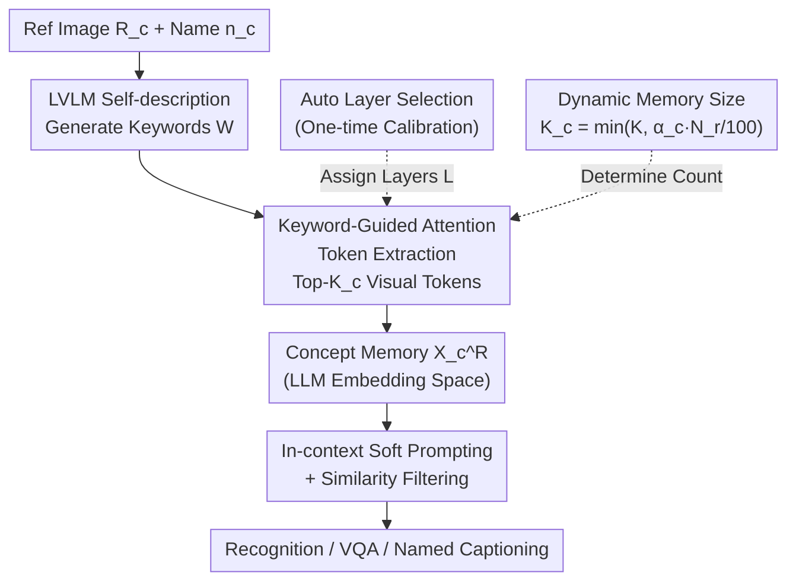

# Ego: Embedding-Guided Personalization of Vision-Language Models

**Conference**: CVPR 2026  
**Paper**: [CVF Open Access](https://openaccess.thecvf.com/content/CVPR2026/html/Seifi_Ego_Embedding-Guided_Personalization_of_Vision-Language_Models_CVPR_2026_paper.html)  
**Code**: None (Authors state implementation will be public; link not yet provided)  
**Area**: Multimodal VLM  
**Keywords**: VLM Personalization, Training-free, Visual Token Selection, Cross-modal Attention, Concept Memory  

## TL;DR
Ego identifies a small set of visual tokens that best represent a personalized concept (e.g., "my cup," "my dog") directly from the LVLM's internal cross-modal attention. These are stored as "concept memory" and injected as soft prompts into the context during inference. This approach is completely training-free, independent of external vision modules, and achieves SOTA performance across single-concept, multi-concept, and video personalization scenarios.

## Background & Motivation
**Background**: Personalization in LVLMs aims to enable a general model to recognize specific user entities (a particular person, pet, or object) and perform recognition, Q&A, or description using specialized names. Current mainstream approaches fall into three categories: (1) Test-time fine-tuning for each concept (e.g., MyVLM, Yo'LLaVA); (2) Training specialized personalization models on large-scale synthetic dialogue data (e.g., PVIT, RAP); (3) Training-free methods that rely on external vision modules (e.g., R2P uses retrieval, PeKit uses DINOv2 memory banks + segmentation networks).

**Limitations of Prior Work**: Each approach has significant drawbacks. Test-time fine-tuning must be repeated for every new concept, making it unscalable for edge devices. Training-based methods, even after training, still require re-processing reference images through the vision encoder during inference, causing context length bottlenecks and computational overhead, while often biasing towards synthetic data and failing in multi-concept scenarios. Training-free methods are bogged down by external modules and top-k retrieval, making them complex and slow.

**Key Challenge**: The "discriminative representation of a specific subject" required for personalization **already exists within powerful LVLMs**. These models can already correspond the same object across different images or video frames, implying they allocate discriminative embeddings to each object internally. However, existing methods either attempt to "teach" the model through additional training or compute separate representations using external encoders, failing to **directly leverage the model's existing internal representations**.

**Goal**: To support single-concept, multi-concept, and video personalization without training, architectural changes, or external modules, while maintaining inference overhead close to pure text prompting.

**Core Idea**: Use cross-modal attention from keywords to visual tokens to locate a few visual tokens that best represent a concept. These are aggregated into "concept memory" and injected as soft prompts during inference, allowing the model to remember and recall personalized concepts using its own internal embeddings.

## Method

### Overall Architecture
Ego consists of two phases. **Concept Introduction Phase**: Given a reference image(s) $\{R_c\}$ and a name $n_c$ for a concept $c$, the LVLM first describes the subject to generate key description words $W$. The cross-modal attention from these keyword tokens to visual tokens is analyzed to select the $K_c$ tokens with the highest attention, forming the visual memory $X_c^R$. This memory resides directly in the LLM's embedding space, requiring no original pixels. **Inference Phase**: The memories of all concepts $\{X_c^R, n_c\}$ are placed in the context as soft prompts. The model then determines if these concepts are present in the test image and responds accordingly. If the number of concepts exceeds context limits, a similarity filter is applied between the test image and concept memories.

Two critical designs facilitate this: **Dynamic Concept Memory Size** (small objects get fewer tokens, large subjects get more) determined by the LVLM's estimation of the subject's area, and **Automatic Layer Selection** to identify the layers most sensitive to visual understanding via a one-time calibration process.

### Key Designs

**1. Keyword-Guided Attention Token Extraction: Letting the Model Identify Key Patches**

The reference image is mapped by the vision encoder into $N_r$ visual tokens $X_R \in \mathbb{R}^{N_r \times D}$, containing both the subject and background. Directly feeding the entire image into the context is expensive and sensitive to background noise (a common failure mode for RAP and R2P). Ego retains only $K_c \ll N_r$ tokens that truly represent the subject. It first prompts the LVLM to describe the subject, yielding keywords $W$ (formula $T = \mathrm{LLM}(X_R, I)$). It assumes that visual tokens most relevant to the description tokens will receive the highest cross-modal attention. At layer $l$ and head $h$, the keyword-to-visual token cross-attention sub-matrix $A_{wr}^{l,h} \in \mathbb{R}^{N_w \times N_r}$ is extracted. The importance score for each visual token $j$ is calculated as:

$$I_j = \frac{1}{|L|}\sum_{l\in L}\frac{1}{H}\sum_{h=1}^{H}\left(\frac{1}{N_w}\sum_{n=1}^{N_w} A_{wr}^{l,h}[n,j]\right)$$

This aggregates scores across selected layers $L$, all heads, and all keywords. Visual tokens are sorted by $I_j$ to select the top $K_c$ tokens, which are then restored to their spatial order to form $X_c^R = X_R[P_{ordered}, :]$. For multiple reference images, top tokens from each are concatenated. The value of this step is that the discriminative signal comes entirely from the model's own attention, without needing external detection/segmentation networks or training.

**2. Dynamic Concept Memory Size: Adaptive Token Allocation by Subject Area**

Fixing $K$ tokens is sub-optimal—a shoe occupying a tiny area results in mostly background noise, while a high-resolution portrait needs more tokens to capture details. Ego reuses the LVLM’s capability by asking it "what percentage of the image does the subject occupy?" to obtain $\alpha_c$, then setting:

$$K_c = \min\!\left(K,\ \frac{\alpha_c \times N_r}{100}\right)$$

where $K \ll N_r$ is the maximum token budget per reference image. This ensures efficiency while focusing on subject attributes. Smaller objects automatically get fewer tokens, while larger subjects get more, suppressing context length and focusing memory.

**3. Automatic Layer Selection: One-time Calibration for Visually Sensitive Layers**

LVLM layers vary in abstraction. While visual-text interaction is strongest in middle-to-late layers, which specific layers are "vision-heavy" varies by model. Ego uses a one-time calibration: taking "single-category, single-instance" images from COCO 2017 with GT segmentation masks, it identifies which tokens belong to the object. The LVLM describes the foreground, and for each layer, the overlap between the top-K patches (by attention score) and the segmentation mask is calculated. Layers are ranked by average overlap, and the top $L$ layers are selected. This calibration is performed once per LVLM, and the selected layers are reused for all future concepts.

**4. In-context Soft Prompting + Similarity Filtering: Replacing Image Re-processing**

During inference, Ego injects the concept memories $\{X_c^R, n_c\}$ as soft prompts. Because the memory is already in the LLM's embedding space, **the vision encoder does not need to re-process reference images at test time**. The overhead is nearly identical to pure text prompting, providing a significant efficiency advantage over training-based or external-module methods. If the number of concepts exceeds context limits, irrelevant concepts are filtered based on the similarity between the test image tokens and the stored concept memories.

## Key Experimental Results
The backbone used is InternVL3-14B (some tests use Qwen2.5-VL-7B). Datasets, backbones, and evaluation protocols were unified across baselines. Tasks include recognition, VQA, and captioning recall.

### Main Results

Recognition Task (F1, InternVL3, 1 Ref Image; Intro Time refers to time to add a concept):

| Method | Type | Intro Time↓ | Single-Concept F1↑ | Multi-Concept F1↑ |
|------|------|-----------|-----------|-----------|
| RAP | Training (24h, 210k samples) | 24 hours | 77.0 | 95.1 |
| R2P | Training-free (Ext. Module) | 5.98s | 68.5 | N/A |
| **Ego** | Training-free | **1.40s** | **90.2** | **98.4** |

VQA Accuracy / Captioning Recall (1 Ref Image, InternVL3):

| Method | Single VQA (Yo'LLaVA) | Single Caption (MyVLM) | Multi VQA | Multi Caption | Video VQA |
|------|------|------|------|------|------|
| RAP | 97.6 | 90.0 | 53.7 | 43.6 | N/A |
| R2P | 94.0 | 82.0 | – | – | – |
| PeKit | 94.6 | 92.0 | 51.8 | 35.2 | 59.9 |
| **Ego** | 92.3 | 88.0 | **72.2** | **70.9** | **70.0** |

Ego slightly trails RAP in single-concept VQA (which RAP was specifically supervised on) but outperforms RAP by ~20 points in multi-concept scenarios. In multi-concept captioning recall, Ego exceeds RAP by nearly 30 points, and in Video VQA, it outperforms PeKit's pipeline by ~10 points. These complex tasks require selecting the correct concept before answering, highlighting Ego's superiority.

### Ablation Study
Recognition F1, InternVL3 + Yo'LLaVA, fixed 20% in-context token budget:

| Configuration | Visual Token % | Keywords Included | F1↑ | Note |
|------|------|------|------|------|
| Keywords Only | 0% | Yes | 71.3 | Text alone lacks discriminative power |
| Full Visual | 100% | No | 84.1 | All tokens from ref image |
| Full Visual + Keywords | 100% | Yes | 82.5 | Keywords actually act as interference |
| Uniform Sampling | 20% | No | 77.7 | Uniformly sampled 20% tokens |
| Ego (1-view) | 20% | No | 80.4 | Attention-based selection |
| **Ego (5-view)** | 20% | No | **85.7** | Multi-view outperforms Full Visual (+1.7) |

### Key Findings
- **Visual Memory > Textual Memory**: Using only keywords (71.3) is significantly worse than using visual tokens. Textual descriptions can even interfere (Full Visual+Keywords 82.5 < Full Visual 84.1).
- **Attention-based Selection > Uniform Sampling**: At a 20% budget, Ego 1-view (80.4) is better than Uniform (77.7), proving attention effectively locates critical patches. Ego 5-view (85.7) outperforms using all tokens (Full Visual) while using the same budget, validating the "quality over quantity" strategy.
- **Efficiency and Scale**: Concept introduction takes only 1.4s (vs 24h for RAP, 21.3s for PeKit). The method remains competitive even when using the smaller Qwen2.5-VL-7B.
- **Error Analysis**: RAP suffers from top-k retrieval bias (k=3) and fine-tuning bias, leading to over-prediction and performance collapse in multi-concept settings. PeKit uses a fixed similarity threshold, resulting in inconsistent recall across different concepts.

## Highlights & Insights
- **Extraction over Training**: The core insight is that powerful LVLMs already possess discriminative object embeddings. Personalization doesn't require additional training or external encoders; it simply requires "reading out" these internal states via attention. This shifts personalization from "adding information" to "extracting information."
- **LLM as a Soft Annotator**: Using the LVLM to estimate the subject area $\alpha_c$ to determine $K_c$ is a clever reuse of the model as a queryable tool, avoiding the need for a separate size predictor.
- **Proxy Supervision for Layer Selection**: Using COCO mask overlap as a one-time calibration to determine "vision-heavy" layers is a transferable idea for other probing-based works.
- **Embedding-level Memory**: Storing memories as LLM tokens rather than pixels drastically reduces inference overhead by bypassing the vision encoder for reference images during test time.

## Limitations & Future Work
- Ego relies heavily on the LVLM's inherent visual understanding; it may fail on older or weaker models. It also makes prompts model-specific.
- Limitation: The assumption that attention equals "importance" relies on keyword quality. If the self-description is inaccurate, the memory will be noisy. Furthermore, dynamic $K_c$ lacks ground-truth verification for the area estimation step.
- Scalability beyond current context limits (similarity filtering notwithstanding) remains to be tested for massive concept libraries.
- Future work: Replace attention-based importance with a calibrated token importance metric or use self-consistency checks for keyword generation to reduce memory noise.

## Related Work & Insights
- **vs MyVLM / Yo'LLaVA (Test-time Fine-tuning)**: These methods require training classification heads or prefix tokens for every concept. Ego is fully training-free, adds concepts in 1.4s, and natively supports multi-concept and video scenarios which the former do not address.
- **vs RAP / PVIT (Training-based)**: RAP uses LoRA on 210k samples and requires retrieval and re-processing images at runtime, failing in multi-concept tasks. Ego outperforms RAP by ~20 points in multi-concept VQA without training.
- **vs R2P / PeKit (Training-free with External Modules)**: R2P relies on external vision models and top-k retrieval, while PeKit uses DINOv2 and segmentation networks. Both add external dependencies. Ego uses only the LVLM's own attention and leads in multi-concept and video performance.

## Rating
- **Novelty**: ⭐⭐⭐⭐⭐ Extracting discriminative visual tokens from internal attention as concept memory is a fresh perspective that achieves personalization without training or external modules.
- **Experimental Thoroughness**: ⭐⭐⭐⭐ Unifies evaluation protocols across three tasks and two backbones with thorough ablations; however, some key analyses (layer selection details) are in the appendix.
- **Writing Quality**: ⭐⭐⭐⭐ Clear motivation and methodology; formulas are complete, though there’s a slight discrepancy between text (max) and formula (average) regarding attention aggregation.
- **Value**: ⭐⭐⭐⭐⭐ Training-free, low overhead, model-agnostic, and supporting multiple scenarios make it highly practical for edge-side personalized assistants. The unified evaluation protocol is also beneficial for future research.

<!-- RELATED:START -->

## Related Papers

- [\[ICML 2026\] Contextualized Visual Personalization in Vision-Language Models](../../ICML2026/multimodal_vlm/contextualized_visual_personalization_in_vision-language_models.md)
- [\[CVPR 2026\] Language-guided Frequency Modulation for Large Vision-Language Models](language-guided_frequency_modulation_for_large_vision-language_models.md)
- [\[CVPR 2026\] Diffusion Guided Chain-of-Vision for Large Autoregressive Vision Models](diffusion_guided_chain-of-vision_for_large_autoregressive_vision_models.md)
- [\[CVPR 2026\] Foundation Encoders Are All You Need for Preference-Aware Personalization](foundation_encoders_are_all_you_need_for_preference-aware_personalization.md)
- [\[CVPR 2026\] AGFT: Alignment-Guided Fine-Tuning for Zero-Shot Adversarial Robustness of Vision-Language Models](agft_alignment-guided_fine-tuning_for_zero-shot_adversarial_robustness_of_vision.md)

<!-- RELATED:END -->
