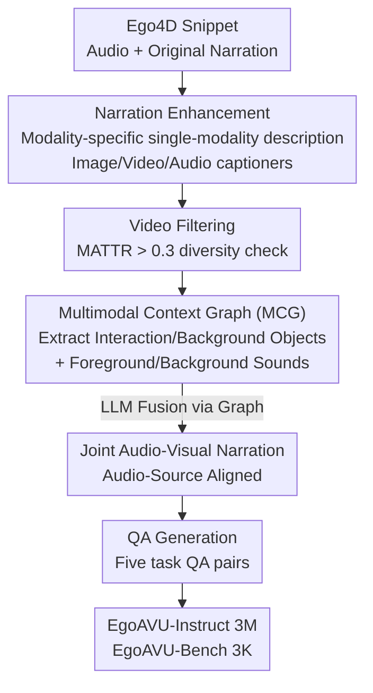

# EgoAVU: Egocentric Audio-Visual Understanding

**Conference**: CVPR 2026  
**Paper**: [CVF Open Access](https://openaccess.thecvf.com/content/CVPR2026/html/Seth_EgoAVU_Egocentric_Audio-Visual_Understanding_CVPR_2026_paper.html)  
**Code**: Project Page https://cs20s030.github.io/EgoAVU/ (No standalone repository seen)  
**Area**: Multimodal VLM / Egocentric Video / Audio-Visual Understanding  
**Keywords**: Egocentric video, Audio-visual understanding, Data engine, Multimodal Context Graph, MLLM instruction tuning

## TL;DR
Addressing the issue where existing MLLMs "see but don't listen" and mismatch audio with incorrect visual sources in egocentric videos, this paper proposes EgoAVU, a fully automated data engine. It uses modular open-source models to generate modality-specific narrations and an explicit Multimodal Context Graph (MCG) to model audio-source relationships. The engine produces 3 million training samples (EgoAVU-Instruct) and 3,000 human-verified evaluation samples (EgoAVU-Bench). After fine-tuning, the model achieves up to a 113% relative improvement on its own benchmark and successfully generalizes to other egocentric benchmarks.

## Background & Motivation
**Background**: Egocentric video (daily activities like cooking or assembly) is a critical data source for embodied AI and mixed reality. Its intense camera shake and narrow field of view make pure visual understanding difficult, whereas audio provides continuous and stable event cues (e.g., chopping sounds, water flow, tapping). Recent MLLMs (Qwen2.5-Omni, VideoLLaMA2, MiniCPM-o, etc.) are now capable of processing both visual and audio inputs simultaneously.

**Limitations of Prior Work**: The bottleneck lies in the data. On the training side, existing egocentric datasets (MultiHop-EgoQA, MM-Ego) are almost entirely derived from human narrations in Ego4D, which describe "human-object interactions" but lack environmental context and auditory diversity. On the evaluation side, existing benchmarks (EgoSchema, EgoTempo, EgoIllusion) primarily test vision; the few attempts to include audio-visual components (e.g., EgoTempo/EgoIllusion) rely on closed-source models like GPT-4o or Gemini for data generation, which is not scalable or reproducible. While exocentric audio-visual benchmarks are numerous, the multimodal dynamics of egocentric perspectives are fundamentally different.

**Key Challenge**: To enable models to perform joint "listen-and-watch" understanding, precisely aligned "audio-visual source" multimodal annotations are required. However, such annotations are extremely difficult to obtain automatically. The authors' tests found that directly feeding both audio and video to an MLLM for joint description leads to the model missing numerous sounds or binding sounds to incorrect visual events due to **modality bias and hallucination** (e.g., Qwen2.5-Omni has an audio inconsistency rate as high as 54.3%).

**Goal**: To build a **fully automated, open-source-only** data engine that generates "audio-source aligned, audio-visual joint" narrations and QAs from public egocentric data like Ego4D, enabling both large-scale training and reproducible evaluation.

**Key Insight**: Since joint multimodal inputs interfere with each other in MLLMs, a **divide-and-conquer** approach is adopted. Each model performs at its most reliable level in a single-modality setting (only watching or only listening), and an **explicit graph structure** is then used to stitch the cross-modal relationships back together.

**Core Idea**: A pipeline comprising "modular single-modality descriptions + Multimodal Context Graph (MCG) for explicit audio-source modeling + LLM fusion for joint narration + automated generation of five QA categories" to automatically produce difficult-to-acquire joint annotations.

## Method

### Overall Architecture
EgoAVU is a four-stage automated data production line. The input is raw egocentric video snippets from Ego4D with audio tracks (each paired with action narrations like `#C C holds a cup`), and the output consists of two datasets: EgoAVU-Instruct (3M samples) and EgoAVU-Bench (3K human-verified samples). The four steps are: **(1) Narration Enhancement**, using multiple open-source MLLMs to expand original narrations into fine-grained visual/auditory descriptions by modality; **(2) Video Filtering**, using the lexical diversity metric MATTR to filter out static or repetitive snippets; **(3) Audio-Visual Narration Generation**, first organizing single-modality cues into a Multimodal Context Graph (MCG), then letting an LLM fuse them into an audio-source aligned joint narration; **(4) QA Generation**, deriving question-answer pairs for five task categories from the joint narrations.

### Key Designs

**1. Modular Modality-specific Narration Enhancement: Bypassing Joint Hallucination with Single-Modality Reliability**

This step addresses the "joint input interference" bottleneck. The authors conducted a validation experiment on 200 random snippets, comparing Qwen2.5-Omni and MiniCPM-o in single-modality (only watch/only listen) vs. joint modality settings. In joint settings, Qwen2.5-Omni's audio inconsistency rate was 54.3% and visual was 25.4%, while MiniCPM-o reached 68.2% and 31.2%, respectively.

Based on this, EgoAVU **splits processing into three single-modality paths**: an image captioner (Qwen2.5-VL) for fine-grained object spatial descriptions of the center frame; Qwen2.5-Omni as a "video-only captioner" (audio removed) for coherent action sequences; and the same Qwen2.5-Omni as an "audio-only captioner" (visuals removed) to describe foreground sounds (e.g., tapping, hissing associated with human action) and background sounds (e.g., birds, wind). This results in time-aligned single-modality narrations where each model works in its most reliable configuration.

**2. MATTR Video Filtering: Screening for Audio-Visual Signal Richness**

Some snippets in enhanced narrations are monotonous or repetitive. The authors quantify "information richness" using lexical diversity: all segment narrations of a video are concatenated into text tokens $T_v = \{t_1, \dots, t_n\}$, and the Moving-Average Type-Token Ratio (MATTR) is calculated within a window of size $w$:

$$\text{MATTR}(T_v) = \frac{1}{n-w+1} \sum_{i=1}^{n-w+1} \frac{|\text{Uni.}(t_i, \dots, t_{i+w-1})|}{w}.$$

A higher MATTR indicates a greater variety of objects, actions, and sounds. With a threshold $\tau = 0.3$, the bottom 25% of static/repetitive snippets are removed, retaining 9,900 videos.

**3. Multimodal Context Graph (MCG) + Two-stage Fusion: Making Audio-Source Relationships Explicit**

This is the core design for merging separate narrations. The authors found that LLaMA-70B often fails to maintain audio-source correspondences when merging narrations directly because it has to **implicitly** retrieve which object the person is interacting with and which action caused which sound.

EgoAVU uses a two-stage process. **Stage 1**: LLaMA-70B extracts a structured Multimodal Context Graph (MCG) from enhanced narrations, listing nodes: Interaction Objects, Background Objects, Foreground Sounds (human-made or groundable environment sounds), and Background Sounds (audio-only). **Stage 2**: The enhanced narrations and MCG are fed to the LLM, requiring it to use the MCG's explicit cues as a template to generate a joint narration. This **externalizes cross-modal relationships** into an explicit structure, removing the need for "implicit reasoning."

**4. Five Task QA Generation: Covering Grounding, Temporal, and Hallucination Spectrum**

Five task types are designed. Open-ended: **SSA (Sound-Source Association)** to identify sounds and visual sources; **AVSN (Audio-Visual Segment Narration)** for time-specific descriptions; **AVDN (Audio-Visual Dense Narration)** for full-video coherence. Closed-ended: **TR (Temporal Reasoning)** via four-choice questions on event order; **AVH (Audio-Visual Hallucination)** via Yes/No questions on the presence of actions/objects/sounds. Results are evaluated using LLM-as-Judge (Qwen3-235B) and METEOR/ROUGE-L.

### Loss & Training
Standard MLLM instruction tuning using LLaMA-Factory. Qwen2.5-Omni (7B) was fine-tuned on EgoAVU-Instruct using both LoRA and full-parameter settings across 64 H100s, with a global batch size of 64 and 5 epochs.

## Key Experimental Results

### Main Results
Comparison of 7 open-source MLLMs vs. fine-tuned versions on EgoAVU-Bench. Open-ended tasks (SSA/AVDN/AVSN) report LLM-as-Judge scores S (1–5), METEOR (M), and ROUGE-L (R). Closed-ended (TR/AVH) report Accuracy.

| Model | SSA (S↑) | AVSN (S↑) | TR Acc↑ | AVH Acc↑ |
|------|----------|-----------|---------|----------|
| VideoLLaMA2 (7B) | 1.51 | 1.71 | 37.00 | 20.32 |
| MiniCPM-o (8B) | 1.43 | 2.06 | 26.44 | 21.76 |
| Qwen2.5-Omni (7B) [Strongest Baseline] | 1.50 | 1.99 | 53.20 | 42.69 |
| **Ours (LoRA, 7B)** | 3.15 | 2.45 | 64.31 | 61.69 |
| **Ours (Full, 7B)** | **3.20** | **2.63** | **67.84** | 60.12 |
| **Gain (%) vs Strongest Baseline** | **+113.3** | +27.6 | +27.2 | +30.8 |

Key Conclusions: (1) Current MLLMs perform **poorly** in joint audio-visual understanding—SSA scores are below 1.6/5 across baselines. (2) Fine-tuning on EgoAVU-Instruct provides **significant and consistent** gains. Generalizability: Improvements also seen on EgoTempo (+28.1%) and EgoIllusion (+7.2%).

### Ablation Study
The paper performs an error analysis by sub-modality rather than module removal, validating that "audio is the weakest link."

| Model | Action Acc↑ | Object Acc↑ | Sound Acc↑ |
|------|-------------|-------------|------------|
| Qwen2.5-Omni (7B) | 44.39 | 50.00 | 33.67 |
| **Ours (Full, 7B)** | **61.32** | **62.40** | **64.20** |

### Key Findings
- **Audio is the bottleneck for all MLLMs**: In TR and AVH, sound recognition accuracy is significantly lower than object/action recognition.
- **Data fills the specific gap**: Sound Acc in the AVH task surged from 33.67 to 64.20 after fine-tuning, the largest sub-item gain.
- **Self-improvement potential**: Demonstrates a "self-learning" loop where single-modality capabilities of MLLMs are used to generate data to improve their joint modality capabilities.

## Highlights & Insights
- **"Divide-and-conquer"** for data engineering: Splitting joint inputs to avoid hallucination and reassembling with a graph is highly transferable to other fusion scenarios.
- **MCG as external reasoning**: Moving cross-modal reasoning from internal latent space to an explicit structure allows weaker open-source models to merge data stably.
- **Error analysis as ablation**: Using sub-set accuracy (Action/Object/Sound) to prove the causal link between "audio-centric data" and "audio performance gain" is very effective.
- **Open-source ecosystem**: Avoiding closed-source dependencies (using Qwen3-235B instead of GPT-4 for judging) ensures scalability and reproducibility.

## Limitations & Future Work
- Data quality is capped by the performance of upstream open-source MLLMs; errors in single-modality captioners propagate through the pipeline.
- Reliance on LLM-as-Judge for open-ended tasks can introduce judge bias.
- Foreground/background sound classification can be ambiguous in edge cases, affecting annotation consistency.

## Related Work & Insights
- **Vs MultiHop-EgoQA / MM-Ego**: These lack the environmental context and audio diversity specifically addressed by EgoAVU's forced audio-source alignment.
- **Vs EgoTempo / EgoIllusion**: EgoAVU is fully open-source and provides 3 million samples, whereas these rely on expensive, non-reproducible closed-source generation.
- **Vs Exocentric Benchmarks**: Specifically addresses egocentric-only challenges like camera shake and ego-audio profiles.

## Rating
- Novelty: ⭐⭐⭐⭐ First systematic egocentric audio-visual data engine; MCG concept is novel.
- Experimental Thoroughness: ⭐⭐⭐⭐ Extensive baselines and cross-benchmark transfer.
- Writing Quality: ⭐⭐⭐⭐ Clear causal chain from motivation to design.
- Value: ⭐⭐⭐⭐⭐ Quantifies "visual bias" and provides high-utility data for embodied AI/AR communities.

<!-- RELATED:START -->

## Related Papers

- [\[ICLR 2026\] OmniVideoBench: Towards Audio-Visual Understanding Evaluation for Omni MLLMs](../../ICLR2026/multimodal_vlm/omnivideobench_towards_audio-visual_understanding_evaluation_for_omni_mllms.md)
- [\[CVPR 2026\] EgoSound: Benchmarking Sound Understanding in Egocentric Videos](egosound_benchmarking_sound_understanding_in_egocentric_videos.md)
- [\[CVPR 2026\] HAVE-Bench: Hierarchical Audio-Visual Evaluation from Perception to Interaction](have-bench_hierarchical_audio-visual_evaluation_from_perception_to_interaction.md)
- [\[CVPR 2026\] LifeEval: A Multimodal Benchmark for Assistive AI in Egocentric Daily Life Tasks](lifeeval_a_multimodal_benchmark_for_assistive_ai_in_egocentric_daily_life_tasks.md)
- [\[NeurIPS 2025\] Watch and Listen: Understanding Audio-Visual-Speech Moments with Multimodal LLM](../../NeurIPS2025/multimodal_vlm/watch_and_listen_understanding_audio-visual-speech_moments_with_multimodal_llm.md)

<!-- RELATED:END -->
