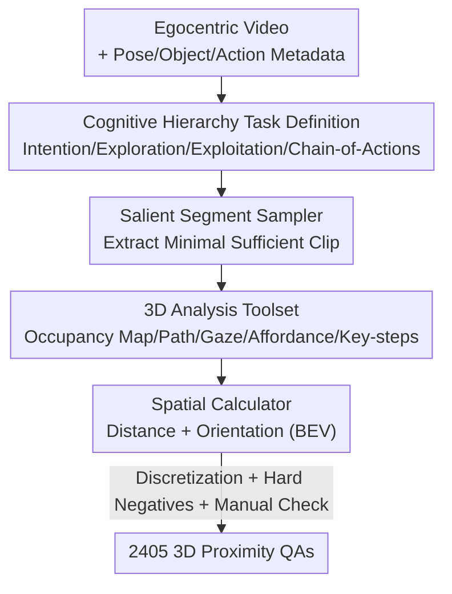

# EgoProx: Evaluating MLLMs on Egocentric 3D Proximity Reasoning Across a Cognitive Hierarchy

**Conference**: CVPR 2026  
**arXiv**: [2605.24456](https://arxiv.org/abs/2605.24456)  
**Code**: https://lijinzhao30.github.io/Egoprox/ (Project Page)  
**Area**: Multimodal VLM / First-person Video / Spatial Intelligence / Benchmark  
**Keywords**: First-person perspective, 3D Proximity Reasoning, Cognitive Hierarchy, Agent Data Engine, Spatial VQA

## TL;DR
EgoProx is the first benchmark to evaluate whether Multimodal Large Language Models (MLLMs) can perform "body-object" 3D proximity reasoning from a first-person perspective. It organizes tasks into four categories based on the human cognitive hierarchy: Intention, Exploration, Exploitation, and Chain-of-Actions. Utilizing an agent-based data engine with Gemini-2.5-Pro as the controller to orchestrate various 3D tools, it automatically generates 2,405 high-quality QAs. Results show that even GPT-5 and Gemini-2.5-Pro perform far below human levels, yet minimal instruction tuning significantly unlocks "dormant" spatial knowledge within the models' pre-training.

## Background & Motivation
**Background**: In daily life, humans constantly infer "3D proximity relationships"—the relative positions between their bodies and surrounding objects—to drive sequences of actions such as gazing, turning, moving, and grasping. This "perception-action" coupling is the core mechanism linking vision to behavior. While MLLMs have progressed rapidly, their ability to simulate such egocentric embodied spatial reasoning remains unexplored.

**Limitations of Prior Work**: Existing spatial reasoning benchmarks (e.g., ScanQA, VSI-Bench, OST-Bench) are mostly based on 3D scans or curated image sequences, focusing on "object/scene-centric" geometric reasoning while ignoring the "user-centric" ability to understand 3D proximity in daily activities. Conversely, existing first-person VQA benchmarks (e.g., EgoSchema, EgoPlan, EgoThink) primarily test causality, planning, and memory, with almost no focus on 3D proximity reasoning. Consequently, the intersection of "first-person + 3D proximity + perception-action coupling" remains a void.

**Key Challenge**: The difficulty lies in data construction. Previous VQA benchmarks relied on "MLLM generation + manual correction," but existing models themselves lack spatial intelligence, making it impossible to produce high-quality spatial QAs. Furthermore, different task types require distinct reasoning capabilities that a single base model cannot support.

**Goal**: (1) Define a set of first-person 3D proximity reasoning tasks covering "Intention → Exploration → Exploitation → Chain-of-Actions"; (2) Build a data engine capable of automated, controllable, and scalable high-quality QA production; (3) Systematically evaluate mainstream MLLMs to determine whether they lack spatial knowledge or simply cannot utilize it.

**Key Insight**: The authors draw an analogy to the "exploration-exploitation" trade-off in machine learning—human egocentric vision naturally unifies exploration and exploitation within a single perceptual stream, driven by intention. Thus, 3D proximity reasoning is decomposed along a "cognitive hierarchy," and specialized 3D tools are orchestrated via agents to bypass the bottleneck of models being unable to generate high-quality data.

**Core Idea**: Construct the first egocentric 3D proximity reasoning benchmark using a "cognitive hierarchy + agent tool orchestration" approach, and demonstrate via cross-task/cross-dataset instruction tuning that MLLM spatial knowledge is "dormant" rather than "missing."

## Method

### Overall Architecture
EgoProx consists of two main components: **Task Definition** (organizing 3D proximity reasoning into four VQA categories along the cognitive hierarchy) and the **Data Engine** (automatically converting long videos into QAs with 3D ground truth). The data pipeline follows a multi-tool serial execution: given an egocentric video with metadata (camera poses, object bounding boxes, action labels), an agent powered by Gemini-2.5-Pro selects the most informative clips via a "Salient Segment Sampler." It then chooses appropriate tools from a "3D Analysis Toolset" to compute spatial cues such as object positions, gaze targets, occupancy maps, and action chains. Finally, a "Spatial Calculator" converts these into structure 3D ground truths (distances/orientations/proximity), which are packaged into QAs after post-processing (discretization + hard negative sampling + manual verification).

### Key Designs

**1. Cognitive Hierarchy Task Definition: Organizing 3D Proximity Reasoning via Cognitive Chains**

Existing benchmarks typically partition tasks by reasoning types like "grounding / forecasting / planning." However, in egocentric video, intention perception and action execution are coupled. EgoProx instead organizes tasks by the human cognitive hierarchy: **Intention** predicts immediate head/gaze direction $\hat{m}$; **Exploration** predicts navigation steps $\hat{s}$ toward a goal $G$; **Exploitation** predicts how the next human-object interaction $\hat{h}$ occurs in 3D space; and **Chain-of-Actions** predicts a sequence of future actions $\{a_1, \dots, a_K\}$ and the relative spatial relationships between adjacent action locations $\{e_i\}$. Given a video segment $\mathcal{X}=\{x_1, \dots, x_T\}$, the model $f_\theta$ must select the correct answer $\mathcal{A}$ from a candidate set $\mathcal{C}$.

**2. Dual Proximity Metrics: Distinguishing Metric Transformations from Relative Relationships**

The authors define answers based on two quantifiable metrics. **Approximate proximity** encodes coarse-grained metric transformations at the last observed timestamp $T$, parameterized by angular rotation and translation (e.g., "how many degrees to turn, how far to walk"). **Relative proximity** describes discrete spatial relationships between entities at time $T$ using spatial predicates (left–right / front–back / near–far) to characterize directional topology rather than absolute distance.

**3. Salient Segment Sampler: Function-Driven Clipping for "Minimal but Sufficient" Evidence**

The sampler handles two functional categories: **Predictive tasks** (gaze in Intention, next-step interaction in Exploitation) are defined by future supervised events. Clips are taken leading up to the detection of a stable gaze or interaction, allowing $\{x_1, \dots, x_T\}$ to implicitly encode preparatory cues. **Planning tasks** (turning, exploration, CoA) require clips to provide partial but sufficient evidence to reach goal $G$. For exploration, $G$ must be visible in an early frame $x_t$ but invisible at $x_T$. For CoA, it identifies key-step dense regions to ensure the future steps remain inferable.

**4. 3D Analysis Toolset + Agent Orchestration: Geometric Tools Complementing MLLM Weaknesses**

Since MLLMs struggle with precise 3D estimation, this task is outsourced to deterministic geometric tools: **Occupancy Map Generator** (for obstacle avoidance), **Exploration Path Generator** (using 8-connected A* on occupancy maps), **Spatial Calculator** (computing translation distances and BEV angles), **Gaze Parser** (converting 2D eye-tracking to 3D gaze rays), and **Chain Constructor** (generating possible action sequences). This division of labor—geometric precision from tools and semantic diversity from LLMs—enables the scalable production of the benchmark.

## Key Experimental Results

### Main Results: Performance of MLLMs on EgoProx (Accuracy %, Random Baseline 20%)

| Model | Intention (Approx./Rel.) | Exploration (Approx./Rel.) | Exploitation (Approx./Rel.) | CoA (Act-Acc) |
|------|------|------|------|------|
| **Human Level** | 62.50 / 75.33 | 60.00 / 63.15 | 82.02 / 85.25 | 80.23 |
| Gemini-2.5-Pro | **42.75** / 37.13 | 36.90 / 29.32 | **50.24** / **45.17** | **25.14** |
| GPT-5 | 33.16 / **40.35** | **41.18** / **34.55** | 46.45 / **45.17** | 21.74 |
| Qwen2.5-VL-72B | 30.83 / 35.38 | 29.41 / 24.08 | 46.21 / 40.26 | 13.04 |
| LLaVA-NeXT-Video-7B | 23.06 / 27.19 | 18.72 / 23.56 | 31.04 / 29.29 | 1.09 |

**Observations**: (1) Even GPT-5/Gemini-2.5-Pro perform significantly below humans, especially in **Chain-of-Actions** where a massive performance gap exists; (2) Scaling model parameters provides limited gains, consistent with recent findings in 3D spatial understanding benchmarks.

### Ablation Study: Cross-Task Instruction Tuning (Qwen2.5-VL-7B, 800 samples/task)

| Tuning Configuration | Intention (Approx.) | Exploration (Approx.) | Exploitation (Approx.) |
|------|------|------|------|
| Qwen2.5-VL-7B (Baseline) | 33.68 | 27.27 | 38.63 |
| + Intention Tuning | — | **32.09** | **64.93** |
| + Exploration Tuning | 45.34 | — | 45.26 |
| + Exploitation Tuning | **56.48** | 27.27 | — |

Minimal tuning on one task improves others (e.g., Intention tuning boosts Exploitation from 38.63 to 64.93), supporting the "dormant knowledge" hypothesis.

### Cross-Dataset Instruction Tuning
Tuning on one dataset (e.g., ADT) improves proximity reasoning on another (e.g., EgoExo4D), demonstrating that spatial knowledge is shared across domains despite significant visual shifts.

### Key Findings
- **Dormant Capability**: Substantial improvements from small-scale tuning suggest a bottleneck in "invoking" spatial knowledge rather than a lack of the knowledge itself.
- **Valid Cognitive Hierarchy**: Intention tuning provides the highest cross-task gains, validating it as the fundamental signal driving localization and action.
- **Scale is Not the Solution**: Increasing parameters does not automatically solve 3D proximity reasoning, distinguishing it from standard VQA scaling laws.

## Highlights & Insights
- **Bypassing Model Bottlenecks**: Outsourcing 3D precision to geometric tools while using MLLMs for semantics is a key strategy for scaling spatial benchmarks.
- **Cognitive Hierarchy as a Principle**: Organizing by cognitive stages rather than reasoning types provides a benchmark structure rooted in human priors that can be validated experimentally.
- **Cross-Task Positive Transfer**: The ability of intention data to improve exploitation tasks suggests that spatial intelligence is integrated within the model, providing a path for data-efficient training.

## Limitations & Future Work
- **Data Source Constraints**: Reliance on EgoExo4D and ADT results in missing labels (e.g., EgoExo4D lacks exploration tasks).
- **Dependency on Gemini-2.5-Pro**: The generation quality is tied to a specific closed-source model, impacting reproducibility.
- **Limited Scale**: At 2,405 samples, the benchmark is high-quality but significantly smaller than datasets focused on volume, potentially leading to statistical variance in complex tasks like CoA.

## Related Work & Insights
- **vs. Object-Centric 3D VQA**: Unlike ScanQA or VSI-Bench, this work focuses on user-centric proximity in daily activities.
- **vs. Egocentric VQA**: While EgoSchema or EgoPlan focus on causality and memory, EgoProx is the first to evaluate 3D proximity cognitive reasoning.
- **vs. Spatial Representation Enhancement**: Unlike methods using explicit 3D modalities (e.g., point clouds), this benchmark evaluates the model's ability to infer 3D proximity from 2D video alone.

## Rating
- **Novelty**: ⭐⭐⭐⭐⭐ First first-person 3D proximity benchmark with a cognitive hierarchy and agent-based engine.
- **Experimental Thoroughness**: ⭐⭐⭐⭐ Comprehensive evaluation across models and tuning regimes, though constrained by data sources.
- **Writing Quality**: ⭐⭐⭐⭐ Clear formalization of tasks and well-motivated framework.
- **Value**: ⭐⭐⭐⭐⭐ Provides a quantifiable measure for embodied spatial intelligence with direct implications for AR and robotics.

<!-- RELATED:START -->

## Related Papers

- [\[CVPR 2026\] LASAR: Towards Spatio-temporal Reasoning with Latent Cognitive Map](lasar_towards_spatio-temporal_reasoning_with_latent_cognitive_map.md)
- [\[CVPR 2026\] Think360: Evaluating the Width-centric Reasoning Capability of MLLMs Beyond Depth](think_360_evaluating_the_width-centric_reasoning_capability_of_mllms_beyond_dept.md)
- [\[ICLR 2026\] EgoHandICL: Egocentric 3D Hand Reconstruction with In-Context Learning](../../ICLR2026/multimodal_vlm/egohandicl_egocentric_3d_hand_reconstruction_with_in-context_learning.md)
- [\[CVPR 2026\] EgoSound: Benchmarking Sound Understanding in Egocentric Videos](egosound_benchmarking_sound_understanding_in_egocentric_videos.md)
- [\[CVPR 2026\] CogniVerse: Revolutionizing Multi-Modal Retrieval-Augmented Generation with Cognitive Reflection and Geometric Reasoning](cogniverse_revolutionizing_multi-modal_retrieval-augmented_generation_with_cogni.md)

<!-- RELATED:END -->
