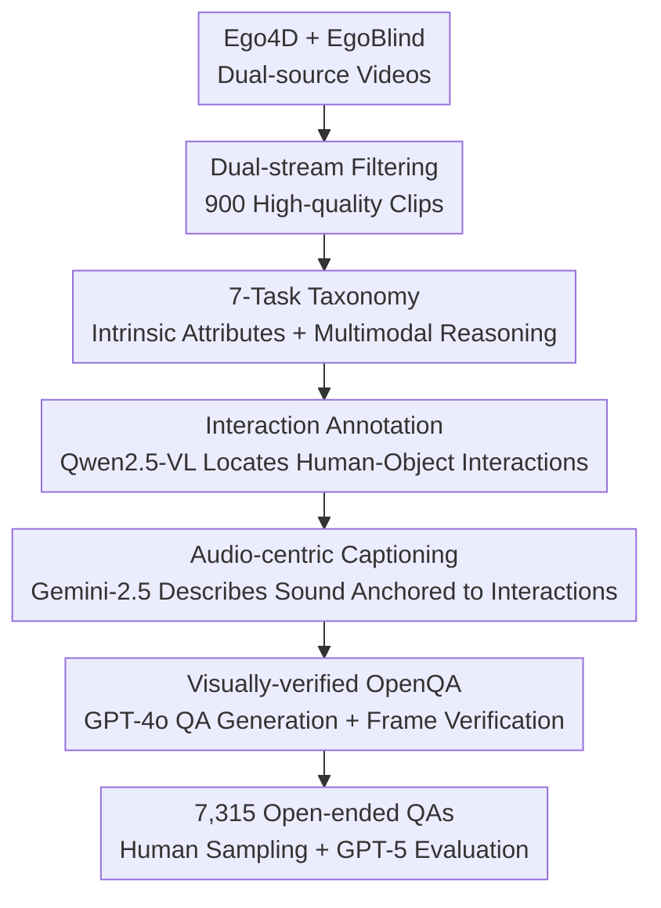

# EgoSound: Benchmarking Sound Understanding in Egocentric Videos

**Conference**: CVPR 2026  
**arXiv**: [2602.14122](https://arxiv.org/abs/2602.14122)  
**Code**: https://groolegend.github.io/EgoSound/ (Project Page)  
**Area**: Multimodal VLM / Audio-Visual Understanding / Benchmark  
**Keywords**: Egocentric Perspective, Sound Understanding, Audio-Visual QA, MLLM Evaluation, Automated Data Generation

## TL;DR
EgoSound is the first benchmark to systematically evaluate the "egocentric sound understanding" capabilities of Multimodal Large Language Models (MLLMs). By merging Ego4D and EgoBlind data sources and defining a 7-task taxonomy covering intrinsic sound perception and cross-modal reasoning, it utilizes a three-stage automated pipeline—"interaction annotation → audio-centric captioning → visually-verified OpenQA"—to produce 7,315 open-ended QAs across 900 video segments. Experiments on 9 SOTA omni models show a maximum accuracy of only 56.7% (compared to 83.9% for humans), exposing significant weaknesses in fine-grained spatial and causal sound reasoning.

## Background & Motivation
**Background**: MLLMs are progressing rapidly in vision-language understanding, capable of complex visual QA and reasoning. Egocentric video understanding has also seen numerous benchmarks such as EgoVQA, EgoTaskQA, EgoSchema, EgoThink, AMEGO, and EgoTempo.

**Limitations of Prior Work**: These egocentric benchmarks are almost entirely "vision-centric"—focusing only on visible events and treating audio as secondary or discarding it entirely. However, human perception is inherently multi-sensory; **sound** carries crucial cues that vision often lacks: spatial layout, off-screen events, and the causality or intent behind interactions. For the visually impaired, sound is a lifeline for navigation and situational awareness rather than a mere supplement.

**Key Challenge**: In egocentric scenarios, audio and vision are deeply coupled (e.g., a "hissing" sound or a sudden metallic "clang" implies off-screen or imminent events). Yet, existing evaluations either lack sound-related questions or rely on closed-set multiple-choice questions from single data sources, failing to systematically test a model's ability to "hear and understand" the first-person world. While Audio-Visual QA benchmarks like SpatialSoundQA, SAVVY, and Magnet exist, they do not adopt an egocentric perspective.

**Goal**: To fill the gap in "egocentric + sound understanding" evaluation by addressing three sub-problems: (1) what data can cover both "vision-guided" and "sound-dependent" experiences; (2) what task taxonomy can systematically distinguish between intrinsic sound attributes and cross-modal reasoning; and (3) how to generate high-quality, guess-proof open-ended QA at scale.

**Key Insight**: The authors observe that "physical interactions are the primary source of meaningful sound events," anchoring data construction in human-object/human-human interactions. Additionally, they introduce the EgoBlind dataset—recorded by blind individuals and naturally audio-centric—to complement Ego4D’s daily activities, forcing models into scenarios where "listening" is truly required.

**Core Idea**: Construct EgoSound, the first egocentric sound understanding benchmark, using a sound-centric, visually-verified automated pipeline to generate OpenQA and expose auditory weaknesses via a 7-task taxonomy.

## Method

### Overall Architecture
EgoSound is essentially a **data benchmark**. Its core outputs consist of a multi-source video collection, a 7-task classification system, and a three-stage pipeline that automatically converts video into high-quality sound QA. The process involves: strictly filtering 900 high-quality clips from Ego4D and EgoBlind; applying a pipeline for "Interaction Annotation → Audio-centric Captioning → Visually-verified QA Construction" using different models (Qwen2.5-VL for interactions, Gemini-2.5 for audio captions, GPT-4o for QA generation with frame verification); and finally obtaining 7,315 OpenQA items evaluated by humans and GPT-5 across 9 omni models.

### Key Designs

**1. Complementary Dual-source Data: Balancing "Visible" and "Must-Listen" Scenarios**
Egocentric sound benchmarks risk "data bias" if they only use daily activity videos where models can guess correctly via vision alone. EgoSound incorporates two distinct sources: Ego4D provides large-scale daily activities like sports, cooking, and playing instruments (260 clips, avg. 105.6s), while EgoBlind, recorded by blind individuals, is naturally centered on auditory navigation (640 clips, avg. 40.5s). The inclusion of EgoBlind forces "sound is critical" scenarios, spanning the spectrum from vision-guided to sound-dependent.

**2. Dual-stream Filtering: Pruning Ineffective Segments in Both Modalities**
To create high-quality sound QA, long periods of silence, noise, or static frames must be removed. The authors designed independent filters: the audio stream discards segments with silence, excessive background noise, or unintelligible speech; the visual stream removes static or monotonous frames, retaining dynamic human activities and rich object interactions. This ensures high information density where both modalities are meaningful.

**3. 7-Task Taxonomy: Hierarchical Diagnosis of Sound Understanding**
The 7-task taxonomy is split into two levels: **Intrinsic Sound Attributes** and **Multimodal Perception & Reasoning**. The intrinsic level includes **Sound Characteristics (timbre/loudness/texture), Counting (sound event/repetition/vocal frequency), and Temporal Attribute (duration/timing/evolution)**, which can be answered via audio alone. The multimodal level includes **Spatial Location (3D position relative to observer), Sound Source Identification (grounding sound to objects/actions), Inferential Causality (inferring intent or cause), and Cross-Modal Reasoning (inter-modal explanation)**. This hierarchy allows for precise diagnostic ablation.

**4. Three-stage Generation Pipeline: Anchoring with Interaction and Visual Verification**
Generic video descriptions often miss key sound details, and generated QA is prone to hallucinations. The authors split the pipeline into three roles: ① **Interaction Annotation**: Qwen2.5-VL labels timestamped interactions, serving as contextual anchors. ② **Audio-centric Captioning**: Gemini-2.5 uses interaction labels to describe sound sources, acoustic features, spatial positions, and causal reasons, transcribing all speech to create fine-grained sound annotations. ③ **Visually-verified QA Construction**: To reduce hallucinations, GPT-4o generates questions based on the captions and video frames, requiring each answer to have visual evidence in the frames, and uses an OpenQA format to prevent guessing.

### Evaluation Protocol
The 7,315 QAs are evaluated as "open-ended descriptive answers." GPT-5 acts as an automated judge to determine factual consistency with reference answers, outputting **Accuracy** (0–100%) and **Score** (0–5, where 5 is perfectly correct). To ensure reliability, 350 items were manually verified by fluent researchers, yielding 92.1% accuracy and a 4.3 average score. Gemini was excluded from the evaluated models to avoid self-bias.

## Key Experimental Results

### Comparison with Existing Egocentric QA Benchmarks

| Benchmark | Duration | Clips | QAs | Tasks | Sound Qs | Multi-source | Open-ended |
|-----------|----------|-------|-----|-------|----------|--------------|------------|
| EgoVQA | (25,100)s | 520 | 0.6k | 5 | ✗ | ✗ | ✓ |
| EgoTaskQA | 25s | 2336 | 40k | 4 | ✗ | ✗ | ✓ |
| EgoSchema | 3min | 1981 | 5k | - | ✗ | ✗ | ✗ |
| AMEGO | 14min | 100 | 20.5k | 8 | ✗ | ✗ | ✗ |
| EgoCross | 22.5s | 798 | 0.95k | 4 | ✗ | ✓ | ✓ |
| **Ours (EgoSound)** | **59s** | **900** | **7.3k** | **7** | **✓** | **✓** | **✓** |

EgoSound is the only benchmark satisfying "sound questions + multi-source + open-ended" criteria.

### Main Results: Evaluation of 9 MLLMs (Avg. Accuracy% / Score)

| Model | Avg. Accuracy | Avg. Score | Note |
|-------|---------------|------------|------|
| **Human** | 83.9 | 3.9 | 350 samples |
| Qwen3-Omni-Thinking-30B | **56.7** | 3.0 | Best Model |
| Qwen3-Omni-Instruct-30B | 51.9 | 2.8 | |
| video-SALMONN 2+ -72B | 46.6 | 2.5 | Largest Open-source |
| MiniCPM-o 2.6-8B | 40.4 | 2.2 | |
| Qwen2.5-Omni-7B | 39.8 | 2.1 | |
| EgoGPT-7B | 34.3 | 2.0 | Egocentric-specific |
| VideoLLaMA2.1-AV-7B | 20.5 | 1.3 | Weakest |

The gap between the best model and humans exceeds 27% (56.7 vs 83.9). Most models performed significantly worse on **Spatial Location** and **Sound Characteristics** tasks.

### Ablation Study (Qwen3-Omni-Thinking-30B)

| Task Group | AV Input | Audio-only | Note |
|------------|----------|------------|------|
| Sound-dependent 3 tasks | 50.3 | 44.3 | Small drop ~6 pts |
| Multimodal 4 tasks | — | >20% Drop | Significant degradation |
| └ Spatial Location | — | −28.1 pts | Largest drop |
| └ Inferential Causality | — | −24.9 pts | Second largest |

### Key Findings
- **Sound is a Major Weakness**: Capabilities models possess in the visual domain (attribute recognition, localization) degrade significantly in the sound domain.
- **Scale is Not a Panacea**: While the 72B video-SALMONN 2+ outperforms its 7B version, it still trails the 30B Qwen3-Omni—parameter count does not guarantee better auditory reasoning.
- **Egocentric Pre-training Gains are Minimal**: EgoGPT-7B underperformed versus general omni models, suggesting that training on egocentric visual data does not inherently improve audio-visual grounding.
- **Audio-only Ablation Validates Taxonomy**: The drop in performance on multimodal tasks when vision is removed validates that the 7-task hierarchy correctly distinguishes between sound-only and multi-sensory reasoning.

## Highlights & Insights
- **EgoBlind is a Masterstroke**: Incorporating data from blind users ensures "audio-essential" scenarios, making the benchmark more robust than simply adding sound-related questions to standard video.
- **Role Assignment in Pipelines**: Distributing tasks (Qwen for interaction, Gemini for caption, GPT-4o for QA) and enforcing visual evidence constraints effectively suppresses hallucinations.
- **OpenQA with LLM Judges**: Moving away from multiple-choice questions toward GPT-5 judgment of factual consistency provides a truer measurement of understanding and prevents guessing strategies.

## Limitations & Future Work
- **Dependency on Generator Models**: Although human verification passed at 92.1%, the pipeline remains susceptible to the systematic biases of the teacher models (e.g., Gemini's acoustic descriptions).
- **Scarce Egocentric-specific Samples**: Conclusions regarding the effectiveness of egocentric pre-training are based on a limited number of specialized models (e.g., EgoGPT).
- **Scale**: The 900-clip dataset is relatively small compared to massive vision-only benchmarks; future work could scale to varied acoustic environments.

## Related Work & Insights
- **Comparison to Vision-centric Benchmarks**: While EgoSchema or AMEGO focus on temporal memory and visual cognition, EgoSound shifts the focus to auditory-visual cues for grounding.
- **Bridge to Audio-VQA**: Unlike SpatialSoundQA, EgoSound specifically addresses the egocentric perspective, which is vital for embodied AI and assistive technology.
- **Direction for MLLM Research**: The study highlights that omni-models "see but do not listen carefully," pointing toward the need for balanced multimodal training that treats audio as a first-class citizen.

## Rating
- Novelty: ⭐⭐⭐⭐⭐ First egocentric sound benchmark with a unique dual-layer taxonomy.
- Experimental Thoroughness: ⭐⭐⭐⭐ Broad model coverage and insightful ablation; could benefit from more egocentric-specific model comparisons.
- Writing Quality: ⭐⭐⭐⭐ Clear motivation and logically consistent task design.
- Value: ⭐⭐⭐⭐⭐ Strongly pushes the field toward multi-sensory egocentric intelligence.

<!-- RELATED:START -->

## Related Papers

- [\[CVPR 2026\] ViKey: Enhancing Temporal Understanding in Videos via Visual Prompting](vikey_enhancing_temporal_understanding_in_videos_via_visual_prompting.md)
- [\[CVPR 2026\] Hear you are: Teaching LLMs Spatial Reasoning with Vision and Spatial Sound](hear_you_are_teaching_llms_spatial_reasoning_with_vision_and_spatial_sound.md)
- [\[NeurIPS 2025\] In the Eye of MLLM: Benchmarking Egocentric Video Intent Understanding with Gaze-Guided Prompting](../../NeurIPS2025/multimodal_vlm/in_the_eye_of_mllm_benchmarking_egocentric_video_intent_understanding_with_gaze-.md)
- [\[CVPR 2026\] EgoProx: Evaluating MLLMs on Egocentric 3D Proximity Reasoning Across a Cognitive Hierarchy](egoprox_evaluating_mllms_on_egocentric_3d_proximity_reasoning_across_a_cognitive.md)
- [\[CVPR 2026\] Generate, Analyze, and Refine: Training-Free Sound Source Localization via MLLM Meta-Reasoning](generate_analyze_and_refine_training-free_sound_source_localization_via_mllm_met.md)

<!-- RELATED:END -->
