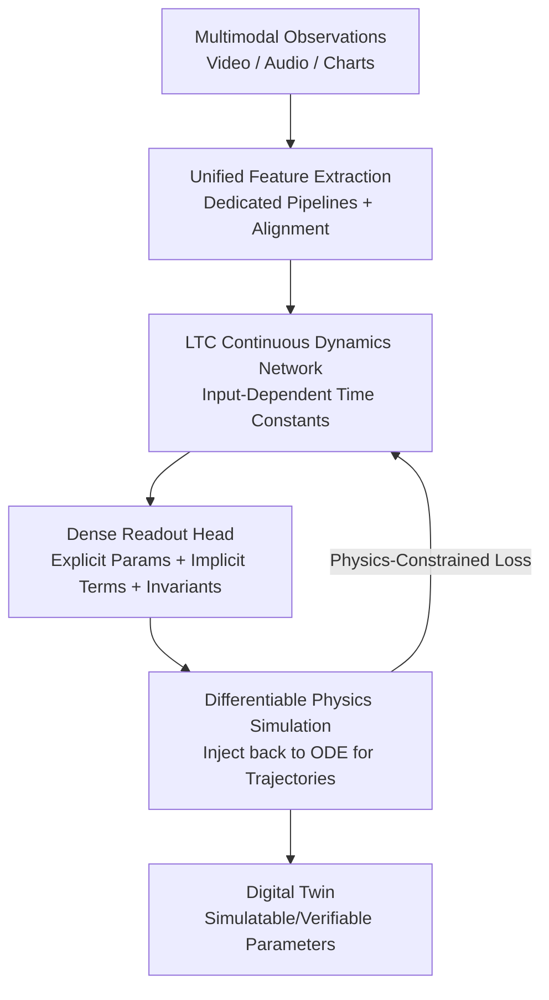

# EMMA: Extracting Multiple physical parameters from Multimodal Data

**Conference**: CVPR 2026  
**arXiv**: [2605.24047](https://arxiv.org/abs/2605.24047)  
**Code**: https://github.com/ImpactLabASU/EMMA-CVPR2026 (Available)  
**Area**: Multimodal VLM / Physical Parameter Identification / Digital Twin  
**Keywords**: Inverse Modeling, Multimodal, Liquid Time-Constant Networks, Physics-Constrained Loss, Implicit Dynamics

## TL;DR
EMMA aligns video, audio, and chart modalities into a Liquid Time-Constant (LTC) network, combined with differentiable physics simulation and physics-constrained losses. It performs **unsupervised** one-shot identification of all identifiable parameters in a dynamical system—including unobservable forced inputs in video, implicit dynamics terms not measurable by any modality, and calibration invariants such as coordinate origins and initial conditions. It significantly outperforms baselines using only video or equation discovery on 75 Delfys videos and real rover/drone platforms.

## Background & Motivation

**Background**: Directly learning the dynamical parameters (pendulum length, damping, gravitational acceleration, motor coefficients, etc.) of physical systems from real-world videos is a crucial step in constructing "digital twins" for autonomous platforms like drones and rovers. This is essentially an inverse modeling problem—inferring latent physical parameters from observable trajectories. Recent mainstream approaches focus on "video-only" methods (Vid2Param, RISP, Delfys, PAIG, etc.) because passive cameras are inexpensive and ubiquitous compared to intrusive sensors.

**Limitations of Prior Work**: Purely video-based methods suffer from several critical flaws. ① **Forced inputs are invisible**: A rover video might show wheel orientation but not the power commands, making kinematic inversion ill-posed; ② **Implicit dynamics are unmeasurable**: Terms like frictional resistance or terrain-dependent drag cannot be directly measured by any modality but substantively shape system behavior; ③ **Dependency on known invariants**: Many methods assume known initial conditions, coordinate origins, and fixed reference frames, whereas in real videos, camera poses, scene geometry, and absolute origins are unknown; ④ **Limited parameter recovery**: Most can only recover a single or a few parameters.

**Key Challenge**: Video provides "opportunistic" but incomplete observations—key state variables are often occluded or simply not present in the pixels. A single modality can neither complete the forced inputs nor identify implicit terms, while hard-coding priors (initial values/coordinates) fails in real-world scenarios.

**Goal**: Develop a unified framework to simultaneously address these four limitations—jointly inferring explicit parameters, implicit dynamical components, and calibration invariants.

**Key Insight**: The authors observe that **different modalities are complementary**—audio can encode forced inputs invisible to video (the acoustic characteristics of wheel rotation are strongly correlated with motor speed) and charts/sensor images can supplement time series. Furthermore, **continuous-time LTC networks** possess input-dependent time constants, making them naturally suited for modeling continuous dynamics with forcing across heterogeneous modalities.

**Core Idea**: Align multimodal features into a unified time series, use an LTC network to learn continuous dynamics in latent space while simultaneously reading out physical parameters, and then close the loop with differentiable physics simulation trained end-to-end via physics-constrained loss (rather than parameter ground truth).

## Method

### Overall Architecture
EMMA aims to solve: "given an opportunistic multimodal observation, infer all identifiable parameters $\boldsymbol{\theta}\in\mathbb{R}^K$ of the dynamical system." The system dynamics are represented as a parameterized continuous ODE $\frac{d\mathbf{x}(t)}{dt}=f(\mathbf{x}(t),\mathbf{u}(t);\boldsymbol{\theta})$, where $\mathbf{u}(t)$ is the exogenous forced input often occluded in video. The pipeline consists of three stages: **① Unified Multimodal Feature Extraction**—video, audio, and images pass through dedicated pipelines and are concatenated after time alignment; **② LTC Dynamics Modeling**—an LTC network with input-dependent time constants models continuous dynamics in latent space, with a dense readout head simultaneously regressing physical parameters and calibration invariants; **③ Differentiable Physics Simulation Loop**—the estimated parameters are injected back into the known ODE to simulate trajectories, and gradients are backpropagated end-to-end using physics-constrained losses to align with observations. The entire process is unsupervised with respect to parameters: training relies solely on physical consistency without any ground truth parameters.

### Key Designs

**1. Unified Multimodal Feature Extraction: Aligning Heterogeneous Signals into One Time Grid**

The limitation is that a single video modality misses forced inputs and implicit cues, necessitating multimodal fusion. However, video frames, 44.1 kHz audio, and chart pixels vary wildly. EMMA equips each modality with a dedicated pipeline: **Video** uses five stages (YOLOv11 detection with 0.85 threshold → edge detection removal + temporal stability filtering → Kalman filtering for $[x,y,v_x,v_y]$ smoothing → pixel-to-physical calibration, e.g., $\theta=\arctan\frac{y-y_p}{x-x_p}$ → weighted moving average denoising) to output physical coordinates $\mathbf{p}(t)$; **Audio** is resampled to 22.05 kHz, processed via STFT for RMS energy/spectral centroid/peak frequency to output acoustic features $\mathbf{w}(t)$; **Images/Charts** use PIL+OpenCV to discretize curve colors into $(x,y)$ time-series points $\mathbf{m}(t)$. All are interpolated to match video frame timestamps and concatenated into a unified state vector $\mathbf{x}(t)=[\mathbf{p}(t);\mathbf{w}(t);\mathbf{m}(t)]\in\mathbb{R}^\{D_{\text{in}}\}$. Missing modalities are handled via zero-padding or learnable embeddings. Authors verified that replacing the detector with unsupervised Farneback optical flow yields comparable accuracy, suggesting the core contribution lies in the LTC physics layer rather than specific feature extractors.

**2. Audio Linear Prior: Recovering Occluded Forced Inputs from Sound**

Videos cannot see the power commands of rover wheels, making kinematic inversion ill-posed—this is where audio compensates. The authors observed (supported by manufacturer datasheets) that in non-flight conditions, the dominant tonal components of acoustic signals vary approximately linearly with rotor/wheel speed. Thus, a linear prior $f_{\mathrm{tone}}(t)\approx\alpha\,v(t)+\beta$ is applied to audio, where $f_{\mathrm{tone}}(t)$ is the spectral peak frequency from $\mathbf{w}(t)$ and $v(t)$ is the physical speed. The affine coefficients $\alpha,\beta$ are not fixed but learned by the LTC network as **calibration invariants**. This allows audio to reconstruct the missing forced input $\mathbf{u}(t)$, making parameter estimation well-posed even under occlusion.

**3. LTC Network: Modeling Forced Inputs and Implicit Dynamics via Input-Dependent Time Constants**

This is the core of EMMA. Standard RNNs/Neural ODEs have fixed time constants and respond sluggishly to forced continuous systems. The evolution of each LTC cell is:

$$\frac{dh_i}{dt}=\underbrace{\frac{-h_i}{\frac{\tau_i}{1+\tau_i f_{NN}(h_i,u,t,w_{NN})}}}_{\text{Modeling Forced Input}}+\underbrace{f_{NN}(h_i,u,t,w_{NN})A}_{\text{Modeling Physics-Consistent Dynamics}}$$

The time constant $\frac{\tau_i}{1+\tau_i f_{NN}(\cdot)}$ in the first term is **input-dependent**, allowing the response speed to adapt based on multimodal inputs—key for modeling the forced input $u(t)$. The second term is a set of hidden outputs satisfying a differential equation. Since the hidden dimension (64) exceeds the actual system state dimension, **the redundant hidden variables naturally provide capacity to represent multiple implicit dynamics terms** (e.g., friction). The paper reports that for forced inputs, LTC achieves 25% lower parameter error than Neural ODE and 5% lower than CT-GRU.

**4. Dense Readout Head: Simultaneous Output of Physical Parameters and Invariants**

Once the LTC learns the latent trajectory, it maps it back to interpretable physical quantities and calibrates unknown origins/initial values. EMMA's dense head performs two tasks: **Physical parameters** are read out via non-linear mapping with Sigmoid activation (per Universal Approximation Theorem) and mapped to physical scales via de-normalization $\theta_k=\big(1+(0.5-\bar{\boldsymbol{\theta}}_k)\cdot\frac{95}{100}\big)\cdot\theta_k^{\text{nom}}$ ($\theta_k^{\text{nom}}$ is the nominal value); **Calibration invariants** are modeled using additional cells with ReLU activation that vary linearly with hidden inputs and loss gradients. Estimated parameters are injected into the known ODE for end-to-end training via differentiable simulation—crucially, there is **zero supervision on parameters**. Training is driven only by physics loss, requiring no ground truth parameters, enabling EMMA to learn initial conditions and suspension points from real video without priors.

### Loss & Training
The total loss is the physics consistency loss: $\mathcal{L}_{\text{total}}=\mathcal{L}^{cal}_{\text{traj}}+\lambda_{\text{param}}\mathcal{L}_{\text{param}}$. The **Calibrated Trajectory Loss** $\mathcal{L}^{cal}_{\text{traj}}=\sum_i M_{ii}\frac{1}{T_{\text{sim}}}\sum_t\lVert x_i(t)-\gamma_i-x_{i,\text{sim}}(t)\rVert^2$ is calculated only on measured states ($M_{ii}$ is 1 if measured, 0 otherwise), where $\gamma_i$ is the state calibration read out via ReLU. The **Parameter Constraint Loss** $\mathcal{L}_{\text{param}}$ uses ReLU to penalize violations of positivity or boundary limits. Optimization uses AdamW + cosine annealing, with 64 LTC hidden units, 6-step ODE unfolding, input dimension 100, window 16, batch 32, and 40 epochs; video/audio processed via YOLOv11, OpenCV, librosa, and MoviePy.

## Key Experimental Results

### Main Results: Delfys Benchmarks (75 Videos, Single/Multiple Parameters)

| System | Parameter | EMMA | Delfys | PySINDy | GT |
|------|------|------|--------|---------|-----|
| Pendulum 150cm | $L$ [m] | **1.50±0.004** | 1.30 | 1.24 | 1.50 |
| Torricelli (Med) | $k$ | **0.0132±8e-4** | 0.0132 | 0.027 | 0.0128 |
| Slider (High) | $a$ [m/s²] | 3.14±0.05 | 3.44 | 2.63 | 3.141 |
| LED (Low) | $\gamma$ | **2.29** | 2.24 | 1.74 | 2.3 |
| Free Fall (Med) | $a$ [m/s²] | **9.95±0.0** | 9.51 | 6.66 | 9.8 |

EMMA stays close to GT with minimal variance across most configurations (Torricelli standard deviation only ±0.0004~0.0009). Especially in Torricelli, which involves fractional powers ($\sqrt{h}$), PySINDy failed systematically while physics-constrained loss stabilized EMMA.

### Real Platforms: Implicit + Forced Dynamics (Compared to GT)

| Platform | Params (Known) | Avg. Error | Example Implicit Parameters |
|------|------|---------|---------|
| Rover | 9 (5 Known) | **8.8% ±1.7%** | Wheel radius, CG height |
| Drone | 12 (7 Known) | 15.9% ±7.4% | Thrust/torque coeffs, motor gain/time constant |

Without receiving no-load power/speed or coordinate origins, EMMA learned optimal invariants on its own; audio robustness experiments showed parameter changes <1.1% even when SNR dropped to 5 dB.

### Ablation Study: Implicit vs. Explicit Dynamics (θ-RMSE, vs. PySINDy)

| Case | EMMA Implicit | EMMA Explicit | PySINDy Implicit | PySINDy Explicit |
|------|-----------|-----------|--------------|--------------|
| Lotka-Volterra | **0.054** | 0.048 | 6.3 | 0.054 |
| Lorenz Chaos | **0.016** | 0.015 | 2.3 | 0.022 |
| F8 Crusader | **7.81** | 6.8 | 21.9 | 10.5 |
| HIV Therapy | **0.45** | 0.39 | 4.5 | 0.43 |

**Key Findings**: Both models degrade when dynamics become implicit, but EMMA's degradation is significantly smaller than PySINDy's (PySINDy's error surged to 6.3 for Lotka implicit, while EMMA remained at 0.054).

### Efficiency

| Model | Time per Epoch | Parameters |
|------|--------------|--------|
| Delfys | 0.19 s | 5.7M |
| EMMA | 0.37 s | **53.2K** |

EMMA takes 1.4× longer but is **107×** smaller, making it suitable for edge deployment. Ablation shows LTC reduces error by 25%/5% over Neural ODE/CT-GRU under forcing; 5 out of 6 configurations still converge with 200% initialization range expansion.

## Highlights & Insights
- **Audio for Blind Spots**: Turning the physical intuition of "pitch follows wheel speed" into a learnable linear prior elegantly recovers occluded forced inputs—this is a compelling use of multimodality rather than fusion for fusion's sake.
- **Redundancy for Implicit Capacity**: Since LTC hidden units far outnumber actual states, the extra differential equations naturally carry unmeasurable terms like friction. This "over-parameterization for observability" perspective is highly transferable.
- **Unsupervised Parameter Identification**: Training depends only on trajectory consistency in a physics loop, never touching ground truth parameters. This allows deployment on opportunistic, unannotated videos.
- **53.2K Parameters beats 5.7M Baseline**: Continuous-time inductive biases (ODE knowledge + LTC) yield 107× model compression, a significant selling point for FPGA/edge deployment.

## Limitations & Future Work
- **Dependency on Time-Varying Modalities**: Purely static observations cannot drive the identification of continuous dynamics.
- **Audio Prior Failure in Turbulence**: The linear pitch-speed assumption degrades in flying or high-turbulence conditions, as acknowledged by the authors.
- **Sensitivity to Camera Shake**: The video pipeline relies on detection + Kalman smoothing; severe jitter can contaminate trajectories.
- **LTC ODE Integration Overhead**: 1.4× slower than Delfys; implicit parameter error (15.9% for drones) is noticeably higher than explicit, showing that truly unobservable quantities remain difficult to recover precisely.
- Future work: Replacing linear priors with non-linear audio models, joint calibration for camera ego-motion, and adding stronger identifiability regularization for implicit terms.

## Related Work & Insights
- **vs. Delfys (Main Baseline)**: Delfys is also unsupervised and decoder-free for video parameter recovery but lacks forced inputs, implicit dynamics, and learnable invariants; EMMA completes all four while being 107× smaller.
- **vs. PySINDy/SINDy-PI (Equation Discovery)**: Sensitive to noise and fractional powers due to numerical differentiation; EMMA’s continuous-time LTC handles irregular sampling, and physics loss stabilizes difficult systems.
- **vs. gradSim/φ-SfT**: These rely on known geometry/templates for differentiable rendering; EMMA requires no segmentation masks or specialized sensors.
- **vs. Vid2Param/RISP/PAIG**: These are either simulation-trained, estimate only states/actions, or handle simple systems without forcing. EMMA is the first to identify both forced and implicit dynamics on real multimodal audio-visual data.

## Rating
- Novelty: ⭐⭐⭐⭐⭐ First unified framework to recover forced inputs, implicit dynamics, invariants, and multiple parameters; checks all five boxes in Table 1.
- Experimental Thoroughness: ⭐⭐⭐⭐ Wide coverage across 5 benchmarks, 75 videos, and real robots; however, implicit parameter error is high and some comparisons lack equivalent baselines (due to task novelty).
- Writing Quality: ⭐⭐⭐⭐ Clear motivation and breakdown of the four limitations; some details on invariant cell mechanisms are brief.
- Value: ⭐⭐⭐⭐⭐ Unsupervised, lightweight (53K params), and uses off-the-shelf sensors; highly practical for digital twins and embodied physical AI.

<!-- RELATED:START -->

## Related Papers

- [\[CVPR 2026\] PhyCritic: Multimodal Critic Models for Physical AI](phycritic_multimodal_critic_models_for_physical_ai.md)
- [\[CVPR 2026\] IPR-1: Interactive Physical Reasoner](ipr-1_interactive_physical_reasoner.md)
- [\[CVPR 2026\] MVP: Multiple View Prediction Improves GUI Grounding](mvp_multiple_view_prediction_improves_gui_grounding.md)
- [\[CVPR 2026\] PAI-Bench: A Comprehensive Benchmark for Physical AI](pai-bench_a_comprehensive_benchmark_for_physical_ai.md)
- [\[CVPR 2026\] Benchmarking Single-Factor Physical Video-to-Audio Generation](benchmarking_single-factor_physical_video-to-audio_generation.md)

<!-- RELATED:END -->
