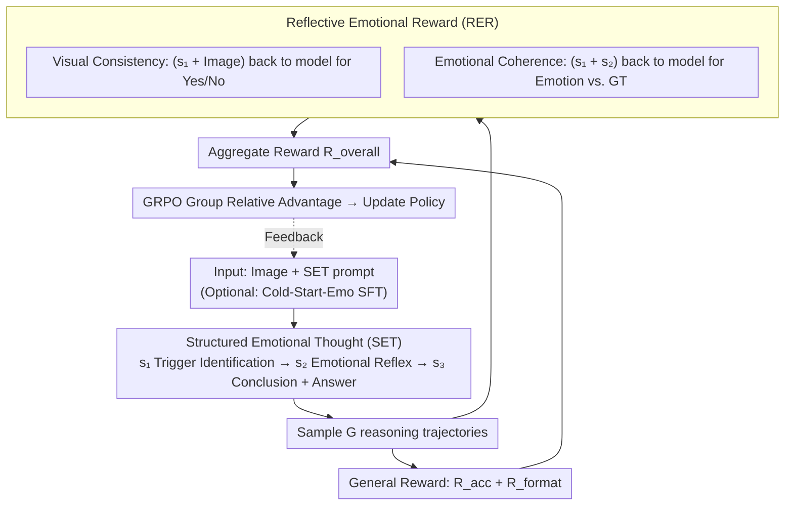

# EMO-R3: Reflective Reinforcement Learning for Emotional Reasoning in Multimodal Large Language Models

**Conference**: CVPR 2026  
**arXiv**: [2602.23802](https://arxiv.org/abs/2602.23802)  
**Code**: [GitHub](https://github.com/xiaomi-research/emo-r3)  
**Area**: Multimodal VLM  
**Keywords**: Emotional Reasoning, GRPO, Structured Thought, Reflective Reward, Multimodal Emotion Understanding

## TL;DR

Ours proposes EMO-R3, which guides MLLMs to perform step-by-step emotional reasoning through Structured Emotional Thought (SET) and designs Reflective Emotional Reward (RER) to allow the model to re-evaluate the vision-text consistency and emotional coherence of its reasoning, significantly enhancing the interpretability and accuracy of multimodal emotion understanding.

## Background & Motivation

**Background**: Although MLLMs excel in visual reasoning, they remain weak in capturing the complexity and subjectivity of human emotions.

**Limitations of Prior Work**: Emotion models based on supervised fine-tuning (e.g., EmoVIT, EmotionLLaMA) are limited by fixed label systems and limited categories, leading to poor generalization and overfitting to the training distribution.

**Key Challenge**: While GRPO can improve generalization, its general "think" process is not tailored for emotional reasoning—there is an observed lack of tight correspondence between the reasoning trajectory and the final answer (unlike mathematical reasoning, where one wrong step leads to a wrong answer).

**Mechanism**: Emotion reasoning is highly subjective and context-dependent. The reasoning path may vary due to individual differences, and merely constraining the answer is insufficient to guide the reasoning process.

**Think-answer Decoupling**: Experiments find that when re-inferring based on the "think" text of the GRPO rollout samples, the deduced emotion often contradicts the final answer.

**Goal**: Pre-trained MLLM emotional priors may mismatch downstream label systems, necessitating lightweight alignment via a Cold Start phase.

## Method

### Overall Architecture

EMO-R3 aims to solve the issue where the "think" process and the final answer of MLLMs often decouple during emotional reasoning—the model might guess the correct emotional label while the intermediate reasoning remains invalid. The strategy involves using a Structured Emotional Thought (SET) prompt to guide the model's free-form thinking into three stages: "Identify Trigger → Characterize Reaction → Draw Conclusion." Then, the Reflective Emotional Reward (RER) passes the intermediate outputs back to the model for self-inspection. Finally, these rewards are fed into GRPO to optimize the policy. The pipeline is: Image + SET prompt → Model outputs three-stage thought plus `\boxed{}` answer → RER extracts intermediate steps for reverse verification → Rewards are aggregated for GRPO updates. An optional lightweight Cold-Start-Emo SFT is performed before training to align emotional priors.

### Key Designs

**1. Structured Emotional Thought (SET): Disciplining free-form thinking into verifiable steps**

The "think" process in general GRPO is free-form, which works for mathematics where an intermediate error usually leads to a wrong final answer. However, emotion judgment is subjective, and the reasoning path is loosely coupled with the answer; the model may produce valid labels through faulty logic. SET constrains the output format into $o = \{s_1, s_2, s_3, \hat{\mathcal{E}}\}$: $s_1$ Emotional Trigger Identification (objects, actions, or expressions in the scene), $s_2$ Human Emotional Reflex (observer's reaction), $s_3$ Emotional Conclusion (polarity and arousal), and the final label $\hat{\mathcal{E}}$ in `\boxed{}`. These three steps map to the cognitive chain of "Perception → Empathy → Judgment," transforming intermediate steps into verifiable products.

**2. Reflective Emotional Reward (RER): Rewarding reasoning validity, not just answer accuracy**

To address think-answer decoupling, RER feeds intermediate SET steps back into the model for self-inspection, using the model itself as a judge. It consists of two sub-rewards: Visual Consistency $\mathcal{R}_{\text{cons}}$ sends $s_1$ and the original image back to the model to ask "Does this text describe the image?", rewarding a "Yes" to ensure $s_1$ is grounded in visual evidence. Emotional Coherence $\mathcal{R}_{\text{coh}}$ sends $s_1 + s_2$ to the model to ask "Which emotion best describes this?", rewarding consistency with the ground truth label to ensure the reasoning matches the final sentiment. The reflective reward is defined as:

$$\mathcal{R}_{\text{RER}} = \frac{\mathcal{R}_{\text{cons}} + \mathcal{R}_{\text{coh}}}{2}$$

Compared to GRPO/DAPO which only reward the answer, RER constrains the reasoning process itself, distinguishing "correct by chance" from "correct by logic."

### Loss & Training

The overall reward is a weighted sum: $\mathcal{R}_{\text{overall}} = (1-\lambda_1-\lambda_2)\mathcal{R}_{\text{acc}} + \lambda_1 \mathcal{R}_{\text{RER}} + \lambda_2 \mathcal{R}_{\text{format}}$, where $\mathcal{R}_{\text{acc}}$ is answer accuracy and $\mathcal{R}_{\text{format}}$ constrains the SET output structure. Optimization is performed under the GRPO framework using relative advantage normalization. The Cold-Start-Emo is a lightweight SFT using a small number of samples without CoT annotations to align emotional priors and mitigate reward sparsity during early RL stages.

## Key Experimental Results

### Main Results: Qwen2.5-VL-3B Emotional Reasoning (In-domain/Out-of-domain)

| Method | EmoSet (In) | Emotion6 (Out) | WebEmo (Out) | Average $\mathcal{A}$ |
|------|-------------|---------------|-------------|---------------------|
| Vanilla* | 51.55 | 50.00 | 40.65 | 47.40 |
| SFT | 77.15 | 34.51 | 17.75 | 43.84 |
| GRPO (G=4) | 74.60 | 60.10 | 49.50 | 59.97 |
| DAPO (G=4) | 68.99 | 56.90 | 49.80 | 58.28 |
| **EMO-R3 (G=4)** | **75.50** | **60.44** | **50.45** | **60.50** |
| **EMO-R3 (G=8)** | **76.40** | **59.26** | **49.70** | **60.42** |

### Ablation Study

| Component | Effect |
|------|------|
| SFT (Cold-Start-Emo) | High in-domain performance but severe out-of-domain degradation |
| GRPO only | Good generalization but reasoning quality is not guaranteed |
| + SET | Structured reasoning and improved emotional coherence |
| + RER | Significant improvement in visual/emotional consistency of reasoning |
| + Cold-Start-Emo | Mitigates reward sparsity and stabilizes training |

### Key Findings

- SFT performs well in-domain (77.15) but suffers catastrophic out-of-domain degradation (17.75), confirming overfitting issues.
- EMO-R3 outperforms GRPO and DAPO across all settings.
- Reflective reward effectively constrains the reasoning process rather than just the final answer.
- Cold-Start-Emo lightweight SFT does not require CoT labels and works with few samples.

## Highlights & Insights

- **First systematic attempt to adapt GRPO to the field of emotional understanding**, revealing the shortcomings of general RL in subjective tasks.
- Structured Emotional Thought (SET) design effectively simulates the human "Perception → Reaction → Judgment" cognitive chain.
- Reflective reward cleverly utilizes the model's own capabilities to assess reasoning quality without external labels.
- Analysis of the think-answer decoupling phenomenon provides a new perspective for research in Affective AI.
- Cold-Start-Emo is designed to align emotional priors rather than merely enhancing reasoning capability.

## Limitations

- Reflective reward requires additional model forward passes, increasing training costs.
- Emotional labels remain discrete; the continuity and multi-dimensionality of emotions are not modeled.
- Validated only on Qwen2.5-VL-3B; effectiveness on larger models remains to be confirmed.
- The three-step structured thought might not cover all emotional reasoning scenarios.

## Related Work & Insights

- Similar to R1-Omni in applying GRPO to emotion, but EMO-R3 deeply adapts the reasoning process.
- Relation to DeepSeek-R1: Inherits the GRPO framework but makes fundamental improvements for subjective tasks.
- The design of Reflective Reward can be generalized to other subjective evaluation tasks (e.g., aesthetic evaluation, subjective quality assessment).

## Rating
- Novelty: ⭐⭐⭐⭐
- Experimental Thoroughness: ⭐⭐⭐⭐
- Writing Quality: ⭐⭐⭐⭐
- Value: ⭐⭐⭐⭐

<!-- RELATED:START -->

## Related Papers

- [\[CVPR 2026\] Visual Reasoning through Tool-supervised Reinforcement Learning](visual_reasoning_through_tool-supervised_reinforcement_learning.md)
- [\[CVPR 2026\] Thinking With Videos: Multimodal Tool-Augmented Reinforcement Learning for Long Video Reasoning](thinking_with_videos_multimodal_tool-augmented_reinforcement_learning_for_long_v.md)
- [\[CVPR 2026\] TTRV: Test-Time Reinforcement Learning for Vision Language Models](ttrv_test-time_reinforcement_learning_for_vision_language_models.md)
- [\[CVPR 2026\] Reading or Reasoning? Format Decoupled Reinforcement Learning for Document OCR](reading_or_reasoning_format_decoupled_reinforcement_learning_for_document_ocr.md)
- [\[CVPR 2026\] R-C2: Cycle-Consistent Reinforcement Learning Improves Multimodal Reasoning](r-c2_cycle-consistent_reinforcement_learning_improves_multimodal_reasoning.md)

<!-- RELATED:END -->
