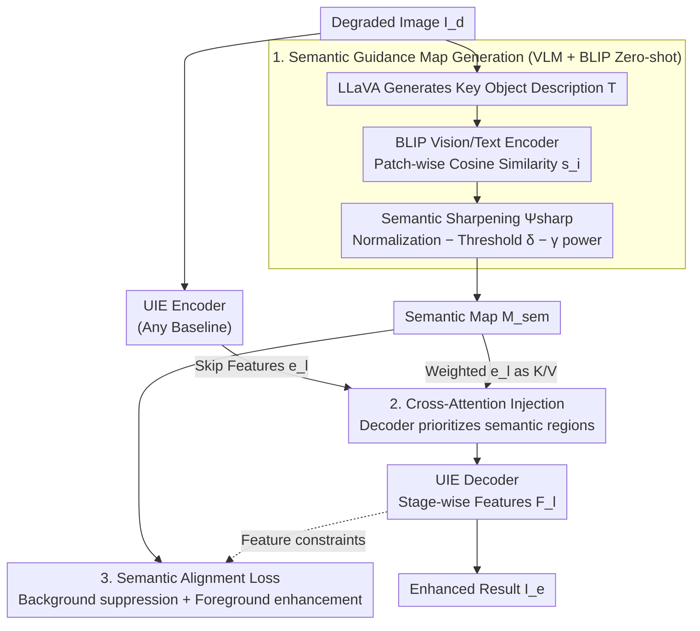

# Empowering Semantic-Sensitive Underwater Image Enhancement with VLM

**Conference**: CVPR 2026  
**arXiv**: [2603.12773](https://arxiv.org/abs/2603.12773)  
**Code**: To be confirmed  
**Area**: Underwater Image Enhancement / Semantic Guidance / VLM Application  
**Keywords**: underwater image enhancement, VLM, semantic guidance, cross-attention, downstream tasks  

## TL;DR
This paper proposes a VLM-driven semantic-sensitive learning strategy. By generating target object descriptions via VLM and constructing spatial semantic guidance maps using BLIP, a dual guidance mechanism (cross-attention + semantic alignment loss) is injected into the UIE decoder. This approach simultaneously improves perceptual quality and performance on downstream tasks like detection and segmentation.

## Background & Motivation
While numerous deep learning methods exist for Underwater Image Enhancement (UIE), an "enhancement paradox" persists: enhanced images may exhibit high visual quality, but downstream detection or segmentation performance often degrades. This occurs because existing methods are "semantic-blind," applying uniform global enhancement across all regions. Consequently, they fail to distinguish between semantic foci (marine life, man-made objects) and the background water, causing distribution shifts that damage semantic cues relied upon by downstream models. Early semantic guidance methods relied on high-quality pixel-level annotations—which are extremely scarce in underwater scenes—while global text prompts (e.g., "a clear underwater photo"), although utilizing VLMs, remain a one-size-fits-all strategy.

## Core Problem
How can underwater image enhancement be made content-aware to protect or enhance the semantic features of key objects while restoring visual quality, thereby benefiting downstream machine vision tasks?

## Method

### Overall Architecture

The "enhancement paradox" stems from the fact that existing methods uniformly enhance the entire image, failing to differentiate between semantic targets and the background. This work introduces content-awareness in three stages: first, using a VLM (LLaVA) to generate text descriptions of key objects from the degraded image; second, utilizing BLIP's vision-language alignment to transform these descriptions into a spatial semantic guidance map $M_{\text{sem}}$; and finally, injecting $M_{\text{sem}}$ into the decoder of any UIE network via a "cross-attention + alignment loss" dual guidance mechanism to prioritize the restoration of critical regions. This plug-and-play module has been validated across five baseline models.

### Key Designs

**1. Semantic Guidance Map Generation: Zero-shot "Importance" Labeling with VLM + BLIP**

Pixel-level semantic annotations are scarce underwater, and global text prompts lack the granularity to locate specific objects. This method avoids annotations by using LLaVA to automatically describe key objects in the degraded image as text $T$. Then, BLIP’s vision encoder $\Phi_v$ extracts patch features $F_v = \{f_{v1}, \dots, f_{vN}\}$ and its text encoder $\Phi_t$ extracts global text features $f_t$, calculating a patch-wise cosine similarity $s_i = \hat{v}_i^\top \hat{t}$. To handle background noise, a semantic sharpening function $\Psi_{\text{sharp}}$ is applied: it performs min-max normalization, subtracts a threshold $\delta$ to filter low-correlation noise, and applies a power $\gamma$ ($\gamma > 1$) to non-linearly amplify the gap between the focus and the background. Compared to ViT class attention or CLIP, BLIP produces the cleanest maps with the clearest boundaries.

**2. Cross-Attention Injection: Prioritizing Semantic Regions in the Decoder**

To ensure the network utilizes $M_{\text{sem}}$, at each decoder stage $l$, the decoder feature $d_l$ acts as the Query. The encoder's skip-connection feature $e_l$ is weighted by $M_{\text{sem}}$ to generate Key and Value representations. Specifically, $M_{\text{sem}}$ is downsampled to the corresponding resolution $\tilde{M}^{(l)}$, and $e_l$ is multiplied by $\tilde{M}^{(l)}$ before projection. The attention output is $d_l' = \text{softmax}(Q_l K_l^\top / \sqrt{d_k}) V_l$. This forces the decoder to extract features primarily from semantic "highlight" regions during reconstruction. Ablations show that injection at the decoder stage is more effective than at the encoder or all stages.

**3. Explicit Semantic Alignment Loss: Bidirectional Constraint**

Structural guidance is further reinforced at the feature level using loss functions. For the feature map $F^{(l)}$ at decoder stage $l$, two constraints are applied: a background suppression term $\|F^{(l)} \odot (1 - \tilde{M}^{(l)})\|_F^2$ to penalize excessive activation in non-key areas, and a foreground enhancement term $-\eta \langle F^{(l)}, \tilde{M}^{(l)} \rangle$ to reward strong responses in target regions. While cross-attention provides structural guidance, the alignment loss provides explicit supervision; their combination outperforms either mechanism alone.

### Loss & Training

- Total Loss: $L_{\text{total}} = L_{\text{recon}} + \lambda_{\text{align}} \sum_l L_{\text{align}}^{(l)}$, where $\lambda_{\text{align}} = 0.1$.
- Reconstruction Loss: $L_{\text{recon}} = L_1(I_e, I_{gt}) + \lambda_{\text{percep}} \sum_j \|\phi_j(I_e) - \phi_j(I_{gt})\|_1$ (VGG-19 perceptual loss).
- Training: Conducted on the UIEB training set (790 pairs). The strategy is validated as a plug-and-play module on five baselines: PUIE, SMDR, UIR, PFormer, and FDCE.

## Key Experimental Results

### Main Results

**UIE Perceptual Quality (UIEB Test Set)**:

| Method | PSNR↑ | SSIM↑ | LPIPS↓ |
|------|-------|-------|--------|
| PFormer | 23.53 | 0.877 | 0.113 |
| PFormer-SS (Ours) | **24.97** (+1.44) | **0.933** (+0.056) | **0.087** (-0.026) |
| UIR | 22.89 | 0.885 | 0.124 |
| UIR-SS (Ours) | **24.62** (+1.73) | **0.901** (+0.016) | **0.113** (-0.011) |

**Downstream Tasks (Detection mAP / Segmentation mIoU)**:

| Method | mAP↑ | mIoU↑ |
|------|------|-------|
| Original (No enhancement) | 95.43 | 68.10 |
| PFormer | 95.50 | 69.34 |
| PFormer-SS (Ours) | **96.87** (+1.37) | **74.75** (+5.41) |
| SMDR | 95.76 | 68.18 |
| SMDR-SS (Ours) | **96.98** (+1.22) | **73.51** (+5.33) |

- All five baselines equipped with -SS showed improvements in PSNR/SSIM.
- The gain in segmentation mIoU was most significant, reaching +5.41 for PFormer-SS.
- While some baselines resulted in lower downstream performance than the raw image, the -SS versions consistently outperformed the raw inputs.

### Ablation Study
- Comparison of guidance models: BLIP > CLIP > ViT (BLIP offers cleaner boundaries and less noise).
- Injection position: Decoder only > All stages > Encoder only (the decoder directly influences the reconstruction process).
- Results confirm that cross-attention and alignment loss are most effective when used synergistically.

## Highlights & Insights
- Accurately identifies the "enhancement paradox": global enhancement damages semantic cues.
- The VLM → Text → BLIP → Spatial Map pipeline cleverly bypasses the need for underwater labels.
- The plug-and-play design makes the strategy applicable to any encoder-decoder UIE architecture.
- Dual guidance (structural cross-attention + explicit alignment loss) is more effective than a single mechanism.
- Pragmatic experimental protocol evaluating both perceptual quality and downstream task performance.

## Limitations & Future Work
- Inference overhead of VLM (LLaVA) and BLIP is high, affecting real-time performance.
- Semantic map quality depends on the VLM's ability to understand heavily degraded images.
- Training was limited to UIEB; the diversity of underwater scenes remains a challenge.
- Selection of hyperparameters $\delta$ and $\gamma$ in the sharpening function may require scene-specific tuning.
- Impact on other downstream tasks (e.g., Re-ID, tracking) has not been evaluated.

## Related Work & Insights
- **vs. Traditional UIE (PUIE/SMDR, etc.)**: These are semantic-blind, whereas this method introduces semantic awareness.
- **vs. Semantic Segmentation Guided Methods (Liao/Yan)**: These require high-quality pixel-level labels, while this work uses VLMs for zero-shot semantic priors.
- **vs. CLIP-style Guidance (Liu et al.)**: CLIP provides global text guidance; this method constructs spatialized object-level semantic maps.

## Rating
- Novelty: ⭐⭐⭐⭐ Introduces spatial semantic guidance from VLMs into UIE; pipeline design is innovative.
- Experimental Thoroughness: ⭐⭐⭐⭐ Includes 5 baselines, 3 datasets, and both detection and segmentation downstream evaluations.
- Writing Quality: ⭐⭐⭐⭐ Motivation is well-defined, logic is coherent, and visualizations are intuitive.
- Value: ⭐⭐⭐⭐ Highly practical plug-and-play strategy with significance for underwater vision and robotic applications.

<!-- RELATED:START -->

## Related Papers

- [\[CVPR 2026\] Can Vision-Language Models Count? A Synthetic Benchmark and Analysis of Attention-Based Interventions](can_vision-language_models_count_a_synthetic_benchmark_and_analysis_of_attention.md)
- [\[CVPR 2026\] UARE: A Unified Vision-Language Model for Image Quality Assessment, Restoration, and Enhancement](uare_a_unified_vision-language_model_for_image_quality_assessment_restoration_an.md)
- [\[CVPR 2026\] G-MIXER: Geodesic Mixup-based Implicit Semantic Expansion and Explicit Semantic Re-ranking for Zero-Shot Composed Image Retrieval](g_mixer_geodesic_mixup_based_implicit_semantic_expansion_for_zero_shot_cir.md)
- [\[CVPR 2026\] Self-guided Semantic Inspection for Zero-Shot Composed Image Retrieval](self-guided_semantic_inspection_for_zero-shot_composed_image_retrieval.md)
- [\[CVPR 2026\] ApET: Approximation-Error Guided Token Compression for Efficient VLMs](apet_approximation-error_guided_token_compression_for_efficient_vlms.md)

<!-- RELATED:END -->
