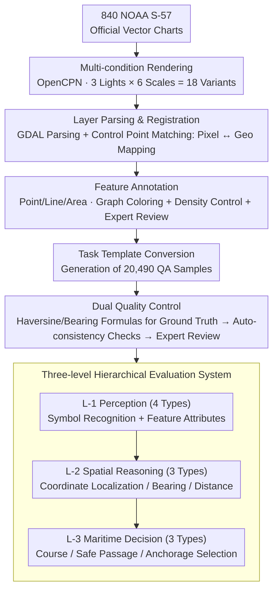

# ENC-Bench: A Benchmark for Evaluating MLLMs in Electronic Navigational Chart Understanding

**Conference**: CVPR 2026  
**arXiv**: [2603.22763](https://arxiv.org/abs/2603.22763)  
**Code**: None  
**Area**: Multimodal / VLM Benchmark  
**Keywords**: Chart understanding, Multimodal benchmark, Spatial reasoning, Safety-critical AI, Symbol grounding

## TL;DR

Ours proposes ENC-Bench, the first professional-grade benchmark for Electronic Navigational Chart (ENC) understanding. It contains 20,490 samples and a three-level hierarchical evaluation system (Perception $\rightarrow$ Spatial Reasoning $\rightarrow$ Maritime Decision-making). Systematically evaluating 10 MLLMs reveals that the best model achieves only $47.88\%$ accuracy, uncovering a significant capability gap of general-purpose models in safety-critical professional domains.

## Background & Motivation

**Background**: Maritime transport carries more than $90\%$ of global trade. Electronic Navigational Charts (ENC) have been mandated by the International Maritime Organization (IMO) for commercial vessels. The maritime AI market is projected to reach $\$4.13$ billion. While MLLMs perform excellently in general visual understanding tasks, their actual capabilities in professional domains remain unknown.

**Limitations of Prior Work**: Existing benchmarks cover statistical charts (ChartQA), documents (DocVQA), and geographic reasoning (MapQA). However, none specifically address ENCs, which utilize standardized vector symbols (IHO S-57), scale-dependent rendering, and multi-constraint spatial geometry in a safety-critical context.

**Key Challenge**: The way ENCs encode regulations, water depths, and route constraints is fundamentally different from natural images or statistical charts. It requires standardized symbol interpretation, spherical geodesic coordinate calculation, and multi-constraint safety decision-making, yet general MLLMs have never undergone such training.

**Goal**: To systematically evaluate whether current MLLMs can reliably interpret ENCs and to quantify their actual capability boundaries in the professional maritime domain.

**Key Insight**: Simulate the cognitive process of certified navigators by designing a hierarchical evaluation system from symbol recognition to safety-critical decision-making.

**Core Idea**: Construct a three-level (Perception $\rightarrow$ Spatial Reasoning $\rightarrow$ Decision-making) professional ENC benchmark to rigorously evaluate MLLM performance in maritime safety-critical scenarios for the first time.

## Method

### Overall Architecture

ENC-Bench aims to answer a specific question: if a real Electronic Navigational Chart is provided to an MLLM, can it reason from symbol recognition to safety decision-making like a certified navigator? To this end, the dataset originates from 840 official NOAA S-57 vector charts, processed through a four-stage pipeline into evaluable QA pairs. First, OpenCPN is used to render vector charts into images under various combinations of lighting and scales. Then, GDAL is used to parse layers, and image registration is performed via control point matching to establish a bidirectional mapping of "Pixel Coordinates $\leftrightarrow$ Geographic Coordinates"—a prerequisite for standardized answers in all subsequent spatial reasoning tasks. Next, point/line/area features on the chart are annotated (using graph coloring to avoid symbol overlap, controlling feature density, and undergoing expert review). Finally, task templates convert these annotations into questions and options, resulting in 20,490 expert-verified samples organized by difficulty: Perception $\rightarrow$ Spatial Reasoning $\rightarrow$ Maritime Decision-making. Two key designs manage the ends of this pipeline: **Multi-condition Rendering and Dual Quality Control** ensure data authenticity and label credibility, while the **Three-level Hierarchical Evaluation System** determines how these samples provide diagnostic signals to locate model weaknesses.

### Key Designs

**1. Multi-condition Rendering and Dual Quality Control: Ensuring scores reflect real capability rather than luck under easy display conditions.**

This design pair manages the quality of the pipeline's input and output. Regarding rendering, the same chart appears very different under different lighting and scales; navigators encounter all these conditions in practice. Therefore, each chart is rendered in 3 lighting modes (Day/Dusk/Night) $\times$ 6 zoom levels ($1:50\text{K} \dots 1:300\text{K}$), totaling 18 variants. This prevents models from hiding failures under night modes or small scales (experiments showed these conditions significantly lower performance). For output, ground truths for spatial reasoning are not manually estimated but calculated using verified navigational formulas like Haversine distance and bearing formulas via the established pixel-to-geographic mapping. Furthermore, two tiers of validation are applied: automatic consistency checks (cross-verifying coordinates, depth values, and classifications) followed by manual review by maritime navigation experts.

**2. Three-level Hierarchical Evaluation System: Breaking down "chart understanding" into a cognitive ladder of increasing difficulty.**

If the model is tested with a mixed pool of questions, the score fails to explain where the model's bottleneck lies. ENC-Bench divides 10 task types into three layers based on a navigator's cognitive sequence. The L-1 Perception layer (4 tasks) asks basic questions: identifying standardized symbols and reading attributes of point/line/area features (i.e., "what is this on the map?"). The L-2 Spatial Reasoning layer (3 tasks) involves calculations: coordinate localization within the registered system, calculating bearings using a $0\dots360^{\circ}$ compass, and measuring distances in nautical miles. The L-3 Maritime Decision-making layer (3 tasks) is the most difficult, requiring the model to make integrated judgments under multiple constraints: determining headings, assessing safe passage considering vessel draft, and selecting anchorages under emergency constraints. This hierarchy allows error analysis to pinpoint whether a failure stems from unrecognized symbols, incorrect geometry, or an inability to weigh constraints.

### Loss & Training

ENC-Bench is a pure evaluation benchmark and does not include training components. All models are tested under a unified zero-shot protocol.

## Key Experimental Results

### Main Results

| Model | Symbol Recognition | Point Feature | Line Feature | Area Feature | Course | Safe Passage | Anchorage Selection | Mean |
|------|----------|--------|--------|--------|------|----------|----------|------|
| Gemini-2.5-Pro | $69.53$ | $45.38$ | $30.05$ | $39.95$ | $63.12$ | $57.55$ | $29.55$ | **$47.88$** |
| Qwen3-VL-235B | $57.03$ | $51.79$ | $29.70$ | $29.93$ | $74.47$ | $58.97$ | $26.48$ | $46.91$ |
| GPT-4o | $50.78$ | $36.39$ | $21.58$ | $23.97$ | $45.39$ | $45.44$ | $20.57$ | $34.87$ |
| GLM-4.5V | $38.80$ | $43.44$ | $20.92$ | $21.61$ | $53.19$ | $65.67$ | $26.24$ | $38.55$ |
| InternVL-3-38B | $55.99$ | $27.36$ | $19.87$ | $30.29$ | $51.06$ | $54.13$ | $20.57$ | $37.04$ |
| Random Guess | $25.00$ | $25.00$ | $25.00$ | $25.00$ | $33.33$ | $50.00$ | $25.00$ | $29.76$ |

### Ablation Study

| Analysis Dimension | Key Metrics | Explanation |
|----------|---------|------|
| Spatial Reasoning: Localization | Gemini best $\text{Acc@200px} = 21.43\%$ | Most predictions deviate severely even under lenient thresholds (mean error $480\text{px}$) |
| Spatial Reasoning: Bearing | Gemini $\text{Acc@20}^{\circ} = 46.86\%$ | Requires understanding chart orientation and coordinate transformations |
| Spatial Reasoning: Distance | Gemini $\text{Acc@0.2} = 25.67\%$, Mean Error $42.31\%$ | Errors over $20\%$ indicate extremely weak scale interpretation capability |
| Light Mode Comparison | Significant drop in Night Mode | High-contrast symbols against dark backgrounds interfere with visual processing |
| Scale Level Comparison | Small scale ($1:200\text{K} \dots 300\text{K}$) performs worst | Generalization leads to changes in feature density and symbology |

### Key Findings

- **Symbol Grounding Bottleneck**: All models systematically fail to interpret formal markers like coordinate grids and scales, indicating a lack of understanding of standardized symbology systems.
- **Multi-constraint Reasoning Defects**: In Anchorage Selection (requiring simultaneous satisfaction of depth, distance, and restricted area constraints), the best model achieved only $29.55\%$, as models tend toward greedy local optimization.
- **Scale/Lighting Fragility**: Performance drops significantly under night mode and small-scale conditions, indicating insufficient robustness.
- **Task Hierarchy Validation**: The increasing difficulty from perception to spatial reasoning and decision-making confirms the validity of the hierarchical evaluation design.

## Highlights & Insights

- Fills a critical gap in maritime AI evaluation; in the context of rapidly increasing MLLM capabilities, the lack of performance in professional vertical domains serves as a major warning.
- The three-level cognitive hierarchy design can be extended to benchmark construction in other safety-critical vertical fields such as medical imaging and air traffic control.
- The data generation pipeline (S-57 $\rightarrow$ Rendering $\rightarrow$ Registration $\rightarrow$ Annotation $\rightarrow$ QA) is methodologically sound with a sufficient scale of 20,490 samples.
- Reveals a counter-intuitive finding: Qwen3-VL-235B outperforms Gemini-2.5-Pro in course recognition ($74.47\%$ vs $63.12\%$), despite slightly trailing in the overall mean.

## Limitations & Future Work

- Currently only covers NOAA (U.S.) nautical charts, lacking ENC data from other countries/regions.
- Only zero-shot evaluation was performed, without exploring performance gains from few-shot prompting or fine-tuning on maritime domains.
- Absolute performance in spatial reasoning tasks is extremely low (coordinate localization $<22\%$), suggesting the need for specialized spatial reasoning enhancement modules.
- Temporal decision-making scenarios (e.g., multi-step route planning) are not included, which could be expanded into a sequential decision benchmark.

## Related Work & Insights

- **vs ChartQA/DocVQA**: The latter focus on unstructured statistical charts/documents, whereas ENC-Bench faces standardized vector symbols, regulatory encoding, and safety constraints.
- **vs GeoQA/MathVista**: The latter perform geometric reasoning on idealized Euclidean coordinates, while ENC-Bench requires spherical geodesic coordinate systems and DMS notation.
- **vs MapQA/MapEval**: The latter involve coarse spatial reasoning on consumer-grade maps; ENC-Bench requires statutory positional accuracy and safety compliance.
- **Insight**: The core of professional domain benchmarks lies in defining the unique "cognitive capability hierarchy" of that field—this is more valuable than simply accumulating sample volume.

## Rating

- Novelty: ⭐⭐⭐⭐⭐ The first ENC understanding benchmark, opening a new research direction with clearly defined problems.
- Experimental Thoroughness: ⭐⭐⭐⭐⭐ Extremely comprehensive with 10 MLLMs, 10 task types, 18 rendering conditions, and detailed error analysis.
- Writing Quality: ⭐⭐⭐⭐ Clear structure, sufficient professional background introduction, and standardized statistical analysis.
- Value: ⭐⭐⭐⭐ Significant warning value for the safety-critical AI field, pushing the industry to address capability gaps in professional domains.

<!-- RELATED:START -->

## Related Papers

- [\[ACL 2026\] VULCA-Bench: A Multicultural Vision-Language Benchmark for Evaluating Cultural Understanding](../../ACL2026/multimodal_vlm/vulca-bench_a_multicultural_vision-language_benchmark_for_evaluating_cultural_un.md)
- [\[CVPR 2026\] Twin-T & TwintVQA: A Reliable Structure-Detail Separating VLM and a Comprehensive Benchmark for Chart and Table Tasks](twin-t_twintvqa_a_reliable_structure-detail_separating_vlm_and_a_comprehensive_b.md)
- [\[CVPR 2026\] SketchVL: Policy Optimization via Fine-Grained Credit Assignment for Chart Understanding and More](sketchvl_policy_optimization_via_fine-grained_credit_assignment_for_chart_unders.md)
- [\[CVPR 2026\] ChartNet: A Million-Scale, High-Quality Multimodal Dataset for Robust Chart Understanding](chartnet_a_million-scale_high-quality_multimodal_dataset_for_robust_chart_unders.md)
- [\[CVPR 2026\] Flat-Pack Bench: Evaluating Spatio-Temporal Understanding in Large Vision-Language Models through Furniture Assembly](flat-pack_bench_evaluating_spatio-temporal_understanding_in_large_vision-languag.md)

<!-- RELATED:END -->
