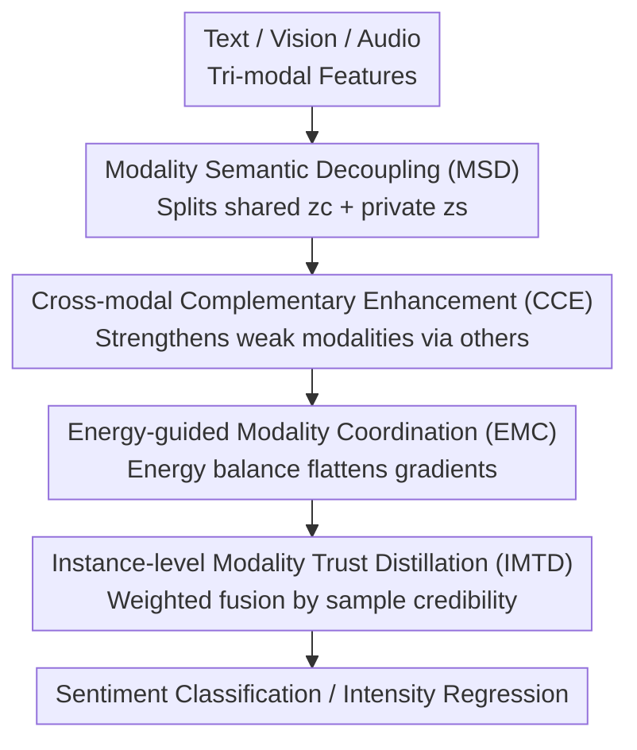

# Enhance-then-Balance Modality Collaboration for Robust Multimodal Sentiment Analysis

**Conference**: CVPR 2026  
**Paper**: [CVF Open Access](https://openaccess.thecvf.com/content/CVPR2026/html/He_Enhance-then-Balance_Modality_Collaboration_for_Robust_Multimodal_Sentiment_Analysis_CVPR_2026_paper.html)  
**Code**: https://github.com/kangverse/EBMC  
**Area**: Multimodal VLM / Multimodal Sentiment Analysis  
**Keywords**: Multimodal Sentiment Analysis, Modality Imbalance, Energy-based Models, Weak Modality Enhancement, Robust Fusion  

## TL;DR
EBMC introduces a "first enhance, then balance" two-stage framework for multimodal sentiment analysis: it first enriches suppressed audio/visual weak modalities through semantic decoupling and cross-modal complementarity, then employs an energy-based model to equalize the optimization dynamics of each modality and performs instance-level weighted fusion based on credibility. It achieves SOTA on MOSI/MOSEI/IEMOCAP and shows significantly smaller performance degradation than baselines in missing modality scenarios.

## Background & Motivation
**Background**: Multimodal Sentiment Analysis (MSA) fuses heterogeneous signals—text, audio, and vision—to predict human emotional intensity or categories. Mainstream approaches follow two branches: representation learning (decoupling shared/private semantics, e.g., MISA) and multimodal fusion (attention, graphs, gating, hierarchy, etc.). Recently, modality alignment before fusion has also become popular.

**Limitations of Prior Work**: These methods almost all implicitly assume that the contributions of the three modalities are balanced and reliable. In practice, text is naturally dominant, while audio and visual emotional cues are weaker, sparser, and more susceptible to noise, leading them to be "overshadowed" by text during joint training. 

**Key Challenge**: Imbalanced modality strength triggers **modality competition**—strong modalities accumulate larger gradients and continuously strengthen their representations, while weak modalities receive insufficient updates. Over time, a "Matthew Effect" forms: weak modalities become increasingly marginalized, particularly in real-world scenarios with noise or missing modalities. Existing imbalanced learning methods (dynamic adjustment of learning rates/gradients via loss, Fisher regularization, decoupled fusion flows, prototype rebalancing) only suppress strong modalities at the optimization level but **fail to provide semantic-level enhancement for weak modalities**.

**Goal**: To sufficiently "enrich" weak modalities at the representation level, prevent dominance of strong modalities at the optimization level, and maintain robustness against noise/missing modalities at the instance level.

**Key Insight**: The authors decompose "strengthening the weak modalities first, then balancing inter-modality competition" into a serial two-stage process—enhancement is the cause, and balancing is the effect; the order cannot be reversed. Simultaneously, they frame the modality competition problem within an **Energy-Based Model (EBM)** framework for the first time, using a differentiable energy balance objective to implicitly perform gradient rebalancing.

**Core Idea**: Enhance-then-Balance—Stage I uses semantic decoupling + cross-modal complementarity to enhance weak modalities; Stage II uses energy-guided coordination + instance-level trust distillation to balance contributions and resist noise.

## Method

### Overall Architecture
The input to EBMC consists of feature sequences from text, vision, and audio $X_m \in \mathbb{R}^{T_m \times d_m}$ ($m \in \{l, v, a\}$), and the output is the sentiment intensity regression value or emotion category. The pipeline is structured into two stages: **Stage I Enhancement** first decouples each modality's representation into shared and private components, then strengthens weak modalities using complementary components from other modalities; **Stage II Balancing** feeds the enhanced modalities into an energy coordination module to flatten optimization dynamics, followed by instance-level trust distillation to adjust fusion weights based on sample credibility, eventually feeding into the sentiment classifier. The sequence is critical—energy coordination and trust weighting require clean and strengthened weak modality representations to function effectively.

### Key Designs

**1. Modality Semantic Decoupling (MSD): Decoupling representations to prevent contamination by strong modalities**

Directly fusing raw modality features introduces semantic interference, allowing strong modalities to overshadow weak ones. MSD uses two lightweight MLP sub-networks for each modality to split the representation $z_m$ into a cross-modal shared component $z^c_m = D^c_m(z_m)$ and a modality-specific private component $z^s_m = D^s_m(z_m)$ (containing modality-specific details like prosody or facial expressions). Three constraints ensure clean separation: ① **Invariant Alignment**—uses InfoNCE contrastive loss $L_{inv} = -\sum_i \log \frac{\exp(\mathrm{sim}(z^c_i, z^c_{agg})/\tau)}{\sum_k \exp(\mathrm{sim}(z^c_i, z^c_k)/\tau)}$ to pull shared components of all modalities closer in semantic space; ② **Private De-redundancy**—minimizes intra-batch cosine similarity $L_{dis} = \sum_{i \neq j} \mathrm{sim}(z^s_i, z^s_j)$ to force private components of different modalities to be mutually orthogonal; ③ **Unimodal Preservation**—feeds each private component into a unimodal predictor $T_m$ with $L_{uni} = \frac{1}{|M|}\sum_m \ell(T_m(z^s_m), y)$ to ensure the decoupled private components retain predictive power. Total loss: $L_{MSD} = L_{inv} + \lambda_1 L_{dis} + \lambda_2 L_{uni}$. This step provides a "clean and controllable" feature foundation for subsequent collaboration; without it, sentiment boundaries in T-SNE become blurred.

**2. Cross-modal Complementary Enhancement (CCE): Feeding cues from other modalities to weak ones**

While MSD preserves private information, text still dominates semantic discrimination, while vision/audio encode more subtle emotional cues. CCE addresses the information deficiency of weak modalities: for modality $m$, it feeds its own components $(z^c_m, z^s_m)$ along with the components of other modalities $(z^c_{-m}, z^s_{-m})$ into a lightweight enhancement network $G_m$ to generate enhanced features $\tilde{z}_m = G_m(z^c_m, z^c_{-m}, z^s_{-m}, \epsilon)$, where $\epsilon$ is an optional random perturbation to increase diversity. The training objective is two-fold:

$$L_{CCE} = \mathbb{E}\lVert \tilde{z}_m - z_m \rVert_2^2 + \gamma\, \ell(f(\tilde{z}_m, z_{-m}), y)$$

The reconstruction term $\lVert \tilde{z}_m - z_m \rVert_2^2$ ensures the original semantic structure remains intact, while the task term ensures the strengthened features are useful for sentiment prediction. In this way, weak modalities absorb complementary semantics from strong modalities without losing their own characteristics.

**3. Energy-guided Modality Coordination (EMC): Implicit gradient rebalancing via energy equilibrium**

To resolve modality competition, the authors avoid manual loss reweighting or hard gradient modification. Instead, they frame multimodal coordination from an EBM perspective, constructing a structured multimodal energy landscape. An energy potential is defined for each modality, integrating semantic activation, task difficulty, and prediction reliability:

$$E(m) = \alpha\lVert z_m \rVert_2^2 + \beta\, \ell_m + \gamma\, u_m, \quad u_m = \mathbb{E}_i\big[H(p_i / T_m(y))\big]$$

where $u_m$ is the prediction uncertainty (measured by entropy $H(p) = -\sum_y p(y)\log p(y)$). Weak modalities naturally have higher energy due to noisy signals and weak discriminative power. Coordination is achieved via two mechanisms: ① **Energy Gap Minimization**—strong modalities often have excessively low energy, thus suppressing others; a global energy balance objective $L_{gap} = \sum_{i,j}(E(m_i) - E(m_j))^2$ is added to force all modalities to converge within a balanced range; ② **Energy Gradient Flow**—explicit energy descent updates are performed $\Delta z_m = -\lambda \frac{\partial E(m)}{\partial z_m}$, creating a negative feedback loop: modalities with low energy (overconfident/dominant) receive inhibitory gradients, while high-energy weak modalities receive larger corrective gradients. The complete objective is $L_{EMC} = L_{gap} + \delta\sum_m \lVert \frac{\partial E(m)}{\partial z_m} \rVert^2$.

**4. Instance-level Modality Trust Distillation (IMTD): Dynamic weighting by sample credibility to resist noise and missing data**

While MSD/CCE mitigate imbalance at the representation level, traditional fusion remains vulnerable to noise and missing modalities at the **instance level**. IMTD uses probabilistic embeddings to estimate the credibility of each modality for a given sample. The teacher $T_m$ from MSD outputs a prediction distribution for sample $i$ with mean $\mu^i_m$ and variance $\sigma^i_m$ (representing uncertainty). Variance is converted to a confidence score $c^i_m = \exp(-\sigma^i_m)$, and a soft normalization factor $\rho^i_m = \frac{1}{\log(1 + \lVert \sigma^{2i}_m \rVert_1)}$ is used to suppress unstable modalities with excessive variance. The final adaptive distillation weight is $\alpha^i_m = \frac{c^i_m \rho^i_m}{\sum_m c^i_m \rho^i_m}$. During distillation, confidence-weighted KL divergence aligns the student's fusion prediction with the teacher:

$$L_{IMTD} = \sum_{m,i} \alpha^i_m\, \mathrm{KL}\big(\sigma(z^i_{fusion}/\tau) \,\Vert\, \sigma(z^i_{T_m}/\tau)\bi)$$

This assigns higher weights to reliable modalities at the sample level and suppresses noisy ones, providing robustness in missing modality scenarios.

### Loss & Training
The total objective is a weighted sum of the losses from the four modules:

$$L = L_{task} + \zeta L_{MSD} + \beta L_{CCE} + \gamma L_{EMC} + \eta L_{IMTD}$$

where $L_{task}$ is the standard cross-entropy. Hyperparameters $\lambda_1, \lambda_2, \beta, \gamma, \eta$ are set to 0.1, and $\zeta$ to 0.5. Features: Text uses BERT-base (768-dim), Vision uses Facet (35-dim facial action units), and Audio uses COVAREP (74-dim acoustic descriptors). Each stage is trained for 100 epochs with a batch size of 64 on an RTX 4090.

## Key Experimental Results

### Main Results
Compared against 10 SOTAs on CMU-MOSI / CMU-MOSEI, EBMC leads in almost all metrics, with significant improvements in Acc-7:

| Dataset | Metric | EBMC | Prev. SOTA | Gain |
|--------|------|------|---------|------|
| CMU-MOSI | Acc-7↑ | 50.34 | 46.50 (Semi-IIN) | +3.84 |
| CMU-MOSI | F1↑ | 87.79 | 86.60 (GLoMo) | +1.19 |
| CMU-MOSI | Acc-2↑ | 86.26/87.84 | 85.28/87.04 | — |
| CMU-MOSEI | Acc-7↑ | 57.32 | 55.89 (Semi-IIN) | +1.43 |
| CMU-MOSEI | F1↑ | 88.07 | 86.40 (GLoMo) | +1.67 |

Transferring to ERC (IEMOCAP 4-class F1) also shows consistent gains, averaging 86.35% vs. 85.08% for DMD (+1.27%).

### Ablation Study
Removing modules one by one on MOSI/MOSEI (reporting F1 drop):

| Config | MOSI F1 | MOSEI F1 | Description |
|------|---------|----------|------|
| EBMC (Full) | 87.79 | 88.07 | — |
| w/o MSD | 86.16 | 86.31 | Decoupling removed |
| w/o CCE | 86.90 | 86.89 | No enhancement for weak modalities |
| w/o EMC | 85.32 | 85.20 | **Largest drop (2.43 / 2.87)** |
| w/o IMTD | 86.77 | 87.09 | No instance-level trust |

### Key Findings
- **EMC contributes the most**: Removing it leads to the largest performance drop (~2.4–2.9% F1). Visualizations show that without EMC, text contribution exceeds 50% across all datasets, whereas EMC flattens the contribution distribution.
- **Enhancement and Balancing are complementary**: MSD clarifies sentiment boundaries in T-SNE, while CCE further clusters points within sentiment groups.
- **IMTD primarily handles robustness**: While it shows the smallest drop under normal settings, it is crucial for noise/missing modality scenarios.

## Highlights & Insights
- **Translating modality competition into an energy landscape**: Using EBM energy potentials and gradient flow transforms "strong modality dominance" into a differentiable equilibrium goal, avoiding manual weight tuning.
- **Causal order of "Enhancing then Balancing"**: Saturating weak modalities at the representation level before balancing optimization avoids the "leveling down" effect where modalities become poor together.
- **Instance-level trust weighting**: IMTD uses teacher variance to estimate credibility per sample, automatically suppressing noisy modalities on a per-sample basis.

## Limitations & Future Work
- The framework involves four modules and several loss terms, leading to a large hyperparameter space ($\zeta, \beta, \gamma, \eta, \lambda_1, \lambda_2$, etc.).
- The energy function $E(m)$ is a linear combination of representation magnitude, task difficulty, and uncertainty; the weights and physical meanings are somewhat empirical.
- Each stage requires 100 epochs, and the inclusion of unimodal teachers plus distillation increases the overall training overhead.

## Related Work & Insights
- **vs. Imbalanced Learning**: Previous methods suppress strong modalities via optimization but do not semantically enhance weak ones. EBMC's Stage I introduces a "strengthening" component missing in prior work.
- **vs. Robust/Missing Modality Methods**: While others rely on self-distillation or cross-modal reconstruction, EBMC embeds robustness into the core learning process via IMTD, outperforming them by 4–5 points F1 in missing modality tests.
- **vs. Decoupled Representations**: Unlike MISA or DMD which terminate at decoupling, EBMC treats decoupling as a starting point for enhancement and energy coordination.

## Rating
- Novelty: ⭐⭐⭐⭐ First use of EBM for implicit modality gradient rebalancing.
- Experimental Thoroughness: ⭐⭐⭐⭐ Extensive testing across three datasets, ERC transfer, and six missing modality conditions.
- Writing Quality: ⭐⭐⭐⭐ Clear method pipeline and comprehensive formulas.
- Value: ⭐⭐⭐⭐ The energy rebalancing approach is highly transferable to other multi-branch imbalance problems.

<!-- RELATED:START -->

## Related Papers

- [\[CVPR 2026\] Factorize, Reconstruct, Enhance: A Unified Framework for Multimodal Sentiment Analysis](factorize_reconstruct_enhance_a_unified_framework_for_multimodal_sentiment_analy.md)
- [\[CVPR 2026\] CICA: Coupling Confidence-Aware Pretraining with Confidence-Informed Attention for Robust Multimodal Sentiment Analysis](cica_coupling_confidence-aware_pretraining_with_confidence-informed_attention_fo.md)
- [\[CVPR 2026\] Conflict-Aware Adaptive Cross-Reconstruction for Multimodal Sentiment Analysis](conflict-aware_adaptive_cross-reconstruction_for_multimodal_sentiment_analysis.md)
- [\[CVPR 2026\] Prototype-as-Prompt: Multimodal Sentiment Prototypes Endowing Large Language Models the Capability to Perform Multimodal Sentiment Analysis](prototype-as-prompt_multimodal_sentiment_prototypes_endowing_large_language_mode.md)
- [\[CVPR 2026\] Multi-Metric Representation Learning Strategy Based on Clustering for Fine-Grained Multimodal Sentiment Analysis](multi-metric_representation_learning_strategy_based_on_clustering_for_fine-grain.md)

<!-- RELATED:END -->
