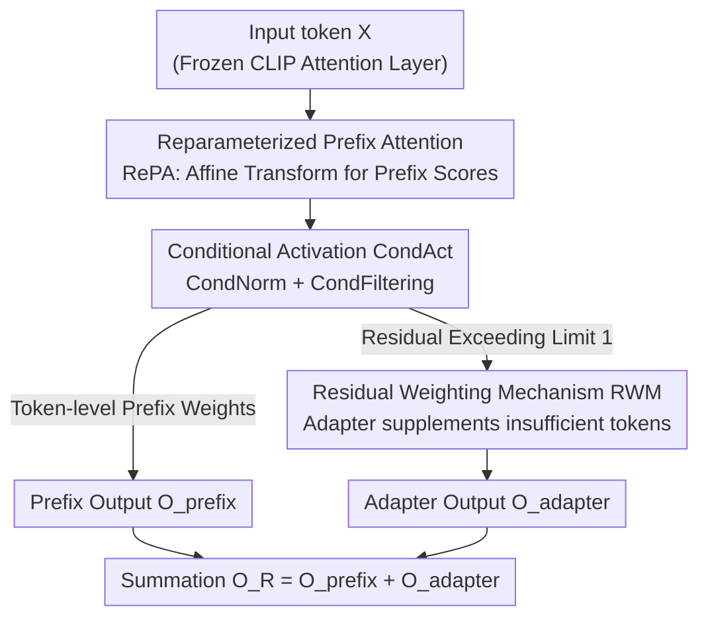

# Enhancing Continual Learning of Vision-Language Models via Dynamic Prefix Weighting

**Conference**: CVPR 2026  
**arXiv**: [2604.18075](https://arxiv.org/abs/2604.18075)  
**Code**: https://github.com/YonseiML/dpw (Available)  
**Area**: Multimodal VLM / Continual Learning / Parameter-Efficient Fine-Tuning  
**Keywords**: Continual Learning, prefix-tuning, token-level weighting, adapter, CLIP

## TL;DR
Addressing the issue where current PEFT methods for VLM continual learning only weight prefixes/adapters at the "sample level" (treating all tokens within a sample equally), DPW utilizes a gating module (RePA + CondAct) to calculate fine-grained prefix weights for each token. It allows adapters to supplement task knowledge in a "residual" manner only when prefix weights are insufficient. DPW achieves SOTA results on MTIL and ODCL-CIL domain-class incremental benchmarks.

## Background & Motivation
**Background**: To enable Vision-Language Models (VLMs) like CLIP to learn a sequence of downstream tasks, full fine-tuning is prohibitively expensive. The field has shifted toward Parameter-Efficient Fine-Tuning (PEFT) — freezing the backbone and injecting task knowledge via prefix-tuning (concatenating learnable prompt vectors in attention) or adapters (lightweight bypasses). To mitigate catastrophic forgetting, recent works dynamically adjust the influence of added parameters based on the input sample (e.g., MoE-Adapters using routers, DIKI using cross-attention for prefix weighting).

**Limitations of Prior Work**: These weighting mechanisms mostly operate at the **sample level**, assigning the same amount of task information to all tokens within an input. However, research suggests that dynamically adjusting injection based on token-level task relevance significantly improves performance. The lack of token-level weighting is a fundamental flaw. Worse, prefix-tuning typically relies on query-key dot products for weight calculation. Pre-trained attention tends to capture **global context**, pulling task-relevant and irrelevant tokens closer in feature space. Empirical measurements in this paper show that after query projection, the cosine similarity between task-relevant and irrelevant tokens spikes from 0.02 to 0.47, even exceeding the similarity among relevant tokens, thus erasing token-wise distinctions.

**Key Challenge**: There is a direct conflict between the need for token-level fine-grained modulation and the tendency of pre-trained attention projections to "blur token distinctions." Simultaneously, a balance must be struck between "aggressive prefix modification" and "conservative adapter supplementation"; using simple sigmoid activations can cause task information to dominate, damaging zero-shot performance.

**Goal**: (1) Ensure each token receives the "appropriate amount" of task information from prefixes and adapters; (2) Enable effective synergy between prefixes and adapters.

**Key Insight**: Instead of following the traditional "query-key dot product + softmax" pipeline that blurs tokens, both scoring and normalization steps should be replaced. Prefix scores should be calculated directly from input tokens via affine transformations, and softmax should be replaced with an activation that allows the "total weight to float within [0,1]."

**Core Idea**: Replace sample-level, enforced-normalization attention weighting with token-level, floating-sum prefix weighting (gating module), and treat "demand exceeding the upper limit" as a residual to be handled by the adapter.

## Method

### Overall Architecture
DPW inserts a DPW module into frozen CLIP attention layers to simultaneously modulate prefix and adapter outputs for each input token. Given input token representations $X\in\mathbb{R}^{m\times d}$, the module outputs tokens fused with prefix and adapter information. The process consists of three steps: First, **RePA** simplifies traditional query-key dot products into an affine transformation of input tokens to compute the prefix score matrix $S_{XP}$. Second, **CondAct** converts scores into weights; conditional normalization allows each token's total prefix weight to flexibly stay below 1, while conditional filtering removes irrelevant prefixes. Finally, **RWM** uses the "residual prefix weight exceeding the limit of 1" as a scaling coefficient for the adapter output, allowing the adapter to supplement only those tokens not "satisfied" by the prefix. The outputs are combined as $O_{R_i}=O_{\text{prefix}_i}+O_{\text{adapter}_i}$.

### Key Designs

**1. RePA: Reparameterizing Query-Key Dot Product as an Affine Transform**

Traditional prefix-tuning calculates scores via $S_{XP}^{(i)}=Q_i(K_{P_i})^{\top}$. However, pre-trained query/key projections lack task-specific knowledge, making it difficult to distinguish token relevance. Training separate projections for each task would cause parameter explosion (training $W^Q, W^K$ requires 228M parameters) and lead to overfitting. RePA deconstructs the dot product into "input $X$ dependent terms" and "constant terms": $S_{XP}^{(i)}=X\,W_i^{G}+B_i^{G}$. This merges the original attention projection with learnable prefix keys $P_K$ into a **composite parameter set** $W_i^{G}, B_i^{G}$. By learning task-specific projections only for the prefix branch while keeping the original matrices intact for zero-shot capabilities, RePA assigns higher scores to task-relevant tokens (Figure 3 shows score maps aligning better with object regions) with only 30.8M parameters.

**2. CondAct: Replacing Softmax with Conditional Normalization and Filtering**

Softmax forces the sum of prefix weights for each token to be exactly 1, failing to reflect that different tokens require different injection amounts. CondAct first applies a sigmoid $\sigma(\cdot)$ and processes the results in two steps. **Conditional Normalization** (Eq. 8a): If $\sum_k\sigma(s_{ijk})\ge 1$, the values are normalized by the sum; otherwise, the sigmoid values are used directly. This ensures the total weight $\sum_k g_{ijk}$ is capped at 1 only when it would otherwise exceed it, providing a **floating upper bound**. This prevents task dominance (mitigating forward forgetting and preserving zero-shot) while allowing token differentiation. **Conditional Filtering** (Eq. 8b): $\widetilde{g}_{ijk}=g_{ijk}\cdot\mathbb{I}(g_{ijk}\ge\text{cutoff})$ removes irrelevant prefixes. The cutoff is dynamically determined by the Gaussian distribution of attention scores between each prefix and the [CLS] token — $\text{cutoff}=1-\sigma(\log\varphi(s_{i,\text{cls},k};\mu_t,\sigma_t^2))$, achieving dual token-level and prefix-level adaptive removal.

**3. RWM: Feeding the "Clipped Prefix Demand" to the Adapter as a Residual**

CondAct protects zero-shot performance by capping prefix weights, but restricts tokens that require stronger adaptation. RWM's insight is that the "overflow demand" clipped by the cap is a natural signal for "how much adaptation a token still lacks." It defines the residual $\Delta_{ij}=\max(0,\sum_k\sigma(s_{ijk})-1)$. $\Delta$ is non-zero only if the sum of sigmoid prefix weights exceeds 1. This value is used to element-wise scale the adapter output: $O_{\text{adapter}_i}=\Delta_i\odot\mathcal{E}_i^t(X)$. Consequently, the **adapter only activates for tokens not "satisfied" by the prefix**, achieving token-level adapter weighting without an extra router. The adapter uses LoRA, where the shared down-projection $D$ is initialized with top-k left singular vectors of $W^V$ and frozen, while independent up-projections $U_t$ are learned per task.

### Loss & Training
The CLIP backbone remains frozen. Only RePA composite parameters $W^G, B^G$, CondAct statistics, and per-task LoRA up-projections are trained. The paper also presents a parameter-efficient variant **Ours†**, which calculates prefix scores using only corresponding sub-dimensions $d/h'$ and uses lower-rank LoRA, further reducing trainable parameters from 30.8M to 4.6M.

## Key Experimental Results

### Main Results
Two domain-class incremental benchmarks involve 11 datasets and 1201 classes. MTIL allows task IDs during inference, while ODCL-CIL does not. Metrics: Transfer (zero-shot generalization/forward forgetting), Avg. (average over all steps), Last (average at the end).

| Benchmark | Method | Extra Data | Params | Trans. | Avg. | Last |
|-----------|--------|------------|--------|--------|------|------|
| MTIL Order I | Zero-shot | - | – | 69.4 | 65.3 | 65.3 |
| MTIL Order I | DIKI | × | 1.8M | 68.7 | 76.3 | 85.1 |
| MTIL Order I | MoE-Adapter | × | 59.6M | 68.9 | 76.7 | 85.0 |
| MTIL Order I | GIFT (FT + Diffusion) | ✓ | 149.6M | 69.3 | 77.3 | 86.0 |
| MTIL Order I | **Ours†** | × | 4.6M | 70.0 | 78.6 | 87.6 |
| MTIL Order I | **Ours** | × | 30.8M | **70.4** | **79.3** | **88.3** |
| ODCL-CIL | DPeCLIP | × | - | 69.1 | 76.1 | 84.6 |
| ODCL-CIL | **Ours** | × | - | **70.4** | **78.6** | **86.6** |

**Ours** outperforms GIFT (which uses full fine-tuning and diffusion-generated data) across all metrics with only 30.8M parameters and no extra data. Even **Ours†** (4.6M) surpasses all comparison methods.

### Ablation Study

| Config | Trans. | Avg. | Last | Description |
|--------|--------|------|------|-------------|
| Remove all (Baseline) | 68.1 | 76.6 | 85.9 | Traditional prefix-tuning |
| +RePA | 68.0 | 76.8 | 86.4 | RePA alone, limited by softmax |
| +CondAct | 69.5 | 77.8 | 86.8 | CondAct alone |
| +RePA+CondAct | 69.9 | 78.9 | 87.9 | Synergy between the two |
| **+Full DPW** | **70.4** | **79.3** | **88.3** | Complete DPW |

CondAct breakdown (Table 5): Sigmoid (68.0/76.8/86.4) $\rightarrow$ CondNorm (69.9/79.0) $\rightarrow$ Filtering (70.4/79.3/88.3). The Transfer improvement (68.0 $\rightarrow$ 70.4) highlights the floating sum's effectiveness in preventing forward forgetting.

### Key Findings
- RePA alone barely improves Avg. (76.6 $\rightarrow$ 76.8) because softmax still enforces a sum of 1, limiting token differentiation. It must be paired with CondAct to release fine-grained scores.
- CondAct contributes most to Transfer (preserving zero-shot), while RWM improves both Last and Transfer (supplementing high-demand tokens).
- RWM vs. Traditional Routing (Table 6): doubling prefix length (39.6M) drops performance (69.5/78.4/87.6), and learnable routers (32.7M) only reach 69.9/79.0/88.1. RWM (30.8M) achieves the highest scores with fewer parameters.
- RePA vs. Traditional Attention (Table 4): Training $W^Q, W^K$ (228M) reaches 68.9/85.9, while RePA (30.8M) reaches 70.4/88.3.

## Highlights & Insights
- **Turning "Overflow" into a Useful Signal**: RWM does not design a separate weighting for the adapter; instead, it reuses the residual $\max(0,\sum\sigma-1)$ discarded by CondAct. One value simultaneously restricts the prefix and drives the adapter.
- **Collapsing Two Steps via Linear Algebra**: RePA demonstrates that "query-key dot product + learnable $P_K$" can be reparameterized as a single affine transformation on tokens. This enables task-specific learning on the prefix branch without touching pre-trained projections.
- **Empirical Diagnosis**: By quantifying the "blurring of token distinctions" via cosine similarity (0.02 $\rightarrow$ 0.47) and UMAP, the paper transforms an intuitive motivation into a measurable phenomenon.
- **Floating Upper Bound Concept**: The idea of $sum \le 1$ instead of $sum = 1$ is generalizable to other prompt/prefix scenarios to balance task injection and pre-trained knowledge preservation.

## Limitations & Future Work
- The method is tied to specific prefix-tuning and LoRA adapter forms. The filtering cutoff depends on the empirical Gaussian assumption of "[CLS]-prefix" attention scores; its robustness across other backbones or modalities is unverified.
- Evaluation is limited to CLIP-based image classification CL; benefits in generative VLMs or structured output tasks (detection/segmentation) remain unknown.
- ODCL-CIL still relies on baseline task-identification strategies. The robustness of the system to task ID estimation errors was not analyzed independently.

## Related Work & Insights
- **vs. DIKI**: DIKI uses cross-attention for sample-level prefix softmax with fixed totals; DPW uses RePA for token-level affine scoring and CondAct for floating totals, plus residual adapters.
- **vs. MoE-Adapter**: MoE-Adapter routes based only on the [CLS] token with fixed sums (59.6M); DPW uses prefix residuals to drive adapters without routers (30.8M).
- **vs. ZSCL / GIFT**: These require full fine-tuning and extra reference data (distillation or diffusion data); DPW is more efficient.
- **vs. DPeCLIP / CoLeCLIP**: These suffer from performance degradation on un-trained domains; DPW preserves zero-shot via the prefix-adapter synergy.

## Rating
- Novelty: ⭐⭐⭐⭐ The combination of token-level floating weighting and residual-driven adapters is innovative.
- Experimental Thoroughness: ⭐⭐⭐⭐ Two benchmarks across 11 datasets with deep ablation and diagnostic analysis.
- Writing Quality: ⭐⭐⭐⭐ Clear motivation, complete formulas, and convincing diagnostic experiments.
- Value: ⭐⭐⭐⭐ Parameter-efficient, SOTA performance, and transferable weighting/residual concepts for PEFT.

<!-- RELATED:START -->

## Related Papers

- [\[CVPR 2026\] On Token's Dilemma: Dynamic MoE with Drift-Aware Token Assignment for Continual Learning of Large Vision Language Models](on_tokens_dilemma_dynamic_moe_with_drift-aware_token_assignment_for_continual_le.md)
- [\[CVPR 2026\] Towards Dynamic Modality Alignment in Multimodal Continual Learning](towards_dynamic_modality_alignment_in_multimodal_continual_learning.md)
- [\[CVPR 2026\] Continual Learning with Vision-Language Models via Semantic-Geometry Preservation](continual_learning_with_vision-language_models_via_semantic-geometry_preservatio.md)
- [\[CVPR 2026\] PACT: Phase-Like Transition Constraints in Adapter-Based Continual Learning of Vision-Language Models](pact_phase-like_transition_constraints_in_adapter-based_continual_learning_of_vi.md)
- [\[ICLR 2026\] Enhanced Continual Learning of Vision-Language Models with Model Fusion](../../ICLR2026/multimodal_vlm/enhanced_continual_learning_of_vision-language_models_with_model_fusion.md)

<!-- RELATED:END -->
