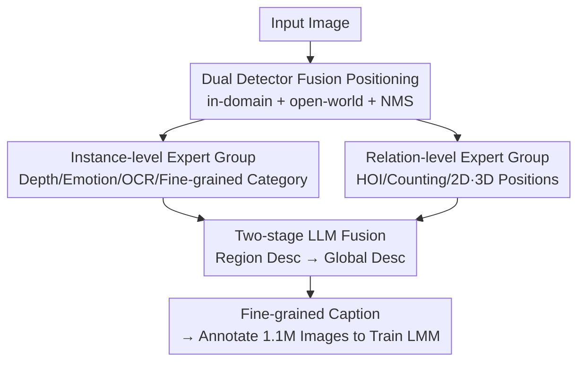

# Enhancing Descriptive Captions with Visual Attributes for Multimodal Perception

**Conference**: CVPR 2026  
**Paper**: [CVF Open Access](https://openaccess.thecvf.com/content/CVPR2026/html/Sun_Enhancing_Descriptive_Captions_with_Visual_Attributes_for_Multimodal_Perception_CVPR_2026_paper.html)  
**Code**: https://github.com/syp2ysy/CapWorkflow  
**Area**: Multimodal VLM / Image Captioning  
**Keywords**: Descriptive image captioning, Visual expert models, Fine-grained attributes, 3D spatial relations, LMM pre-training data  

## TL;DR
This paper proposes Cap-Workflow, which utilizes a suite of off-the-shelf visual expert models (detection, depth, emotion, OCR, fine-grained recognition, HOI) to extract fine-grained attributes and object relationships "unseen by general LMMs" from images. These attributes are integrated into accurate and detailed image descriptions using a two-stage LLM approach. This process re-labels 1.1M images into superior LMM pre-training corpora, enhancing the perception and reasoning capabilities of LLaVA-v1.5/NeXT across 14 benchmarks.

## Background & Motivation
**Background**: Training Large Multimodal Models (LMMs) relies heavily on descriptive "image-text" captions for vision-language alignment. Current caption sources primarily follow two paths: manual annotation (e.g., COCO, LAION) or distillation using powerful LMMs (e.g., GPT-4V/InternVL2 as seen in ShareGPT4V and DenseFusion).

**Limitations of Prior Work**: Neither path is sufficient. Manual captions tend to describe only the most salient objects, missing fine-grained details, object counts, and contextual relationships—for example, a COCO caption for a skateboarding image might only mention "a shirtless man with green tattoos on a skateboard," losing other objects and the spatial structure. While LMM-generated captions are more detailed, they still **entirely overlook certain objects** (e.g., Object 6 in Fig. 1 is ignored by all LMMs). Crucially, they lack **3D spatial relations**, precise **OCR**, and **fine-grained categories** (specific species of animals/aircraft/landmarks), and are often accompanied by hallucinations.

**Key Challenge**: General LMMs are "jacks of all trades but masters of none"—they are not specifically trained to estimate depth, identify species, read text, or judge human-object interactions, making these capabilities "blind spots." However, these precise signals are exactly what complex visual reasoning requires. Achieving "comprehensiveness, accuracy, and granularity" simultaneously within a single general model is inherently difficult.

**Goal**: To create image descriptions with **more complete information, finer attributes, and more accurate relationships** without relying on closed-source models or expensive manual labor, and to verify that such captions significantly improve downstream LMMs.

**Key Insight**: The authors observe that human understanding of an image involves perceiving through specialized visual abilities (depth perception, species recognition, reading text, interaction judgment) and then organizing these cues into language via cognition. Thus, **visual expert models can replicate specialized capabilities**, while **LLMs simulate cognitive integration**.

**Core Idea**: Replace "single-pass captioning by a general LMM" with "attribute extraction by off-the-shelf experts + two-stage LLM fusion," explicitly injecting fine-grained attributes and 3D relations that are invisible to general models.

## Method

### Overall Architecture
Cap-Workflow is a "perceive then organize" annotation pipeline: it takes an image as input and outputs a detailed, accurate descriptive caption. It first uses a robust detector to localize objects, then branches into parallel attribute extraction: one for **instance-level attributes** (size, depth, emotion, text, and fine-grained category per object) and another for **relation-level attributes** (HOI, counting, 2D/3D positional relations). This is followed by a two-stage language fusion: in the first stage, an LLM merges attributes of each object with a base caption (from InternVL2-26B) to create **region-level descriptions**; in the second stage, the LLM combines these region descriptions with relation-level attributes and grounding information into a **complete image-level caption**. The entire pipeline uses only open-source experts and LLMs.

### Key Designs

**1. Dual Detector Fusion Positioning: Precise bounding boxes as attribute anchors**

All attributes in the pipeline are "anchored to boxes"—depth is averaged within a box, emotion is judged if a box is a "person," and fine-grained recognition is performed on cropped boxes. Thus, detection recall and deduplication determine the upper bound. Instead of a single detector, the authors merge boxes from an **in-domain detection model** and an **open-world detection model**: boxes with confidence > 0.5 are kept to balance common and open-vocabulary classes, with NMS (IoU threshold 0.75) used to remove redundancy. This ensures objects typically missed by general LMMs are captured while controlling noise. ⚠️ The authors admit that detection noise can interfere with object identification and impact POPE (hallucination evaluation).

**2. Instance-level Expert Group: Complementing fine-grained details invisible to general models**

The biggest blind spot of general LMMs is granularity—they might say "a bird" but cannot identify the species. Cap-Workflow addresses this with several experts: bounding box area provides **size**; the depth map is averaged within the box for **depth** (the basis for 3D relations); an emotion model provides **emotion** for "person" boxes; an OCR model extracts **text content and location**; and a set of **fine-grained recognition models** covers animals (891k species), plants (427k species), food, logos, aircraft, landmarks, and celebrities. These categories are treated as "external world knowledge" to align image content with basic human cognition (e.g., identifying an F-16A/B rather than just a "military jet").

**3. Relation-level Expert Group: Explicitly providing relationships (especially 3D) rarely captured by general models**

Captions must contain object relationships to support scene structure understanding, which is a weak point for LMMs. The authors extract three types: an **HOI model** for person-object interactions (P2O relation) to complement missing action events; bounding boxes for **2D absolute positions** (left/right/center, etc.), **2D relative positions** (A is near B), and a global **count**; and most critically, **3D relative positions**. By utilizing depth differences between two objects, the system determines "Relative to the camera, A is in front of/behind B." Basing 3D relations on physical depth rather than LLM guesswork provides a signal that is missing in general LMMs but crucial for complex reasoning (e.g., GQA).

**4. Two-stage Prompt-guided LLM Fusion: Organizing scattered attributes into coherent language**

Extracted attributes are structured fragments. The authors use a two-stage LLM (Qwen2-72B-AWQ) with structured prompts to convert them into natural language. **Stage 1 (Region Description)**: Object attributes and the InternVL2-26B base caption are fed to the LLM to integrate category, color, texture, position, and interaction into coherent sentences. **Conditional constraints** are added to suppress fine-grained hallucinations:

> "{cat_name} appears in this region and {animal_name} is a sub-class of {cat_name}; then use {animal_name} in the caption; otherwise, do not mention {animal_name}"

This ensures fine-grained labels are only included if they logically belong to the detected coarse category. **Stage 2 (Global Caption)**: Relation-level attributes, region grounding information, and region captions are merged into the final image caption. For 3D relations, a template is used: "Relative to the camera, the {cat0} in {bbox0} is {3d_relation} the {cat1} in {bbox1}.", where `{3d_relation}` is derived from the depth difference.

### Loss & Training
Cap-Workflow is an **annotation engine** and does not involve training a new model itself. Its outputs are the datasets **Cap-Workflow-1M** (from 1 million diverse images in DenseFusion) and **Cap-Workflow-118K** (118k complex COCO images). Downstream validation uses LLaVA-v1.5 and LLaVA-NeXT with a two-stage training approach: (1) Pre-training phase—LLaVA-v1.5 trains the projector, then the last 12 layers of the vision encoder, while LLaVA-NeXT is fully trainable; (2) Instruction tuning phase—using LLaVA-mix-665K and LLaVA-NeXT-data **without modified SFT data**, ensuring gains are purely attributable to pre-training caption quality.

## Key Experimental Results

### Main Results
Comparison of different caption annotation methods on the same downstream models (higher is better). Pre-training with Cap-Workflow captions achieves the best performance on most benchmarks:

| Downstream Model | Annotation Method | GQA | ScienceQA | MMBench | MM-Vet | SEED-Bench |
|----------|----------|-----|-----------|---------|--------|-----------|
| LLaVA-v1.5-7B | +ShareGPT4V | 63.3 | 68.4 | 68.8 | 37.6 | 61.9 |
| LLaVA-v1.5-7B | +DenseFusion | 64.0 | 69.3 | 69.2 | 37.8 | 62.3 |
| LLaVA-v1.5-7B | **+Cap-Workflow** | **64.2** | **71.0** | 69.2 | **38.2** | **64.3** |
| LLaVA-NeXT-7B | +IT | 64.9 | **71.3** | 68.6 | 38.1 | 65.4 |
| LLaVA-NeXT-7B | **+Cap-Workflow** | **65.2** | 71.2 | **69.3** | **40.1** | **65.7** |

VQA Benchmarks (LLaVA-v1.5/NeXT pre-trained with Cap-Workflow-1M vs. Baseline):

| Model | VQAv2 | DocVQA | GQA | TextVQA | ScienceQA | Ai2d |
|------|-------|--------|-----|---------|-----------|------|
| LLaVA-v1.5 Baseline | 78.5 | 28.1 | 62.0 | 58.2 | 66.8 | 55.5 |
| LLaVA-v1.5 (Ours) | **80.9** | **39.1** | **64.2** | **61.4** | **71.0** | **59.4** |
| LLaVA-NeXT Baseline | 81.8 | 74.4 | 64.2 | 64.9 | 70.1 | 66.6 |
| LLaVA-NeXT* (Ours) | **82.4** | **78.8** | **65.2** | 64.8 | **71.2** | **71.2** |

### Ablation Study
Using fixed 118K COCO images, comparing different annotation methods (Manual / General LMM / Cap-Workflow) for downstream performance:

| Downstream Model | Annotation Method | OKVQA | GQA | ScienceQA | TextVQA | MM-Vet | SEED-Bench |
|----------|----------|-------|-----|-----------|---------|--------|-----------|
| LLaVA-v1.5 | + Manual | 54.9 | 62.4 | 68.6 | 58.1 | — | 61.1 |
| LLaVA-v1.5 | + InternVL2-26B | 54.7 | 63.0 | 69.1 | 58.4 | 32.7 | 61.8 |
| LLaVA-v1.5 | + LLaVA-NeXT-34B | 55.7 | 62.9 | 68.8 | 58.7 | 33.0 | 61.7 |
| LLaVA-v1.5 | **+ Cap-Workflow** | **56.9** | **63.2** | **69.8** | **58.9** | **33.9** | **62.0** |

Human evaluation of attribute richness (100 images, 5–10 evaluators) shows that Cap-Workflow leads significantly in spatial relations (0.75), fine-grained attributes (0.24), OCR (0.48), emotion (0.47), and position (0.81).

### Key Findings
- **Object attribute experts drive OKVQA/TextVQA**: Fine-grained object attributes significantly improve tasks requiring identification of specific entities compared to InternVL2 annotations.
- **Relation attributes drive GQA**: Explicit injection of object-to-object relations enhances understanding of scene structures, yielding high gains in visual reasoning (GQA).
- **3D relations are a unique advantage**: While general LMMs struggle with 3D, Cap-Workflow consistently provides them via depth differences, benefiting complex spatial reasoning.
- **Honest Limitations**: TextVQA is hindered by open-source OCR limitations; MMBench-CN is weak due to the lack of Chinese in the 1M corpus; POPE (hallucination) is slightly affected by detection noise.

## Highlights & Insights
- **The "Generalist Patch" approach is practical**: Rather than forcing a general LMM to be perfect at everything, this method identifies its blind spots and patches them with specialized, affordable models. This decoupling allows each capability to be handled by the best-fit model and is highly extensible.
- **3D relations via physics, not guessing**: Grounding "A is in front of B" in physical depth differences avoids the hallucinations common when LMMs guess spatial relations based on text likelihood.
- **Suppressing hallucinations with conditional prompts**: The "use sub-class only if valid" constraint is a simple but effective mechanism to prevent LLMs from generating unverified fine-grained labels during fusion.
- **Method as data, data as gain**: The entire engine culminates in "better pre-training captions," and by freezing SFT data, it cleanly proves that performance gains stem from caption quality.

## Limitations & Future Work
- The authors acknowledge: Open-source OCR misses small text (limiting TextVQA); the 1M corpus lacks Chinese (weakening MMBench-CN); and detection noise can propagate errors.
- Self-identified limitations: The pipeline involves detection, depth, emotion, OCR, multiple fine-grained models, HOI, and two 72B LLM calls, leading to **high annotation costs and error propagation**. An error in the upstream detector propagates through the entire pipeline.
- Future work: Adding confidence scores to attributes for weighted fusion or rejection; introducing multilingual LLMs and Chinese OCR; making the expert group plug-and-play for different scenarios.

## Related Work & Insights
- **vs. ShareGPT4V / DenseFusion**: These rely on single LMM distillation (GPT-4V/InternVL2), which is scalable but inherits the model's blind spots (3D, fine-grained details). Cap-Workflow explicitly fills these gaps.
- **vs. Manual Annotations (COCO / DCI / DOCCI)**: Manual labels are accurate but expensive and often simplified. Cap-Workflow provides more comprehensive and detailed descriptions automatically.
- **vs. ReCap / IT**: These also focus on caption enhancement, but Cap-Workflow's modular injection of specialized visual capabilities, particularly 3D spatial relations, sets it apart.

## Rating
- Novelty: ⭐⭐⭐⭐ The approach of using specialized experts + two-stage fusion to patch LMM blind spots is clear and practical. 3D relation injection is a highlight, though individual components are existing models.
- Experimental Thoroughness: ⭐⭐⭐⭐⭐ 14 benchmarks, two downstream models, comparison with 6 annotation methods, human evaluations, and honest reporting of limitations.
- Writing Quality: ⭐⭐⭐⭐ Motivation and pipeline are well-explained; some metric names and tables are slightly cluttered.
- Value: ⭐⭐⭐⭐ Provides a 1.1M high-quality pre-training corpus and an open-source engine with high utility for data-centric LMM development.

<!-- RELATED:START -->

## Related Papers

- [\[CVPR 2026\] Same or Not? Enhancing Visual Perception in Vision-Language Models](same_or_not_enhancing_visual_perception_in_vision-language_models.md)
- [\[CVPR 2026\] DiG: Differential Grounding for Enhancing Fine-Grained Perception in Multimodal Large Language Models](dig_differential_grounding_for_enhancing_fine-grained_perception_in_multimodal_l.md)
- [\[CVPR 2026\] DEVA: Fine-tuning Multimodal Large Language Models for Visual Perception Tasks](deva_fine-tuning_multimodal_large_language_models_for_visual_perception_tasks.md)
- [\[CVPR 2026\] CodePercept: Code-Grounded Visual STEM Perception for MLLMs](codepercept_code-grounded_visual_stem_perception_for_mllms.md)
- [\[CVPR 2026\] ViKey: Enhancing Temporal Understanding in Videos via Visual Prompting](vikey_enhancing_temporal_understanding_in_videos_via_visual_prompting.md)

<!-- RELATED:END -->
