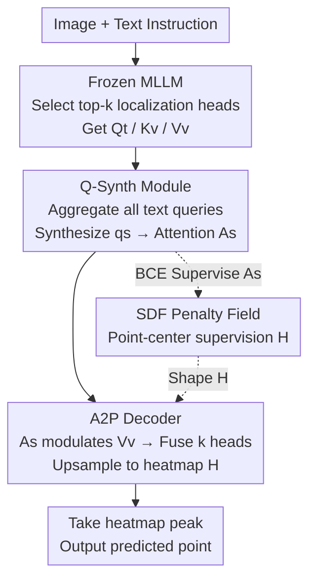

# Enhancing Part-Level Point Grounding for Any Open-Source MLLMs

**Conference**: CVPR 2026  
**Paper**: [CVF Open Access](https://openaccess.thecvf.com/content/CVPR2026/html/Jhang_Enhancing_Part-Level_Point_Grounding_for_Any_Open_Source_MLLMs_CVPR_2026_paper.html)  
**Code**: None (Not released)  
**Area**: Multimodal VLM  
**Keywords**: Part-level point grounding, MLLM attention, frozen backbone, query synthesis, robot perception  

## TL;DR
Without fine-tuning any MLLM parameters, by "synthesizing a grounding-aware query" in the intermediate layers to reshape text-to-image attention and using a lightweight decoder to upsample it into a point heatmap, the **part-level point grounding** accuracy of open-source MLLMs is significantly improved. This method can be plug-and-played into any model with an attention mechanism.

## Background & Motivation
**Background**: Visual grounding maps free-text queries to specific regions in an image. Recently, MLLMs (e.g., Molmo, Qwen2.5-VL) have begun incorporating "point grounding" into their training objectives, outputting coordinates directly in text format. Point representation is more compact than boxes or masks and aligns closely with "action locations" for robotic tasks such as picking and placing—for instance, locating **parts** like cuffs, collars, or hems when folding clothes.

**Limitations of Prior Work**: Existing MLLMs perform well at **object-level** grounding but struggle significantly at the **part-level**. Table 1 in the paper provides evidence: Molmo-7B drops from 0.854 object-level Acc to 0.487 at the part-level; Qwen2.5-VL-7B drops from 0.838 to 0.407; and First-Gen-MLLMs without specialized point grounding training achieve only 0.068 at the part-level. Part-level grounding requires finer spatial localization, which is essential for fine-grained manipulation tasks.

**Key Challenge**: To enhance the grounding capabilities of MLLMs, both existing paths involve trade-offs. The first is **fine-tuning**: making the model autoregressively output box coordinates or introducing a special `[SEG]` token for mask decoding—however, fine-tuning can cause the model to overfit to specific outputs, **damaging its original reasoning and conversation capabilities**. The second is **freezing parameters and reading attention**: recent work suggests that MLLM text-to-image attention naturally highlights query-related regions for zero-shot grounding—but **native attention is not precise enough**, especially for part-level grounding that requires exact spatial localization.

**Goal**: To improve native attention into precise part-level point grounding while **completely freezing** the MLLM to preserve pre-training capabilities, ensuring the method can be **universally** applied to any open-source MLLM.

**Key Insight**: The authors identify two specific shortcomings in existing "attention-reading" methods: ① They fixedly use the query of the **last token** in a sentence to represent the entire semantics (e.g., using the `.` token's query for "Point to the handle of the knife."), which fails to capture full semantics when the sentence involves multiple concepts or reasoning; ② The resolution of attention maps is limited by image patching (typically $1/14$ of the original image), making it impossible to pinpoint centers accurately even if the correct patch is selected.

**Core Idea**: Utilize a **learnable Q-Synth module** to aggregate semantics from **all** text queries and synthesize a single grounding-aware query to drive attention; then use an **A2P decoder** to upsample low-resolution attention into a point-centered heatmap; supplemented by an **SDF penalty field** for point-center supervision. This triad is trained end-to-end while keeping the backbone completely frozen.

## Method

### Overall Architecture
The method is inserted into a specific layer $l$ and certain attention heads $h$ of a **frozen** MLLM. Following prior work ([9]), the top-$k$ "localization-critical" attention heads are selected as localization heads. Within each head, text features serve as the query $Q_t$, and image features serve as the key $K_v$ and value $V_v$. The native approach uses a target token's query $q_{tg}$ to compute text-to-image attention; this paper replaces it with a superior alternative.

The pipeline consists of three steps: **(1) Q-Synth module** takes all text queries $Q_t \in \mathbb{R}^{L \times d_h}$ from the layer to synthesize a single grounding-aware query $q_s$, computing a refined attention map $A_s$; **(2) A2P decoder** uses $A_s$ to modulate the image value $V_v$ to obtain target-focused feature maps, which are fused across $k$ heads and upsampled via convolution and bilinear interpolation to output a high-resolution heatmap $H$; **(3) The peak position of $H$** is taken as the final predicted point. Two losses are used during training: patch-wise BCE to supervise $A_s$, and an SDF penalty field to shape $H$, with no MLLM parameters modified.

### Key Designs

**1. Q-Synth Query Synthesis Module: Compressing sentence semantics into a grounding-aware query**

Addressing the issue where "fixedly using the last token query fails to capture full semantics," Q-Synth no longer selects a single token but synthesizes a single query $q_s$ **conditioned on all text queries** $Q_t \in \mathbb{R}^{L \times d_h}$. It initializes $N$ learnable latent vectors $Z^{(0)} \in \mathbb{R}^{N \times d_h}$ as queries, using text features as both keys and values ($K_s = V_s = Q_t$). $T$ rounds of cross-attention are stacked to let the latents repeatedly "absorb and refine" the most relevant semantics:

$$Z^{(t)} = Z^{(t-1)} + \mathrm{CrossAttn}\!\left(Z^{(t-1)},\, K_s,\, V_s\right)$$

After $T$ rounds, $Z^{(T)} = [z_1, \dots, z_N]$ is obtained. A lightweight MLP computes the importance weight for each latent, which are then weighted and summed to form the final query:

$$q_s = \sum_{i=1}^{N} \alpha_i z_i, \quad \alpha_i = \mathrm{softmax}\!\left(\mathrm{MLP}(z_i)\right)$$

$q_s$ replaces the original $q_{tg}$ to compute the synthesized attention map $A_s$ (following the form $\mathrm{softmax}(q K_v^\top / \sqrt{d_h})$). Each selected localization head is equipped with an independent Q-Synth, producing $k$ synthesized attention maps. This step is the crux of the method: ablation studies show that removing Q-Synth causes the largest drop in performance, indicating that the bottleneck lies in "attention semantic precision" rather than just resolution.

**2. A2P Attention-to-Point Decoder: Upsampling low-resolution attention into a point-centered heatmap**

To solve the "patchiness leading to low resolution and imprecise patch-center pointing" issue, the A2P decoder upgrades $A_s$ into a high-resolution heatmap. Crucially, it does not use the attention map alone but **incorporates original image values $V_v$**, as $V_v$ contains the visual content actually "seen" by that attention head. Specifically, $A_s$ is used to weight $V_v$, resulting in a spatially modulated feature map $F \in \mathbb{R}^{P_h \times P_w \times d_h}$, which highlights the target area and suppresses irrelevant regions. The feature maps from $k$ heads are weighted by a lightweight MLP, concatenated along the feature dimension, and reduced via a $1 \times 1$ convolution to form a fused feature $F_{\text{fused}}$. Finally, a sequence of alternating convolutional layers and bilinear upsampling is used for spatial refinement and hierarchical upsampling, outputting the high-resolution heatmap $H$. Ablation without $V_v$ (decoder only using $k$-channel attention maps) dropped accuracy from 0.463 to 0.453, proving fine-grained visual information is beneficial.

**3. SDF Penalty Field: Using an asymmetric signed distance field to push heatmaps toward the part's innermost point**

To address the problem where "heatmaps cover the region but do not converge on the most representative point," the authors design an **asymmetric** penalty field inspired by Signed Distance Fields (SDF) in 3D reconstruction. Standard SDF is symmetric across boundaries (positive outside, negative inside), but here the objective is asymmetric: predictions falling **outside** the target should be heavily penalized, while those **inside** are considered correct with small penalties, encouraging the model to move toward the **innermost point**. A softplus function with hyperparameters $\tau$ (steepness) and $\gamma$ (inside/outside asymmetry) maps the raw SDF value $x$ to a penalty:

$$f(x) = \operatorname{softplus}\!\left(\frac{x}{\tau}\right) + \gamma \begin{cases} e^{x/\tau}, & x \le 0, \\ 1, & x > 0, \end{cases}$$

The SDF loss is the pixel-wise weighted sum of the predicted heatmap distribution and the penalty field: $\mathcal{L}_{\text{sdf}} = \sum_{u,v} \operatorname{softmax}\!\big(H(u,v)\big) f\!\big(D(u,v)\big)$, where $D$ is the signed distance field. It forces the heatmap to remain within boundaries while tightening toward the innermost point, resulting in a sharper, spatially coherent heatmap.

### Loss & Training
The total loss is $\mathcal{L}_{\text{total}} = \mathcal{L}_{\text{bce}} + \lambda \mathcal{L}_{\text{sdf}}$, trained end-to-end while **freezing all MLLM parameters**. Q-Synth is supervised via patch-wise classification using part-level segmentation masks $M_p$ (downsampled from the original mask $M$ to the patch grid): $\mathcal{L}_{\text{bce}} = \mathrm{BCE}(q_s K_v^\top, M_p)$, forcing $q_s$ to align with visual features of the target region to produce near-binary attention activation, facilitating subsequent feature modulation. The A2P heatmap $H$ is shaped by the $\mathcal{L}_{\text{sdf}}$ described above.

## Key Experimental Results

### Main Results
Evaluated on three datasets: PACO (direct pointing, query explicitly names the target part), InstructPart (reasoning-based pointing, query omits the part and requires reasoning), and PointArena Point-Bench (cross-task generalization). The metric used is hit-or-miss: a prediction is correct if it falls within the GT mask; Patch Accuracy is also reported.

Main Results (PACO / InstructPart, Accuracy):

| Model | Method | PACO Acc | InstructPart Acc |
| :--- | :--- | :--- | :--- |
| Molmo-7B | text pointing | 0.487 | 0.710 |
| Molmo-7B | attention pointing [9] | 0.428 | 0.378 |
| Molmo-7B | **Ours** | **0.510** | **0.868** |
| Qwen2.5-VL-7B | text pointing | 0.407 | 0.708 |
| Qwen2.5-VL-7B | attention pointing [9] | 0.309 | 0.283 |
| Qwen2.5-VL-7B | **Ours** | **0.479** | **0.818** |
| First-Gen-MLLM | text pointing | 0.068 | 0.033 |
| First-Gen-MLLM | attention pointing [9] | 0.183 | 0.194 |
| First-Gen-MLLM | **Ours** | **0.463** | **0.783** |

The most striking result is for **First-Gen-MLLM**: a model with virtually no native point grounding capability is boosted from 0.068 to 0.463 (PACO) and 0.033 to 0.783 (InstructPart), proving that any model with an attention mechanism can be empowered. The gains on InstructPart (longer text, more reasoning) are particularly significant, highlighting Q-Synth's advantage in aggregating full-sentence semantics.

Cross-dataset Generalization (PointArena, evaluated after PACO training, Patch-Acc):

| Model | Method | Affordance | Spatial | Reasoning | Steerability |
| :--- | :--- | :--- | :--- | :--- | :--- |
| Molmo-7B | attn pointing | 0.495 | 0.436 | 0.513 | 0.285 |
| Molmo-7B | Ours | 0.793 | 0.554 | 0.653 | 0.450 |
| Qwen2.5-VL-7B | attn pointing | 0.359 | 0.431 | 0.373 | 0.227 |
| Qwen2.5-VL-7B | Ours | 0.838 | 0.585 | 0.658 | 0.430 |

The method outperforms native attention pointing even on unseen tasks (Spatial / Reasoning / Steerability), indicating that it learns a general ability to condense text intent into a grounding query.

### Ablation Study
Conducted on First-Gen-MLLM + PACO (since the model has no native capabilities, gains are directly attributable to the proposed modules):

| Q-Synth | A2P Decoder | Image V | Accuracy | Notes |
| :--- | :--- | :--- | :--- | :--- |
| ✓ | ✓ | ✓ | **0.463** | Full Model |
| ✓ | ✓ | ✗ | 0.453 | Drops without Image V (lacks fine visual info) |
| ✓ | ✗ | — | 0.429 | Drops without A2P (low-res attention only) |
| ✗ | ✓ | ✓ | 0.336 | Drops hard without Q-Synth (worst case) |

Ablation on localization head count: Acc for $k=1$ is 0.427, $k=3$ is 0.451, $k=5$ (Ours) is 0.463. Beyond $k=5$, additional heads provide weaker localization and unique attention with increased compute, so $k=5$ is chosen.

### Key Findings
- **Q-Synth is the primary contributor**: Removing it causes accuracy to plummet from 0.463 to 0.336, proving the bottleneck is **semantic accuracy**, not just resolution—even with A2P refinement, poor attention initialization cannot be salvaged.
- **A2P's use of Image V is an effective detail**: Removing $V_v$ utilization drops performance by 1% (0.463→0.453), showing that attention maps alone are insufficient without real visual content.
- **More heads are generally better** (up to 5): Unlike previous findings ([9]) that $k=3$ was optimal, this method benefits from more heads because A2P utilizes image $V_v$, where more heads provide a richer variety of feature bases.

## Highlights & Insights
- **"Synthesizing Query" vs. "Picking Token"**: Using Perceiver-style learnable latents to aggregate full-sentence semantics into a single grounding query elegantly avoids the "last token misses semantics" issue and can be applied to any head of any MLLM.
- **Frozen Backbone, Zero Fine-tuning Empowerment**: Boosting First-Gen-MLLMs from near-zero capability (0.068) to usability (0.463) without modifying parameters preserves conversation/reasoning skills and provides a scalable path for future MLLMs to gain fine-grained grounding.
- **Asymmetric SDF Penalty Field**: Adapting SDF concepts from 3D reconstruction to 2D point grounding, the "region coverage" is upgraded to "pushing toward the center," a design that can transition to any task requiring point-centered heatmaps (e.g., keypoints, grasp points).

## Limitations & Future Work
- **Dependence on part-level masks for training**: Q-Synth's BCE and A2P's SDF require masks/SDF, meaning part-level annotated datasets (e.g., PACO) are still necessary; adaptation to unannotated new domains is not discussed.
- **Decoder details in supplementary**: Specific convolution layers/upsampling ratios are not fully detailed in the main text (⚠️ refer to the original paper), and the code is not public.
- **2D points only**: Real-world robotic grasping often requires 3D poses; there remains a gap between 2D points and executable grasps, and the paper only validates 2D accuracy without a closed-loop manipulation test.
- **Sensitivity of $\tau, \gamma, \lambda$**: The sensitivity of the penalty field steepness and asymmetry parameters was not analyzed in the main text.

## Related Work & Insights
- **vs. Fine-tuning Grounding ([SEG] token / autoregressive coordinates, like LISA)**: These modify MLLM output heads to emit box/mask tokens, which works well but harms native reasoning; this paper freezes the backbone and refines attention, prioritizing the preservation of pre-training capabilities.
- **vs. Native Attention Pointing ([9])**: [9] uses raw peaks of native attention maps for zero-training pointing, but is limited by last-token queries and low resolution; this paper builds on their "head selection" but replaces queries with Q-Synth and upsamples to heatmaps, significantly outperforming them (e.g., Molmo InstructPart 0.378→0.868).
- **vs. Specialists (RoboPoint / Molmo)**: These train the entire MLLM as a pointing expert on large-scale data; this paper outperforms specialists like Molmo on part-level tasks (PACO 0.487→0.510) without training the backbone, offering higher universality.

## Rating
- Novelty: ⭐⭐⭐⭐ Combination of synthesized queries, frozen backbone refinement, and asymmetric SDF supervision is novel, though built on existing attention discovery.
- Experimental Thoroughness: ⭐⭐⭐⭐ Evaluated across 3 MLLMs and 3 datasets including generalization and ablation; lacks hyperparameter sensitivity and robot-in-the-loop validation.
- Writing Quality: ⭐⭐⭐⭐ Clear logic from motivation to experiment; Figures 2/3 explain the pipeline well.
- Value: ⭐⭐⭐⭐ Provides a plug-and-play solution for low-cost part-level point grounding in any MLLM, with practical value for embodied/robotic perception.

<!-- RELATED:START -->

## Related Papers

- [\[CVPR 2026\] From Failure to Feedback: Group Revision Unlocks Hard Cases in Object-Level Grounding](from_failure_to_feedback_group_revision_unlocks_hard_cases_in_object-level_groun.md)
- [\[CVPR 2026\] The LLM Bottleneck: Why Open-Source Vision LLMs Struggle with Hierarchical Visual Recognition](the_llm_bottleneck_why_open-source_vision_llms_struggle_with_hierarchical_visual.md)
- [\[CVPR 2026\] Describe Anything Anywhere At Any Moment](describe_anything_anywhere_at_any_moment.md)
- [\[CVPR 2026\] From Indoor to Open World: Revealing the Spatial Reasoning Gap in MLLMs](from_indoor_to_open_world_revealing_the_spatial_reasoning_gap_in_mllms.md)
- [\[CVPR 2026\] Molmo2: Open Weights and Data for Vision-Language Models with Video Understanding and Grounding](molmo2_open_weights_and_data_for_vision-language_models_with_video_understanding.md)

<!-- RELATED:END -->
