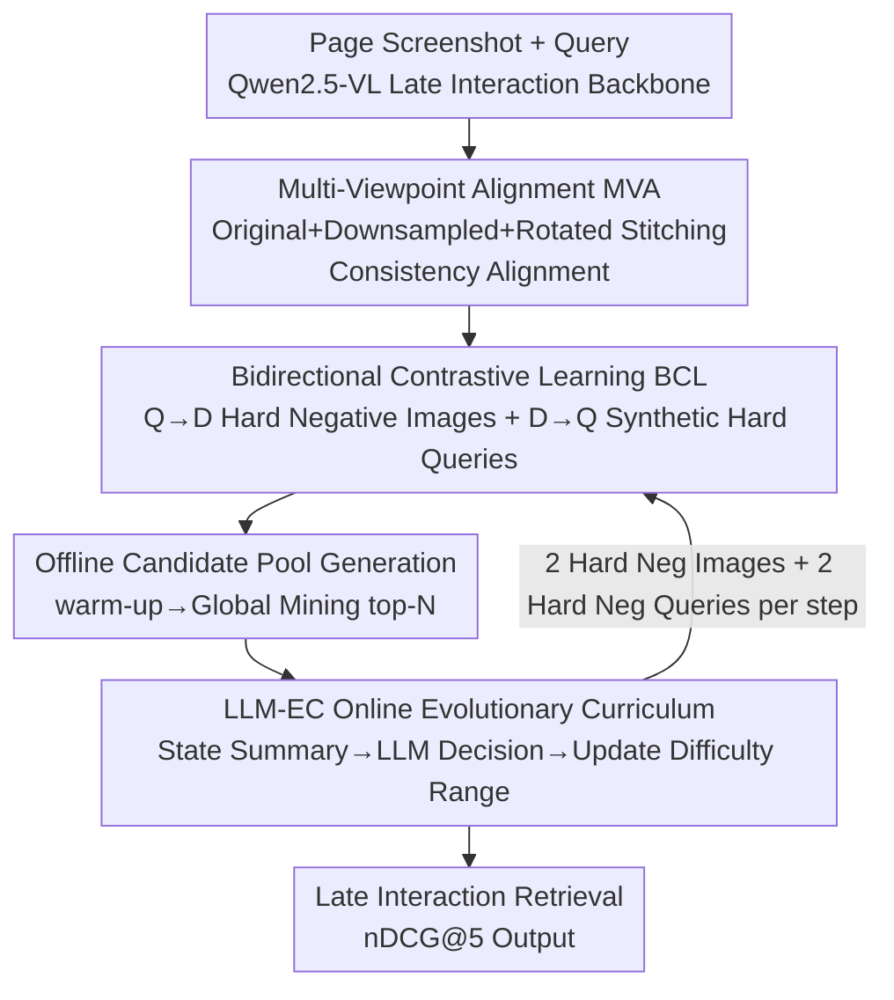

# Evo-Retriever: LLM-Guided Curriculum Evolution with Viewpoint-Pathway Collaboration for Multimodal Document Retrieval

**Conference**: CVPR 2026  
**Paper**: [CVF Open Access](https://openaccess.thecvf.com/content/CVPR2026/html/Li_Evo-Retriever_LLM-Guided_Curriculum_Evolution_with_Viewpoint-Pathway_Collaboration_for_Multimodal_Document_CVPR_2026_paper.html)  
**Code**: https://huggingface.co/ApsaraStackMaaS (Model Weights)  
**Area**: Multimodal VLM / Document Retrieval  
**Keywords**: Visual document retrieval, curriculum learning, hard negative mining, LLM meta-controller, late interaction  

## TL;DR
Evo-Retriever couples the "model" and "training curriculum" into a synergistic evolutionary pair—stabilizing representations through multi-viewpoint alignment and bidirectional contrastive learning, while an external LLM meta-controller dynamically adjusts the difficulty of hard negatives based on real-time training states. It achieves new SOTA results on ViDoRe V2 and MMEB(VisDoc) with nDCG@5 scores of 65.2% and 77.1%, respectively.

## Background & Motivation
**Background**: Complex Visual Document Retrieval (CVDR) entails precisely locating pages related to multimodal queries from large-scale corpora. Mainstream approaches have shifted from "parse-then-retrieve" (OCR + chunking) to directly feeding page screenshots into VLMs to encode them into dense vectors. Among these, **multi-vector late-interaction** models like ColPali index pages at the token level and calculate pair-wise similarity with query tokens at runtime for fine-grained alignment, representing the current SOTA.

**Limitations of Prior Work**: The authors identify three specific flaws in current SOTA models on real-world complex documents: (a) **Insufficient spatial awareness**: Relying on a single fixed viewpoint makes it difficult to integrate spatially dispersed information (e.g., aggregating "Plastic 12%" and "Metal 8%" from different areas); (b) **Inherent vulnerability to textual confusion**: Existing contrastive learning only mines hard negatives that are "visually similar but semantically different," while neglecting "textually similar but visually mismatched" negatives (e.g., misidentifying a text block as a match for a query requesting a chart); (c) **Stagnation due to static curricula**: Even with data synthesis (GME), the curriculum for selecting hard negatives is pre-defined. Models quickly learn the initial hard negatives, after which these samples provide no challenge, leading to gradient signal decay and degraded discriminative power.

**Key Challenge**: Model capabilities evolve dynamically during training, whereas the training curriculum (hard negative difficulty) remains static—a fixed threshold provides effective gradients early on but yields only trivial negatives with near-zero gradients later (the core motivation in Fig.2).

**Core Idea**: Enable **model–curriculum co-evolution**. First, establish robust base representations through Viewpoint-Pathway Collaboration (multi-view + bidirectional paths). Then, employ an LLM meta-controller to adaptively adjust difficulty ranges for hard negative mining based on training state summaries, ensuring the supervision signal remains challenging throughout the training process.

## Method

### Overall Architecture
Evo-Retriever is built upon a Qwen2.5-VL backbone with multi-vector late interaction, integrating three collaborative components: **MVA (Multi-Viewpoint Alignment)** for spatial awareness, **BCL (Bidirectional Contrastive Learning)** to mitigate textual confusion—forming the "Viewpoint-Pathway Collaboration"—and **LLM-EC (LLM-guided Evolutionary Curriculum)** as a meta-controller to dynamically adjust hard negative mining. The pipeline's key lies in MVA/BCL producing robust representations while generating a **candidate pool** of hard negatives (images and queries), which the LLM-EC uses to determine difficulty levels at each step, alternating between estimator (difficulty estimation) and learner (sample learning).

### Key Designs

**1. Multi-Viewpoint Alignment (MVA): Forcing Geometric Invariance with Single-Token Budget**

To address "insufficient spatial awareness," the authors construct a **multi-view jigsaw** $I_{aug}$ for each image $I$: the original image, a downsampled version, and a rotated version (sampled from $[-180°, 180°]$) are **horizontally stitched**. Leveraging Qwen-VL’s smart resizing, the jigsaw generates different patch layouts within the **same token budget**, allowing the model to see multi-scale and multi-orientation views without increasing inference costs. The original image $I$ and the jigsaw $I_{aug}$ share the same mapping path and are aligned with the matching query $Q$. Two alignment losses, $\mathcal{L}_{Q\to I}$ and $\mathcal{L}_{Q\to I_{aug}}$, enforce "representation consistency across scales/orientations under the same query." **Preserving the original view** is critical: ablations show performance drops when using only downsampling (-1.42%) or only stitching without the original image (-2.58%), indicating the necessity of both high-fidelity global context and geometric perturbations. MVA is used only during training and incurs **zero additional inference overhead**.

**2. Bidirectional Contrastive Learning (BCL): Adding the D→Q Path to Mine "Textually Similar, Visually Mismatched" Negatives**

To address "textual confusion," where mainstream retrievers only use query→document (Q→D) contrast, BCL adds constraints in both directions. The core is an automated **Hard Negative Query Synthesis (HNQS) pipeline**: given a positive pair $(I_{pos}, Q_{pos})$, a VLM (Qwen2.5-VL-72B) synthesizes 20 candidate queries that are syntactically/contextually similar to $Q_{pos}$ but semantically **inconsistent** with image $I_{pos}$. These "textually similar but visually mismatched" hard queries force the model to anchor semantics to visual evidence rather than surface-level text matching. Selection is dynamically determined by the LLM-EC.

The overall objective unifies these directions into a softplus-based margin loss (rather than softmax-normalized InfoNCE), allowing each hard negative to contribute gradients **independently**:

$$\mathcal{L}_{total} = \mathcal{L}_{forward} + \alpha \cdot \mathcal{L}_{backward}$$

The forward term includes the dual views of MVA: $\mathcal{L}_{forward} = \mathcal{L}(Q_{pos}, I_{ori}, \{I_{neg}\}) + \beta \cdot \mathcal{L}(Q_{pos}, I^{aug}_{ori}, \{I^{aug}_{neg}\})$. The general margin loss sums over $K$ hard negatives: $\mathcal{L}(Q, I_{pos}, \{I_{neg}\}) = \sum_{k=1}^{K} \log\big(1 + \exp(\frac{\text{sim}(Q, I_{neg}^{(k)}) - \text{sim}(Q, I_{pos})}{\tau})\big)$, where similarity follows ColBERT late interaction: $\text{sim}(Q, I) = \sum_{l=1}^{L_Q} \max_{j=1}^{L_I}\big(E_Q(Q)_l \cdot E_I(I)_j^T\big)$ (L2-normalized token embeddings, dot product as cosine). The backward term symmetrically constrains D→Q using synthetic hard queries $\{Q_{neg}\}$.

**3. LLM-Guided Curriculum Evolution (LLM-EC): Closed-Loop Scheduling of Negative Sample Difficulty**

This design directly addresses "static curriculum stagnation." It operates in two phases. **Offline Candidate Pool Generation**: A warm-up round using in-batch negatives establishes an initial representation space. The model then switches from learner to estimator for a one-time **global offline mining**—retrieving and storing the top-N most similar negative documents for each query $q$ from the entire corpus $\mathcal{D}$ to form a candidate pool $C_q$.

**Online LLM-Guided Curriculum Evolution**: The curriculum is formalized into $M$ discrete difficulty ranges, each defined by $[\tau_{low}, \tau_{high}]$ on a positive-aware difficulty metric. The action of "selecting a range" is assigned to an external LLM in a three-step cycle: (i) **State Summary**: Aggregating key metrics (e.g., average hard negative loss, loss trends) into structured reports; (ii) **LLM Deliberation**: The LLM selects the next action based on a "three-stage decision protocol"; (iii) **Curriculum Update**: Implementing the new range for the next training phase. Unlike fixed threshold schedulers, this controller makes decisions **conditioned on training dynamics**, allowing for non-monotonic adjustments (e.g., rolling back to simpler ranges if training becomes unstable).

The **Three-Stage Decision Protocol** mimics human curriculum design: ① **Exploration**: Systematically mapping the "difficulty-performance landscape" by monitoring loss across various ranges; ② **Transition**: Identifying "effective learning" actions where loss falls within an ideal range ($0.3 \le \text{loss} \le 1.2$) and selecting the hardest as the main anchor; ③ **Lock-in**: Fine-tuning during the main training phase by evaluating "learning speed"—increasing difficulty when mastered, decreasing when struggling, or maintaining otherwise.

### Loss & Training
Backbone: Qwen2.5-VL-3B / 7B-Instruct, projected to 128 dimensions, max 1024 visual tokens per image. $\alpha = \beta = 1$. Training consists of two stages: 1 epoch of warmup using 480K pairs with in-batch negatives + InfoNCE to build the top-N=200 candidate pool; followed by 1 epoch with the LLM-EC dynamic curriculum. Training uses LoRA (rank 32), paged_adamw_8bit, learning rate $2\times10^{-5}$, and a global batch size of 32. Each step uses 2 synthetic hard neg queries + 2 hard neg images. The meta-controller is Qwen3-235B-A22B.

## Key Experimental Results

### Main Results
Benchmarks: ViDoRe V2 (Zero-shot, nDCG@5) and MMEB VisDoc (nDCG@5).

| Benchmark | Metric | Evo-Retriever-7B | Prev. SOTA | Gain |
|--------|------|------|----------|------|
| ViDoRe V2 (Avg) | nDCG@5 | **65.2** | 63.5 (llama-nemoretriever-3b) | +1.7 |
| ViDoRe V2 · Economics Macro | nDCG@5 | 59.1 | 55.9 | +3.2 |
| MMEB (VisDoc) Avg | nDCG@5 | **77.12** | 75.18 (gme-Qwen2-VL-7B) | +1.94 |
| MMEB · VisRAG | nDCG@5 | 89.28 | 84.99 | +4.29 |

Notably, Evo-Retriever-3B (63.3%) outperforms the architecturally similar colqwen2.5-v0.2 (59.3%) by 4.0% on ViDoRe V2, demonstrating gains from training strategy rather than just scale.

### Ablation Study (ViDoRe V2, 3B Model, Baseline Net0 = InfoNCE in-batch = 61.17%)

| Configuration | nDCG@5 | Note |
|------|---------|------|
| Baseline (Net0) | 61.17 | In-batch negative only |
| + MVA (Net1) | 62.25 | Multi-view alignment, +1.08 |
| Downsample-only | 59.75 | Simplified augmentation, -1.42 |
| Stitched-only | 58.59 | Removing original image, -2.58 |
| + BCL (Net2) | 61.84 | Bidirectional contrast, +0.67 |
| Net0+MVA+BCL | 62.39 | Base representation, +1.22 |
| Fixed Window 80-98% | 62.10 | Strong static curriculum, +0.93 |
| Rule-based Oracle | 62.81 | Dynamic curriculum with fixed loss thresholds |
| LLM-EC (Ours) | 63.05 | Outperforms Oracle by +0.24 |
| Full Model | **63.30** | All components |

### Key Findings
- **Dual Views are Essential**: MVA requires both the original image (fidelity) and the augmented jigsaw (invariance); removing either performs worse than the baseline.
- **Exploration Phase is Vital**: Disabling it leads to a 1.19% drop, showing that adaptively determining the starting difficulty is more effective than pre-defined starts.
- **Difficulty Granularity Matters**: Neither too coarse (10 ranges) nor too fine (21 ranges) performs as well as 16 ranges, which balances convergence within each interval.
- **Controller Scale is Not the Bottleneck**: Qwen3-32B achieved 63.30%, slightly higher than the 235B model, suggesting that with a proper protocol, curriculum control relies on flexible logical interpretation rather than extreme scale.

## Highlights & Insights
- **Model-Curriculum Co-Evolution is a Clean Abstraction**: Explicitly modeling hard negative difficulty as an Action space for an external agent turns the "curriculum" from a dead parameter into a closed-loop controllable object.
- **Efficient Token Jigsawing**: Using VLM smart resizing to pack multi-scale views into the same token budget achieves geometric invariance at almost zero marginal cost.
- **LLM as "Coach" rather than Generator**: The LLM does not generate data; it reads structured summaries and makes difficulty decisions. This "meta-level scheduling" is a lightweight way to use LLMs in training.
- **Margin Loss vs. InfoNCE**: Margin loss allows hard negative signals to remain distinct, avoiding the dilution of gradients that often occurs with softmax normalization in InfoNCE.

## Limitations & Future Work
- **Reliance on External Models**: Generating hard queries and the candidate pool requires powerful VLMs and global mining, making the pipeline relatively heavy.
- **Static Candidate Pool**: While selection is dynamic, the pool itself is indexed after warm-up. If representations evolve significantly, the pool may no longer contain the "hardest" negatives.
- **Controller Scale Ambiguity**: The 32B model outperforming the 235B model lacks deep variance analysis; it is unclear if this is a trend or noise.
- **Single-Domain Validation**: The co-evolution paradigm has yet to be tested on general image-text retrieval or basic cross-modal alignment.

## Related Work & Insights
- **vs. ColPali / Late Interaction**: This work adopts the late-interaction architecture but adds multi-view consistency to stabilize alignment under layout changes. It addresses spatial invariance, textual de-confusin, and curriculum evolution on top of fine-grained matching.
- **vs. GME / NV-Retriever**: While prior work uses state-agnostic thresholds or linear interpolation, this work uses an LLM meta-controller to ensure supervision remains challenging based on training dynamics.
- **vs. DocReRank**: The HNQS synthesis prompt design is inspired by DocReRank but integrated into a bidirectional contrastive framework and dynamic curriculum rather than just a reranking stage.

## Rating
- Novelty: ⭐⭐⭐⭐⭐ "Model-curriculum co-evolution + LLM meta-controller" is a distinct and self-consistent paradigm.
- Experimental Thoroughness: ⭐⭐⭐⭐ Solid results on primary benchmarks with three-layer ablations, though candidate pool updates and controller variance could be explored further.
- Writing Quality: ⭐⭐⭐⭐⭐ Clear mapping between pain points and components; intuition is well-communicated.
- Value: ⭐⭐⭐⭐ SOTA performance with a transferable paradigm, though reproduction costs are high.

<!-- RELATED:START -->

## Related Papers

- [\[CVPR 2026\] Camouflage-aware Image-Text Retrieval via Expert Collaboration](camouflage-aware_image-text_retrieval_via_expert_collaboration.md)
- [\[ICLR 2026\] Guided Query Refinement: Multimodal Hybrid Retrieval with Test-Time Optimization](../../ICLR2026/multimodal_vlm/guided_query_refinement_multimodal_hybrid_retrieval_with_test-time_optimization.md)
- [\[CVPR 2026\] STiTch: Semantic Transition and Transportation in Collaboration for Training-Free Zero-Shot Composed Image Retrieval](stitch_semantic_transition_and_transportation_in_collaboration_for_training-free.md)
- [\[ACL 2026\] ViLL-E: Video LLM Embeddings for Retrieval](../../ACL2026/multimodal_vlm/vill-e_video_llm_embeddings_for_retrieval.md)
- [\[CVPR 2026\] Anchor-Guided Gradient Alignment for Incomplete Multimodal Learning](anchor-guided_gradient_alignment_for_incomplete_multimodal_learning.md)

<!-- RELATED:END -->
