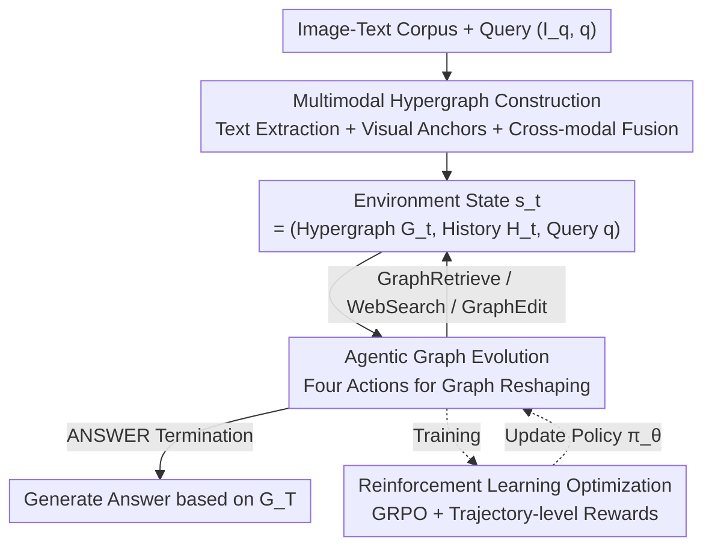

# EvoGraph-R1: Self-Evolving Multimodal Knowledge Hypergraphs for Agentic Retrieval

**Conference**: CVPR 2026  
**Paper**: [CVF Open Access](https://openaccess.thecvf.com/content/CVPR2026/html/Lin_EvoGraph-R1_Self-Evolving_Multimodal_Knowledge_Hypergraphs_for_Agentic_Retrieval_CVPR_2026_paper.html)  
**Code**: To be confirmed (No repository link provided in the paper)  
**Area**: Multimodal VLM / Agentic Retrieval  
**Keywords**: Multimodal GraphRAG, Self-evolving Knowledge Graph, Hypergraph, MDP/Reinforcement Learning, Agentic Retrieval  

## TL;DR
EvoGraph-R1 redefines the knowledge hypergraph in multimodal GraphRAG from a static data structure—"built offline, queried once"—into an MDP environment that co-evolves with the reasoning process. Agents continuously perform four actions: "Query Graph / Web Search / Edit Graph / Answer" to insert, refine, and prune the hypergraph. Optimized end-to-end with GRPO, the system achieves SOTA performance on both multimodal VQA and text-only QA benchmarks.

## Background & Motivation

**Background**: RAG is the dominant paradigm for anchoring Multimodal Large Language Models (MLLMs) to external knowledge. To support structured multi-hop reasoning, recent GraphRAG approaches organize retrieved evidence into "entity-relationship graphs." A typical pipeline involves three steps: LLM-based entity-relationship extraction for graph construction → retrieval of relevant subgraphs → answer generation based on subgraphs.

**Limitations of Prior Work**: The authors identify a fundamental assumption shared by these systems: **knowledge graphs are static structures built offline in a single pass, and are only queried—never modified—during inference**. This leads to three bottlenecks: (1) **Text-centric fragmentation**: LLM extraction compresses rich multimodal evidence into isolated textual triplets, losing cross-modal dependencies and long-range relationships; (2) **Frozen structures**: Once the graph is built, it remains static, unable to incorporate new evidence, correct construction errors, or cover unseen topics during reasoning; (3) **Inflexible one-shot retrieval**: Retrieval is a one-shot process, preventing the system from switching strategies, finding alternative paths, or invoking external searches when initial evidence is insufficient.

**Key Challenge**: Treating the knowledge graph as a passive "data structure" rather than an active "reasoning substrate." Human knowledge reasoning is inherently interactive and iterative—one collects initial evidence, identifies gaps, supplements information, resolves contradictions, and gradually refines understanding. This perfectly aligns with the Reinforcement Learning (RL) paradigm of "agent perceives state → performs action to change state → receives feedback to guide decisions."

**Goal**: To make knowledge graphs "live" during the reasoning process, enabling them to dynamically expand, correct, and prune themselves according to the query.

**Key Insight**: Re-modeling multimodal GraphRAG as a Markov Decision Process (MDP), where the **multimodal knowledge hypergraph serves as the environment state that evolves alongside reasoning**. The state consists of the current hypergraph, action history, and the query; actions include graph retrieval, expansion, editing, or termination; rewards are trajectory-level signals for reasoning quality and efficiency; and the policy is learned via RL.

**Core Idea**: Replace "one-shot retrieval on static graphs" with "continuous hypergraph reshaping via agent-environment interaction," unifying retrieval, reasoning, and knowledge evolution into a closed loop.

## Method

### Overall Architecture
EvoGraph-R1 consists of three components: (1) **Multimodal Hypergraph Construction**—fusing image-text corpora into a unified cross-modal hypergraph as the initial environment state $G_0$; (2) **Agentic Graph Evolution**—modeling retrieval as an MDP where the agent observes the current hypergraph at each step, identifies knowledge gaps, and selects one of four actions to reshape the hypergraph and generate feedback; (3) **Reinforcement Learning Optimization**—training the agent policy using GRPO with trajectory-level rewards. The entire pipeline is a closed loop: the hypergraph and reasoning co-evolve until the agent selects `ANSWER` or reaches the step limit $T$, generating the final answer based on the evolved $G_T$.

### Key Designs

**1. Multimodal Hypergraph Construction: Fusing Image-Text Evidence into a Unified Environment for High-order Reasoning**

To address "text-centric fragmentation," the authors build a **hypergraph** $G_H=(V,E)$ instead of binary triplets. The process follows three steps. **Textual Subgraph Extraction**: Input text is segmented into knowledge snippets, each treated as a hyperedge $e_i=(e_i^{text}, V_{e_i}, r_i, \sigma_i)$, representing the natural language description, entity set, relationship type, and confidence $\sigma_i\in(0,10]$. An n-ary relationship extraction prompt enables the MLLM extractor $\pi_{ext}$ to produce $F_d^{(n)}=\{f_1,\dots,f_k\}\sim\pi_{ext}(d)$, where each $f_\ell=(e_\ell, V_{e_\ell})$ binds a hyperedge to its entity set. This allows "one text segment to contribute multiple, overlapping n-ary facts," supporting high-order reasoning. **Visual Subgraph Construction**: For each image, $\pi_{ext}$ generates a detailed scene description and primary object names. The scene description is encoded as an **anchor node** $u_x=(\text{id}=x,\text{type}=\text{image},\text{mod}=\text{vis})$ for a high-order hyperedge. Entities and fine-grained visual relationship facts $(V_x^{vis}, E_x^{vis})=\pi_{ext}(x)$ are then extracted, with a constraint that every visual hyperedge must contain the anchor $u_x\in V_e$—ensuring visual facts are always tethered to their image source. **Cross-modal Fusion**: An entity resolution function $\phi$ (string similarity + embedding proximity) matches textual and visual entities, merging them into canonical nodes with dual-modal attributes: $V=\text{Resolve}(V_{text}\cup V_{vis},\phi),\ E=E_{text}\cup E_{vis}$. Finally, a multimodal encoder (e.g., GME) embeds all entities and hyperedges into a shared semantic space for offline indexing.

**2. Agentic Graph Evolution: Modeling Retrieval as an MDP for Self-evolving Hypergraphs**

This is the core of the paper, directly addressing "frozen structures" and "inflexible retrieval." The agent-graph interaction is modeled as a discrete-time MDP. **State** $s_t=(G_t, H_t, q)$: The current hypergraph $G_t$ (encoding retrieved entities/relationships/visual regions, alignments, and relevance scores), action history $H_t$ (a sequence of $(a_k, r_k, G_{k+1})$ triplets), and query $q$. This allows decisions based on both "current structure" and "reasoning trajectory." The **Action Space** includes four categories: `GRAPHRETRIEVE` performs entity-level lookups and hyperedge-level vector retrieval in the current graph; `WEBSEARCH` is triggered when internal evidence is insufficient, constructing $q_{web}$ to fetch and align external info; `GRAPHEDIT` directly modifies the graph with three sub-operations—`INSERT` adds new retrieved entities/hyperedges as verified evidence, `UPDATE` corrects existing hyperedges to refine facts, and `DELETE` performs soft pruning by **reducing the confidence of low-quality or refuted elements**; `ANSWER` terminates the process. The **Mechanism** for state transition is $G_{t+1}=\pi_{evolve}(a_t, G_t)$. While `GRAPHRETRIEVE` only marks visited elements, `WEBSEARCH` adds new facts, and `GRAPHEDIT` improves graph quality. The final answer is $a^*\leftarrow\pi_{resp}^{final}(q, H_T)$.

**3. RL Optimization: Teaching Agents to Evolve Graphs Accurately and Efficiently**

To teach the agent "when to query, search, edit, or stop," the authors use GRPO to train the policy $\pi_\theta(a_t\mid s_t)$. The reward function $R(\tau)$ consists of three components. **Structure Reward** ensures logical interaction: each step must output intermediate blocks $(a_t^{think}, \alpha_t, a_t^{out})$. If formatted correctly, the agent is rewarded up to a cap: $R_{struct}(\tau)=\min\big(1.0,\ \eta\sum_{t=1}^{|\tau|}\mathbb{I}_{valid}(t)\big)$, where $\eta=0.5$ encourages disciplined multi-round reasoning. **Answer Reward** uses token-level overlap (F1-style) between the predicted answer and ground truth $y_q^*$:

$$R_{ans}(a_T^{ans})=\frac{2\,|\text{tok}(a_T^{ans})\cap\text{tok}(y_q^*)|}{|\text{tok}(a_T^{ans})|+|\text{tok}(y_q^*)|}$$

The **Total Reward** integrates correctness, structure, and efficiency:

$$R(\tau)=-\lambda\sum_{t=1}^{|\tau|}c(a_t)+R_{struct}(\tau)+\mathbb{I}[R_{struct}(\tau)=1.0]\cdot R_{ans}(a_T^{ans})$$

where $c(a_t)$ is the normalized cost of action $a_t$ and $\lambda>0$ is the efficiency coefficient. Crucially, **the answer reward only activates if the structure reward is 1.0**, forcing the agent to master standardized reasoning before optimizing for accuracy. GRPO performs stable updates by comparing the reward of a trajectory to the group mean.

## Key Experimental Results

### Main Results
On text-only (2WikiMultiHopQA / HotpotQA / NQ, F1) and multimodal (E-VQA / InfoSeek / OK-VQA, Accuracy) benchmarks, EvoGraph-R1-7B outperforms RAG, GraphRAG, and RL-enhanced baselines.

| Setup | Method | 2Wiki | HotpotQA | NQ | E-VQA | InfoSeek | OK-VQA |
|------|------|-------|----------|------|--------|----------|--------|
| No Retrieval | GPT-4o-mini | 17.0 | 31.8 | 21.6 | 27.2 | 35.9 | 65.9 |
| GraphRAG | HippoRAG2 | 23.5 | 44.8 | 24.1 | 22.6 | 25.6 | 48.2 |
| RL Enhanced | MMSearch-R1-7B | 38.5 | 45.3 | 41.6 | 36.9 | 41.3 | 59.9 |
| RL Enhanced | Graph-R1-7B | 65.0 | 62.7 | 49.9 | 28.5 | 29.8 | 53.6 |
| **Ours** | **EvoGraph-R1-7B** | **68.5** | **65.4** | **56.8** | **43.6** | **42.3** | **68.6** |

**Gain**: On text datasets, it surpasses Graph-R1 by up to +6.9% (NQ). On multimodal datasets, it exceeds MMSearch-R1 by +6.7% (E-VQA) and GPT-4o-mini by +2.7% (OK-VQA). The advantage over "online search without persistence" (e.g., Search-R1) is significant, highlighting the value of a "persistently evolving graph."

### Ablation Study
Ablations on 2Wiki (F1) and E-VQA (Acc) with average retrieval rounds (efficiency).

| Configuration | 2Wiki F1 | 2Wiki Rounds | E-VQA Acc | E-VQA Rounds | Description |
|------|----------|-----------|-----------|-----------|------|
| Full Model | 68.5 | 2.57 | 43.6 | 1.65 | Full components |
| − Hypergraph | 63.1 | 2.82 | 38.8 | 2.29 | -5.4 / 4.8, more rounds |
| − INSERT | 60.1 | 3.48 | 36.8 | 2.45 | Max drop (-8.4/6.8), inefficient |
| − UPDATE | 63.0 | 2.95 | 39.7 | 2.10 | -5.5 / 3.9, correction value |
| − DELETE | 66.1 | 2.70 | 42.1 | 1.85 | Small but stable gain |
| − WEBSEARCH | 58.9 | 3.17 | 32.4 | 2.22 | Massive drop (-9.6/11.2) |

### Key Findings
- **INSERT and WEBSEARCH are foundational**: Removing INSERT drops 2Wiki F1 by 8.4% and increases rounds by 35.4%. Removing WEBSEARCH yields the largest accuracy drop (up to 11.2%), proving static corpora cannot sustain open-domain long-tail knowledge.
- **Accuracy-Efficiency Synergy**: EvoGraph-R1 converges in ~2.4 rounds (~1,300 tokens). Variants without graph editing require ~3.1 rounds (~2,850 tokens), proving that a persistent hypergraph prevents redundant retrieval.
- **Robust in Data-Scarce Regimes**: When Wikipedia is reduced to 1%, EvoGraph-R1 maintains 37.2% accuracy (vs. 13.2%–18.9% for baselines). The lead over MMKB-RAG expands from +7.7% at full data to +13.2% at 1%.
- **Measurable Structural Improvement**: Post-evolution hypergraph density increases by +7.81%, clustering coefficient by +16.67%, and edge semantic similarity by +3.16%, transforming loose associations into coherent multi-hop clusters.

## Highlights & Insights
- **"Graph-as-Environment" Paradigm Shift**: Elevating the KG from a passive structure to an evolving MDP environment is the breakthrough. Retrieval, reasoning, and evolution are unified in one loop.
- **Soft Deletion via Confidence**: `DELETE` reduces confidence instead of hard removal, preserving potentially useful info while mitigating noise—a robust detail for graph maintenance.
- **"Gated" Structure Reward**: $R_{ans}$ is only awarded if $R_{struct}=1.0$. This forces the agent to follow standardized reasoning protocols first, inhibiting "correct answers via chaotic processes."
- **Modality Agnosticism**: The framework naturally excels in text-only tasks when visual components are removed, proving the "graph as environment" value is independent of modality.

## Limitations & Future Work
- **Dependency on Strong External Components**: Construction relies on GPT-4o-mini and vector retrieval on GME; system limits are tethered to these black-box performance ceilings.
- **F1 Token Overlap Reward**: May provide inflated rewards for partial overlaps in numerical or entity-specific questions, potentially biasing the policy toward "keyword harvesting" rather than true correctness.
- **Web Noise and Latency**: `WEBSEARCH` introduces risks from long-tail online noise. While `DELETE` exists, the timeliness of error correction lacks dedicated verification.
- **Future Directions**: Self-adaptive efficiency coefficients $\lambda$; reliability filters for `WEBSEARCH` evidence; explicit hypergraph state caching to reduce construction overhead.

## Related Work & Insights
- **vs. Graph-R1**: While Graph-R1 uses RL for interactive search on hypergraphs, it assumes a fixed offline structure. EvoGraph-R1 differentiates itself by **online** expansion and pruning (`GRAPHEDIT`), leading to a significant lead (E-VQA 43.6 vs. 28.5).
- **vs. MMSearch-R1 / Search-R1**: These agents use RL for web search but treat results as **transient prompt context**. EvoGraph-R1 treats search as a state update to a persistent hypergraph, enabling traceable multi-hop reasoning.
- **vs. Multimodal GraphRAG (e.g., RAG-Anything)**: These build cross-modal graphs but remain static. This work shifts the paradigm to incremental construction and pruning during inference.

## Rating
- Novelty: ⭐⭐⭐⭐⭐ First to model multimodal KGs as evolving MDP environments.
- Experimental Thoroughness: ⭐⭐⭐⭐⭐ Covers 6 benchmarks, 3 baseline categories, and detailed structural/efficiency analyses.
- Writing Quality: ⭐⭐⭐⭐ Clear motivation and layering; some symbols (e.g., $\pi_{evolve}$ implementation) remain slightly abstract.
- Value: ⭐⭐⭐⭐⭐ "Graph-as-environment" and "gated rewards" are highly transferable concepts for agentic RAG.

<!-- RELATED:START -->

## Related Papers

- [\[CVPR 2026\] VisPlay: Self-Evolving Vision-Language Models](visplay_self-evolving_vision-language_models.md)
- [\[CVPR 2026\] Self-guided Semantic Inspection for Zero-Shot Composed Image Retrieval](self-guided_semantic_inspection_for_zero-shot_composed_image_retrieval.md)
- [\[CVPR 2026\] Air-Know: Arbiter-Calibrated Knowledge-Internalizing Robust Network for Composed Image Retrieval](air-know_arbiter-calibrated_knowledge-internalizing_robust_network_for_composed_.md)
- [\[ICLR 2026\] Self-Evolving Vision-Language Models for Image Quality Assessment via Voting and Ranking](../../ICLR2026/multimodal_vlm/self-evolving_vision-language_models_for_image_quality_assessment_via_voting_and.md)
- [\[ICML 2026\] SOLAR: Self-supervised Joint Learning for Symmetric Multimodal Retrieval](../../ICML2026/multimodal_vlm/solar_self-supervised_joint_learning_for_symmetric_multimodal_retrieval.md)

<!-- RELATED:END -->
