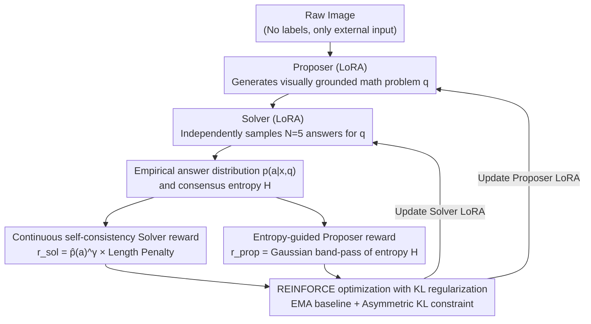

# EvoLMM: Self-Evolving Large Multimodal Models with Continuous Rewards

**Conference**: CVPR 2026 Findings  
**arXiv**: [2511.16672](https://arxiv.org/abs/2511.16672)  
**Code**: [https://github.com/mbzuai-oryx/EvoLMM](https://github.com/mbzuai-oryx/EvoLMM) (Open Source)  
**Area**: Multimodal VLM / Self-Evolving Learning  
**Keywords**: Self-evolving LMM, Unsupervised self-improvement, Continuous self-consistency rewards, Proposer-Solver, Visual mathematical reasoning

## TL;DR
EvoLMM is proposed as a purely unsupervised self-evolving framework. It splits a single LMM into a Proposer (generating image-related questions) and a Solver (answering questions), forming a closed-loop training signal through continuous self-consistency rewards (replacing discrete majority voting). Using only raw images without annotations or external reward models, it achieves a consistent improvement of approximately 2-3% across 8 multimodal mathematical reasoning benchmarks.

## Background & Motivation

**Background**: Large Multimodal Models (LMMs) have made significant progress in visual reasoning, but their training pipelines still rely on (a) manually annotated data and (b) external reward models/evaluators, which limits autonomy and scalability.

**Limitations of Prior Work**: Existing self-evolving methods in the LLM domain (such as SQLM, Proposer-Solver-Judge) face issues when directly applied to the multimodal domain. Discrete majority voting rewards generate a large number of zero-reward updates in the early stages of visual reasoning, leading to training instability. Current multimodal self-improvement methods (e.g., ViPER, Vision-Zero) still depend on structured intermediate signals.

**Key Challenge**: Self-evolution requires effective internal training signals; however, discrete rewards fail to provide meaningful gradient feedback during early stages when model outputs are highly variable, resulting in optimization stagnation.

**Goal**: To enable LMMs to self-improve their multimodal reasoning capabilities through internal consistency under completely unsupervised conditions.

**Key Insight**: Replace discrete majority voting with continuous self-consistency rewards to provide smooth gradient signals; implement adaptive curriculum learning using entropy-guided Proposer rewards.

**Core Idea**: Continuous self-consistency rewards enable the smooth co-evolution of the Proposer and Solver, continuously enhancing visual reasoning capabilities using only raw images.

## Method

### Overall Architecture
EvoLMM aims to address a fundamental question: Can a multimodal model improve its own visual reasoning capabilities **by only looking at raw images, without any annotations or external judgment**? The approach involves "splitting" a pre-trained LMM (such as Qwen2.5-VL-7B) into two components—sharing a frozen backbone while each is equipped with a LoRA adapter, acting as a Proposer and a Solver. Given an image, the Proposer formulates a visually grounded mathematical problem, and the Solver independently samples $N=5$ answers for this problem. The system calculates a continuous reward based on the consistency among these five answers, which is then used to update both roles simultaneously via REINFORCE with KL regularization. There is no human QA or external reward model in the entire loop; the only external input is the image itself, allowing the two roles to co-evolve through this self-play.

The following loop illustrates this process: raw images are processed by the Proposer to generate questions, the Solver performs multiple samplings to obtain an empirical answer distribution, and two paths of continuous rewards are derived (one for the Solver and one for the Proposer). Finally, the gradients are fed back to the two LoRA policies via REINFORCE optimization, forming a self-evolving loop.

### Key Designs

**1. Continuous Self-consistency Solver Reward: Replacing "Majority Voting" with Differentiable Consistency Signals**

The most direct internal signal is self-consistency—the more consistent the answers to the same question, the better the model "understands." However, its predecessor SQLM used discrete majority voting, which only considers which answer is in the majority. Thus, "partial consistency" like 2/5 or 3/5 receives no discriminative signal. In early visual reasoning, Solver outputs are highly divergent, making most rewards zero and causing vanishing gradients. EvoLMM modifies the reward to be the empirical probability of the answer raised to the power of $\gamma$, multiplied by a length penalty:

$$r_{\text{Solver}} = \hat{p}(a)^{\gamma}\cdot \text{LenPenalty},\qquad \gamma=0.7$$

Where $\hat{p}(a)$ is the empirical frequency of an answer appearing in $N=5$ samples. $\gamma<1$ acts as a "softener"—it amplifies the differences between moderate consistencies (e.g., 2/5, 3/5) into meaningful gradients, while the length penalty suppresses verbose output formats. This ensures that even when the model is uncertain, the reward is a smoothly increasing continuous curve rather than a step function, preventing early training from stalling.

**2. Entropy-guided Proposer Reward: Adaptive Difficulty and Emerging Curriculum**

A Solver alone is insufficient—if the Proposer always generates trivial questions where all answers are consistent, or unsolvable questions where answers are chaotic, the Solver learns nothing. EvoLMM uses the entropy $H$ of the Solver's five answers to measure problem difficulty, providing the Proposer with a Gaussian band-pass reward that peaks at moderate entropy:

$$r_{\text{Proposer}} = \exp\!\left(-\frac{(H-\mu_H)^2}{2\sigma_H^2}\right),\qquad \mu_H=0.90,\ \sigma_H=0.35$$

An $H \to 0$ indicates the answers are all consistent (the problem is too easy), while a very large $H$ suggests the problem is too difficult or ambiguous. Both extremes are penalized, while medium-difficulty problems that are "challenging yet solvable" receive high scores. This naturally creates a curriculum: as the Solver strengthens, previously medium problems become too easy (entropy drops), forcing the Proposer to generate more difficult questions to maintain high rewards. The difficulty is pushed upward by the Solver's capabilities without any external Judge or manual difficulty standards.

**3. KL-regularized REINFORCE Optimization: Stabilizing Self-play without Deviating from Pre-training**

Unsupervised self-play risks the policies becoming too "wild" or collapsing into a degenerate solution. EvoLMM uses REINFORCE to update the two LoRA policies, coupled with an Exponential Moving Average (EMA) baseline to reduce variance, and dynamic KL coefficients to anchor the policies near the pre-trained model. The "slack" for the two roles differs: the Solver has a tighter KL constraint to prioritize stability against degradation, while the Proposer has a looser KL constraint to allow exploration of new question types. This asymmetric constraint allows both sides to advance stably.

### A Complete Example
Consider a chart (e.g., a line graph): the Proposer looks at the image and formulates the question, "How much did sales grow from 2019 to 2021?" The Solver samples 5 answers, say {120, 120, 118, 95, 120}. Under majority voting, "120" accounts for 3/5 and is considered "passed" with a binary reward. In contrast, EvoLMM calculates $\hat p(120)=0.6$, resulting in a continuous reward of approximately $0.6^{0.7} \approx 0.69$ multiplied by the length penalty—a smooth positive signal that reinforces the Solver. Simultaneously, the entropy $H$ of this set of answers falls within the medium range, hitting the high-score segment of the Proposer's band-pass, thus rewarding the behavior of "generating questions of this difficulty." After several thousand steps, the Solver answers such questions more consistently (5 answers converge, entropy decreases), and the reward for the Proposer for the same question decreases, forcing it to formulate more complex questions (multiple-step readings, cross-subplot comparisons). The difficulty distribution shifts from a U-shape to a normal distribution centered in the middle—a curriculum spontaneously emerges.

### Training Details
- **Base Model**: Qwen2.5-VL-7B, backbone frozen, two LoRA adapters.
- **Training Data**: Approximately 6K raw images (no QA labels), sourced from ChartQA, AI2D, InfographicVQA, PlotQA, ChartX, Geometry3K.
- **Hardware**: 8x AMD MI250X GPUs, bfloat16 precision.
- **Training Steps**: 6000 steps, batch size 1, Proposer updated every 5 steps.
- **Hyperparameters**: $N=5$ sampling, $\gamma=0.7$, learning rate 1e-6.

## Key Experimental Results

### Main Results (8 Multimodal Reasoning Benchmarks)

| Model | ChartQA | MathVista | MathVision | MathVerse | AI2D | ScienceQA | MMMU |
|------|---------|-----------|------------|-----------|------|-----------|------|
| Qwen2.5-VL-7B Base | 84.00 | 68.46 | 23.91 | 43.78 | 82.61 | 88.30 | 51.11 |
| + Discrete Reward | 84.62 | 68.88 | 22.52 | 42.10 | 82.18 | 87.98 | 50.84 |
| + Continuous Reward (Ours) | 86.70 | 70.52 | 24.81 | 44.88 | 83.41 | 89.50 | 52.01 |
| **Gain** | +2.70 | +2.06 | +0.90 | +1.10 | +0.80 | +1.20 | +0.90 |

### Ablation Study (Parameter Update Strategy)

| Strategy | ChartQA | MathVista | ScienceQA | Description |
|------|---------|-----------|-----------|------|
| LoRA | 86.70 | 70.52 | 89.50 | Best, maintains pre-trained capability |
| QLoRA | 85.32 | 68.92 | 88.73 | Slightly affected by quantization noise |
| Full Finetune | 84.20 | 68.41 | 88.12 | Overfitting occurs without external supervision |

### Cross-model Generalization

| Base Model | ChartQA Gain | MathVista Gain |
|---------|------------|--------------|
| Qwen2.5-VL-7B | 84.00 -> 86.70 | 68.46 -> 70.52 |
| InternVL3-8B | 82.40 -> 84.97 | 65.20 -> 67.20 |

### Key Findings
- **Continuous vs. Discrete Rewards**: Discrete rewards even led to negative gains on MathVision (-1.39) and MathVerse (-1.68), while continuous rewards showed positive gains across all 8 benchmarks.
- **LoRA >> Full Finetune**: In unsupervised self-evolving scenarios, parameter-efficient fine-tuning outperforms full parameter fine-tuning, as the latter is prone to overfitting internal signals.
- **Natural Emergence of Adaptive Curriculum**: During training, the Proposer transitions from generating simple or overly difficult problems to medium-difficulty ones, with the entropy distribution shifting from a U-shape to a normal distribution centered in the middle.
- **Effective Across Models**: Consistent improvements were observed on both Qwen2.5-VL-7B and InternVL3-8B, demonstrating the generalizability of the method.

## Highlights & Insights
- **Continuous self-consistency reward** is the core contribution: using the empirical answer probability raised to $\gamma$ as a continuous signal avoids the "all-or-nothing" problem of discrete voting. This is a key innovation in upgrading self-consistency from an evaluation metric to a differentiable training signal. This insight can be extended to any scenario requiring internal consistency as a training signal.
- **Entropy band-pass Proposer reward** achieves zero-human-intervention curriculum learning: it requires no external difficulty annotations as the Solver's answer entropy naturally reflects problem difficulty. This mechanism can be extended to any self-play training requiring adaptive difficulty adjustment.
- **Comparison between Figure 3 and 4** is highly educational: it clearly demonstrates the fundamental differences in training dynamics between discrete and continuous rewards, serving as a key visualization for understanding the advantages of continuous rewards.
- **Cleanliness of the experiments** is commendable: the study truly achieves a minimalist setup of "raw images + pre-trained model" without any hidden external dependencies.

## Limitations & Future Work
- The magnitude of improvement is limited (approx. 2-3%), with a clear gap compared to supervised methods.
- Validation is limited to mathematical/chart reasoning; generalizability to open-domain visual understanding remains unknown.
- Training involved only 6K images and 6000 steps; scaling laws have not been explored.
- The quality of questions generated by the Proposer has not been manually evaluated and may include nonsensical questions.
- Continuous rewards may not be robust for answers that are semantically equivalent but different in format (e.g., "3.14" and "pi").

## Related Work & Insights
- **vs. SQLM [Huang et al.]**: SQLM is the predecessor of EvoLMM in the LLM domain, using discrete majority voting. EvoLMM proves that the multimodal scenario necessitates the replacement of discrete rewards with continuous ones.
- **vs. Vision-Zero [Xu et al.]**: Vision-Zero evolves through a "Who is the Spy" game but relies on GPT-4o/Gemini to generate image pairs. EvoLMM is entirely independent of external models.
- **vs. ViPER [Zhang et al.]**: ViPER uses reconstruction objectives for self-supervision, while EvoLMM uses consistency—the latter is more general and does not require image generation capabilities.

## Rating
- Novelty: ⭐⭐⭐⭐ Continuous self-consistency rewards and entropy band-pass Proposer rewards are technical highlights, though the overall framework is inherited from SQLM.
- Experimental Thoroughness: ⭐⭐⭐⭐⭐ Comprehensive ablations across 8 benchmarks, 4 backbones, and 3 fine-tuning strategies.
- Writing Quality: ⭐⭐⭐⭐⭐ The visualization comparing discrete vs. continuous rewards (Figures 3, 4) is very intuitive.
- Value: ⭐⭐⭐⭐ High reference value for the direction of unsupervised multimodal self-evolution, though the absolute gain is limited.

<!-- RELATED:START -->

## Related Papers

- [\[CVPR 2026\] VisPlay: Self-Evolving Vision-Language Models](visplay_self-evolving_vision-language_models.md)
- [\[ACL 2026\] iReasoner: Trajectory-Aware Intrinsic Reasoning Supervision for Self-Evolving Large Multimodal Models](../../ACL2026/multimodal_vlm/ireasoner_trajectory-aware_intrinsic_reasoning_supervision_for_self-evolving_lar.md)
- [\[CVPR 2026\] EvoGraph-R1: Self-Evolving Multimodal Knowledge Hypergraphs for Agentic Retrieval](evograph-r1_self-evolving_multimodal_knowledge_hypergraphs_for_agentic_retrieval.md)
- [\[CVPR 2026\] Evolving Contextual Safety in Multi-Modal Large Language Models via Inference-Time Self-Reflective Memory](evolving_contextual_safety_in_multi-modal_large_language_models_via_inference-ti.md)
- [\[ICML 2026\] Breaking Dual Bottlenecks: Evolving Unified Multimodal Models into Self-Adaptive Interleaved Visual Reasoners](../../ICML2026/multimodal_vlm/breaking_dual_bottlenecks_evolving_unified_multimodal_models_into_self-adaptive_.md)

<!-- RELATED:END -->
