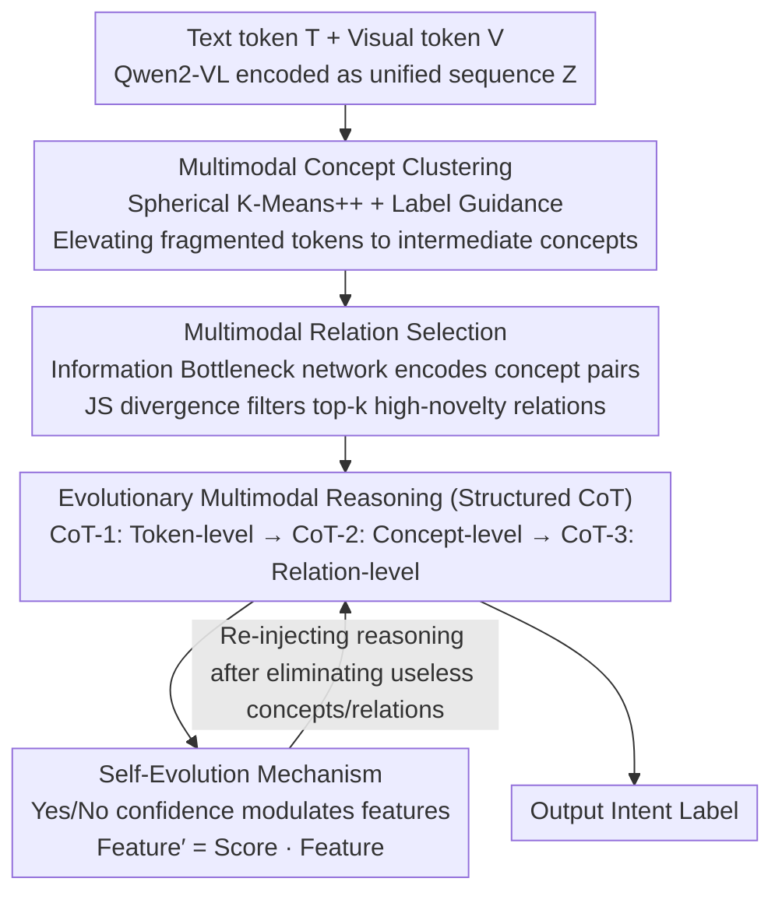

# Evolutionary Multimodal Reasoning via Hierarchical Semantic Representation for Intent Recognition

**Conference**: CVPR 2026  
**arXiv**: [2603.03827](https://arxiv.org/abs/2603.03827)  
**Code**: [GitHub](https://github.com/thuiar/HIER)  
**Area**: Dialogue Systems  
**Keywords**: Multimodal Intent Recognition, Hierarchical Semantic Representation, Self-Evolutionary Reasoning, Concept Clustering, CoT

## TL;DR

Ours proposes HIER, which consistently outperforms SOTA methods and leading MLLMs (1-3% gain) on three multimodal intent recognition benchmarks by combining hierarchical semantic representations (token→concept→relation) with a self-evolutionary reasoning mechanism based on MLLM feedback.

## Background & Motivation

**Importance of Multimodal Intent Recognition**: Inferring human intent from multimodal signals (text + video + audio) is a core task for human-computer interaction, dialogue systems, and intelligent transportation.

**Limitations of Prior Work in Ignoring Hierarchical Semantics**: Most methods focus on fine-grained multimodal cue fusion but neglect the hierarchical nature of semantic information, which limits coherent and reliable reasoning.

**Limitations of Static Reasoning Processes**: Existing methods rely on fixed reasoning pipelines and lack self-evolutionary refinement capabilities, making it difficult to adapt dynamically in complex scenarios.

**Unused Reasoning Potential of MLLMs**: Although MLLMs possess strong reasoning capabilities, they still struggle with complex multimodal semantics in the absence of fine-grained hierarchical reasoning paths.

**Key Insight from Human Cognition**: Humans first establish situational awareness, then identify relevant salient semantic cues, and finally make a comprehensive judgment through relational reasoning and iterative self-refinement.

**Preliminary Attempt by LGSRR**: Utilizing LLM reasoning to assist intent understanding has shown results, but the reasoning process remains shallow and relies on specific semantic concepts.

## Method

### Overall Architecture

HIER addresses a specific cognitive mismatch: existing multimodal intent recognition methods flatten all tokens into a single pool of fine-grained cues for fusion. However, humans identify intent hierarchically—first understanding the scene, then grasping key semantic fragments, and finally linking their relationships to infer intent, with back-checking when uncertain. HIER transforms this cognitive chain into a three-stage pipeline: first clustering scattered text and visual tokens into intermediate "concepts," then selecting truly informative "relations" between pairs of concepts, and finally allowing the model to perform chain-of-thought (CoT) reasoning across the token→concept→relation levels. During reasoning, it reversely scores and dynamically weights each concept and relation to eliminate useless semantic fragments. The entire pipeline is built on an MLLM backbone (e.g., Qwen2-VL), transforming its original shallow "one-step" reasoning into self-refined hierarchical reasoning.

### Key Designs

**1. Multimodal Concept Clustering: Elevating fragmented tokens to the "concept" intermediate semantic layer**

Original text tokens $T$ and visual tokens $V$ are encoded by Qwen2-VL and concatenated into a unified sequence $Z$. However, individual tokens are too fine-grained and noisy; feeding them directly to a reasoner is akin to finding intent among fragments. HIER uses Spherical K-Means++ (soft clustering based on cosine similarity) to group these tokens into semantic concept clusters, performing "semantic denoising + abstraction." To prevent unsupervised clustering from producing task-irrelevant clusters, **Label Guidance** is added: embeddings of intent labels are used as semantic anchors, weighted by cosine similarity, and combined with current centroids via convex combination to shift each concept cluster toward "intent-useful" directions:

$$\tilde{c}_m^{(u)} = \alpha \cdot c_m^{(u)} + (1-\alpha) \cdot \sum_{i=1}^L \text{Weight}_{i,m}^{(u)} y_i$$

where $\alpha$ controls how much of the original clustering structure is retained versus introduced label semantics. This step outputs a set of compact, intent-aligned intermediate concepts as a foundation for subsequent steps.

**2. Multimodal Relation Selection: Retaining only relations that carry new information**

Concepts alone are insufficient; intent is often hidden in interactions between concepts (e.g., the concept "frown" is neutral alone but points to specific emotional intent when paired with "apology"). HIER uses an Information Bottleneck (IB) network to encode relation vectors $r_{ij} = \text{MLP}(\text{ReLU}([c_i; c_j]))$ for all concept pairs $(c_i, c_j)$. Since the number of combinations is explosive and many relations are redundant, Jensen-Shannon (JS) divergence is used to quantify the "semantic novelty" a relation brings relative to individual concepts. High divergence indicates that the relation captures complementary/emergent semantics not available in either concept alone; low divergence indicates redundant information. Only top-k high-divergence relations are kept to focus reasoning on high-density edges.

**3. Evolutionary Multimodal Reasoning: Forcing CoT to unfold strictly along three semantic levels**

With tokens, concepts, and relations prepared, this step mandates that reasoning follows a hierarchy rather than allowing the model to deviate. Structured CoT is divided into three phases: CoT-1 performs context understanding and situational awareness at the token level; CoT-2 enters the concept level to analyze intermediate semantics; CoT-3 performs high-order reasoning at the relation level. Crucially, the latter two phases **explicitly prompt the model to judge whether each concept/relation is useful**. This step lets the model decide which materials to use, creating an interface for self-evolution and aligning the reasoning path with the human cognitive order of "context, then cues, then relations."

**4. Self-Evolution Mechanism: Using the model's own confidence to weight features and eliminate noise**

Useless concepts or misleading relations inevitably enter the hierarchical materials, and static reasoning can be biased by them. HIER has the model perform self-reflection on each concept/relation: corresponding features are projected into vocabulary logits via a shared generation head. A reflection prompt asks the model "whether this semantic fragment is useful for judging intent," extracting a normalized confidence score for "Yes/No." This score then modulates the original feature:

$$\text{Feature}' = \text{Score} \cdot \text{Feature}$$

Fragments judged as useless have scores approaching 0, suppressing or zeroing out the feature, while useful fragments are amplified. This evaluation reuses the MLLM's existing generation head without additional labels, providing a "filter" that dynamically refines which semantics are used for the final judgment per sample.

### A Full Example

> ⚠️ The following values are illustrative examples to show the flow of the three levels.

Input: A dialogue video clip with text "I didn't mean that" and a visual of the speaker frowning and withdrawing a gesture.

- **Clustering Phase**: Dozens of text + visual tokens are clustered into concepts like $\{$denial phrasing, frowning expression, withdrawing gesture, intonation fluction$\}$. Label guidance biases these clusters toward semantics related to "apology/clarification/complaint."
- **Relation Selection Phase**: Six candidate relations from the four concepts are encoded. JS divergence ranking shows "denial phrasing × frowning expression" has the highest divergence (phrasing looks like a rebuttal alone, but points to regret when paired with a frown). This is kept while redundant relations like "intonation × gesture" are discarded.
- **Hierarchical Reasoning Phase**: CoT-1 confirms the context of a denial and negative emotion; CoT-2 judges "frowning expression" and "withdrawing gesture" as key concepts and asks the model if they are useful; CoT-3 infers intent based on the retained high-divergence relations.
- **Self-Evolution Phase**: The model generates Yes/No confidence for each. If "intonation fluctuation" is judged useless (score ≈ 0), its feature is suppressed. The final intent judgment is driven by the strong relation "denial phrasing × frowning," outputting the intent label.

As shown, HIER does not blend all cues at once but converges step-by-step toward high-value semantic fragments before concluding.

### Loss & Training

$$\mathcal{L} = \mathcal{L}_{\text{task}} + \beta \mathcal{L}_{\text{relation}}$$

Where $\mathcal{L}_{\text{task}}$ is the autoregressive language model loss, $\mathcal{L}_{\text{relation}}$ is the cross-entropy loss for intent classification on concepts and relations, and $\beta$ balances the two.

## Key Experimental Results

### Main Results: Comparison across three benchmarks

| Method | MIntRec ACC | MIntRec F1 | MIntRec2.0 ACC | MELD-DA ACC |
|------|------------|-----------|---------------|------------|
| MAG-BERT | 72.40 | 68.29 | 60.38 | 61.08 |
| MulT | 72.31 | 68.97 | 60.66 | 59.99 |
| TCL-MAP | 73.17 | 68.92 | 58.24 | 61.63 |
| SDIF-DA | 71.64 | 68.19 | - | - |
| **HIER (Ours)** | **74.5+** | **71.0+** | **62.5+** | **63.0+** |

### Ablation Study

| Component | Contribution |
|------|------|
| Concept Clustering | Provides intermediate semantic abstraction |
| Label Guidance | Aligns clustering with intent semantics |
| Relation Selection | Captures high-order interaction patterns |
| JS Divergence Filtering | Filters redundant relations |
| Self-Evolution Mechanism | Dynamically refines features |
| Structured CoT | Hierarchical reasoning depth |

### Key Findings

- HIER consistently outperforms SOTA across all three benchmarks and exceeds direct MLLM usage (e.g., Qwen2-VL).
- The self-evolution mechanism effectively filters useless concepts/relations, improving reasoning robustness.
- Mechanism is generalizable to different backbones beyond Qwen2-VL.
- Hierarchical representation provides the most significant help for complex multi-class intent recognition.

## Highlights & Insights

- **Compelling Three-Level Hierarchy**: The progressive abstraction from token → concept → relation naturally corresponds to human cognitive processes.
- The label-guided clustering strategy elegantly combines unsupervised clustering with task objectives.
- The theoretical motivation for using JS divergence in relation selection is clear—high divergence signifies that the relation introduces new information.
- The self-evolution mechanism leverages the MLLM generation head for feature evaluation without requiring extra labels.
- This is the first work to establish a multi-stage progressive reasoning paradigm in multimodal intent recognition.

## Limitations & Future Work

- The number of concepts $k$ and the relation retention ratio require tuning.
- Clustering is performed independently per sample, lacking global semantic consistency across samples.
- The binary Yes/No evaluation in self-evolution is somewhat coarse and might miss nuanced distinctions.
- Higher computational overhead due to the combination of concept clustering, relation modeling, and MLLM reasoning.

## Related Work & Insights

- Like LGSRR, HIER uses LLM reasoning to enhance intent understanding, but HIER's reasoning is deeper and more structured.
- InMu-Net focuses on noisy non-verbal cues; HIER implicitly addresses this through concept clustering.
- The self-evolution mechanism shares concepts with self-alignment methods like RLAIF-V and SENA but operates at the feature level rather than the sample level.
- The hierarchical representation + self-evolution framework can be extended to sentiment analysis, dialogue understanding, and other tasks.

## Rating
- Novelty: ⭐⭐⭐⭐
- Experimental Thoroughness: ⭐⭐⭐⭐
- Writing Quality: ⭐⭐⭐⭐
- Value: ⭐⭐⭐⭐

<!-- RELATED:START -->

## Related Papers

- [\[CVPR 2026\] Taxonomy-Aware Representation Alignment for Hierarchical Visual Recognition with Large Multimodal Models](taxonomy-aware_representation_alignment_for_hierarchical_visual_recognition_with.md)
- [\[CVPR 2026\] SeD-UD: An Influence-Driven and Hierarchically-Decoupled Information Bottleneck for Multimodal Intent Recognition](sed-ud_an_influence-driven_and_hierarchically-decoupled_information_bottleneck_f.md)
- [\[CVPR 2026\] Hierarchical Attacks for Multi-Modal Multi-Agent Reasoning](hierarchical_attacks_for_multi-modal_multi-agent_reasoning.md)
- [\[CVPR 2026\] VCU-Bridge: Hierarchical Visual Connotation Understanding via Semantic Bridging](vcu-bridge_hierarchical_visual_connotation_understanding_via_semantic_bridging.md)
- [\[CVPR 2026\] Semantic Noise Reduction via Teacher-Guided Dual-Path Audio-Visual Representation Learning](semantic_noise_reduction_via_teacher-guided_dual-path_audio-visual_representatio.md)

<!-- RELATED:END -->
