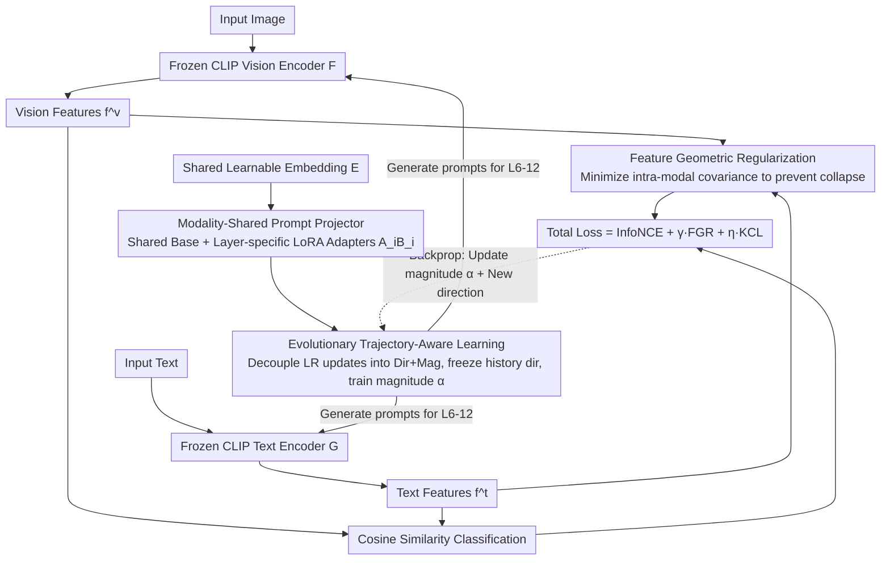

# EvoPrompt: Evolving Prompt Adaptation for Vision-Language Models

**Conference**: CVPR 2026  
**arXiv**: [2603.09493](https://arxiv.org/abs/2603.09493)  
**Code**: To be confirmed  
**Area**: Multi-modal VLM  
**Keywords**: prompt learning, catastrophic forgetting, low-rank decomposition, feature decorrelation, VLM adaptation

## TL;DR
EvoPrompt addresses catastrophic forgetting and modality bias in VLM prompt learning through a trajectory-aware prompt evolution strategy (unified embedding projection + direction-magnitude decoupled training + feature geometric regularization), achieving comprehensive SOTA on few-shot/cross-dataset/domain generalization tasks while maintaining zero-shot capability.

## Background & Motivation
**Background**: Large-scale vision-language models (CLIP, ALIGN, etc.) acquire powerful zero-shot generalization through contrastive pre-training. To efficiently adapt to downstream tasks, prompt learning (e.g., CoOp, CoCoOp, MaPLe) implements parameter-efficient fine-tuning by inserting learnable prompt tokens into frozen backbones.

**Limitations of Prior Work**:
   - **Inter-layer Isolation**: Methods like MaPLe insert prompts independently into each layer; these prompts are isolated from each other, failing to transmit cross-layer semantic information flow and disrupting the hierarchical semantic progression of the Transformer.
   - **Modality Bias**: Existing schemes (e.g., MaPLe) exhibit a text-centric bias and fail to fully utilize complementary vision-language interactions.
   - **Catastrophic Forgetting**: During few-shot adaptation, learnable prompts rapidly deviate from pre-trained semantic anchors and overfit minimal downstream data, leading to severe degradation in zero-shot generalization.

**Key Challenge**: The trade-off between task-specific adaptation and pre-trained knowledge preservation—existing methods either achieve high accuracy on base classes but collapse on novel classes, or adapt conservatively with limited gains on base classes.

**Goal**: (a) Establish a cross-layer and cross-modal prompt generation mechanism; (b) control the prompt evolution trajectory during training to prevent knowledge forgetting; (c) prevent feature representation collapse in low-data scenarios.

**Key Insight**: The authors observe that prompts naturally undergo a progressive evolution from "universal semantic anchors" to "task-specific features" during training. If this trajectory can be explicitly guided—retaining early-learned semantic directions while only adjusting magnitudes—"unforgettable" adaptation can be achieved.

**Core Idea**: Decouple the low-rank updates of the prompt projector into direction and magnitude, freezing historical directions while only training magnitudes, and combine this with feature geometric regularization to achieve trajectory-controlled prompt evolution.

## Method

### Overall Architecture
EvoPrompt aims to resolve the longstanding balance in VLM prompt learning: allowing prompts to learn downstream task features without drifting too far during few-shot training or forgetting CLIP's original zero-shot knowledge. The entire pipeline is built upon a fully frozen CLIP (ViT-B/16)—images pass through the visual encoder $F$ and text through the text encoder $G$, with no parameters modified in either backbone. The learnable components are minimal: a cross-layer shared embedding, from which prompts injected into layers 6 through 12 are generated by a **Modality-Shared Prompt Projector (MPP)**. During training, prompts are not updated freely; instead, **Evolutionary Trajectory-Aware Learning (ETL)** decomposes each low-rank update into "direction" and "magnitude," freezing historical directions and only adjusting magnitudes to let prompts evolve along a controlled trajectory. Simultaneously, **Feature Geometric Regularization (FGR)** uses geometric constraints to expand the feature space, and a Knowledge Constancy Loss (KCL) pulls features back toward the original CLIP vicinity. Finally, classification is performed using the cosine similarity between visual features $f^v$ and text features $f^t$. The data flow is summarized below:

### Key Designs

**1. Modality-Shared Prompt Projector: Anchoring prompts to a single semantic tree**

Methods like MaPLe insert independent prompt sets at each layer, which are disconnected and effectively sever the Transformer's inherent hierarchical semantic progression. MPP reverses this by maintaining a single shared learnable embedding $E \in \mathbb{R}^{K \times d_r}$ ($K=5$, $d_r=512$). Prompts for every layer and modality are projected from this embedding: for modality $m \in \{v, t\}$, the $i$-th layer prompt is $P_i^m = \text{Proj}_i^m(E)$. Crucially, the projector weights are decomposed into a "shared base + layer-specific low-rank adapter":

$$W_i^m = W_{\text{shared}}^m + A_i \cdot B_i$$

Where $W_{\text{shared}}^m \in \mathbb{R}^{d_r \times d_m}$ is shared across all layers to handle general vision/text patterns, and $A_i \in \mathbb{R}^{d_r \times r}, B_i \in \mathbb{R}^{r \times d_m}$ are layer-specific low-rank matrices for layer-specific adaptation. This allows a shared base to link cross-layer semantic flow while providing low-rank space for per-layer fine-tuning, reducing parameters from $O((L-J+1) \cdot d_r \cdot d_m)$ to $O(d_r \cdot d_m + (L-J+1) \cdot r \cdot (d_r + d_m))$, which is 4.6x fewer than MaPLe.

**2. Evolutionary Trajectory-Aware Learning: Freezing direction and tuning magnitude for unforgettable trajectories**

This is the core trick of the paper, targeting the issue where prompts rapidly deviate from semantic anchors during few-shot adaptation. Observing that prompt training naturally evolves from universal anchors to task-specific features, the authors explicitly manage this trajectory. Specifically, the low-rank update at each epoch $t$ is decomposed into a scalar magnitude $\alpha_i^t$ and a Frobenius-normalized direction matrix $\overline{A_i^t B_i^t}$. At epoch $T$, the total weights for layer $i$ are a weighted accumulation of historical directions:

$$W_i^T = W_{\text{shared}} + \sum_{t=1}^{T-1} \alpha_i^t \cdot \overline{A_i^t B_i^t} + \alpha_i^T \cdot \overline{A_i^T B_i^T}$$

The secret is that all historical directions $\{\overline{A_i^t B_i^t}\}_{t=1}^{T-1}$ are frozen once learned. Each new epoch only trains the scalar magnitudes $\{\alpha_i^t\}$ and the current new direction $\overline{A_i^T B_i^T}$. Following the insight from DoRA that direction is more critical than magnitude in low-rank adaptation, freezing early directions preserves the robust "cognitive skeleton," while allowing magnitudes to scale to fit the task. 

**3. Feature Geometric Regularization: Recovering intra-modal structures missed by contrastive learning**

Contrastive loss focuses on instance-level cross-modal alignment, often resulting in highly redundant feature dimensions and collapse under low-data conditions. FGR draws from the Soft-HGR (Hirschfeld-Gebelein-Rényi) maximal correlation framework: InfoNCE only corresponds to the first term of the Soft-HGR objective (cross-modal alignment), while the second term—intra-modal covariance structure—is ignored. FGR explicitly adds this term by minimizing the trace of the product of intra-modal covariance matrices:

$$\mathcal{L}_{fgr}(\mathcal{F}^v, \mathcal{F}^t) = \frac{1}{2} \text{tr}(\text{cov}(\mathcal{F}^v) \cdot \text{cov}(\mathcal{F}^t))$$

This term forces intra-modal feature dimensions to decorrelate, expanding the feature space to use every dimension and avoiding redundant collapse.

### Loss & Training
The total training objective is a weighted sum of three terms:
$$\mathcal{L}_{total} = \mathcal{L}_{InfoNCE} + \gamma \cdot \mathcal{L}_{fgr} + \eta \cdot \mathcal{L}_{kcl}$$
The knowledge constancy loss $\mathcal{L}_{kcl} = \frac{1}{2}[(1 - \cos(f^v, f_0^v)) + (1 - \cos(f^t, f_0^t))]$ ensures prompted features do not deviate from the original frozen CLIP distribution. Optimal hyperparameters are $\gamma=25, \eta=0.5$.

Training Config: ViT-B/16 backbone, 16-shot per class, prompts inserted from layer 6 to 12, token length $l=5$, embedding vectors $K=5$, A800 GPU, mean of 3 random seeds.

## Key Experimental Results

### Main Results: Base-to-Novel Generalization (Average over 11 datasets)

| Method | Base | Novel | HM |
|------|------|-------|------|
| CLIP (zero-shot) | 69.34 | 74.22 | 71.70 |
| CoOp | 82.69 | 63.22 | 71.66 |
| MaPLe | 82.28 | 75.14 | 78.55 |
| PromptSRC | 84.26 | 76.10 | 79.97 |
| MMA | 83.20 | 76.80 | 79.87 |
| **Ours** | **84.28** | **77.76** | **80.73** |

EvoPrompt improves HM by +0.76% and Novel classes by +0.96% compared to the previous best. It shows a +1.27% Novel class gain on FGVCAircraft and reaches 86.54% HM on EuroSAT (vs. 83.87% for SOTA MMA).

### Ablation Study (ImageNet Base-to-Novel)

| Config | Base | Novel | HM | Description |
|------|------|-------|------|------|
| w/o MPP | 75.32 | 70.15 | 72.64 | Revert to independent per-layer prompts; HM drops 1.65%. |
| w/o $W_{\text{shared}}$ | 75.80 | 71.42 | 73.54 | Independent projectors for each layer. |
| w/o AB | 76.15 | 70.90 | 73.43 | Full-rank projection without LoRA. |
| w/o E.T. | 77.42 | 70.25 | 73.66 | Without trajectory-aware training: Base rises but Novel crashes. |
| w/o $\mathcal{L}_{kcl}$ | 77.24 | 70.55 | 73.74 | Without knowledge constancy loss. |
| w/o $\mathcal{L}_{fgr}$ | 76.70 | 70.52 | 73.48 | Without geometric regularization. |
| **Full EvoPrompt** | 76.98 | 71.80 | **74.29** | Optimal balance. |

### Key Findings
- **MPP is foundational**: Removing MPP causes the largest HM drop (74.29% to 72.64%).
- **ETL and KCL prevent forgetting**: Removing them causes Base to increase (overfitting) but Novel to drop sharply, typical of catastrophic forgetting.
- **FGR provides crucial refinement**: Removing FGR drops HM to 73.48%, showing intra-modal decorrelation is vital for low-data generalization.
- **Efficiency**: Only 0.764M trainable parameters, inference speed 1282.1 FPS, training 4.5ms/image. Parameter count is 4.6x lower than MaPLe.
- **Magnitude Evolution**: Learned $\alpha$ peaks at epoch 2 and then decays, supporting the idea of early core direction building followed by fine refinement.

## Highlights & Insights
- **Direction-magnitude decoupling is the core technique**: Decomposing low-rank updates into direction + magnitude and freezing historical directions is an elegant "progressive knowledge accumulation" mechanism. This is highly valuable for continual learning scenarios.
- **Cross-domain transfer of Soft-HGR regularization**: Using information-theoretic maximal correlation to constrain feature geometry is more theoretically grounded than simple orthogonal regularization.
- **Overfitting "breakpoint" analysis**: MaPLe shows irreversible Novel class degradation after its breakpoint, whereas EvoPrompt remains stable.

## Limitations & Future Work
- **Backbone specialized**: Only verified on CLIP ViT-B/16; performance on ViT-L/14 or other VLMs (SigLIP, EVA-CLIP) is unreported.
- **Manual thresholds**: Thresholds $\mu, \nu$ for adaptive rank reduction are manually set rather than adaptive.
- **Storage overhead**: Accumulating directions requires storing historical matrices, which could become a bottleneck in long-term training.
- **Batch size sensitivity**: Covariance estimation in FGR depends on batch size, potentially becoming unstable in extreme 1-shot scenarios.

## Related Work & Insights
- **vs MaPLe**: MaPLe uses independent prompts per layer. EvoPrompt uses a unified embedding + shared base, improving parameter efficiency by 4.6x and enabling more natural cross-layer flow.
- **vs PromptSRC**: PromptSRC uses self-consistency (prediction consistency). EvoPrompt addresses the optimization trajectory directly by freezing directions, which is more fundamental.
- **vs DoRA**: DoRA performs direction-magnitude decomposition once; EvoPrompt extends this to epoch-level progressive accumulation for temporal modeling of prompt evolution.

## Rating
- Novelty: ⭐⭐⭐⭐
- Experimental Thoroughness: ⭐⭐⭐⭐⭐
- Writing Quality: ⭐⭐⭐⭐
- Value: ⭐⭐⭐⭐

<!-- RELATED:START -->

## Related Papers

- [\[CVPR 2026\] STAR: Test-Time Adaptation Can Enhance Universal Prompt Learning for Vision-Language Models](star_test-time_adaptation_can_enhance_universal_prompt_learning_for_vision-langu.md)
- [\[CVPR 2026\] Towards Calibrating Prompt Tuning of Vision-Language Models](towards_calibrating_prompt_tuning_of_vision-language_models.md)
- [\[CVPR 2026\] VisPlay: Self-Evolving Vision-Language Models](visplay_self-evolving_vision-language_models.md)
- [\[CVPR 2026\] Probabilistic Prompt Adaptation for Unified Image Aesthetics and Quality Assessment](probabilistic_prompt_adaptation_for_unified_image_aesthetics_and_quality_assessm.md)
- [\[CVPR 2026\] BiomedCCPL: Causal Conditional Prompt Learning for Biomedical Vision-Language Models](biomedccpl_causal_conditional_prompt_learning_for_biomedical_vision-language_mod.md)

<!-- RELATED:END -->
