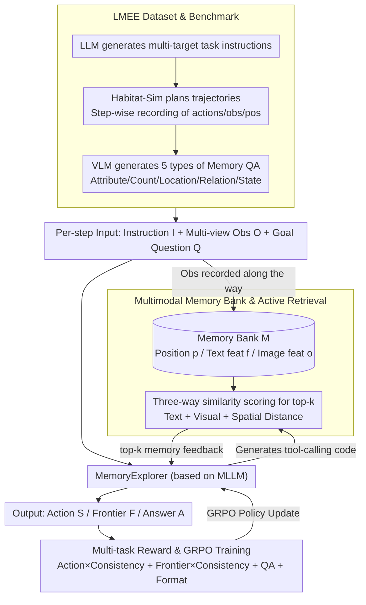

# Explore with Long-term Memory: A Benchmark and Multimodal LLM-based Reinforcement Learning Framework for Embodied Exploration

**Conference**: CVPR 2026  
**arXiv**: [2601.10744](https://arxiv.org/abs/2601.10744)  
**Code**: [https://wangsen99.github.io/papers/lmee/](https://wangsen99.github.io/papers/lmee/)  
**Area**: Multimodal VLM / Embodied AI / Agent  
**Keywords**: Embodied Exploration, Long-term Memory, Multi-target Navigation, Reinforcement Learning Fine-tuning, Memory Retrieval

## TL;DR
This paper introduces the LMEE benchmark and the MemoryExplorer framework, which unify the evaluation of embodied exploration processes and outcomes by combining multi-target navigation with memory-based question answering. By fine-tuning MLLMs with reinforcement learning to actively invoke memory retrieval tools, the method achieves a 23.53% SR on LMEE-Bench (surpassing 3D-Mem's 16.91%) and a 46.40% SR on GOAT-Bench.

## Background & Motivation

1.  **Background**: Embodied exploration aims to enable agents to actively explore unknown environments. Current mainstream task paradigms include Object Navigation (ObjectNav) and Embodied Question Answering (EQA), but these are usually evaluated as independent, one-off tasks—navigation focuses only on whether the target is found, while EQA focuses only on the correctness of the answer.

2.  **Limitations of Prior Work**: (a) Existing benchmarks neglect the accumulation and utilization of memory during exploration—an ideal embodied agent should accumulate environmental knowledge during exploration and use it for subsequent tasks; (b) Existing MLLM exploration methods use memory passively—imitation learning methods (e.g., MTU3D) limit the development of autonomous exploration strategies, while memory snapshot methods (e.g., 3D-Mem) use pre-filtering strategies to handle context window limits but fail to fully leverage the active querying capabilities of MLLMs; (c) There is a lack of a unified framework to evaluate both cognitive understanding and decision-making capabilities.

3.  **Key Challenge**: Long-horizon tasks require agents to possess both efficient exploration capabilities and long-term memory utilization skills. However, current methods either optimize only for navigation success rate or only for question-answering accuracy, failing to optimize both in a unified manner.

4.  **Goal**: (1) Design a benchmark that unifiedly evaluates the exploration process (memory) and the results (navigation success); (2) Train an MLLM agent capable of actively retrieving memory to assist in exploration and decision-making.

5.  **Key Insight**: Episodic memory accumulated during exploration is not just a byproduct; it should be the core resource driving subsequent decisions. Memory-based QA is used to evaluate and train memory utilization.

6.  **Core Idea**: Fine-tune MLLMs using reinforcement learning to enable them to actively call memory retrieval tools to query episodic memory during multi-target navigation. Simultaneously, optimize action prediction, frontier selection, and memory QA unifiedly through a multi-task reward function.

## Method

### Overall Architecture
This paper addresses the problem of enabling an embodied agent to build long-term memory while exploring an unknown environment and actively retrieving these memories for subsequent decision-making. The work is structured into two layers: offline construction of the "LMEE Dataset and Benchmark" involving tasks, trajectories, and memory QA; and the online "MemoryExplorer"—an end-to-end MLLM-based framework. At each step, the input includes the task instruction $I$ (e.g., "Check the Christmas tree, dryer, then the bedroom nightstand"), multi-view observations $O$ from three directions, and a goal-oriented question $Q$. Observations along the way are continuously written into a "Multimodal Memory Bank." The model generates tool-calling code to actively retrieve from this memory bank, feeding top-k relevant memories back into the context to output the discrete action $S$ (Move Ahead/Turn Left/Right), the next frontier $F$, and the answer $A$. The agent is fine-tuned using "Multi-task Reward + GRPO" reinforcement learning, integrating "correct pathing" and "correct answering" into a single reward to update the policy in a closed loop.

### Key Designs

**1. LMEE Dataset and Benchmark: Integrating the "Exploration Process" into Evaluation**

Previous ObjectNav only checked if the target was found, and EQA only checked the answer's correctness, while the memory accumulated during exploration was treated as a disposable byproduct. LMEE fills this gap based on HM3DSem (145 training scenes + 36 test scenes). It first uses an LLM to generate multi-target instructions, then plans exploration trajectories using Habitat-Sim to record step-wise data. Observations are annotated using an image tagging model to form a multimodal memory bank. Crucially, a VLM generates QA pairs around the navigation goals across five categories: attribute, count, location, relation, and state. Questions only pertain to target objects the agent actually passed and observed; thus, "answering correctly" truly reflects memory utilization rather than common-sense guessing. The final dataset comprises 1,982 tasks, 9,286 questions, and 377,311 records, categorized into Easy, Medium, and Hard based on the number of areas, targets, and distance.

**2. Multimodal Memory Bank & Active Retrieval: Letting the Model Decide What and When to Query**

The memory bank is defined as $\mathcal{M} = \{(p_i, f_i, o_i)\}$, storing position $p_i$, text features $f_i$, and image features $o_i$ (encoded by CLIP) at each step. Retrieval involves a triple-stream scoring mechanism combining text similarity, visual similarity, and spatial distance:

$$s_i = \omega_f(f_c^\top f_i) + \omega_o(o_c^\top o_i) + \omega_p\,\text{dist}(p_c, p_i)$$

where subscript $c$ represents the current query features. The top-k memories are fed into the inference context. The fundamental difference here is "activity": whereas methods like 3D-Mem provide a pre-filtered set of memories (passive), MemoryExplorer lets the model generate tool-calling code to query, deciding if and what to search. This aligns better with autonomous agent settings, transforming memory from static snapshots into a dynamic resource.

**3. Multi-task Reward & GRPO Training: Unifying Movement, Frontier Selection, and Answering**

A single reward often leads to neglecting certain objectives. This paper uses a total multi-task reward:

$$r_{\text{total}} = w_{act}\cdot r_{\text{action}}\cdot c + w_{front}\cdot r_{\text{frontier}}\cdot c + w_{ans}\cdot r_{\text{answer}} + w_{fmt}\cdot r_{\text{format}}$$

Action reward $r_{\text{action}}$ and frontier reward $r_{\text{frontier}}$ are multiplied by a consistency coefficient $c$, which penalizes logical contradictions between the chosen action and frontier. $r_{\text{format}}$ encourages structured output. To force the model to learn tool usage, a scaling factor $\alpha$ is introduced: the sub-reward is amplified ($\alpha=1.2$) upon successful memory retrieval and reduced upon failure. This difference tells the model that "correctly using tools yields rewards." Policy optimization is performed using GRPO (Group Relative Policy Optimization).

### Loss & Training
- Based on Qwen2.5-VL-7B-Instruct, using the EasyR1 (simplified VERL) framework.
- Learning rate 1e-6, KL penalty coefficient 0.1.
- 8 NVIDIA H200 GPUs, 160 steps, global batch size 128.
- Continuous action window sampling: Samples continuous identical actions as a single training data point to reduce redundancy.
- Intermediate tool-calling responses are not optimized; only the final reward feedback evaluates tool-use effectiveness.

## Key Experimental Results

### Main Results

**LMEE-Bench Results**:

| Method | SR ↑ | SPL ↑ | QA Score ↑ | QA Acc ↑ |
|------|------|-------|------------|----------|
| Explore-EQA | 13.24 | 7.66 | - | - |
| 3D-Mem | 16.91 | 6.86 | 32.59 | 41.38 |
| RA-Mem | 20.96 | 12.18 | 35.52 | 58.62 |
| **MemoryExplorer** | **23.53** | **14.99** | **43.62** | **65.52** |

**GOAT-Bench Results**:

| Method | Success Rate ↑ | SPL ↑ |
|------|---------------|-------|
| SenseAct-NN Skill Chain | 29.5 | 11.3 |
| 3D-Mem | 37.05 | 20.26 |
| RA-Mem | 42.81 | 21.95 |
| **MemoryExplorer** | **46.40** | **28.03** |

### Ablation Study

| Question Type Setting | LMEE SR | LMEE SPL | LMEE Score | GOAT SR | GOAT SPL |
|------------|---------|----------|------------|---------|----------|
| Baseline (No RFT) | 20.96 | 12.18 | 35.52 | 42.81 | 21.95 |
| Simple (Task Progress) | 20.80 | 12.49 | 41.33 | 44.24 | 27.29 |
| Multiple-choice | 23.53 | 14.99 | 43.62 | 46.40 | 28.03 |
| All | 22.06 | 15.13 | 43.28 | 48.20 | 29.36 |

### Key Findings
- **RA-Mem vs. 3D-Mem shows active retrieval is superior to passive filtering**: Merely switching from passive filtering to active retrieval improved GOAT-Bench SR from 37.05% to 42.81%.
- **The core value of RL fine-tuning lies in acquiring tool-use capabilities**: Training curves show the model gradually learns to call memory retrieval tools more accurately, with tool-use rates and answer accuracy improving simultaneously.
- **Multiple question types are more effective than a single type**: Using all question types achieved the highest GOAT SR (48.20%), though single multiple-choice questions performed best on LMEE SR (23.53%), suggesting a non-linear correlation between question types and task characteristics.
- **Alignment issues between cognition and decision-making**: Different MLLMs performed inconsistently on open-ended vs. multiple-choice questions (Qwen2.5-VL excels at open-ended, Qwen3-VL at multiple-choice), hinting at a potential mismatch between cognitive understanding and action decision-making.

## Highlights & Insights
- **Unity of the LMEE Paradigm**: By unifying navigation and QA into a single exploration process, this work merges the evaluation of "process" and "outcome" at the dataset level for the first time, avoiding the capability fragmentation caused by separate evaluations.
- **Incentive Mechanism for Tool Use**: Differentiating between successful and failed tool calls through the reward scaling factor $\alpha$ allows the model to autonomously learn when to use memory retrieval. This design is transferable to other LLM Agent training scenarios requiring tool use.
- **Incremental Understanding via Memory Enhancement**: The agent accumulates memory during exploration and retrieves it for reasoning when faced with questions, effectively simulating the human cognitive process of "thinking based on experience."

## Limitations & Future Work
- **Support for Only Single-turn Tool Calls**: Due to multi-image input constraints, only one memory retrieval is currently supported; multi-turn iterative retrieval might provide more accurate results.
- **Limited Evaluation Subset**: Due to resource constraints, evaluation was performed only on 58/166 test tasks, potentially leading to selection bias.
- **Simple Action Space**: Includes only three discrete actions (Move Ahead 0.25m, Turn Left/Right 30°), which is far from real-world robotic manipulation.
- **Memory Bank Dependency**: The quality of memory depends directly on the pre-defined image tagging model used for labeling objects.
- **Future Directions**: Introducing multi-turn memory retrieval, extending to continuous action spaces, and validating in real-world robotic scenarios.

## Related Work & Insights
- **vs. 3D-Mem**: 3D-Mem uses memory snapshots and pre-filtering (passive); MemoryExplorer uses RL for active memory retrieval, improving GOAT SR from 37.05% to 46.40%.
- **vs. MTU3D**: MTU3D uses imitation learning for trajectory replication, limiting generalization; MemoryExplorer uses RL to encourage autonomous exploration strategies.
- **vs. GOAT-Bench**: GOAT-Bench focuses on multi-target navigation but ignores memory utilization; LMEE adds a memory QA dimension for more comprehensive embodied AI evaluation.
- The multi-task reward design and tool-use incentive mechanism provide general reference value for training LLM Agents.

## Rating
- Novelty: ⭐⭐⭐⭐ The paradigm of unifying exploration process and memory evaluation is relatively new; RL training for active memory retrieval is creative.
- Experimental Thoroughness: ⭐⭐⭐⭐ Evaluated on both the self-built benchmark and GOAT-Bench with thorough ablations, though the evaluation subset is small.
- Writing Quality: ⭐⭐⭐⭐ Clear structure and well-explained motivation, though some details (e.g., continuous action windows) lack depth.
- Value: ⭐⭐⭐⭐ Provides a valuable benchmark and method for lifelong learning in embodied AI, though real-world verification is missing.

<!-- RELATED:START -->

## Related Papers

- [\[CVPR 2026\] PersonaVLM: Long-Term Personalized Multimodal LLMs](personavlm_long_term_personalized_multimodal_llms.md)
- [\[CVPR 2026\] Learning to Focus and Precise Cropping: A Reinforcement Learning Framework with Information Gaps and Grounding Loss for MLLMs](learning_to_focus_and_precise_croppinga_reinforcement_learning_framework_with_in.md)
- [\[ICLR 2026\] GuirlVG: Incentivize GUI Visual Grounding via Empirical Exploration on Reinforcement Learning](../../ICLR2026/multimodal_vlm/guirlvg_incentivize_gui_visual_grounding_via_empirical_exploration_on_reinforcem.md)
- [\[CVPR 2026\] Scaling the Long Video Understanding of Multimodal Large Language Models via Visual Memory Mechanism](scaling_the_long_video_understanding_of_multimodal_large_language_models_via_vis.md)
- [\[CVPR 2026\] Training High-Level Schedulers with Execution-Feedback Reinforcement Learning for Long-Horizon GUI Automation](training_high-level_schedulers_with_execution-feedback_reinforcement_learning_fo.md)

<!-- RELATED:END -->
