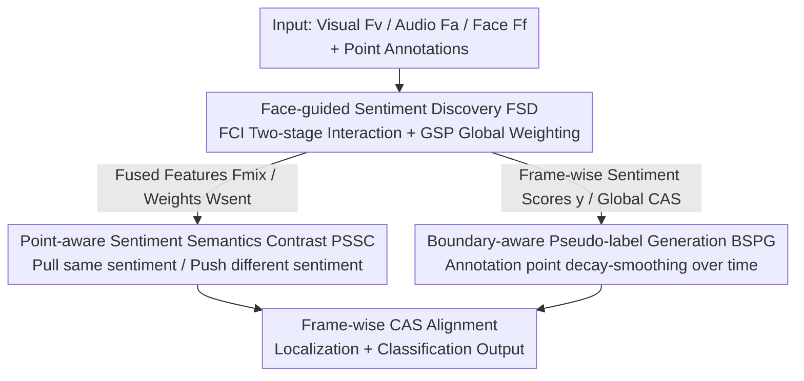

# Face-Guided Sentiment Boundary Enhancement for Weakly-Supervised Temporal Sentiment Localization

**Conference**: CVPR 2026  
**Paper**: [CVF Open Access](https://openaccess.thecvf.com/content/CVPR2026/html/Han_Face-Guided_Sentiment_Boundary_Enhancement_for_Weakly-Supervised_Temporal_Sentiment_Localization_CVPR_2026_paper.html)  
**Code**: https://github.com/CeilingHan/FSENet  
**Area**: Multimodal VLM / Video Understanding  
**Keywords**: Temporal Sentiment Localization, Point-level Weak Supervision, Face-guided, Contrastive Learning, Pseudo-label Smoothing  

## TL;DR
FSENet utilizes facial features as sentiment cues to guide audio-visual interaction. Under a weakly-supervised setting with only "point-level" timestamp annotations, it employs contrastive learning to align sentiment semantics and expands sparse point annotations into pseudo-labels with smooth boundaries. This pushes the average mAP of temporal sentiment localization on TSL300 to 21.45%, outperforming the previous SOTA by approximately 5%.

## Background & Motivation
**Background**: Temporal Sentiment Localization (TSL) aims to both determine the sentiment category (positive/negative) and locate its time interval within unclipped videos with audio. Full supervision requires frame-by-frame annotation, which is extremely costly. Consequently, the community has shifted toward weak supervision: either providing only one label for the entire video (video-level) or providing a single timestamp for each sentiment segment (point-level, denoted as P-WTSL). Point-level annotation requires only a single click within a sentiment segment, significantly reducing costs, though the start and end boundaries of segments remain unknown.

**Limitations of Prior Work**: Point-level weak supervision faces three specific difficulties. ① **Redundant information drowns out sentiment signals**—videos contain complex content like backgrounds and colors, burying actual sentiment-bearing signals and making it difficult for models to extract effective cues; ② **Sparse point annotations lead to boundary uncertainty**—having only one anchor per segment makes it impossible to judge which frame a sentiment starts or ends; ③ **Sentiment is abrupt and transient**—in real-world scenarios, sentiment may appear and disappear very quickly, making classification prone to errors. Existing point-level methods (e.g., TSL) mainly rely on temporal context and semantic alignment for inverse mapping but ignore cross-modal synchrony (correspondence between facial expressions, visuals, and audio) and the oppositional nature of sentiment semantics (positive vs. negative).

**Key Challenge**: Under weak supervision, "finding sentiment cues" and "accurately locating sentiment boundaries" are mutually restrictive tasks—cues are more stable with coarse-grained whole-segment perception, while boundaries require fine-grained frame-level discrimination, and sparse point annotations fail to satisfy both.

**Key Insight**: The authors observe that **facial expressions** can simultaneously alleviate these three problems—expressions directly reflect sentiment stimuli, subtle changes in facial regions are easier to capture than "person/background" scene differences, and facial features are inherently extracted from visual frames, allowing for collaborative learning with video features.

**Core Idea**: Use **face-guided multimodal interaction** to discover sentiment cues, then use a two-step optimization involving **point-aware contrast** and **boundary-aware pseudo-labels** to transform sparse point annotations into usable boundary supervision, integrating these into a unified framework called FSENet.

## Method

### Overall Architecture
The input to FSENet consists of three streams of features extracted from an unclipped video—visual $F_v$, audio $F_a$, and face $F_f$ (all $\in \mathbb{R}^{T\times d}$, where $T$ is the number of frames/segments)—along with several point-level sentiment annotations $Y_{anno}=\{(t_i, y_{t_i})\}_{i=1}^N$. The output is frame-by-frame "Category-aware Sentiment Scores" (CAS), used to localize and classify sentiment segments.

The pipeline consists of three stages: First, **Face-guided Sentiment Discovery (FSD)** uses a dual-branch (Face-Centric Interaction branch FCI + Global Sentiment Perception weighting branch GSP) to extract sentiment cues, producing fused features $F_{mix}$ and sentiment weights $W_{sent}$. Next, **PSSC** performs point-aware contrastive learning along the temporal axis to pull together frames with the same sentiment and push apart those with different sentiments, specifically strengthening semantic discrimination. Finally, **BSPG** expands isolated annotation points into temporally smooth-decaying pseudo-labels $\hat{y}$, providing continuous and reliable targets for boundary supervision. The CAS (from the FCI path) and Global CAS (from the GSP path) are both aligned with the pseudo-labels $\hat{y}$ from BSPG, while the contrastive loss of PSSC acts directly on the feature space.

### Key Designs

**1. Face-guided Sentiment Discovery: Using faces as "cue anchors" to guide audio-visual interaction**

This module addresses the issue of "redundant information drowning sentiment signals" through two parallel branches. **Face-Centric Interaction (FCI)** performs cross-attention in two stages: in the first stage, the face guides visual and audio features respectively, $F_v^{(f)} = F_v + \mathrm{MHAttn}(F_f, F_v, F_v)$, $F_a^{(f)} = F_a + \mathrm{MHAttn}(F_f, F_a, F_a)$, using face features as queries and visual/audio as keys/values to isolate sentiment-related segments in relatively "clean" single modalities. In the second stage, these face-guided features interact with each other, $F_v^{(af)} = F_v^{(f)} + \mathrm{MHAttn}(F_a^{(f)}, F_v^{(f)}, F_v^{(f)})$ and $F_a^{(vf)} = F_a^{(f)} + \mathrm{MHAttn}(F_v^{(f)}, F_a^{(f)}, F_a^{(f)})$, concatenated to form $F_{mix}=[F_v^{(af)}; F_a^{(vf)}]\in\mathbb{R}^{T\times 2d}$ to capture complex cross-modal sentiment. **Global Sentiment Perception (GSP)** complements this from a holistic view: concatenating the three features and feeding them into a convolutional layer $E(\cdot)$, then through a regression head and sigmoid to obtain frame-wise sentiment weights $W_{sent}=\sigma(\mathrm{Reg}(E([F_a; F_v; F_f])))\in[0,1]$, describing the sentiment intensity of each frame. FCI handles cross-modal temporal alignment while GSP handles global sentiment saliency; together they extract sentiment cues from complex backgrounds—ablations show that the two-stage face guidance is optimal, and removing GSP drops mAP by approximately 1.2%.

**2. Point-aware Sentiment Semantics Contrast: Turning point annotations into "prototypical anchors" for contrastive learning**

Sparse point annotations lack sufficient discriminative power; PSSC amplifies it using contrastive learning. For each candidate frame embedding $f_t$ on the temporal axis, the sum of similarities to all annotation points of that class is calculated as $d_t^{c_i}=\sum_{n=1}^{N}\mathrm{sim}(f_t, p_n^{c_i})$ (where $\mathrm{sim}$ is cosine similarity). When constructing positive and negative samples, the GSP sentiment weights are introduced for weighted filtering: the positive sample set for class $c_i$ is taken from the Top-K of $W_{sent}\cdot d$, $U_{c_i}^{+}=\{f_t \mid d_t^{c_i}\in\mathrm{Top\text{-}K}(\{W_{sent,t}\cdot d_t^{c_i}\}_{t=1}^{T})\}$ ($K<T-N$ controls the positive set size and excludes the annotation points themselves); frames near other classes $c_j\neq c_i$ serve as the negative set $U_{c_j}^{-}$. Using the mean of the annotation point features $\bar{p}_{c_i}$ as the sentiment prototype, a triplet $\{\bar{p}_{c_i}, U_{c_i}^{+}, U_{c_j}^{-}\}$ is formed, with the contrastive loss defined as:

$$\mathcal{L}_{sc} = -\sum_{i=1}^{C}\log\frac{\sum_{f_t\in U_{c_i}^{+}}\exp(f_t\cdot\bar{p}_{c_i})}{\sum_{f_t\in\{U_{c_i}^{+}, U_{c_j}^{-}\}}\exp(f_t\cdot\bar{p}_{c_{k}})}$$

This pulls frames with the same sentiment toward the prototype and pushes those with different sentiments away. The advantage lies in using GSP saliency weights to filter candidates, preventing low-intensity sentiment frames from being mistakenly included in the positive set, thus improving the discriminative power of point-level classification.

**3. Boundary-aware Sentiment Pseudo-label Generation: "Spreading" isolated points into smooth boundary pseudo-labels**

The traditional approach involves applying a threshold to frame-wise sentiment scores to define boundaries, but scores are sensitive to noise, resulting in jittery, discontinuous pseudo-label boundaries. BSPG instead generates smooth scores by **decaying frame-by-frame** from the annotation point toward both sides:

$$s_t = \beta + (1-\beta)\left(1 - \frac{|t - t_p|}{w}\right)$$

where $t_p$ is the timestamp of the annotation point, $w\in\mathbb{Z}^+$ is the smoothing window length (controlling how many neighboring frames are affected), and $\beta\in[0,1]$ is the minimum pseudo-label value at the boundary (controlling the decay floor). This is then merged with the model output score $y$ to form pseudo-labels $\hat{y}_{t,c_i}$: for $|t-t_p|\le w$, the sentiment class takes $s_t$, the non-sentiment class ($c_i=c+1$) takes $1-s_t$, and points outside the window take 0; here $I(y_t)$ is a threshold function that zeros the sentiment score when non-sentiment confidence exceeds $\tau=0.95$. This forms a continuous decaying "sentiment mound" near the annotation point, much smoother than the square-wave boundaries of hard thresholds—ablations show BSPG improves mAP from 16.92% without pseudo-labels to 21.45% (+4.5%).

### Loss & Training
The backbone passes $F_{mix}$ through $C+1$ independent convolutions + sigmoid to get frame-wise CAS: $y=\sigma(\mathrm{CLS}(F_{mix}))\in\mathbb{R}^{T\times(C+1)}$ (where the extra class is "non-sentiment"). The GSP path performs feature-level collaboration to yield Global CAS: $\tilde{y}_t=[W_{sent,t}\cdot y_{t,1:C};\,(1-W_{sent,t})\cdot y_{t,C+1}]$. The total loss is:

$$\mathcal{L}_{total} = \mathcal{L}_{base} + \lambda_1\cdot(\mathcal{L}_{frame} + \mathcal{L}_{frame}^{glo}) + \lambda_2\mathcal{L}_{sc}$$

where $\mathcal{L}_{base}=-\sum_c \mathrm{avg}(\hat{y}_c)\log\mathrm{avg}(y_c)$ performs video-level alignment; $\mathcal{L}_{frame}$ (FCI path $y$ vs. $\hat{y}$) and $\mathcal{L}_{frame}^{glo}$ (GSP path $\tilde{y}$ vs. $\hat{y}$) are frame-level alignments using focal loss with $\gamma=2$ to distinguish sentiment and non-sentiment frames. Hyperparameters: $\lambda_1=1, \lambda_2=0.05, w=7, \beta=0.6$; Adam optimizer, learning rate $1\times10^{-5}$, 600 epochs, single A40 GPU.

## Key Experimental Results

### Main Results
The datasets used are TSL300 (300 unclipped videos, average duration >250 seconds) and CMU-MOSEI. Metrics include mAP at IoU thresholds 0.1–0.3 (step 0.05), plus Recall and F2 score. Visual/audio/face features are extracted using I3D / MFCC / ResEmoteNet, with face boxes detected by DeepFace.

| Setting | Method | Avg mAP(%) | Recall(%) | F2(%) |
|------|------|-----------|-----------|-------|
| Point-level Weak Supervision | TSL (Prev. SOTA) | 20.40 | 71.14 | 35.36 |
| Point-level Weak Supervision | **Ours** | **21.45** | **75.02** | 33.67 |
| Video-level Weak Supervision | UM | 10.75 | 55.33 | 23.94 |
| Video-level Weak Supervision | **Ours** | **12.53** | 58.11 | 30.0 |
| Full Supervision | AFSD | 22.14 | 75.10 | 31.78 |
| Full Supervision | **Ours** | 21.87 | **79.58** | 30.37 |

In the point-level setting, FSENet achieves the best mAP at all IoU thresholds, with an average of 21.45%, outperforming TSL by approximately 5% (relative); on CMU-MOSEI, the average mAP is 16.54%, exceeding TSL and HR-pro by approximately 5.5% and 5.1% respectively. Notably, as a "small model," its average mAP on TSL300 (21.45%) significantly outperforms Qwen3-Omni-30B zero-shot (5.07%) and LLaMA-2-7B LoRA (9.97%), indicating that LLM text-centric representations struggle to align audio-visual/facial temporal sentiment.

### Ablation Study

| Configuration | Avg mAP(%) | Description |
|------|-----------|------|
| Full (FCI Two-stage + GSP) | 21.45 | Complete FSD |
| GSP only (No FCI) | 18.42 | Removes face interaction, drop of 3.0% |
| FCI One-stage + GSP | 19.10 | Only single-modal face guidance |
| FCI Two-stage (No GSP) | 20.22 | No global perception, drop of ~1.2% |
| No Pseudo-labels | 16.92 | BSPG contribution ≈ +4.5% |
| Threshold Pseudo-labels only | 20.29 | Hard threshold boundaries |
| No $\mathcal{L}_{frame}+\mathcal{L}_{frame}^{glo}$ | 12.53 | Removing both frame-level losses, drop of 8.9% |

### Key Findings
- **Face guidance requires "two-stage progression"**: Using only first-stage single-modal guidance (19.10%) or directly applying complex second-stage fusion yields limited gains; using both reaches 21.45%, showing that selecting cues in clean single modalities before deep cross-modal interaction is crucial.
- **Frame-level alignment loss is vital**: Separately removing $\mathcal{L}_{frame}$ or $\mathcal{L}_{frame}^{glo}$ drops results by ~1.4%/0.8%, but removing both causes a crash of 8.9%—the boundary constraints of pseudo-labels depend almost entirely on these two terms.
- **Face gains are real under fair comparison**: In unified feature settings, even using only audio-visual features, FSENet outperforms SOTA by 0.48%; when adding identical facial features, all methods improve, but FSENet still leads by 0.59% over TSL, ruling out the suspicion of "relying on a stronger face extractor."

## Highlights & Insights
- **Promoting "Face" to a first-class citizen sentiment anchor**: Previous TSL methods mixed faces into visual features; this paper explicitly uses the face as a query to guide audio-visual attention—subtle expressions are easier to capture than whole-scene differences, a simple intuition that hits the core of "cue discovery" in weak supervision.
- **"One-fish-two-eats" GSP weight**: The same $W_{sent}$ is used for both Global CAS calculation and for weighting positive sample selection in PSSC, allowing the "global sentiment intensity" signal to be reused for both classification and contrast, making for an efficient design.
- **Pseudo-labels from "Square Wave" to "Mound"**: Decaying point labels over time using $\beta, w$ into a smooth distribution is a label smoothing idea that can be directly transferred to other point-level/timestamp weakly-supervised temporal localization tasks (action or event detection) to mitigate boundary jitter.

## Limitations & Future Work
- **Strong dependence on face visibility**: The method is built on the premise that "facial expressions reflect sentiment stimuli." For videos without clear faces (voiceovers, scenery, occlusions), the gains may vanish, a degradation scenario not discussed.
- **Small data scale**: TSL300 has only 300 segments, and CMU-MOSEI only keeps two sentiment categories. Absolute mAP (around 20%) remains low, and generalization to finer sentiment labels or larger scales remains to be verified.
- **Sensitivity to decay shape hyperparameters**: $w=7, \beta=0.6$ were tuned on TSL300; the width of the pseudo-label "mound" directly determines boundary quality and may require retuning for other datasets ⚠️ (The original paper provides no sensitivity curves across datasets).
- **DeepFace+ResEmoteNet is a two-stage offline process**; end-to-end joint optimization of facial representations is a natural direction for improvement.

## Related Work & Insights
- **vs. TSL [55]**: Both perform point-level weakly-supervised TSL; TSL relies on inverse mapping + contrastive learning but ignores cross-modal synchrony and sentiment semantic opposition. Ours uses face guidance to explicitly model cross-modal consistency and introduces sentiment prototypes with heterogeneous negative sets in point-aware contrast, achieving 21.45% vs. 20.40% avg mAP.
- **vs. Video-level Weak Supervision (UM / CoLA / DDG-Net, etc.)**: These lack fine-grained temporal labels, making boundaries hard to define. FSENet uses point-level annotations + BSPG smooth pseudo-labels to provide boundary constraints, significantly leading in both average mAP and F2.
- **vs. LLM Solutions (Qwen3-Omni / LLaMA-2 LoRA)**: LLMs have strong reasoning but text-centric representations Struggle to align audio-visual temporal sentiment, with zero-shot reaching only 5.07% mAP. Interestingly, applying the BSPG pseudo-labels from this paper to LLaMA-2 fine-tuning can yield an additional 1.8% gain, showing the smooth boundary idea is also effective for large models.

## Rating
- Novelty: ⭐⭐⭐⭐ The combination of face guidance + point-aware contrast + boundary-smoothing pseudo-labels is relatively new in P-WTSL, though components are clever assemblies of existing paradigms.
- Experimental Thoroughness: ⭐⭐⭐⭐ Spans three supervision settings + two datasets + LLM comparisons + multiple ablations; fair feature comparisons are particularly solid; data scale is somewhat small.
- Writing Quality: ⭐⭐⭐⭐ Clear motivation for the three modules, complete formulas, and good text-to-figure correspondence.
- Value: ⭐⭐⭐⭐ BSPG smooth pseudo-labels and face-guidance ideas are transferable to other weakly-supervised temporal localization tasks.

<!-- RELATED:START -->

## Related Papers

- [\[CVPR 2026\] Prototype-as-Prompt: Multimodal Sentiment Prototypes Endowing Large Language Models the Capability to Perform Multimodal Sentiment Analysis](prototype-as-prompt_multimodal_sentiment_prototypes_endowing_large_language_mode.md)
- [\[CVPR 2026\] Conflict-Aware Adaptive Cross-Reconstruction for Multimodal Sentiment Analysis](conflict-aware_adaptive_cross-reconstruction_for_multimodal_sentiment_analysis.md)
- [\[CVPR 2026\] Factorize, Reconstruct, Enhance: A Unified Framework for Multimodal Sentiment Analysis](factorize_reconstruct_enhance_a_unified_framework_for_multimodal_sentiment_analy.md)
- [\[CVPR 2026\] Enhance-then-Balance Modality Collaboration for Robust Multimodal Sentiment Analysis](enhance-then-balance_modality_collaboration_for_robust_multimodal_sentiment_anal.md)
- [\[CVPR 2026\] Multi-Metric Representation Learning Strategy Based on Clustering for Fine-Grained Multimodal Sentiment Analysis](multi-metric_representation_learning_strategy_based_on_clustering_for_fine-grain.md)

<!-- RELATED:END -->
