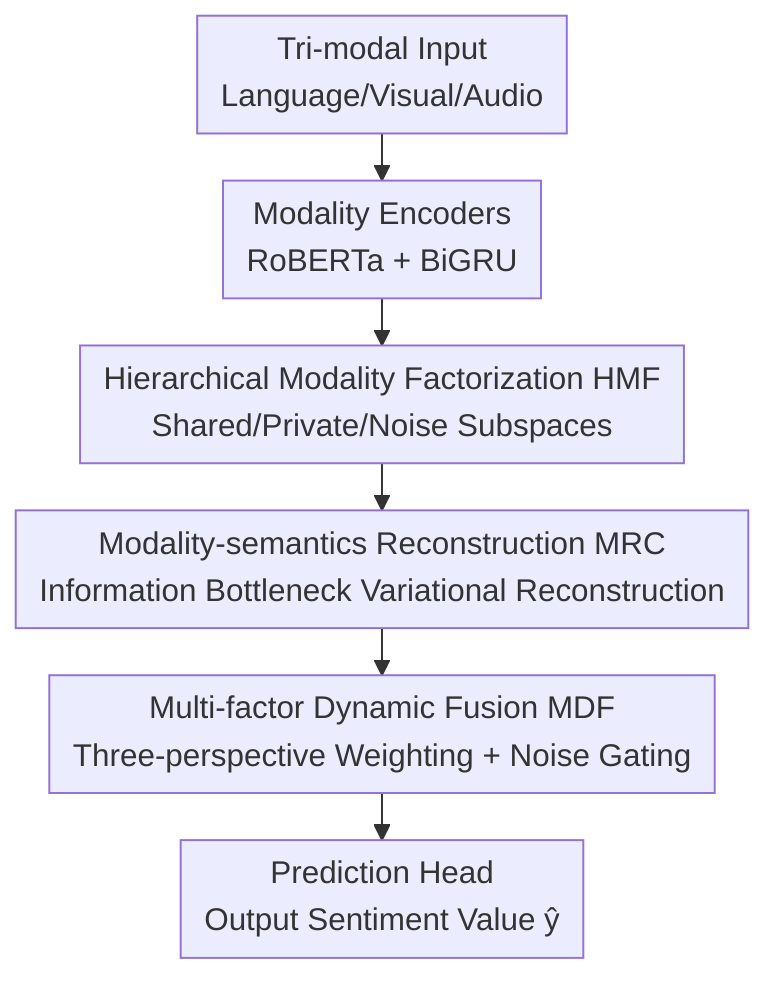

# Factorize, Reconstruct, Enhance: A Unified Framework for Multimodal Sentiment Analysis

**Conference**: CVPR 2026  
**Paper**: [CVF Open Access](https://openaccess.thecvf.com/content/CVPR2026/html/Yang_Factorize_Reconstruct_Enhance_A_Unified_Framework_for_Multimodal_Sentiment_Analysis_CVPR_2026_paper.html)  
**Code**: None  
**Area**: Multimodal VLM / Multimodal Sentiment Analysis  
**Keywords**: Multimodal Sentiment Analysis, Subspace Decoupling, Noise Subspace, Information Bottleneck Reconstruction, Dynamic Fusion  

## TL;DR
FUSE-Net explicitly factorizes each modality into "shared / private / noise" subspaces, employs variational reconstruction based on the Information Bottleneck to preserve sentiment semantics, and utilizes a multi-perspective sample-adaptive dynamic fusion for weighted aggregation and gated noise suppression. It achieves state-of-the-art performance in regression and ordered classification metrics across MOSI, MOSEI, and SIMSv2 benchmarks.

## Background & Motivation
**Background**: Multimodal Sentiment Analysis (MSA) aims to infer human emotional polarity and intensity from three heterogeneous signals: text, audio, and vision. Mainstream approaches follow two lines: fusion-based (e.g., TFN, LMF, MulT) which directly perform attention or hierarchical aggregation at the feature/decision level; and representation learning-based (e.g., MISA, Self-MM, DTN) which purify single-modal representations before fusion, often using shared-private decoupling or contrastive consistency objectives.

**Limitations of Prior Work**: Single-modal representations entangle three types of heterogeneous information: cross-modal shared sentiment semantics, modality-specific sentiment cues, and task-irrelevant noise perturbations. Existing "shared-private" binary decoupling is too coarse and **lacks explicit noise isolation**: true modality-specific cues and noise are mixed within the same private branch, leading to nuisance leakage into downstream fusion, which is particularly fragile under low signal-to-noise ratios or unreliable modalities.

**Key Challenge**: Decoupling objectives (contrastive/geometric constraints) only manage the relative geometry between latent components and **do not guarantee** that the preserved information is sufficient to reconstruct sentiment-related modality semantics. Excessive factorization may suppress subtle but critical sentiment evidence, resulting in semantic incompleteness that propagates to the fusion stage as unstable predictions. Furthermore, decoupling and fusion are often treated as loosely coupled steps, lacking a sample-adaptive fusion mechanism to dynamically adjust the contributions of various modalities and branches.

**Goal**: To jointly optimize "clean subspace separation," "sentiment semantics preservation," and "adaptive fusion" within a unified framework.

**Core Idea**: Beyond traditional shared-private split, an **explicit noise subspace** is added. An Information Bottleneck reconstruction channel prevents over-purification, followed by a Multi-factor Dynamic Fusion (MDF) module that decomposes fusion control into three complementary scales (sample-level, factor-type-level, and branch-level) for sample-adaptive aggregation—namely the factorize → reconstruct → enhance pipeline.

## Method

### Overall Architecture
The input consists of tri-modal feature sequences $U=(X^L, X^V, X^A)$ (Language / Vision / Audio), and the output is an utterance-level continuous sentiment value $\hat{y}$. The backbone of FUSE-Net is a serial pipeline of "Encoding → Three-factor Factorization → Reconstruction Regularization → Dynamic Fusion → Prediction," where the factorization, reconstruction, and fusion modules constitute the main contributions.

Specifically: Tri-modal features first pass through respective modality encoders (RoBERTa/BERT + masked mean pooling for text, single-layer BiGRU for audio/vision) to obtain contextual representations $(H_L, H_V, H_A)$. These are fed into **Hierarchical Modality Factorization (HMF)** to split each modality into shared $H^h_m$, private $H^s_m$, and noise $H^n_m$ subspaces. These factors are processed by the **Modality-semantics Reconstruction Channel (MRC)** using variational reconstruction to preserve sentiment-related semantics while suppressing redundancy. The refined factors are then passed to **Multi-factor Dynamic Fusion (MDF)**, which determines weights for each "modality × factor" branch using sample modulation, factor-type coefficients, and branch attention, while gating noise branches. Finally, the fused representation passes through a prediction head to output $\hat{y}$.

### Key Designs

**1. Hierarchical Modality Factorization (HMF): Blocking nuisance leakage with an explicit noise branch**

To address the coarse "shared-private binary" split, HMF factorizes each modality representation $H_m$ into three complementary subspaces: shared $H^h_m$ (cross-modal invariant sentiment semantics), private $H^s_m$ (modality-specific but sentiment-related cues), and noise $H^n_m$ (sentiment-irrelevant perturbations). The explicit introduction of $H^n_m$ is critical—it extracts nuisance separately, forcing sentiment knowledge to concentrate in $(H^h_m, H^s_m)$, providing a cleaner foundation for subsequent reconstruction and fusion.

The factorization is learned through three collaborative objectives. First, a **contrastive separation objective** aligns cross-modal shared semantics while preventing modality-specific information from collapsing into the shared branch. Defining similarity $\phi(u,v)=\exp(\mathrm{sim}(u,v)/\tau)$, the loss is:

$$L_{contrast} = -\frac{1}{6}\sum_{a\in\Omega}\sum_{b\in\Omega, b\neq a}\log\frac{\phi(H^h_a, H^h_b)}{\phi(H^h_a, H^h_b)+\phi(H^h_a, H^s_a)}$$

Second, the **information gain constraint** attaches auxiliary sentiment estimators to each branch to obtain information scores $\ell^m_h, \ell^m_s, \ell^m_n$, using $L_{info}=\frac{1}{|\Omega|}\sum_m(-\ell^m_h-\ell^m_s+\ell^m_n)$ to concentrate discriminative power in shared/private branches while suppressing it in noise branches. Third, a **dual consistency constraint** uses invertible mappings $g_m, g_m^{-1}$ to ensure shared and private subspaces are mutually recoverable, $L_{dual}=\frac{1}{|\Omega|}\sum_m(\lVert H^h_m-g_m(H^s_m)\rVert_2^2+\lVert H^s_m-g_m^{-1}(H^h_m)\rVert_2^2)$, stabilizing factorization.

**2. Modality-semantics Reconstruction Channel (MRC): Preventing semantic loss via Information Bottleneck**

HMF only manages geometric relationships between components. In scenarios with low SNR or modality imbalance, aggressive factorization can discard weak sentiment evidence. MRC acts as an explicit semantic preservation mechanism based on the Variational Information Bottleneck (VIB), ensuring latent representations are both **sufficient** (to reconstruct sentiment semantics) and **minimal** (to suppress residual redundancy).

Each modality's factors are concatenated $H^{concat}_m=[H^h_m; H^s_m; H^n_m]$ and passed through a variational encoder $E_\phi$ to parameterize a diagonal Gaussian posterior $q_\phi(z_m\mid H^{concat}_m)$. A sample $z_m$ is drawn via reparameterization and passed through decoder $D_\theta$ to reconstruct the original representation $\hat{H}_m$. The objective is:

$$L_{MRC}=\sum_{m\in\Omega}\left(\lVert\hat{H}_m-H_m\rVert_2^2 + \beta\, D_{KL}\big(q_\phi(z_m\mid H^{concat}_m)\,\Vert\,\mathcal{N}(0,I)\big)\right)$$

MRC acts on the **concatenation of the three branches**, enabling joint refinement of shared, private, and noise subspaces.

**3. Multi-factor Dynamic Fusion (MDF): Sample-adaptive weighting + noise gating**

MDF decomposes fusion control into three complementary scalar scales:

- **Sample Modulation Score** $\alpha_m=\mathrm{MLP}([H^h_m; H^s_m])$, characterizing modality importance for a specific sample.
- **Factor Type Coefficient** $\beta^{(x)}$ ($x\in\{h,s,n\}$), a learnable structural prior for shared/private/noise tendencies.
- **Branch Attention** $\gamma^{(x)}_m=\mathrm{Attn}(H^{(x)}_m)$, a per-branch scalar attention.

The product $\ell^{(x)}_m=\alpha_m\cdot\beta^{(x)}\cdot\gamma^{(x)}_m$ is normalized via softmax **within each modality** to obtain weights $w^{(x)}_m$. Aggregated features $F^{(h)}$ and $F^{(s)}$ are computed, while the noise branch is further suppressed via a gate: $F^{(n)}=\sum_m w^{(n)}_m\cdot\mathrm{Gate}(H^{(n)}_m)$, where $\mathrm{Gate}(h)=h\odot\sigma(W_g h+b_g)$.

### Loss & Training
The total objective combines task loss and regularization terms:

$$L_{total}=\lambda_{task}L_{task}+L_{HMF}+\lambda_{MRC}L_{MRC}$$

where $L_{task}$ is the Mean Squared Error (MSE). Training uses AdamW with ReduceLROnPlateau and early stopping.

## Key Experimental Results

### Main Results
FUSE-Net was compared against fusion-based (TFN/LMF/MulT) and decoupling-based (MISA/Self-MM/DTN) methods. FUSE-Net achieves the lowest MAE across all three benchmarks.

| Dataset | Metric | Ours | DTN (Strong Baseline) | Gain |
|--------|------|----------|----------|------|
| MOSI | MAE ↓ | **0.688** | 0.716 | -3.91% |
| MOSI | Acc7 ↑ | **49.27** | 47.5 | — |
| MOSEI | MAE ↓ | **0.527** | 0.572 | -7.87% |
| MOSEI | Acc7 ↑ | **54.32** | 52.3 | — |
| SIMSv2 | MAE ↓ | **0.297** | 0.302 | — |
| SIMSv2 | Acc5 ↑ | **55.51** | 53.71 | +3.35% |

### Ablation Study
Ablation on MOSI (average of 5 seeds):

| Configuration | MAE ↓ | Acc7 ↑ | Description |
|------|-------|--------|------|
| FUSE-Net (Full) | 0.688 | 49.27 | Full Model |
| w/o HMF | 0.754 | 43.0 | Without hierarchical factorization |
| w/o MRC | 0.729 | 45.7 | Without IB reconstruction |
| w/o MDF | 0.712 | 46.3 | Without dynamic fusion |
| w/o Language | 1.246 | 23.5 | Performance collapse |

### Key Findings
- **HMF provides the largest contribution**: Removing it degrades MAE from 0.688 to 0.754, confirming explicit noise branches as the foundation for clean representations.
- **Language modality is dominant**: Removing text causes MAE to spike to 1.246, consistent with the observation that text carries the most sentiment signals in MSA.
- The combination of denoising and semantic preservation is particularly effective for fine-grained classification (SIMSv2 Acc5 +3.35%).

## Highlights & Insights
- **Explicit Noise Subspace + Joint Reconstruction**: Unlike shared-private models, the dedicated noise "trash bin" and joint reconstruction on concatenated branches prevent over-purification and loss of weak sentiment cues.
- **Three-scale Scalar Multiplicative Fusion**: The design of $\alpha_m$, $\beta^{(x)}$, and $\gamma^{(x)}_m$ realizes fine-grained controllable fusion with minimal parameters, outforming static weighting or simple gating.
- **VIB Perspective for Denoising**: Reinterpreting denoising as an Information Bottleneck sufficiency-minimality trade-off provides a principled objective function beyond geometric heuristics.

## Limitations & Future Work
- Lack of visualization/interpretability for what the noise subspace actually learns; its "nuisance-only" nature is inferred indirectly via information gain constraints.
- Sensitivity to hyperparameters ($\lambda_{contrast}, \lambda_{info}, \beta$, etc.) is not fully explored.
- Robustness to severe modality missing/corruption in unaligned open-world scenarios is motivated but not tested via dedicated stress tests.

## Related Work & Insights
- **vs. MISA**: FUSE-Net adds the third noise branch and uses dual consistency to stabilize decomposition, addressing "noise leakage into private branches."
- **vs. DTN**: FUSE-Net achieves significant MAE gains (7.87% on MOSEI) through explicit noise modeling and reconstruction regularization.
- **vs. DisCo**: While DisCo models label corruption with noise subspaces, FUSE-Net further employs VIB reconstruction for task-oriented semantic preservation.

## Rating
- Novelty: ⭐⭐⭐⭐ 
- Experimental Thoroughness: ⭐⭐⭐⭐ 
- Writing Quality: ⭐⭐⭐⭐ 
- Value: ⭐⭐⭐⭐ 

<!-- RELATED:START -->

## Related Papers

- [\[CVPR 2026\] Enhance-then-Balance Modality Collaboration for Robust Multimodal Sentiment Analysis](enhance-then-balance_modality_collaboration_for_robust_multimodal_sentiment_anal.md)
- [\[CVPR 2026\] EBMC: Enhance-then-Balance Modality Collaboration for Robust Multimodal Sentiment Analysis](ebmc_multimodal_sentiment_analysis.md)
- [\[CVPR 2026\] Conflict-Aware Adaptive Cross-Reconstruction for Multimodal Sentiment Analysis](conflict-aware_adaptive_cross-reconstruction_for_multimodal_sentiment_analysis.md)
- [\[CVPR 2026\] Prototype-as-Prompt: Multimodal Sentiment Prototypes Endowing Large Language Models the Capability to Perform Multimodal Sentiment Analysis](prototype-as-prompt_multimodal_sentiment_prototypes_endowing_large_language_mode.md)
- [\[CVPR 2026\] Multi-Metric Representation Learning Strategy Based on Clustering for Fine-Grained Multimodal Sentiment Analysis](multi-metric_representation_learning_strategy_based_on_clustering_for_fine-grain.md)

<!-- RELATED:END -->
