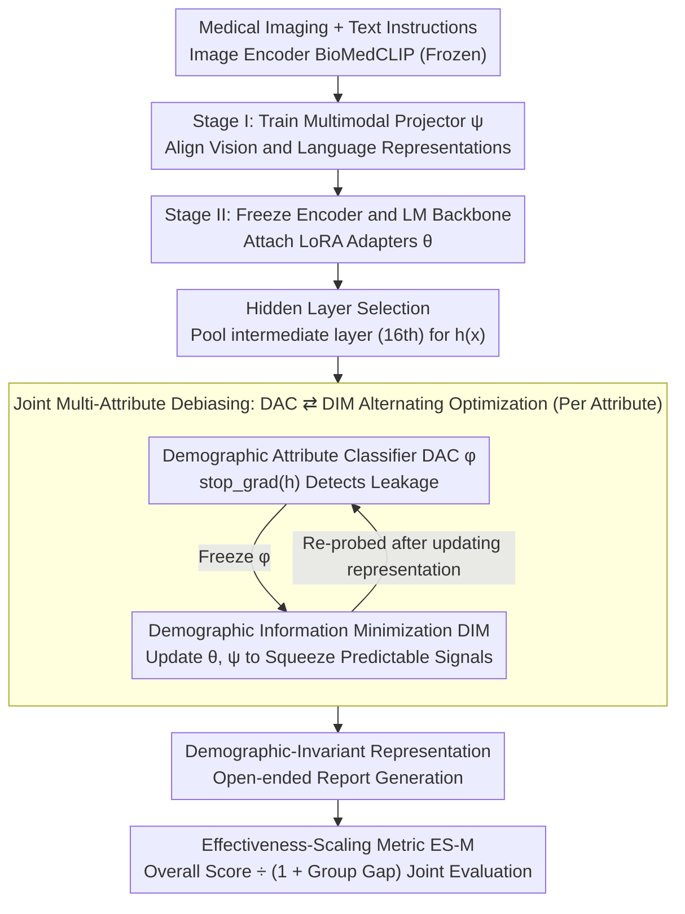

# FairLLaVA: Fairness-Aware Parameter-Efficient Fine-Tuning for Large Vision-Language Models

**Conference**: CVPR 2026  
**arXiv**: [2603.26008](https://arxiv.org/abs/2603.26008)  
**Code**: [github.com/bhosalems/FairLLaVA](https://github.com/bhosalems/FairLLaVA)  
**Area**: Multimodal VLM  
**Keywords**: Fairness, MLLM, Mutual Information, LoRA, Medical Image Analysis

## TL;DR

Proposes FairLLaVA, a parameter-efficient fairness fine-tuning method that eliminates demographic shortcuts in Multimodal Large Language Models (MLLMs) by minimizing mutual information between hidden states and demographic attributes. It significantly narrows performance gaps across groups in chest X-ray report generation and skin lesion question answering.

## Background & Motivation

Multimodal Large Language Models (MLLMs) demonstrate powerful capabilities in medical imaging tasks but suffer from severe fairness issues:

**Objective Performance Gaps**: Systematic performance differences exist across age, gender, and racial groups, which cannot be simply attributed to sample size imbalances—on MIMIC-CXR, "White" is the largest group, yet multiple MLLMs perform worse on it.

**Medical Images Leak Sensitive Information**: Models can predict self-reported race from X-rays with high AUC even when images are corrupted, indicating that demographic signals are systematically encoded.

**Failure of Existing Methods**:
   - Resampling/Reweighting: Assumes gaps stem from quantity imbalance, but the actual drivers are intersectional dependencies across attributes.
   - Adversarial Classifiers: Introduce pretrained discriminators but lead to catastrophic forgetting of clinical knowledge.
   - Word-level Fairness Metrics (e.g., pronoun frequency): Inapplicable as radiology reports rarely contain demographic markers.

**Evaluation Gap**: Fairness metrics for discriminative tasks (TPR/FPR gap) cannot be directly applied to open-ended text generation.

## Method

### Overall Architecture

FairLLaVA aims to address "demographic shortcuts" in medical imaging MLLMs—where models implicitly encode sensitive signals like race, gender, or age into hidden representations, causing systematic performance gaps. It uses a two-stage fine-tuning approach based on the LLaVA framework: in the first stage, the image encoder and language model (LM) are frozen, and only the multimodal projector $\psi$ is trained to align visual and linguistic representations. In the second stage, the encoder and LM backbone remain frozen while LoRA adapters $\theta$ are attached. Mutual information regularization is applied to a set of hidden states $h(x)$ pooled from intermediate layers to remove demographic information. The core mechanism is an alternating optimization of "exposure then elimination" (DAC ⇄ DIM), supplemented by a fairness metric ES-M for open-ended text generation.

### Key Designs

**1. Demographic Attribute Classifier (DAC): Exposing Leakage Points**

To eliminate leakage, one must first identify what demographic information can be predicted from hidden states. DAC is a lightweight variational MLP $\phi$ that maps pooled hidden states $h(x)$ to demographic attributes. The training objective is $\mathcal{L}_{DAC} = -\mathbb{E}[\log \phi(\mathbf{a} \mid h(x))]$. A crucial constraint is applying `stop_gradient` to $h(x)$—this step only updates $\phi$ without altering the representation. Thus, DAC acts as a "probe" specifically targeting the decodable portions of hidden states to prepare for elimination.

**2. Demographic Information Minimization (DIM): Cutting the Leakage Link**

With $\phi$ exposing the leakage, DIM trains the representation to deceive it. This is implemented via a variational approximation of the mutual information upper bound: using the mean of positive sample pairs (attribute $\mathbf{a}_i$ and hidden state $\phi(\mathbf{a}_i \mid h(x_i))$ for the same sample $i$) minus negative pairs (different samples cross-matched $\phi(\mathbf{a}_i \mid h(x_j))$). During optimization, $\phi$ is frozen, and only LoRA $\theta$ and projector $\psi$ are updated. The intuition is to treat the predictability of $h(x) \rightarrow \mathbf{a}$ as leakage; DIM drives the representation to actively discard these signals. Compared to direct adversarial discriminators, this alternating MI minimization is more stable and avoids flushing out clinical knowledge.

**3. Joint Multi-Attribute Debiasing: Avoiding the "Seesaw Effect"**

Debiasing a single attribute often leads to a seesaw effect—improving the target attribute while worsening gaps in others. FairLLaVA attaches a classification head $\phi_a$ for each attribute $a \in \mathcal{A}$, calculating $\mathcal{L}_{DAC}^{(a)}$ and $\mathcal{L}_{DIM}^{(a)}$ respectively. These are summed ($\mathcal{L}_{DIM} = \sum_a \mathcal{L}_{DIM}^{(a)}$) for unified optimization, ensuring gaps across all attributes narrow simultaneously. The joint variant (FairLLaVA-All) is the strongest configuration in experiments.

**4. Hidden Layer Selection: Operating on Intermediate Layers**

Identifying which layer leaks most information is an empirical question. Ablations found that the intermediate layer (16th) provides the best balance between fairness and performance—shallow layers handle visual localization, middle layers handle reasoning, and deep layers handle task decoding; demographic shortcuts primarily form in the middle. DIM regularization focuses on $h(x)$ pooled from this intermediate layer.

**5. Effectiveness-Scaling Metric (ES-M): Closing the "Uniform Failure" Loophole**

Fairness evaluation in generation tasks involves a trap: if a model performs poorly across all groups, the inter-group gap is small, which might be wrongly judged as "fair." ES-M incorporates both overall performance and group gaps: $ES\text{-}M_a = \frac{M_{all}}{1 + \Delta M_a}$, where $M_{all}$ is the overall score and $\Delta M_a$ is the inter-group gap for attribute $a$. It can be applied to any linguistic metric (BLEU, RadGraph-F1, GREEN), extending fairness measurement from discriminative tasks to open-ended text generation.

### Loss & Training

The total loss is $\mathcal{L}_{total} = \lambda_1 \mathcal{L}_{DAC} + \lambda_2 \mathcal{L}_{DIM} + \lambda_3 \mathcal{L}_{LM}$, using an alternating optimization protocol: first optimize $\mathcal{L}_{DAC}$ (with `stop_gradient` on $h$) to update $\phi$, then freeze $\phi$ and optimize $\mathcal{L}_{DIM} + \mathcal{L}_{LM}$ to update LoRA $\theta$ and projector $\psi$. The base model is Vicuna-7b-v1.5 with a BioMedCLIP image encoder. Training on MIMIC-CXR takes approximately 17 hours (1 epoch) on 8×RTX A6000. The parameter overhead for DAC is only about 57K.

## Key Experimental Results

### Main Results

MIMIC-CXR Joint Debiasing (All attributes, 12 ES metrics):

| Method | ES-BLEU1(R) | ES-BLEU4(R) | ES-RG-F1(R) | ES-BLEU1(A) | ES-RG-F1(A) | ES-BLEU1(G) | ES-RG-F1(G) |
|------|------------|------------|-------------|------------|-------------|------------|-------------|
| LLaVA-Rad | 5.29 | 2.14 | 4.14 | 8.28 | 1.42 | 28.06 | 9.24 |
| Resampling | 8.71 | 2.32 | 2.95 | 12.54 | 3.01 | 30.38 | 15.97 |
| Reweighting | 1.81 | 1.73 | 3.31 | 7.36 | 2.17 | 11.72 | 9.88 |
| **Ours** | **13.36** | **8.65** | **6.34** | **21.89** | **4.06** | **24.89** | **19.40** |

FairLLaVA-All achieves the **best result in 7 out of 12** ES metrics, showing universal advantages in clinical semantic metrics (RadGraph-F1).

CheXpert-F1 ES metrics (Direct comparison with Chen et al.):

| Method | Race↑ | Age↑ | Gender↑ |
|------|-------|------|---------|
| Chen et al. | 24.06 | 23.85 | 24.13 |
| **Ours** | **69.21** | **68.70** | **69.38** |

Similar leads were observed on PadChest & HAM10000, validating generalization across modalities (Grayscale X-ray → RGB skin lesions).

### Ablation Study

Hidden layer selection ablation (MIMIC-CXR, lower Δ is better):

| Pooling Layer | BLEU4-Δ(R)↓ | RG-F1-Δ(R)↓ | BLEU4-Δ(A)↓ | Overall BLEU4↑ |
|--------|-------------|-------------|-------------|---------------|
| first | 3.40 | 4.42 | 2.53 | 13.62 |
| last | 4.48 | 3.90 | 2.40 | 13.19 |
| mean | 3.07 | 4.52 | 2.16 | **14.84** |
| **mid** | **0.61** | **3.50** | **1.01** | 14.01 |

The middle layer is optimal on 5/6 gap metrics while maintaining reasonable overall performance.

### Key Findings

- **Joint multi-attribute debiasing outperforms single-attribute debiasing**: Single-attribute methods improve the target but worsen others ("seesaw effect"), while joint debiasing achieves comprehensive improvement.
- **FairLLaVA does not sacrifice overall performance for fairness**: On PadChest, it achieves both the best overall performance and the best ES metrics.
- **Assumptions of Resampling/Reweighting are invalid**: Demographic gaps stem not just from quantity imbalance but from intersectional dependencies and implicit signals encoded in images.
- **Intermediate layers are the primary location for demographic shortcut leakage**: Consistent with theories regarding how different layers process different information types.

## Highlights & Insights

1. **Elegant and Theoretically Sound MI Regularization**: The alternating optimization of DAC (exposing) → DIM (eliminating) avoids the instability of direct adversarial training.
2. **ES-M Metric Fills an Important Gap**: Solves the "low-performance pseudo-fairness" trap in generative model evaluation.
3. **Extremely Low Overhead**: Only ~57K parameters for the MLP plus standard LoRA fine-tuning, requiring no additional data augmentation or preference data.
4. **Cross-modal Generalization**: The same framework is effective for both grayscale chest X-rays (MIMIC-CXR, PadChest) and RGB skin lesion images (HAM10000).

## Limitations & Future Work

- Base model is limited to Vicuna-7b; applicability to larger models (e.g., LLaMA-3) is unverified.
- DAC relies on the availability of demographic labels; label-free scenarios require self-supervised variants.
- Currently handles only Age/Gender/Race; more complex attributes like socioeconomic status remain to be explored.
- FairLLaVA is not always optimal on the GREEN metric; variance in LLM-based evaluation metrics requires further analysis.
- Generalization on non-English report datasets has not been evaluated.

## Related Work & Insights

- The debiasing approach using MI minimization can be generalized to any MLLM task requiring attribute-invariant representations.
- The ES-M metric can be extended to all fairness evaluation scenarios for open-ended text generation.
- The discovery that "images leak sensitive attributes" (Gichoya et al.) suggests that debiasing might also be needed at the visual encoder level.

## Rating

- Novelty: ⭐⭐⭐⭐ — Novel application of MI regularization in MLLM fairness; ES-M metric is a significant contribution.
- Experimental Thoroughness: ⭐⭐⭐⭐⭐ — 3 datasets × 3 demographic attributes × 6 metrics × multiple baselines, with detailed ablations.
- Writing Quality: ⭐⭐⭐⭐ — Figures 1 and 2 clearly illustrate core ideas; Algorithm 1 is complete and accurate.
- Value: ⭐⭐⭐⭐⭐ — First systematic solution for fairness in medical MLLMs, with direct significance for trustworthy AI deployment.

<!-- RELATED:START -->

## Related Papers

- [\[CVPR 2026\] CoVFT: Context-aware Visual Fine-tuning for Multimodal Large Language Models](covft_context-aware_visual_fine-tuning_for_multimodal_large_language_models.md)
- [\[CVPR 2026\] Parameter-Efficient Adaptation for MLLMs via Implicit Modality Decomposition](parameter-efficient_adaptation_for_mllms_via_implicit_modality_decomposition.md)
- [\[CVPR 2026\] Interpretable Debiasing of Vision-Language Models for Social Fairness](interpretable_debiasing_of_vision-language_models_for_social_fairness.md)
- [\[CVPR 2026\] DEVA: Fine-tuning Multimodal Large Language Models for Visual Perception Tasks](deva_fine-tuning_multimodal_large_language_models_for_visual_perception_tasks.md)
- [\[CVPR 2026\] TRivia: Self-supervised Fine-tuning of Vision-Language Models for Table Recognition](trivia_self-supervised_fine-tuning_of_vision-language_models_for_table_recogniti.md)

<!-- RELATED:END -->
