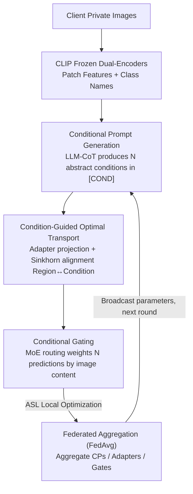

# FedMPT: Federated Multi-Label Prompt Tuning of Vision-Language Models

**Conference**: CVPR 2026  
**Paper**: [CVF Open Access](https://openaccess.thecvf.com/content/CVPR2026/html/Wang_FedMPT_Federated_Multi-Label_Prompt_Tuning_of_Vision-Language_Models_CVPR_2026_paper.html)  
**Code**: https://xuc865.github.io/fedmpt/index.html (Project Page)  
**Area**: Multimodal VLM  
**Keywords**: Federated Learning, Multi-Label Recognition, Prompt Learning, Causal Adjustment, Optimal Transport  

## TL;DR
FedMPT models Federated Multi-Label Recognition (MLR) as a causal front-door adjustment problem. It uses an LLM to generate a set of universal "conditions" (e.g., spatial layout, object poses) as mediating variables to constrain label co-occurrence. Through a three-step pipeline—conditional prompts, optimal transport, and gated aggregation—these conditions are aligned to image regions and adaptively weighted. This significantly suppresses spurious correlation overfitting, such as "falsely reporting a chair whenever a cat is seen," especially when client data is heterogeneous.

## Background & Motivation
**Background**: Mainstream MLR (identifying all labels in one image) recently relies on prompt learning in VLMs like CLIP, such as DualCoOp and PosCoOp, which learn collaborative prompt pairs for each class. Another research line involves VLM-based Federated Learning (FL), such as FedTPG and FedMVP, where each client holds private heterogeneous data and uses FedAvg to aggregate prompt weights to preserve privacy.

**Limitations of Prior Work**: These two lines rarely intersect—all existing VLM-based FL methods are designed for **single-label** tasks, completely ignoring multi-label scenarios. Directly applying SOTA MLR methods to FL using FedAvg leads the global model to learn **excessive spurious label correlations**. The authors provide an example where "cats" often co-occur with "chairs" in the training set; during inference, the model inflates the score for "chair" as soon as it sees a "cat," even if no chair is present. As data heterogeneity (distributional differences between clients) increases, the mAP of existing SOTA methods drops sharply.

**Key Challenge**: The authors use Structural Causal Models (SCM) to pinpoint the root cause. Pre-trained semantic factors $F$ can be decomposed into clickable **global factors** $F_g$ and client-specific **private factors** $F_s$. Image content is generated by a mixture of both, but labels **should only** be determined by $F_g$. Limited local data and the large gap with the inference distribution cause the model to conflate $F_g$ and $F_s$ into $F_{g,s}$. This opens a backdoor path $D\leftarrow F_{g,s}\to Y$ between $D$ and $Y$, which is the source of spurious correlations.

**Goal / Key Insight**: From the perspective of **front-door adjustment**, a mediating variable $R$ is introduced to block the backdoor and restore true causality. The objective is $P(Y|do(D))=\mathbb{E}_{P(r|d)}\mathbb{E}_{P(d')}P(Y|r,d')$. The core challenge is how to construct an $r$ that approximates the oracle mechanism of "why labels co-occur."

**Core Idea**: Use a set of **universal and complementary "conditions"** as the mediating variable $R$ to intervene in MLR. The intuition is that cats and chairs co-occur because they satisfy conditions like "indoor scene," "wooden texture," or "lying posture." When substituted with a "cat + bicycle" image where these conditions are not met, the model should automatically lower the weight for "chair."

## Method

### Overall Architecture
FedMPT takes private images from clients as input and outputs global multi-label predictions. In each client, it runs a three-stage pipeline: "Conditional Prompt Generation → Condition-Guided Optimal Transport → Conditional Gating." Trainable parameters are then sent to a central server for FedAvg aggregation. The CLIP dual-encoders remain frozen throughout, with only the conditional prompt tokens, LoRA adapters, and gating routers being trained (approximately 0.8M parameters in total).

The key is grounding abstract "conditions" into computation: an LLM first produces $N$ abstract conditions offline (e.g., layout, background, lighting), which are filled into templates to create $N$ sets of Conditional Prompts (CPs). Patch-level features from each image are projected by $N$ adapters and aligned with corresponding CPs using Optimal Transport, yielding $N$ "condition-specific" predictions. Finally, a gating module dynamically weights these $N$ predictions based on image content.

### Key Designs

**1. Conditional Prompt Generation: Distilling "Why Labels Co-occur" via LLM into Learnable Conditions**

This step corresponds to constructing the mediator $r$ in causal analysis. The difficulty is that conditions must be both **universal** (shared across clients to learn $F_g$) and **fine-grained** (distinguishing scenarios for different label combinations). The strategy is "fixed abstract conditions with learnable specific content." A two-stage offline LLM + Chain-of-Thought pipeline is used: first, the LLM generates descriptive sentences for **every combination** of dataset classes (e.g., "a bicycle leaning against a small plane wing, background is a hangar and clear sky"), leveraging LLM world knowledge to capture conditions for label combinations. Then, the LLM summarizes these into **$N$ non-overlapping abstract conditions**, such as "spatial layout, object pose, background, lighting/weather, object scale."

These are filled into the prompt template: $[L_1]\dots[L_{\beta_{cond}}]\,[\text{COND}]\,[L_1]\dots[L_{\beta_{cls}}]\,[\text{CLASS}]$, where condition-level tokens are independent for each condition, and class-level tokens are shared. These prompts $p^\dagger=\{p^\dagger_1,\dots,p^\dagger_C\}$ are stored on the server and distributed each round, then encoded via the text encoder to get $f_t(p^\dagger)$. Unlike DualCoOp, which learns coarse class prompts, this explicitly encodes the "semantic prerequisites for label co-occurrence."

**2. Condition-Guided Optimal Transport: Aligning Conditions to Image Regions**

Conditions describe local semantics (e.g., "wooden texture" only applies to certain patches), requiring **alignment to specific regions**. For each condition, a LoRA-style adapter $A_n$ is applied to the patch-level visual output $f_v(v)$ to generate a condition-specific latent space $f^\dagger_{v,n}(v)=W_\uparrow(W_\downarrow(f_v(v)))$. An optimal transport plan $P^*=\mathrm{OT}(C;a,b)$ is computed between patches and condition prompts. The cost matrix $C_{m,n}$ is derived from the negative softmax of patch–condition similarity ($S=1-C$).

The marginal distributions are designed specifically: the column marginal $b$ is uniform, giving all classes an **equal chance of being detected** (avoiding bias toward frequent classes). The row marginal $a$ represents the **semantic importance** of each patch: $a_{m,n}=\frac{\exp(\max_c \mathrm{sim}(f^\dagger_{v,n}(v_m),f_t(p^\dagger_n))/\tau)}{\sum_m \exp(\dots)}$, allowing more informative regions to contribute more. OT is solved efficiently using Sinkhorn iterations with entropy regularization. The final "condition-$n$ specific prediction" $P_n$ is the Wasserstein distance $\psi_n=\sum_m P_{m,n}S_{m,n}$.

**3. Conditional Gating: Image-Adaptive Weighting via MoE-style Routing**

The relevance of conditions varies across clients and images. Inspired by Mixture-of-Experts (MoE), a router $\omega=\Omega(f_v(v))$ (where $\Omega$ is a LoRA module) calculates weights for the $N$ conditions based on image content, followed by softmax weighted aggregation: $P'=\sum_n \frac{\exp(\omega_n)}{\sum_{n'}\exp(\omega_{n'})}P_n$. This lets the data decide "which conditions are currently credible." If a condition is invalid for a specific image, its weight is suppressed. Ablations show that gating gains **depend on OT**: adding gating alone yields only +0.27% mAP, but adding it when OT is present yields +2.21%.

### Loss & Training
Local optimization uses Asymmetric Loss (ASL): $L=(1-P')^{\gamma_+}y\log(P')+(P'_c)^{\gamma_-}(1-y)\log(1-P'_c)$, where $P'_c=\max(P'-c,0)$. $\gamma_-\!\ge\!\gamma_+$ is used to down-weight easy negative samples, mitigating severe positive-negative imbalance in MLR. After one epoch of local training, weights for prompts $p$, adapters $\{A_n\}$, and the gate $\Omega$ are sent for FedAvg. CLIP ViT-B/16 is frozen. SGD is used ($lr=0.001$, $\lambda=0.2$, $\tau=4$, $\beta_{cond}=\beta_{cls}=4$, LoRA dimension $D_s=32$).

## Key Experimental Results

### Main Results
Evaluated on three Federated MLR benchmarks over three datasets, compared against 10 baselines. The table shows average mAP / CF1 / OF1 on the **heterogeneous benchmark** with $t$ ranging from 10% to 100%:

| Dataset | Metric | FedMPT | Prev. Best | Gain |
| :--- | :--- | :--- | :--- | :--- |
| VOC2007 | mAP | 89.51 | 85.67 (Fed-RAM) | +3.84 |
| VOC2007 | OF1 | 83.62 | 79.44 (FedMVP) | +4.18 |
| COCO2014 | mAP | 64.65 | 61.64 (FedMVP) | +3.01 |
| COCO2014 | OF1 | 65.26 | 61.75 (FedMVP) | +3.51 |
| NUS-Wide | mAP | 56.69 | 53.33 (Fed-RAM) | +3.36 |
| NUS-Wide | OF1 | 77.33 | 75.42 (FedMVP) | +1.91 |

Gains are even larger on **partially labeled benchmarks** (masking 10% to 90% of labels): COCO2014 mAP increases by +2.26% at 10% mask up to +7.25% at 90% mask. FedMPT shows almost no performance drop as heterogeneity increases or client participation rate decreases (10%), while others drop by ~5-7% mAP.

### Ablation Study
Module ablation (Table 4, VOC2007 average):

| Configuration | mAP | Avg(3 Metrics) | Insight |
| :--- | :--- | :--- | :--- |
| CPs alone | 87.08 | 83.88 | Stronger than adapters alone |
| Adapters alone | 84.40 | 80.92 | Pure visual adaptation is weakest |
| CPs + Adapters | 87.62 | 84.78 | Combining both |
| + OT | 89.35 | 85.23 | OT adds +1.44% mAP |
| Full (CPs+Ad.+OT+Gate) | 90.10 | 86.19 | Gating requires OT to be effective |

Efficiency (Table 5): FedMPT uses only **0.80M** trainable parameters (the least) but achieves 90.10% mAP (the highest). Fed-RAM requires 13.02M parameters.

### Key Findings
- **Condition modeling is more critical than visual adaptation**: CPs alone (87.08) significantly outperform Adapters alone (84.40).
- **Gating and OT are strongly coupled**: Gating alone is nearly useless (+0.27%) without OT to harmonize patch-level trade-offs first.
- **Robustness in extreme settings**: Gains relative to SOTA increase as heterogeneity rises or labels become scarcer.
- **Hyperparameter sensitivity**: $\tau > 4$ degrades discriminability; $D_s > 32$ leads to slight overfitting. Optimal prompt length is (5, 7).

## Highlights & Insights
- **Grounding "spurious correlation" with causal front-door adjustment**: Translating the abstract SCM mediator $R$ into LLM-generated "conditions" provides a theoretical foundation that matches the design.
- **LLM as a "condition miner" rather than a "labeler"**: Instead of using noisy LLM labels, the authors extract universal abstract conditions, leveraging LLM knowledge while avoiding its unreliability.
- **Dual-marginal OT design**: The column-marginal uniform distribution ensures multi-label fairness, while the row-marginal captures patch importance.
- **Parameter efficiency**: SOTA performance with only 0.8M parameters is highly suitable for real-world FH deployments.

## Limitations & Future Work
- Generating abstract conditions relies on offline LLM output, and the number of conditions $N$ is a fixed hyperparameter.
- Computational overhead grows linearly with $N$ due to multiple adapters and OT solvers.
- Scalability to thousands of classes is unverified, as the LLM-CoT pipeline relies on enumerating class combinations.
- The causal framework assumes labels are only determined by $F_g$; its validity in scenarios with client-specific label semantics requires further verification.

## Related Work & Insights
- **vs FedMVP (ICCV'25)**: FedMVP uses a PromptFormer to fuse image tokens with LLM attribute embeddings for single-label FL. FedMPT targets multi-label tasks with causal conditions and OT-based alignment, being more robust (+3.84% mAP on VOC) with fewer parameters.
- **vs FedOTP**: FedOTP uses OT to balance local/global prompt contributions for single-label tasks. FedMPT uses OT to align condition prompts to image regions to suppress spurious correlations.
- **vs DualCoOp / PosCoOp**: These model object existence with positive/negative prompts in centralized settings but overfit local correlations in FL. FedMPT replaces per-class local prompts with universal conditions as the knowledge carrier.

## Rating
- **Novelty**: ⭐⭐⭐⭐⭐ First method tailored for Federated MLR; original combination of front-door adjustment, LLM conditions, and OT.
- **Experimental Thoroughness**: ⭐⭐⭐⭐⭐ Comprehensive coverage of heterogeneity, partial labels, and real-world datasets with overhead analysis.
- **Writing Quality**: ⭐⭐⭐⭐ Clear correspondence between causal motivation and method; some formulas are dense but well-explained.
- **Value**: ⭐⭐⭐⭐ Highly practical for privacy-sensitive multi-label fields like medical or remote sensing.

<!-- RELATED:START -->

<!-- RELATED:END -->

## Related Papers

- [\[CVPR 2026\] Towards Calibrating Prompt Tuning of Vision-Language Models](towards_calibrating_prompt_tuning_of_vision-language_models.md)
- [\[CVPR 2026\] Improving Calibration in Test-Time Prompt Tuning for Vision-Language Models via Data-Free Flatness-Aware Prompt Pretraining](improving_calibration_in_test-time_prompt_tuning_for_vision-language_models_via_.md)
- [\[ICCV 2025\] FedMVP: Federated Multimodal Visual Prompt Tuning for Vision-Language Models](../../ICCV2025/multimodal_vlm/fedmvp_federated_multimodal_visual_prompt_tuning_for_vision-language_models.md)
- [\[CVPR 2026\] Controllable Federated Prompt Learning at Test Time](controllable_federated_prompt_learning_at_test_time.md)
- [\[CVPR 2026\] Noise-Aware Few-Shot Learning through Bi-directional Multi-View Prompt Alignment](noise-aware_few-shot_learning_through_bi-directional_multi-view_prompt_alignment.md)

<!-- RELATED:END -->
