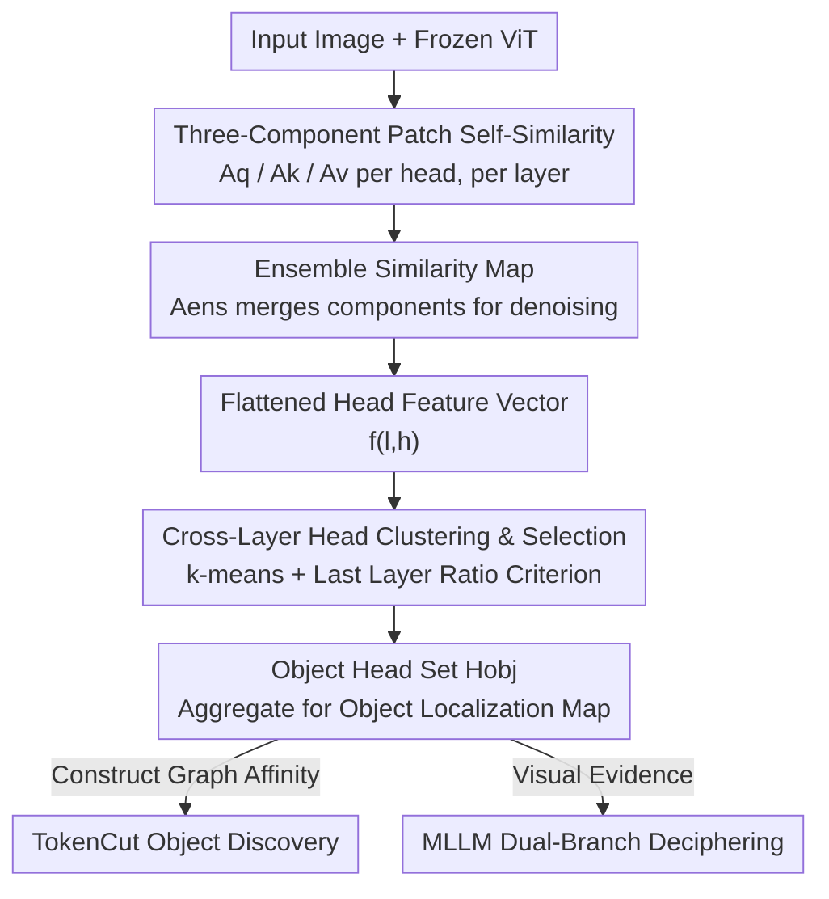

# Finding Distributed Object-Centric Properties in Self-Supervised Transformers

**Conference**: CVPR 2026  
**Paper**: [CVF Open Access](https://openaccess.thecvf.com/content/CVPR2026/html/Rawlekar_Finding_Distributed_Object-Centric_Properties_in_Self-Supervised_Transformers_CVPR_2026_paper.html)  
**Code**: Not provided (No code link in the paper)  
**Area**: Self-Supervised Representation Analysis / Unsupervised Object Discovery  
**Keywords**: Self-Supervised ViT, DINO, Attention Head Analysis, Unsupervised Object Discovery, MLLM Hallucination Mitigation  

## TL;DR
The paper provides a systematic analysis of "where object information is hidden" within self-supervised ViTs like DINO. It finds that such information is distributed across all layers and encoded simultaneously in Query, Key, and Value patch similarities (rather than only in the last layer's [CLS] or key features). Based on this, the authors propose a training-free method, **Object-DINO**, which identifies "object heads" via cross-layer clustering. This method improves unsupervised object discovery (CorLoc) by +3.6 to +12.4 and provides visual evidence to mitigate object hallucinations in MLLMs.

## Background & Motivation

**Background**: Self-supervised ViTs (represented by DINO) exhibit an "emergent" ability to locate objects without any labels. The most common approach uses the `[CLS]` token of the final layer as a query to generate a self-attention map. This map highlights salient object regions and serves as a signal for object discovery. Subsequent stronger methods (e.g., TokenCut) discard `[CLS]` and use the **key features** of the last layer for spectral clustering or normalized cuts.

**Limitations of Prior Work**: `[CLS]` attention maps are noisy and provide coarse localization, often missing objects or mis-activating backgrounds. The root cause is that DINO's training objective is **image-level** global matching; `[CLS]` is forced to summarize the texture/edge/context of the entire image rather than focusing solely on objects. This tension between the "global objective vs. desired local localization" makes `[CLS]` maps unreliable. Even TokenCut only utilizes keys from the final layer.

**Key Challenge**: Object information resides in **local patch-to-patch interactions**. To enable `[CLS]` to summarize a semantically rich global representation, self-attention must first establish correspondences between patches based on visual similarity. Consequently, patches of the same object naturally attend to each other and form clusters. However, this direct, patch-level structural information is diluted when aggregated into the `[CLS]` token.

**Goal**: To bypass `[CLS]` and answer two questions: (1) Which component (Query, Key, or Value) or combination should be used? (2) Is object information exclusive to the last layer, or can it be utilized across layers?

**Key Insight**: Calculate patch-to-patch similarity matrices directly from the Query, Key, and Value components. By examining localization capabilities head-by-head and layer-by-layer, "object heads" can be separated from "noise heads" through clustering.

**Core Idea**: Object information is **distributed** across Q/K/V components and multiple network layers. By using a training-free clustering algorithm to automatically identify and aggregate these scattered object heads, a much cleaner object localization map can be obtained compared to using only the "last layer's key."

## Method

### Overall Architecture

The method, named **Object-DINO**, takes an image and a frozen pre-trained ViT (e.g., DINO-V2/V3) as input and outputs a set of "object heads" $H_{obj}$ distributed across layers. Aggregating the similarity maps of these heads produces a high-fidelity object localization map. This pipeline requires no training or labels and consists of two stages:

Phase 1 (**Head Feature Extraction**): For each head, the patch self-similarity matrices for Q, K, and V are calculated and merged into an ensemble similarity map, which is then flattened into a feature vector describing the head's behavior. Phase 2 (**Head Clustering and Selection**): All $L \times H$ heads in the network are clustered using k-means. The "object cluster" $c_{obj}$ is automatically identified as the cluster containing the highest proportion of last-layer heads. Finally, only the ensemble maps of heads in $H_{obj}$ are aggregated, filtering out noise from non-object heads. The resulting localization map is applied to two downstream tasks: unsupervised object discovery and MLLM hallucination mitigation.

### Key Designs

**1. Patch Self-Similarity of Three Components: Object Information is Not Just in Keys**

Addressing the limitation that previous works only used key features, this paper performs L2 normalization on each component $r \in \{q, k, v\}$ for each head $(\ell, h)$: $\tilde r^{\ell,h}=r^{\ell,h}/\lVert r^{\ell,h}\rVert$. Then, patch-patch self-similarity is calculated with softmax normalization:

$$A_r^{\ell,h}=\mathrm{softmax}\!\left(\frac{\tilde r^{\ell,h}\cdot(\tilde r^{\ell,h})^{\top}}{\tau}\right)$$

where $\tau$ is the temperature (ablation suggests $\tau=60$). Each component has a different focus: $A_q$ reflects "which patches are looking for similar things," $A_k$ reflects "which patches provide similar context," and $A_v$ reflects "which patches have similar content." A key finding is that **all three maps exhibit strong localization properties**, indicating that methods like TokenCut capture only part of the object information.

**2. Ensemble Similarity Map $A_{ens}$: Merging Complementary Components for Denoising**

Single components can be erroneous: $A_q$ and $A_v$ sometimes merge background into the foreground, while $A_k$ might miss parts of an object. To produce a low-noise object saliency map, the three matrices are merged:

$$A_{ens}^{\ell,h}=w_q\,A_q^{\ell,h}+w_k\,A_k^{\ell,h}+w_v\,A_v^{\ell,h}$$

Default weights are set to $w_q=w_k=w_v=0.33$. $A_{ens}$ serves as the unified representation for clustering and the aggregation unit for the final output. Ablations (Fig. 6) show that using the ensemble consistently outperforms any single component in CorLoc, with the ranking $A_q < A_v < A_k < A_{ens}$.

**3. Cross-Layer Clustering and Automatic Object Cluster Selection**

This is the core of Object-DINO, corresponding to the second finding: **object information is distributed across layers, and not every head in the last layer is an object head.** Clustering on 4000 COCO images revealed that intermediate layers (8–10) consistently contain many object heads, while approximately 4 out of 12 heads in the final layer are non-object heads that introduce noise.

The algorithm flattens $A_{ens}^{\ell,h}$ into a feature $f^{\ell,h}$ and applies k-means ($K=5$):

$$C=\text{k-means}(f^{\ell,h},K),\quad C=\{C_1,\dots,C_K\}$$

An **unsupervised criterion** identifies the object cluster: since prior knowledge suggests the last layer has the highest concentration of object heads, it selects the cluster with the most heads from the last layer:

$$c_{obj}=\arg\max_k\, n_k^{(L)},\quad n_k^{(L)}=\big|\{(\ell,h)\in C_k\mid \ell=L\}\big|$$

The resulting $H_{obj}$ filters out noise from the last layer while reclaiming critical object heads from intermediate layers.

**4. Training-Free Downstream Applications**

The localization map is verified in two zero-shot applications. First, **Unsupervised Object Discovery**: In TokenCut, the "last layer keys" are replaced with the aggregated $H_{obj}$ ensemble similarity as patch affinity. Second, **Mitigating MLLM Object Hallucination**: A dual-branch decoding strategy is used. The standard branch utilizes the original image $u$ and prompt $T_u$ to get $\text{Logits}(y\mid T_u,R,u)$. The guiding branch uses the Object-DINO map $v$ and prompt $T_v$ (e.g., "describe the highlighted region") to get $\text{Logits}(y\mid T_v,R,v)$. These are combined linearly:

$$L=\alpha\,\text{Logits}(y\mid T_u,R,u)+(1-\alpha)\,\text{Logits}(y\mid T_v,R,v)$$

With $\alpha=0.4$, tokens consistent with visual evidence are amplified, correcting hallucinations (e.g., from "two dogs" to "three dogs").

## Key Experimental Results

### Main Results: Unsupervised Object Discovery (CorLoc)

Integrating Object-DINO heads into TokenCut yields consistent gains (CorLoc, IoU>0.5):

| Model | Method | VOC07 | VOC12 | COCO20K |
|------|------|-------|-------|---------|
| DINO-V3 | TokenCut | 26.0 | 30.3 | 19.8 |
| DINO-V3 | + Ours | 30.8 (+4.8) | 36.0 (+5.7) | 23.4 (+3.6) |
| DINO-V2 | TokenCut | 16.2 | 18.3 | 11.9 |
| DINO-V2 | + Ours | 25.7 (+9.5) | 30.7 (+12.4) | 19.7 (+7.8) |

### Main Results: MLLM Object Hallucination (POPE, Higher is Better)

Dual-branch decoding achieves top Precision and F1 across three MLLMs:

| Method | LLaVA-1.5 Acc/P/F1 | InstructBLIP Acc/P/F1 | Qwen-VL Acc/P/F1 |
|------|--------------------|-----------------------|-------------------|
| Regular | 77.4 / 73.3 / 79.2 | 74.6 / 71.2 / 76.4 | 79.8 / 80.1 / 79.7 |
| VCD | 77.1 / 72.1 / 79.4 | 77.2 / 74.2 / 78.4 | 81.3 / 80.6 / 81.5 |
| DeGF | 81.6 / 80.5 / 81.9 | 80.3 / 80.9 / 80.1 | 83.4 / 84.4 / 82.9 |
| **Ours** | 83.6 / **87.4** / 82.7 | 82.7 / **87.7** / 81.6 | **86.6 / 89.2 / 86.1** |

### Ablation Study: Layer/Head Selection Breakdown

| Method | VOC07 | VOC12 | COCO20K | Description |
|------|-------|-------|---------|------|
| TokenCut | 26.0 | 30.3 | 19.8 | Baseline: All heads of the last layer |
| + Our Head (Last Layer Only) | 27.5 (+1.5) | 31.4 (+1.1) | 20.5 (+0.7) | Only removes noise heads from the last layer |
| + Our Head (All Layers) | 30.8 (+4.8) | 36.0 (+5.7) | 23.4 (+3.6) | Adds object heads from intermediate layers |

### Key Findings
- **Intermediate layers are the primary performance drivers**: Moving from "last layer only" to "all layers" adds +3.3 / +4.6 / +2.9 CorLoc, proving that object information is distributed and largely lost if only the last layer is considered.
- **Ensemble > Single Component**: Selecting heads using $A_{ens}$ yields the highest CorLoc, confirming that Q/K/V are complementary.
- **Cross-model Presence**: The distributed pattern persists in DINO ViT-L/14 and even in reconstruction-based MAE (though MAE signals are noisier).
- **Efficiency**: Dual-branch decoding adds minimal latency compared to feedback-based methods like DeGF.

## Highlights & Insights
- **Empirical Diagnosis**: The paper treats "where object information is" as an empirical question, quantifying localization head-by-head rather than just proposing a new loss.
- **Clever Unsupervised Criterion**: Using "maximum last-layer head proportion" anchors the cluster selection using a strong prior (last layer is central) without being restricted by it, naturally capturing intermediate heads.
- **Task Agnostic Objectness**: A single $H_{obj}$ map serves both high-level MLLM visual evidence and low-level graph affinity, proving its fundamental value.

## Limitations & Future Work
- **Hyperparameter Dependency**: $K=5$, $\tau=60$, and $\alpha=0.4$ are chosen via ablation; the criterion relies on the assumption that the last layer is object-centric, which may not hold for all SSL models.
- **MAE Noise**: While the method identifies distributed information in MAE, the localization quality remains lower than DINO, and no specific solution for reconstruction-based models is provided.
- **Equation Discrepancy**: Eq. 5 in the text and Fig. 4 show slightly different logit combinations, which may affect reproducibility.

## Related Work & Insights
- **vs. TokenCut**: TokenCut uses only last-layer keys. Object-DINO improves this by utilizing Q/V and intermediate layers as a "plug-and-play" better feature source.
- **vs. DINO-seg**: Early methods thresholded `[CLS]` maps. This work bypasses `[CLS]` noise by using patch-level interactions.
- **vs. VCD/DeGF**: Unlike VCD (noise-based contrastive decoding) or DeGF (diffusion feedback), Object-DINO provides explicit, open-vocabulary spatial object evidence from a single SSL model.

## Rating
- Novelty: ⭐⭐⭐⭐ Quantifying distributed information through clustering is a fresh perspective.
- Experimental Thoroughness: ⭐⭐⭐⭐ Multiple models, benchmarks, and tasks.
- Writing Quality: ⭐⭐⭐⭐ Clear argumentation chain, though some formula inconsistencies exist.
- Value: ⭐⭐⭐⭐ Training-free and applicable to both object discovery and MLLM reliability.

<!-- RELATED:START -->

## Related Papers

- [\[CVPR 2026\] Towards Stable Self-Supervised Object Representations in Unconstrained Egocentric Video](towards_stable_self-supervised_object_representations_in_unconstrained_egocentri.md)
- [\[ICML 2025\] ReSA: Clustering Properties of Self-Supervised Learning](../../ICML2025/self_supervised/clustering_properties_of_self-supervised_learning.md)
- [\[CVPR 2026\] Vision Transformers Need More Than Registers](vision_transformers_need_more_than_registers.md)
- [\[CVPR 2026\] Progressive Mask Distillation for Self-supervised Video Representation](progressive_mask_distillation_for_self-supervised_video_representation.md)
- [\[CVPR 2026\] A Stitch in Time: Learning Procedural Workflow via Self-Supervised Plackett-Luce Ranking](a_stitch_in_time_learning_procedural_workflow_via_self_supervised_plackett_luce_r.md)

<!-- RELATED:END -->
