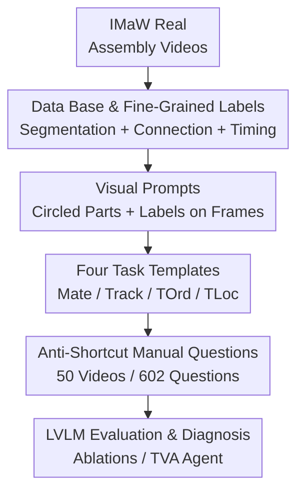

# Flat-Pack Bench: Evaluating Spatio-Temporal Understanding in Large Vision-Language Models through Furniture Assembly

**Conference**: CVPR 2026  
**arXiv**: [2605.21625](https://arxiv.org/abs/2605.21625)  
**Code**: flat-pack-bench.github.io (Project page with viewer/samples)  
**Area**: Multimodal VLM / Video Understanding / Evaluation Benchmark  
**Keywords**: VideoQA, Spatio-temporal Understanding, Furniture Assembly, Visual Prompting, Fine-grained Tracking

## TL;DR
Using "IKEA furniture assembly videos" as a sandbox, a video QA benchmark named Flat-Pack Bench (602 multiple-choice questions, 4 task categories) was constructed to specifically test the **fine-grained spatio-temporal understanding** of Large Vision-Language Models (LVLMs). It was found that the strongest models, such as GPT-5, achieve only ~38% accuracy, significantly lower than the human performance of 94.18%. The study identifies "tracking, contact judgment, and region grounding" as the primary bottlenecks.

## Background & Motivation
**Background**: LVLMs have made rapid progress in video understanding, but existing benchmarks mostly focus on **coarse-grained** tasks such as action segmentation, classification, captioning, and retrieval. These benchmarks typically pose overall semantic questions like "What is happening in this video?" and often involve simple entities (household objects, animals, or people) in clean, unobstructed scenes.

**Limitations of Prior Work**: Many real-world applications (furniture assembly, cooking, equipment repair) require **step-by-step, fine-grained spatio-temporal understanding**: knowing exactly what is done at each step, which part is used, and when. Existing benchmarks do not evaluate "which two parts are connected," the temporal order of connections, or the ability to **track multiple nearly identical parts** in cluttered scenes. High scores on old benchmarks do not imply that a model truly "understands" the process.

**Key Challenge**: Understanding an assembly process fundamentally requires three capabilities: mapping a **region** circled in a visual prompt to an object in the video (region grounding), **tracking** these parts through occlusions/camera cuts in long videos, and judging **physical contact/connectivity** between parts. These are precisely the weakest and least-evaluated abilities of current LVLMs.

**Goal**: To create a benchmark capable of exposing these weaknesses—one that is both realistic (in-the-wild videos, cluttered scenes) and able to precisely diagnose which specific capability the model lacks.

**Key Insight**: Furniture assembly was chosen as the sandbox. It is a "simplified microcosm" of the aforementioned challenges: parts are rigid bodies whose shapes and identities remain constant, allowing for the **clean isolation** of tracking, contact, and ordering skills without the interference of object state changes (e.g., "a tomato being sliced"). Failure in this simple domain implies failure in more complex ones.

**Core Idea**: Construct multiple-choice questions using assembly videos and visual prompts (parts circled and labeled on frames). The "fine-grained spatio-temporal understanding" is decomposed into four quantifiable tasks: **Mate, Track, TOrd, and TLoc**. Manual anti-shortcut question design is employed to prevent models from guessing via image shortcuts.

## Method

### Overall Architecture
Flat-Pack Bench is not a model but a **benchmark construction and evaluation analysis** pipeline. The construction side uses the IMaW (IKEA-Manuals-at-Work) real-world assembly video dataset as a foundation. It fills missing annotations (part segmentation, inter-part connections, fine-grained assembly sequences), generates visual prompts and question templates, and finally **manually filters questions** that can be solved via shortcuts. This results in 50 videos and 602 multiple-choice questions. The evaluation side tests proprietary/open-source/specialized LVLMs and designs image ablations, Part-ID shuffling, self-explanatory error attribution, and a "TVA" agent baseline that decomposes tasks into "tracking + contact judgment" to diagnose model bottlenecks.

### Key Designs

**1. Data Base and Fine-grained Assembly Annotations: Converting unlabeled real videos into temporal benchmarks**
Existing VideoQA datasets are often either too short, too clean, or lack the fine-grained labels necessary to test "which parts connect at which step." IMaW was selected as the base (in-the-wild IKEA assembly, including 3D models of parts, segmentation masks for keyframes, 6DoF poses, and sub-assembly level connectivity). However, it had two major flaws: incomplete segmentation and connectivity only at the "sub-assembly" rather than "part-to-part" level. Two labeling enhancements were performed: **manual part segmentation on 343 frames** across 50 videos (for visual prompts) and **per-part connectivity timing (which part connects to which at what time)**. This enabled the Mate/TOrd/TLoc tasks. Additionally, trimmed videos were generated by removing static instruction cards using a 1-second interval heuristic, and key-frame videos were created by concatenating only key frames for comparison.

**2. Visual Prompting instead of Textual Referencing: Solving "which part" ambiguity in cluttered symmetric structures**
Furniture parts are often symmetric or nearly identical, making purely textual descriptions (e.g., "the top rail") ambiguous. Furthermore, text prompts may **induce common-sense bias** where the model imagines a typical piece of furniture rather than looking at the video. Ours uses visual prompting: circling a part with a segmentation mask on a specific frame and overlaying a numeric label. Questions then refer to parts by these labels. Each question consists of "a video segment + 1-2 visual prompt images + a multiple-choice question." To ensure clarity, mask colors are chosen via a greedy strategy to maximize contrast with existing colors and underlying pixels, and 2-pixel borders are added for saliency. Ablations show that labels, borders, and masks **must be rendered simultaneously** for maximum effectiveness.

**3. Four Fine-grained Spatio-temporal Tasks: Quantifying assembly understanding**
Complete understanding requires knowing **which parts connect (Mate)** and **when they connect**, which in turn necessitates **tracking parts throughout the video**. Four tasks were designed:
- **Mate**: Determines if two parts are connected in the final product.
- **Track**: Provides two frames with shuffled part IDs as visual prompts and requires the model to recover the correct correspondence using the video.
- **TOrd**: Tests the correct chronological order of connection events.
- **TLoc**: Tests "what event happened immediately before/after the state shown in the visual prompt," measuring temporal localization and neighbor-event reasoning.
The 602 questions consist of Track (257, 42.7%), TOrd (155), TLoc (103), and Mate (87) across 13 templates.

**4. Anti-shortcut Manual Questioning: Closing the "guess without video" loophole**
Initial template-based question generation revealed that models could **frequently solve questions by ignoring the video and using shortcuts**—for example, if parts in a Mating question are already positioned near each other or if distractor shapes/colors are easily excluded. Consequently, all 602 questions were **manually filtered or authored**. Annotators were provided with the full video, labeled prompt frames, templates, and a guide on avoiding static cues. Subsequent analysis confirmed shortcut risks: when part IDs were shuffled, TOrd accuracy dropped, indicating models previously leveraged the bias that "larger Part ID values correlate with the correct answer."

### Mechanism Example: Decomposing a TOrd question with the TVA Agent
To verify if tasks can be solved by decomposing them into "tracking + contact judgment" primitives, the **Temporal Video Agent (TVA)** was built. This visual programming agent (analogous to ViperGPT) provides a Code LLM (Gemini 2.5 Pro) with Python APIs: a SAM2-based video object segmentation function and a Qwen2.5-VL-32B-based image QA function (for contact judgment). For TOrd, the agent iterates through frames, tracks parts from visual prompts, checks their connection status, records "connected" timestamps, and sorts them. Due to potential tool failures, a "Not Sure" option was added. TVA achieved only **11.79% overall accuracy and a 62.29% abstention rate**. Among answered questions, accuracy was 31.27%. The failure is attributed to tool limitations: contact judgment was essentially random for "Yes" cases (52.93%), and SAM2 tracking IoU was only 0.28. This demonstrates that even with explicit decomposition, current low-level vision tools cannot support these tasks.

## Key Experimental Results

### Benchmark Composition

| Category | #Video | #Question | Ratio | Avg Q/Video | #Template |
| :--- | :--- | :--- | :--- | :--- | :--- |
| Track | 43 | 257 | 42.69% | 5.98 | 2 |
| TOrd | 39 | 155 | 25.75% | 3.97 | 2 |
| TLoc | 35 | 103 | 17.11% | 2.94 | 6 |
| Mate | 21 | 87 | 14.45% | 4.14 | 3 |
| **Total** | **50** | **602** | 100% | 12.04 | 13 |

### Main Results: Models vs. Human (Micro Avg. Accuracy %)

| Model | Micro Avg. | TOrd | TLoc | Track | Mate |
| :--- | :--- | :--- | :--- | :--- | :--- |
| Human | **94.18** | 93.54 | 93.20 | 93.77 | 97.70 |
| Random | 26.41 | 25.00 | 25.00 | 25.49 | 33.33 |
| Frequency-based | 26.74 | 27.74 | 30.10 | 26.46 | 36.78 |
| GPT-5 (Strongest Prop.) | 37.71 | 40.65 | 53.40 | 25.68 | 49.43 |
| Gemini 2.5 Pro | 33.72 | 40.65 | 44.66 | 23.35 | 39.08 |
| InternVL3-78B (Best OS) | **41.03** | 43.87 | 39.81 | 42.02 | 34.48 |
| Qwen2.5-VL-72B | 40.37 | 41.29 | 30.10 | 45.14 | 36.78 |

The best model (InternVL3-78B, 41.03%) only outperforms the frequency baseline (26.74%) by ~14 points and remains 53 points behind human performance (94.18%). Track performance is consistently the worst, reflecting the direct failure of long-term tracking.

### Key Finding
- **Models barely use video**: In the image-only setting, overall performance drops by only 8.80 points (humans drop >50). The drop is concentrated in Track ($-24.51$), while TLoc/Mate performance remained stable or even increased, suggesting models rely on static images and common sense for those tasks.
- **Chain-of-Thought (CoT) is counterproductive**: ZS-CoT and SC-CoT reduced performance, indicating that spatio-temporal visual understanding differs from linguistic reasoning and that text-based prompting techniques do not transfer well.
- **Low-level vision is the bottleneck**: Contact judgment (Yes class 52.93%) and SAM2 tracking (IoU 0.28) indicate that the issue lies not just in "reasoning" but in the inability of current vision systems to perform the underlying primitives.
- **Visual Prompt elements**: Masks, labels, and borders are all necessary; focusing on just one yielded limited gains.

## Highlights & Insights
- **Using rigid body assembly as a sandbox is a clever "controlled variable" design**: By keeping part identities fixed, it cleanly isolates tracking, contact, and ordering abilities, allowing specific skill deficiencies to be pinpointed.
- **Measuring shortcuts via "Image-only + ID Shuffling"**: The former proves models ignore the video, while the latter proves they exploit ID biases. This "inverse falsification" diagnostic is more insightful than just reporting a low score.
- **TVA Agent as a diagnostic tool**: By explicitly decomposing tasks and recording execution traces, failure is localized to specific tools (SAM2 and contact judgment), providing clear targets for future research.

## Limitations & Future Work
- **Domain Narrowness**: The benchmark only covers IKEA furniture (rigid bodies, 50 videos). Whether conclusions generalize to non-rigid scenes (e.g., cooking) requires caution.
- **Limited Scale**: 602 questions and 50 videos is small compared to massive benchmarks, though bootstrap confidence intervals were provided (e.g., InternVL3-78B’s $[36.21, 45.64]$).
- **Cross-task Comparisons**: Direct comparison across tasks/models requires care as settings were optimized for the best performance per visual prompt format.
- **Future Directions**: Task-specific fine-tuning on synthetic data, improving visual prompting for region understanding, and building more complex agents that utilize low-level signals like 3D geometry and depth.

## Related Work & Insights
- **vs. LEGO-Puzzles**: Also uses assembly for multi-step reasoning but in a multi-image setting (2-3 keyframes), bypassing the difficulty of "determining which frames to watch." Flat-Pack Bench uses full long videos.
- **vs. VLM4D**: VLM4D evaluates relative motion understanding in dynamic scenes but does not involve inter-object interactions; ours centers on connection/contact interaction.
- **vs. PerceptionLM / VideoRefer**: These typically assume tracking is solved or involve few unique objects per video. Flat-Pack Bench requires tracking multiple similar-looking parts autonomously.

## Rating
- Novelty: ⭐⭐⭐⭐ Precise spatio-temporal quantification via a "controlled variable sandbox" with clever task definitions and anti-shortcut logic.
- Experimental Thoroughness: ⭐⭐⭐⭐⭐ Comprehensive evaluation of 30+ models and multi-layered diagnostics (Image-only, ID-shuffling, CoT, TVA).
- Writing Quality: ⭐⭐⭐⭐ Clear motivation and consistent diagnostic logic.
- Value: ⭐⭐⭐⭐ Provides a challenging, discriminative benchmark and identifies tracking and contact judgment as the true roadblocks for future research.

<!-- RELATED:START -->

<!-- Related papers would go here -->

<!-- RELATED:END -->

## Related Papers

- [\[CVPR 2026\] R4: Retrieval-Augmented Reasoning for Vision-Language Models in 4D Spatio-Temporal Space](r4_retrieval-augmented_reasoning_for_vision-language_models_in_4d_spatio-tempora.md)
- [\[CVPR 2026\] LASAR: Towards Spatio-temporal Reasoning with Latent Cognitive Map](lasar_towards_spatio-temporal_reasoning_with_latent_cognitive_map.md)
- [\[CVPR 2026\] DiGraphHal-Bench: Evaluating Multimodal Large Language Models on Complex Directed Graphs](digraphhal-bench_evaluating_multimodal_large_language_models_on_complex_directed.md)
- [\[ICLR 2026\] GTR-Bench: Evaluating Geo-Temporal Reasoning in Vision-Language Models](../../ICLR2026/multimodal_vlm/gtr-bench_evaluating_geo-temporal_reasoning_in_vision-language_mod.md)
- [\[CVPR 2026\] ViKey: Enhancing Temporal Understanding in Videos via Visual Prompting](vikey_enhancing_temporal_understanding_in_videos_via_visual_prompting.md)

<!-- RELATED:END -->
