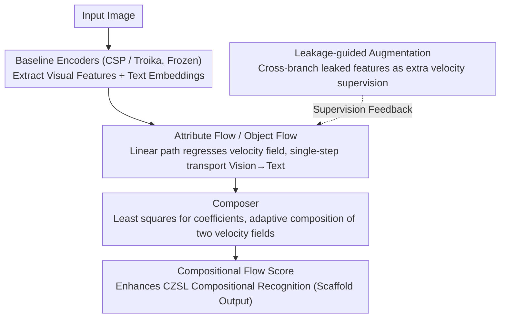

# FlowComposer: Composable Flows for Compositional Zero-Shot Learning

**Conference**: CVPR 2026  
**arXiv**: [2603.16641](https://arxiv.org/abs/2603.16641)  
**Code**: [https://hkust-longgroup.github.io/FlowComposer/](https://hkust-longgroup.github.io/FlowComposer/)  
**Area**: Multi-modal VLM / Compositional Zero-Shot Learning  
**Keywords**: Compositional Zero-Shot Learning, Flow Matching, CLIP, Velocity Field Composition, Leakage-guided Augmentation

## TL;DR

FlowComposer introduces Flow Matching to Compositional Zero-Shot Learning (CZSL) for the first time. It learns two primitive flows (attribute flow and object flow) to transport visual features into the corresponding text embedding space. It explicitly composes velocity fields through a learnable Composer and utilizes a leakage-guided augmentation strategy to transform imperfect feature decoupling into auxiliary supervision signals. As a plug-and-play module, it consistently improves CZSL performance across three benchmarks.

## Background & Motivation

1. **Background**: CZSL aims to recognize unseen attribute-object combinations by recombining seen attribute and object primitives. Current mainstream methods are based on Vision-Language Models (VLMs) like CLIP, performing prompt learning via Parameter-Efficient Fine-Tuning (PEFT).
2. **Limitations of Prior Work**: Existing methods suffer from two fundamental flaws—(1) Implicit Compositional Construction: Compositions are achieved only through token-level splicing rather than explicit operations in the embedding space, causing embeddings of unseen combinations to deviate from image embeddings; (2) Residual Feature Entanglement: Visual decouplers cannot strictly separate attribute and object features, leading to information leakage across branches.
3. **Key Challenge**: These flaws make existing methods prone to overfitting seen combinations. During training, seen accuracy increases while unseen accuracy continues to decrease, exhibiting a strong seen bias.
4. **Goal**: Design a framework that performs explicit composition operations in the embedding space while transforming imperfect decoupling into useful signals.
5. **Key Insight**: The velocity fields of Flow Matching naturally support composition and decomposition—primitive flows can be learned, and their velocity fields can then be composed.
6. **Core Idea**: Use two Flow Matching models to learn the transport flows of attributes and objects separately, then compose the velocity fields through a Composer network to achieve explicit composition in the embedding space.

## Method

### Overall Architecture

FlowComposer is built upon existing CZSL baselines (e.g., CSP, Troika). Given an image, attribute, object, and compositional visual features and text embeddings are obtained through the baseline image and text encoders. FlowComposer operates in this shared feature space: it learns attribute and object flows to transport visual features to text embeddings, then uses a Composer to combine velocity fields. The final compositional flow score enhances compositional recognition; meanwhile, leakage-guided augmentation flows cross-branch leaked features back as additional velocity supervision for the two primitive flows.

### Key Designs

**1. Attribute and Object Flows: Modeling "Vision→Text" as a Single-Step Solvable Transport Field**

Addressing the issue where "unseen combination embeddings deviate from image embeddings," FlowComposer avoids implicit alignment via prompt tokens. Instead, it learns a Rectified Flow for each of the two branches $i \in \{a, o\}$. It defines a linear path $x^i_t = (1-t)\,x^i_0 + t\,x^i_1$ between the visual feature $x^i_0$ and the corresponding text embedding $x^i_1$, requiring the velocity network $v_{\theta_i}$ to regress the target velocity $x^i_1 - x^i_0$ of this path. Simultaneously, a cross-entropy loss is applied to ensure the predicted endpoint is correctly classified, preventing transport to a location that "looks similar but is misclassified." Rectified Flow straightens the path, allowing for single-step inference $\hat{x}^i_1 = x^i_0 + v_{\theta_i}(x^i_0, 0)$ to reach the text space without multiple ODE steps. This establishes a clear velocity field for each primitive, laying the foundation for velocity composition.

**2. Composer: Adaptively Synthesizing Compositional Velocity Fields from Primitive Velocity Fields**

With attribute and object velocity fields established, the critical step is obtaining the velocity field for the "attribute-object combination." Simply adding them ignores the fact that the contribution of attributes and objects varies across samples (e.g., dominance differs between "wet ground" and "worn chair"). FlowComposer approximates the compositional velocity as a linear combination of the two primitive velocities $v^*_c = a^*\,v^*_a + b^*\,v^*_o$. First, primitive velocities are normalized into unit directions $\hat{\Delta}_a, \hat{\Delta}_o$. Then, target coefficients $(a^*, b^*)$ that best fit the true compositional direction are solved via least squares to serve as supervision. The Composer network learns to predict these coefficients directly from the primitive velocities, using MSE to align with $(a^*, b^*)$. Thus, composition occurs in the embedding space with sample-adaptive weights.

**3. Leakage-guided Augmentation: Turning Decoupling Flaws into Supervision**

Visual decouplers cannot strictly separate attributes and objects, leading to cross-branch information leakage. Rather than attempting to eliminate leakage, FlowComposer exploits it. In addition to standard intra-branch supervision (attribute visual feature → attribute text), each primitive flow is tasked with processing "leaked features." For instance, visual features extracted from the object branch are transported to attribute text, and features from the compositional branch are transported to their respective primitive texts. These directions, originally considered noise, are fed back into the flow model as additional velocity supervision, expanding the training signals. This transforms a disadvantage into an advantage, explaining why C-GQA, which is harder to decouple, saw the largest improvement (+4.3 HM).

### Loss & Training

Total Loss = Baseline Original Loss + Attribute Flow Loss (MSE + CE) + Object Flow Loss (MSE + CE) + Composer Loss (MSE) + Leakage Augmentation Loss. FlowComposer is a model-agnostic plug-and-play module that can be attached to any CZSL pipeline.

## Key Experimental Results

### Main Results

| Dataset | Metric (HM↑) | Troika | +FlowComposer | Gain |
|--------|-----------|--------|--------------|------|
| MIT-States (CW) | HM | 39.2 | 40.2 | +1.0 |
| C-GQA (CW) | HM | 29.7 | 34.0 | +4.3 |
| UT-Zappos (CW) | HM | 55.4 | 58.6 | +3.2 |
| MIT-States (OW) | AUC | 12.5 | 15.9 | +3.4 |

Significant improvements are also observed on the CSP baseline: C-GQA HM increased from 19.3 to 22.9 (+3.6).

### Ablation Study

| Configuration | HM (MIT-States) | AUC | Description |
|------|-----------------|-----|------|
| Troika Baseline | 39.2 | 12.5 | Without FlowComposer |
| +Primitive Flows (No Composer) | 39.7 | 13.8 | Only transport flows |
| +Composer | 40.0 | 15.0 | Added velocity field composition |
| +Leakage Augmentation (Full) | 40.2 | 15.9 | Full model |

### Key Findings

- FlowComposer consistently improves baseline performance across all three datasets and two settings (Closed-World/Open-World).
- The Composer module contributes the most, particularly in Open-World scenarios (significant AUC increase), indicating that explicit composition is crucial for generalization.
- Leakage-guided augmentation is most effective on C-GQA (+4.3 HM), likely due to the increased difficulty of decoupling in this dataset.
- Training dynamics are more stable: seen/unseen accuracies are better balanced, reducing seen bias.

## Highlights & Insights

- **Composability of FM Velocity Fields**: Points out for the first time that the velocity fields of Flow Matching are naturally suited to the compositional/decompositional nature of CZSL, providing an elegant conceptual correspondence.
- **Flaws as Advantages**: Cleverly transforms imperfect decoupling (information leakage) into additional supervision, a versatile approach.
- **Plug-and-Play Design**: Operates purely in the representation space without modifying encoders, making it transferable to any CZSL method.

## Limitations & Future Work

- Flow models introduce additional parameters and training costs.
- Single-step inference is an approximation; multi-step might be more accurate but reduces efficiency.
- Validated only in the CLIP feature space; other VLMs require further verification.
- Future work could explore non-linear paths (e.g., ODE solvers) for more precise transport.

## Related Work & Insights

- **vs CSP/Troika**: These methods only compose at the token level; FlowComposer composes explicitly in the embedding space.
- **vs Diffusion Classifiers**: Diffusion classifiers use generative models for classification but do not exploit the composability of velocity fields.
- **vs FM for generation**: Traditional FM is used for image generation; FlowComposer is the first to use its composability for classification.

## Rating

- Novelty: ⭐⭐⭐⭐⭐ Using FM for CZSL is a new direction; the velocity field composition is elegant.
- Experimental Thoroughness: ⭐⭐⭐⭐ Three datasets, two baselines, detailed ablations.
- Writing Quality: ⭐⭐⭐⭐ Clear motivation and mathematical derivation.
- Value: ⭐⭐⭐⭐ Strong practicality due to the plug-and-play design, though the field is relatively niche.

<!-- RELATED:START -->

## Related Papers

- [\[CVPR 2026\] Bridging the Modality Gap in Compositional Zero-Shot Learning via Sparse Alignment and Unimodal Memory Bank](bridging_the_modality_gap_in_compositional_zero-shot_learning_via_sparse_alignme.md)
- [\[NeurIPS 2025\] TOMCAT: Test-time Comprehensive Knowledge Accumulation for Compositional Zero-Shot Learning](../../NeurIPS2025/multimodal_vlm/tomcat_test-time_comprehensive_knowledge_accumulation_for_compositional_zero-sho.md)
- [\[CVPR 2026\] SOTA: Self-adaptive Optimal Transport for Zero-Shot Classification with Multiple Foundation Models](sota_self-adaptive_optimal_transport_for_zero-shot_classification_with_multiple_.md)
- [\[CVPR 2026\] Self-guided Semantic Inspection for Zero-Shot Composed Image Retrieval](self-guided_semantic_inspection_for_zero-shot_composed_image_retrieval.md)
- [\[CVPR 2026\] Noise-Aware Few-Shot Learning through Bi-directional Multi-View Prompt Alignment](noise-aware_few-shot_learning_through_bi-directional_multi-view_prompt_alignment.md)

<!-- RELATED:END -->
